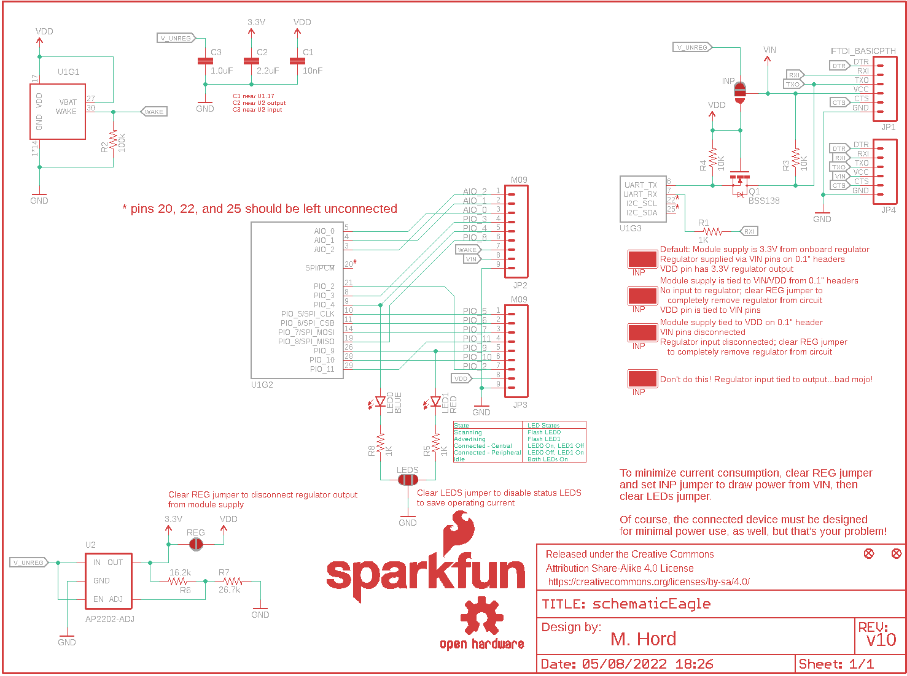
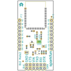
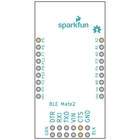
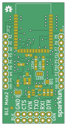
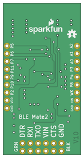

Contents
========

* [PRS13019 > BLE Mate2](#prs13019--ble-mate2)
	* [Schematic](#schematic)
	* [PCB](#pcb)
	* [Interactive BOM](#interactive-bom)
	* [OOMP Parts](#oomp-parts)
	* [Images](#images)
	* [Tags](#tags)
  
![][im]
# PRS13019 > BLE Mate2

- ID: PROJ-SPAR-13019-STAN-01
- Hex ID: PRS13019
- Name: Sparkfun
- Description: Sparkfun
- Long Link: [http://oom.lt/PROJ-SPAR-13019-STAN-01](http://oom.lt/PROJ-SPAR-13019-STAN-01)
- Short Link: [http://oom.lt/PRS13019](http://oom.lt/PRS13019)

## Schematic
  

## PCB
  

## Interactive BOM

- Interactive BOM page: [ibom.html](https://htmlpreview.github.io/?https://github.com/oomlout/oomlout_OOMP_projects/blob/main/PROJ-SPAR-13019-STAN-01/kicad/bom/ibom.html)

## OOMP Parts
  

|OOMP Parts|
| :---: |
|[CAPC-0603-X-NF10-V50  SMD (0603) 10 nF Capacitor (Ceramic) 50v  C1](https://github.com/oomlout/oomlout_OOMP_parts/tree/main/CAPC-0603-X-NF10-V50/)|
|[CAPC-0603-X-UF22D-V10  SMD (0603) 2.2 uF Capacitor (Ceramic) 10v  C2](https://github.com/oomlout/oomlout_OOMP_parts/tree/main/CAPC-0603-X-UF22D-V10/)|
|CAPC-0603-X-UNMATCHED-01 C3|
|HEAD-I01-X-UNMATCHED-01 JP1|
|[HEAD-I01-X-PI09-01  2.54 mm 9 Pin Header  JP2, JP3](https://github.com/oomlout/oomlout_OOMP_parts/tree/main/HEAD-I01-X-PI09-01/)|
|[HEAD-I01-X-PI06-01  2.54 mm 6 Pin Header  JP4](https://github.com/oomlout/oomlout_OOMP_parts/tree/main/HEAD-I01-X-PI06-01/)|
|[LEDS-0603-L-STAN-01  SMD (0603) Blue LED  LED0](https://github.com/oomlout/oomlout_OOMP_parts/tree/main/LEDS-0603-L-STAN-01/)|
|[LEDS-0603-R-STAN-01  SMD (0603) Red LED  LED1](https://github.com/oomlout/oomlout_OOMP_parts/tree/main/LEDS-0603-R-STAN-01/)|
|UNMATCHED-SO23-X-KBSS138-01 Q1|
|[RESE-0603-X-O102-01  SMD (0603) 1k Ohm Resistor  R1, R5, R8](https://github.com/oomlout/oomlout_OOMP_parts/tree/main/RESE-0603-X-O102-01/)|
|RESE-0603-X-O1003-01 R2|
|[RESE-0603-X-O103-01  SMD (0603) 10k Ohm Resistor  R3, R4](https://github.com/oomlout/oomlout_OOMP_parts/tree/main/RESE-0603-X-O103-01/)|
|RESE-0603-X-UNMATCHED-01 R6, R7|
|UNMATCHED-UNMATCHED-X-UNMATCHED-01 U1|
|UNMATCHED-SO235-X-UNMATCHED-01 U2|

## Images
  
  

|bominteractivefront|bominteractiveback|kicadPcb3d|kicadPcb3dFront|kicadPcb3dBack|eagleImage|eagleSchemImage|pcbdraw|pcbdrawback|
| :---: | :---: | :---: | :---: | :---: | :---: | :---: | :---: | :---: |
||||||||||

## Tags

- hexID: PRS13019
- oompType: PROJ
- oompSize: SPAR
- oompColor: 13019
- oompDesc: STAN
- oompIndex: 01
- oompName: BLE Mate2
- sources: All source files from https://github.com/sparkfun/BLE_Mate2 (source licence details in srcLicense.md)
- linkBuyPage: https://www.sparkfun.com/products/13019
- oompID: PROJ-SPAR-13019-STAN-01
- oompParts: C1,CAPC-0603-X-NF10-V50
- oompParts: C2,CAPC-0603-X-UF22D-V10
- oompParts: C3,CAPC-0603-X-UNMATCHED-01
- oompParts: JP1,HEAD-I01-X-UNMATCHED-01
- oompParts: JP2,HEAD-I01-X-PI09-01
- oompParts: JP3,HEAD-I01-X-PI09-01
- oompParts: JP4,HEAD-I01-X-PI06-01
- oompParts: LED0,LEDS-0603-L-STAN-01
- oompParts: LED1,LEDS-0603-R-STAN-01
- oompParts: Q1,UNMATCHED-SO23-X-KBSS138-01
- oompParts: R1,RESE-0603-X-O102-01
- oompParts: R2,RESE-0603-X-O1003-01
- oompParts: R3,RESE-0603-X-O103-01
- oompParts: R4,RESE-0603-X-O103-01
- oompParts: R5,RESE-0603-X-O102-01
- oompParts: R6,RESE-0603-X-UNMATCHED-01
- oompParts: R7,RESE-0603-X-UNMATCHED-01
- oompParts: R8,RESE-0603-X-O102-01
- oompParts: U1,UNMATCHED-UNMATCHED-X-UNMATCHED-01
- oompParts: U2,UNMATCHED-SO235-X-UNMATCHED-01
- rawParts: C1,10nF,10NF/10000PF-50V-10%(0603),0603-CAP,CAP-00867,CAP-00867,10nF,
- rawParts: C2,2.2uF,2.2UF-10V-20%(0603),0603-CAP,CAP-07888,CAP-07888,2.2uF,
- rawParts: C3,1.0uF,1.0UF-16V-10%(0603),0603-CAP,CAP-00868,CAP-00868,1.0uF,
- rawParts: FID1,FIDUCIAL1X2,FIDUCIAL1X2,FIDUCIAL-1X2,Fiducial Alignment Points,,,
- rawParts: FID2,FIDUCIAL1X2,FIDUCIAL1X2,FIDUCIAL-1X2,Fiducial Alignment Points,,,
- rawParts: FRAME1,FRAME-LETTER,FRAME-LETTER,CREATIVE_COMMONS,Schematic Frame,,,
- rawParts: INP,JUMPER-PAD-3-2OF3_NC_BY_PASTE,JUMPER-PAD-3-2OF3_NC_BY_PASTE,PAD-JUMPER-3-2OF3_NC_BY_PASTE_YES_SILK_FULL_BOX,,,,
- rawParts: JP1,FTDI_BASICPTH,FTDI_BASICPTH,FTDI_BASIC,FTDI Basic header with labels,,,
- rawParts: JP2,M09,M09,1X09,Header 9,,,
- rawParts: JP3,M09,M09,1X09,Header 9,,,
- rawParts: JP4,,M06SIP,1X06,Header 6,,,
- rawParts: LED0,BLUE,LED-BLUE0603,LED-0603,Blue LEDs for production use,DIO-08575,BLUE,
- rawParts: LED1,RED,LED-RED0603,LED-0603,Assorted Red LEDs,DIO-00819,RED,
- rawParts: LEDS,JUMPER-PAD-3-NC_BY_PASTE,JUMPER-PAD-3-NC_BY_PASTE,PAD-JUMPER-3-NC_BY_PASTE_YES_SILK_FULL_BOX,,,,
- rawParts: LOGO1,SFE_LOGO_NAME.1_INCH,SFE_LOGO_NAME.1_INCH,SFE_LOGO_NAME_.1,SFE Logo, name only,,,
- rawParts: LOGO2,OSHW-LOGOS,OSHW-LOGOS,OSHW-LOGO-S,Open Source Hardware Logo This logo indicates the piece of hardware it is found on incorporates a OSHW license and/or adheres to the definition of open source hardware found here: http://freedomdefined.org/OSHW,,,
- rawParts: LOGO3,SFE_LOGO_NAME_FLAME.1_INCH,SFE_LOGO_NAME_FLAME.1_INCH,SFE_LOGO_NAME_FLAME_.1,SFE Logo, name and flame,,,
- rawParts: LOGO4,OSHW-LOGOS,OSHW-LOGOS,OSHW-LOGO-S,Open Source Hardware Logo This logo indicates the piece of hardware it is found on incorporates a OSHW license and/or adheres to the definition of open source hardware found here: http://freedomdefined.org/OSHW,,,
- rawParts: Q1,BSS138,MOSFET-NCHANNELBSS138,SOT23,Common NMOSFET Parts,TRANS-00830,,
- rawParts: R1,1K,1KOHM1/10W1%(0603),0603-RES,RES-07856,RES-07856,1K,
- rawParts: R2,100k,100KOHM1/10W1%(0603),0603-RES,RES-07828,RES-07828,100k,
- rawParts: R3,10K,10KOHM1/10W1%(0603)0603,0603-RES,RES-00824,RES-00824,10K,
- rawParts: R4,10K,10KOHM1/10W1%(0603)0603,0603-RES,RES-00824,RES-00824,10K,
- rawParts: R5,1K,1KOHM1/10W1%(0603),0603-RES,RES-07856,RES-07856,1K,
- rawParts: R6,16.2k,16.2KOHM1/10W1%(0603),0603-RES,,RES-12187,16.2k,
- rawParts: R7,26.7k,16.2KOHM1/10W1%(0603),0603-RES,,RES-12187,16.2k,
- rawParts: R8,1K,1KOHM1/10W1%(0603),0603-RES,RES-07856,RES-07856,1K,
- rawParts: REG,JUMPER-PAD-2-NC_BY_PASTE,JUMPER-PAD-2-NC_BY_PASTE,PAD-JUMPER-2-NC_BY_PASTE_YES_SILK,,,,
- rawParts: U1,,BC118,BC118,,WRL-12203,BC118,
- rawParts: U2,AP2202-ADJ,AP2202-ADJ,SOT23-5,AP2202 Adjustable LDO,VREG-12189,AP2202-ADJ,

[im]: kicadPcb3d_450.png
