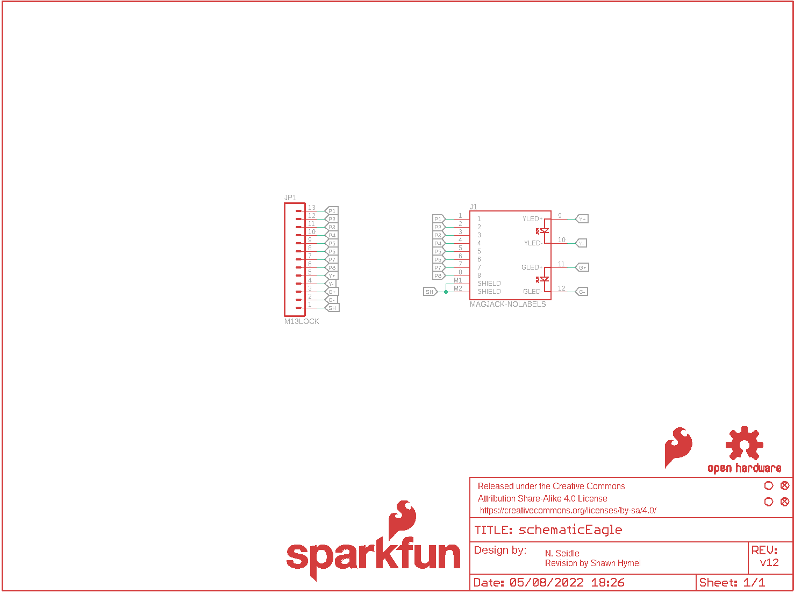
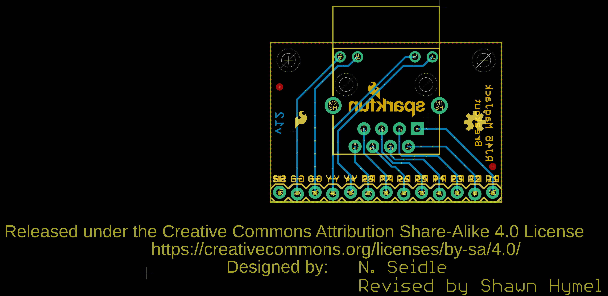
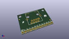
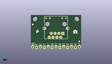
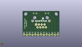
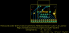

Contents
========

* [PRS13021 > MagJack Breakout](#prs13021--magjack-breakout)
	* [Schematic](#schematic)
	* [PCB](#pcb)
	* [Interactive BOM](#interactive-bom)
	* [OOMP Parts](#oomp-parts)
	* [Images](#images)
	* [Tags](#tags)
  
![][im]
# PRS13021 > MagJack Breakout

- ID: PROJ-SPAR-13021-STAN-01
- Hex ID: PRS13021
- Name: Sparkfun
- Description: Sparkfun
- Long Link: [http://oom.lt/PROJ-SPAR-13021-STAN-01](http://oom.lt/PROJ-SPAR-13021-STAN-01)
- Short Link: [http://oom.lt/PRS13021](http://oom.lt/PRS13021)

## Schematic
  

## PCB
  

## Interactive BOM

- Interactive BOM page: [ibom.html](https://htmlpreview.github.io/?https://github.com/oomlout/oomlout_OOMP_projects/blob/main/PROJ-SPAR-13021-STAN-01/kicad/bom/ibom.html)

## OOMP Parts
  

|OOMP Parts|
| :---: |
|UNMATCHED-UNMATCHED-X-UNMATCHED-01 J1|
|HEAD-I01-X-PI13-01 JP1|

## Images
  
  

|kicadPcb3d|kicadPcb3dFront|kicadPcb3dBack|eagleImage|eagleSchemImage|
| :---: | :---: | :---: | :---: | :---: |
||||||

## Tags

- hexID: PRS13021
- oompType: PROJ
- oompSize: SPAR
- oompColor: 13021
- oompDesc: STAN
- oompIndex: 01
- oompName: MagJack Breakout
- sources: All source files from https://github.com/sparkfun/MagJack_Breakout (source licence details in srcLicense.md)
- linkBuyPage: https://www.sparkfun.com/products/13021
- oompID: PROJ-SPAR-13021-STAN-01
- oompParts: J1,UNMATCHED-UNMATCHED-X-UNMATCHED-01
- oompParts: JP1,HEAD-I01-X-PI13-01
- rawParts: FID1,FIDUCIAL1X2,FIDUCIAL1X2,FIDUCIAL-1X2,Fiducial Alignment Points,,
- rawParts: FID2,FIDUCIAL1X2,FIDUCIAL1X2,FIDUCIAL-1X2,Fiducial Alignment Points,,
- rawParts: FRAME1,FRAME-LETTER,FRAME-LETTER,CREATIVE_COMMONS,Schematic Frame,,
- rawParts: J1,MAGJACK-NOLABELS,MAGJACK-NOLABELS,MAGJACK,,CONN-09556,
- rawParts: JP1,M13LOCK,M13LOCK,1X13_LOCK,13-pin single row .1 header,,
- rawParts: LOGO1,OSHW-LOGOS,OSHW-LOGOS,OSHW-LOGO-S,Open Source Hardware Logo This logo indicates the piece of hardware it is found on incorporates a OSHW license and/or adheres to the definition of open source hardware found here: http://freedomdefined.org/OSHW,,
- rawParts: LOGO2,SFE_LOGO_FLAME.1_INCH,SFE_LOGO_FLAME.1_INCH,SFE_LOGO_FLAME_.1,SFE Logo, flame only,,
- rawParts: LOGO3,SFE_LOGO_NAME_FLAME.1_INCH,SFE_LOGO_NAME_FLAME.1_INCH,SFE_LOGO_NAME_FLAME_.1,SFE Logo, name and flame,,
- rawParts: STANDOFF3,STAND-OFF,STAND-OFF,STAND-OFF,#4 Stand Off,,
- rawParts: STANDOFF5,STAND-OFF,STAND-OFF,STAND-OFF,#4 Stand Off,,

[im]: kicadPcb3d_450.png
