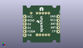
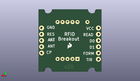
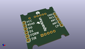

Contents
========

* [PROJ-SPAR-13030-STAN-01>RFID Reader Breakout](#proj-spar-13030-stan-01rfid-reader-breakout)
	* [Images](#images)
	* [Interactive BOM](#interactive-bom)
	* [OOMP Parts](#oomp-parts)
	* [Tags](#tags)
  
![][im]
# PROJ-SPAR-13030-STAN-01>RFID Reader Breakout

- ID: PROJ-SPAR-13030-STAN-01
- Hex ID: PRS13030
- Name: RFID Reader Breakout
- Description: 

## Images
  
  

|eagleImage|kicadPcb3dFront|kicadPcb3dBack|kicadPcb3d|
| :---: | :---: | :---: | :---: |
|||||

## Interactive BOM

- Interactive BOM page: [ibom.html](kicad/bom/ibom.html)

## OOMP Parts
  

|OOMP Parts|
| :---: |
|<table><tr><td></td><td> JP4</td><td>[HEAD-I01-X-PI06-01 2.54 mm 6 Pin Header](https://github.com/oomlout/oomlout_OOMP_parts/tree/main/HEAD-I01-X-PI06-01/)</td><td>[H06](https://github.com/oomlout/oomlout_OOMP_parts/tree/main/HEAD-I01-X-PI06-01/)</td></tr></table>|
|<table><tr><td></td><td> JP5</td><td>[HEAD-I01-X-PI05-01 2.54 mm 5 Pin Header](https://github.com/oomlout/oomlout_OOMP_parts/tree/main/HEAD-I01-X-PI05-01/)</td><td>[H05](https://github.com/oomlout/oomlout_OOMP_parts/tree/main/HEAD-I01-X-PI05-01/)</td></tr></table>|
|ERROR, U1 RFID ID_PACKAGE, 0, 0, 0,U1, RFID, ID_PACKAGE, ID, Innovations, (0, 0), MR0|

## Tags

- hexID: PRS13030
- oompType: PROJ
- oompSize: SPAR
- oompColor: 13030
- oompDesc: STAN
- oompIndex: 01
- oompName: RFID Reader Breakout
- sources: All source files from https://github.com/sparkfun/RFID_Reader_Breakout (source licence details in srcLicense.md)
- linkBuyPage: https://www.sparkfun.com/products/13030
- oompPart: HEAD-I01-X-PI06-01, JP4, -11.43, -7.62, 90
- oompPart: HEAD-I01-X-PI05-01, JP5, 11.43, 5.08, 270
- oompPart: ERROR, U1 RFID ID_PACKAGE, 0, 0, 0
- rawPart: JP4, 1X06, SparkFun-Connectors, (-11.43, -7.62), R90
- rawPart: JP5, 1X05, SparkFun-Connectors, (11.43, 5.08), R270
- rawPart: U1, RFID, ID_PACKAGE, ID, Innovations, (0, 0), MR0
- oompID: PROJ-SPAR-13030-STAN-01

[im]: kicadPcb3d_450.png
