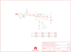

Contents
========

* [PRS13032 > Sparkfun](#prs13032--sparkfun)
	* [Schematic](#schematic)
	* [Interactive BOM](#interactive-bom)
	* [OOMP Parts](#oomp-parts)
	* [Images](#images)
	* [Tags](#tags)
  
![][im]
# PRS13032 > Sparkfun

- ID: PROJ-SPAR-13032-STAN-01
- Hex ID: PRS13032
- Name: Sparkfun
- Description: Sparkfun
- Long Link: [http://oom.lt/PROJ-SPAR-13032-STAN-01](http://oom.lt/PROJ-SPAR-13032-STAN-01)
- Short Link: [http://oom.lt/PRS13032](http://oom.lt/PRS13032)

## Schematic
  

## Interactive BOM

- Interactive BOM page: [ibom.html](https://htmlpreview.github.io/?https://github.com/oomlout/oomlout_OOMP_projects/blob/main/PROJ-SPAR-13032-STAN-01/kicad/bom/ibom.html)

## OOMP Parts
  

|OOMP Parts|
| :---: |
|C1,CAPX-UNMATCHED-X-UF100-01,C1,100uF,CAP_POL7343,EIA7343,Capacitor Polarized,,,|
|C2,CAPX-UNMATCHED-X-UF10-01,C2,10uF,CAP_POL1206,EIA3216,Capacitor Polarized,,,|
|C3,CAPC-0603-X-NF100-V50,C3,0.1uF,CAP0603-CAP,0603-CAP,Capacitor,,,|
|D1,DIOD-UNMATCHED-X-UNMATCHED-01,D1,1N4001,DIODESMA-TYLERALT1,SMA-DIODE-TYLERALT1,Diode,,,|
|F1,UNMATCHED-1206-X-UNMATCHED-01,F1,PTCSMD-W,PTCSMD-W,PTC-1206-WIDE,Resettable Fuse PTC,,,|
|J1,UNMATCHED-UNMATCHED-X-UNMATCHED-01,FRAME1,FRAME-LETTER,FRAME-LETTER,CREATIVE_COMMONS,Schematic Frame,,,|
|JP1,HEAD-I01-X-PI01-01,J1,POWER_JACKSMD,POWER_JACKSMD,POWER_JACK_SMD,Power Jack,CONN-08106,5.5x2.1mm Barrel,|
|JP2,HEAD-I01-X-PI01-01,JP1,M01PTH,M01PTH,1X01,Header 1,,,|
|JP3,HEAD-I01-X-PI01-01,JP2,M01PTH,M01PTH,1X01,Header 1,,,|
|JP4,HEAD-I01-X-PI01-01,JP3,M01PTH,M01PTH,1X01,Header 1,,,|
|JP5,HEAD-I01-X-PI02-01,JP4,M01PTH,M01PTH,1X01,Header 1,,,|
|JP6,HEAD-I01-X-PI01-01,JP5,,M02PTH,1X02,Header 2,,,|
|JP7,HEAD-I01-X-PI01-01,JP6,M01PTH,M01PTH,1X01,Header 1,,,|
|JP8,HEAD-I01-X-PI01-01,JP7,M01PTH,M01PTH,1X01,Header 1,,,|
|JP9,HEAD-I01-X-PI01-01,JP8,M01PTH,M01PTH,1X01,Header 1,,,|
|LED2,LEDS-1206-G-STAN-01,JP9,M01PTH,M01PTH,1X01,Header 1,,,|
|R1,RESE-0603-X-O241-01,LED2,Power,LED1206,LED-1206,,,,|
|R2,RESE-0603-X-O391-01,LOGO1,OSHW-LOGOS,OSHW-LOGOS,OSHW-LOGO-S,Open Source Hardware Logo This logo indicates the piece of hardware it is found on incorporates a OSHW license and/or adheres to the definition of open source hardware found here: http://freedomdefined.org/OSHW,,,|
|R3,RESE-0603-X-O331-01,R1,240,RESISTOR0603-RES,0603-RES,Resistor,,,|
|R4,RESE-0603-X-O331-01,R2,390,RESISTOR0603-RES,0603-RES,Resistor,,,|
|S1,UNMATCHED-UNMATCHED-X-UNMATCHED-01,R3,330,RESISTOR0603-RES,0603-RES,Resistor,,,|
|S2,UNMATCHED-UNMATCHED-X-UNMATCHED-01,R4,330,RESISTOR0603-RES,0603-RES,Resistor,,,|
|U1,UNMATCHED-UNMATCHED-X-UNMATCHED-01,S1,On/Off,AYZ0202,AYZ0202,SPDT Slide Switch,,,|

## Images
  
  

|kicadPcb3d|kicadPcb3dFront|kicadPcb3dBack|eagleImage|eagleSchemImage|
| :---: | :---: | :---: | :---: | :---: |
||||||

## Tags

- hexID: PRS13032
- oompType: PROJ
- oompSize: SPAR
- oompColor: 13032
- oompDesc: STAN
- oompIndex: 01
- oompName: Breadboard Power Supply Stick 5V-3.3V
- sources: All source files from https://github.com/sparkfun/Breadboard_Power_Supply_Stick_5V-3.3V (source licence details in srcLicense.md)
- linkBuyPage: https://www.sparkfun.com/products/13032
- oompID: PROJ-SPAR-13032-STAN-01
- oompParts: C1,CAPX-UNMATCHED-X-UF100-01
- oompParts: C2,CAPX-UNMATCHED-X-UF10-01
- oompParts: C3,CAPC-0603-X-NF100-V50
- oompParts: D1,DIOD-UNMATCHED-X-UNMATCHED-01
- oompParts: F1,UNMATCHED-1206-X-UNMATCHED-01
- oompParts: J1,UNMATCHED-UNMATCHED-X-UNMATCHED-01
- oompParts: JP1,HEAD-I01-X-PI01-01
- oompParts: JP2,HEAD-I01-X-PI01-01
- oompParts: JP3,HEAD-I01-X-PI01-01
- oompParts: JP4,HEAD-I01-X-PI01-01
- oompParts: JP5,HEAD-I01-X-PI02-01
- oompParts: JP6,HEAD-I01-X-PI01-01
- oompParts: JP7,HEAD-I01-X-PI01-01
- oompParts: JP8,HEAD-I01-X-PI01-01
- oompParts: JP9,HEAD-I01-X-PI01-01
- oompParts: LED2,LEDS-1206-G-STAN-01
- oompParts: R1,RESE-0603-X-O241-01
- oompParts: R2,RESE-0603-X-O391-01
- oompParts: R3,RESE-0603-X-O331-01
- oompParts: R4,RESE-0603-X-O331-01
- oompParts: S1,UNMATCHED-UNMATCHED-X-UNMATCHED-01
- oompParts: S2,UNMATCHED-UNMATCHED-X-UNMATCHED-01
- oompParts: U1,UNMATCHED-UNMATCHED-X-UNMATCHED-01
- rawParts: C1,100uF,CAP_POL7343,EIA7343,Capacitor Polarized,,,
- rawParts: C2,10uF,CAP_POL1206,EIA3216,Capacitor Polarized,,,
- rawParts: C3,0.1uF,CAP0603-CAP,0603-CAP,Capacitor,,,
- rawParts: D1,1N4001,DIODESMA-TYLERALT1,SMA-DIODE-TYLERALT1,Diode,,,
- rawParts: F1,PTCSMD-W,PTCSMD-W,PTC-1206-WIDE,Resettable Fuse PTC,,,
- rawParts: FRAME1,FRAME-LETTER,FRAME-LETTER,CREATIVE_COMMONS,Schematic Frame,,,
- rawParts: J1,POWER_JACKSMD,POWER_JACKSMD,POWER_JACK_SMD,Power Jack,CONN-08106,5.5x2.1mm Barrel,
- rawParts: JP1,M01PTH,M01PTH,1X01,Header 1,,,
- rawParts: JP2,M01PTH,M01PTH,1X01,Header 1,,,
- rawParts: JP3,M01PTH,M01PTH,1X01,Header 1,,,
- rawParts: JP4,M01PTH,M01PTH,1X01,Header 1,,,
- rawParts: JP5,,M02PTH,1X02,Header 2,,,
- rawParts: JP6,M01PTH,M01PTH,1X01,Header 1,,,
- rawParts: JP7,M01PTH,M01PTH,1X01,Header 1,,,
- rawParts: JP8,M01PTH,M01PTH,1X01,Header 1,,,
- rawParts: JP9,M01PTH,M01PTH,1X01,Header 1,,,
- rawParts: LED2,Power,LED1206,LED-1206,,,,
- rawParts: LOGO1,OSHW-LOGOS,OSHW-LOGOS,OSHW-LOGO-S,Open Source Hardware Logo This logo indicates the piece of hardware it is found on incorporates a OSHW license and/or adheres to the definition of open source hardware found here: http://freedomdefined.org/OSHW,,,
- rawParts: R1,240,RESISTOR0603-RES,0603-RES,Resistor,,,
- rawParts: R2,390,RESISTOR0603-RES,0603-RES,Resistor,,,
- rawParts: R3,330,RESISTOR0603-RES,0603-RES,Resistor,,,
- rawParts: R4,330,RESISTOR0603-RES,0603-RES,Resistor,,,
- rawParts: S1,On/Off,AYZ0202,AYZ0202,SPDT Slide Switch,,,
- rawParts: S2,Voltage,SWITCH-SPSTSMD,AYZ0202,SPST Switch,,,
- rawParts: U$1,LOGO-SFESK,LOGO-SFESK,SFE-LOGO-FLAME,Spark Fun Electronics PCB Logo,,,
- rawParts: U$2,LOGO-SFENEW,LOGO-SFENEW,SFE-NEW-WEBLOGO,Spark Fun Electronics PCB Logo,,,
- rawParts: U$3,FIDUCIAL1X2,FIDUCIAL1X2,FIDUCIAL-1X2,Fiducial Alignment Points,,,
- rawParts: U$4,FIDUCIAL1X2,FIDUCIAL1X2,FIDUCIAL-1X2,Fiducial Alignment Points,,,
- rawParts: U1,V_REG_317SMD,V_REG_317SMD,SOT223,Voltage Regulator,,,

[im]: kicadPcb3d_450.png
