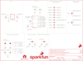

Contents
========

* [PRS13033 > Sparkfun](#prs13033--sparkfun)
	* [Schematic](#schematic)
	* [Interactive BOM](#interactive-bom)
	* [OOMP Parts](#oomp-parts)
	* [Images](#images)
	* [Tags](#tags)
  
![][im]
# PRS13033 > Sparkfun

- ID: PROJ-SPAR-13033-STAN-01
- Hex ID: PRS13033
- Name: Sparkfun
- Description: Sparkfun
- Long Link: [http://oom.lt/PROJ-SPAR-13033-STAN-01](http://oom.lt/PROJ-SPAR-13033-STAN-01)
- Short Link: [http://oom.lt/PRS13033](http://oom.lt/PRS13033)

## Schematic
  

## Interactive BOM

- Interactive BOM page: [ibom.html](https://htmlpreview.github.io/?https://github.com/oomlout/oomlout_OOMP_projects/blob/main/PROJ-SPAR-13033-STAN-01/kicad/bom/ibom.html)

## OOMP Parts
  

|OOMP Parts|
| :---: |
|C1,UNMATCHED-UNMATCHED-UNMATCHED-UNMATCHED-UNMATCHED,C1,1.0uF,1.0UF-16V-10%(0603),0603-CAP,CAP-00868,CAP-00868,1.0uF,|
|C2,UNMATCHED-UNMATCHED-UNMATCHED-UNMATCHED-UNMATCHED,C2,10uF,CAP0805,0805,Capacitor,CAP-11330,,|
|C3,UNMATCHED-UNMATCHED-UNMATCHED-UNMATCHED-UNMATCHED,C3,1.0uF,1.0UF-16V-10%(0603),0603-CAP,CAP-00868,CAP-00868,1.0uF,|
|C4,UNMATCHED-UNMATCHED-UNMATCHED-UNMATCHED-UNMATCHED,C4,0.1uF,0.1UF-25V(+80/-20%)(0603),0603-CAP,CAP-00810,CAP-00810,0.1uF,|
|C5,UNMATCHED-UNMATCHED-UNMATCHED-UNMATCHED-UNMATCHED,C5,0.22uF,0.22UF-25V-10%(0603),0603-CAP,CAP-07822,CAP-07822,0.22uF,|
|C6,UNMATCHED-UNMATCHED-UNMATCHED-UNMATCHED-UNMATCHED,C6,4.7uF,4.7UF-6.3V-10%(0603)0603,0603-CAP,CAP-08280,CAP-08280,4.7uF,|
|FRAME1,UNMATCHED-UNMATCHED-UNMATCHED-UNMATCHED-UNMATCHED,FID1,FIDUCIAL1X2,FIDUCIAL1X2,FIDUCIAL-1X2,Fiducial Alignment Points,,,|
|FRAME2,UNMATCHED-UNMATCHED-UNMATCHED-UNMATCHED-UNMATCHED,FID2,FIDUCIAL1X2,FIDUCIAL1X2,FIDUCIAL-1X2,Fiducial Alignment Points,,,|
|LOGO1,UNMATCHED-UNMATCHED-UNMATCHED-UNMATCHED-UNMATCHED,FID3,FIDUCIAL1X2,FIDUCIAL1X2,FIDUCIAL-1X2,Fiducial Alignment Points,,,|
|LOGO2,UNMATCHED-UNMATCHED-UNMATCHED-UNMATCHED-UNMATCHED,FID4,FIDUCIAL1X2,FIDUCIAL1X2,FIDUCIAL-1X2,Fiducial Alignment Points,,,|
|LOGO3,UNMATCHED-UNMATCHED-UNMATCHED-UNMATCHED-UNMATCHED,FRAME1,FRAME-LETTER,FRAME-LETTER,CREATIVE_COMMONS,Schematic Frame,,,|
|R1,UNMATCHED-UNMATCHED-UNMATCHED-UNMATCHED-UNMATCHED,FRAME2,FRAME-LETTER,FRAME-LETTER,CREATIVE_COMMONS,Schematic Frame,,,|
|R2,UNMATCHED-UNMATCHED-UNMATCHED-UNMATCHED-UNMATCHED,LOGO1,SFE_LOGO_FLAME.2_INCH,SFE_LOGO_FLAME.2_INCH,SFE_LOGO_FLAME_.2,SFE Logo, flame only,,,|
|R3,UNMATCHED-UNMATCHED-UNMATCHED-UNMATCHED-UNMATCHED,LOGO2,OSHW-LOGOS,OSHW-LOGOS,OSHW-LOGO-S,Open Source Hardware Logo This logo indicates the piece of hardware it is found on incorporates a OSHW license and/or adheres to the definition of open source hardware found here: http://freedomdefined.org/OSHW,,,|
|R4,UNMATCHED-UNMATCHED-UNMATCHED-UNMATCHED-UNMATCHED,LOGO3,SFE_LOGO_NAME_FLAME.1_INCH,SFE_LOGO_NAME_FLAME.1_INCH,SFE_LOGO_NAME_FLAME_.1,SFE Logo, name and flame,,,|
|R5,UNMATCHED-UNMATCHED-UNMATCHED-UNMATCHED-UNMATCHED,R1,10K,10KOHM1/10W1%(0603)0603,0603-RES,RES-00824,RES-00824,10K,|
|R6,UNMATCHED-UNMATCHED-UNMATCHED-UNMATCHED-UNMATCHED,R2,10K,10KOHM1/10W1%(0603)0603,0603-RES,RES-00824,RES-00824,10K,|
|SJ1,UNMATCHED-UNMATCHED-UNMATCHED-UNMATCHED-UNMATCHED,R3,10k,10K-1%RES-00824,0603-RES,10k-ohm SMT,RES-00824,10k,|
|SJ2,UNMATCHED-UNMATCHED-UNMATCHED-UNMATCHED-UNMATCHED,R4,10k,10K-1%RES-00824,0603-RES,10k-ohm SMT,RES-00824,10k,|
|SJ3,UNMATCHED-UNMATCHED-UNMATCHED-UNMATCHED-UNMATCHED,R5,10k,10K-1%RES-00824,0603-RES,10k-ohm SMT,RES-00824,10k,|
|SJ4,UNMATCHED-UNMATCHED-UNMATCHED-UNMATCHED-UNMATCHED,R6,10k,10K-1%RES-00824,0603-RES,10k-ohm SMT,RES-00824,10k,|
|SJ5,UNMATCHED-UNMATCHED-UNMATCHED-UNMATCHED-UNMATCHED,SJ1,JUMPER-PAD-3-NOYES_SILK,JUMPER-PAD-3-NOYES_SILK,PAD-JUMPER-3-NO_YES_SILK,,,,|
|SJ6,UNMATCHED-UNMATCHED-UNMATCHED-UNMATCHED-UNMATCHED,SJ2,,JUMPER-PAD-3-NC_BY_TRACE,PAD-JUMPER-3-3OF3_NC_BY_TRACE_YES_SILK_FULL_BOX,,,,|
|SJ7,UNMATCHED-UNMATCHED-UNMATCHED-UNMATCHED-UNMATCHED,SJ3,JUMPER-PAD-2-NC_BY_PASTE,JUMPER-PAD-2-NC_BY_PASTE,PAD-JUMPER-2-NC_BY_PASTE_YES_SILK,,,,|
|SJ8,UNMATCHED-UNMATCHED-UNMATCHED-UNMATCHED-UNMATCHED,SJ4,JUMPER-PAD-2-NOYES_SILK,JUMPER-PAD-2-NOYES_SILK,PAD-JUMPER-2-NO_YES_SILK,,,,|
|SJ9,UNMATCHED-UNMATCHED-UNMATCHED-UNMATCHED-UNMATCHED,SJ5,JUMPER-PAD-2-NOYES_SILK,JUMPER-PAD-2-NOYES_SILK,PAD-JUMPER-2-NO_YES_SILK,,,,|
|SJ10,UNMATCHED-UNMATCHED-UNMATCHED-UNMATCHED-UNMATCHED,SJ6,JUMPER-PAD-2-NOYES_SILK,JUMPER-PAD-2-NOYES_SILK,PAD-JUMPER-2-NO_YES_SILK,,,,|
|SJ11,UNMATCHED-UNMATCHED-UNMATCHED-UNMATCHED-UNMATCHED,SJ7,JUMPER-PAD-2-NOYES_SILK,JUMPER-PAD-2-NOYES_SILK,PAD-JUMPER-2-NO_YES_SILK,,,,|
|SJ12,UNMATCHED-UNMATCHED-UNMATCHED-UNMATCHED-UNMATCHED,SJ8,JUMPER-PAD-3-2OF3_NC_BY_TRACE_SMALL,JUMPER-PAD-3-2OF3_NC_BY_TRACE_SMALL,PAD-JUMPER-3-2OF3_NC_BY_TRACE_YES_SILK_FULL_BOX,,,,|
|SJ13,UNMATCHED-UNMATCHED-UNMATCHED-UNMATCHED-UNMATCHED,SJ9,JUMPER-PAD-3-2OF3_NC_BY_TRACE_SMALL,JUMPER-PAD-3-2OF3_NC_BY_TRACE_SMALL,PAD-JUMPER-3-2OF3_NC_BY_TRACE_YES_SILK_FULL_BOX,,,,|
|SJ14,UNMATCHED-UNMATCHED-UNMATCHED-UNMATCHED-UNMATCHED,SJ10,JUMPER-PAD-2-NOYES_SILK,JUMPER-PAD-2-NOYES_SILK,PAD-JUMPER-2-NO_YES_SILK,,,,|
|SJ15,UNMATCHED-UNMATCHED-UNMATCHED-UNMATCHED-UNMATCHED,SJ11,JUMPER-PAD-2-NOYES_SILK,JUMPER-PAD-2-NOYES_SILK,PAD-JUMPER-2-NO_YES_SILK,,,,|
|SJ16,UNMATCHED-UNMATCHED-UNMATCHED-UNMATCHED-UNMATCHED,SJ12,JUMPER-PAD-2-NOYES_SILK,JUMPER-PAD-2-NOYES_SILK,PAD-JUMPER-2-NO_YES_SILK,,,,|
|SJ17,UNMATCHED-UNMATCHED-UNMATCHED-UNMATCHED-UNMATCHED,SJ13,JUMPER-PAD-2-NOYES_SILK,JUMPER-PAD-2-NOYES_SILK,PAD-JUMPER-2-NO_YES_SILK,,,,|
|U1,UNMATCHED-UNMATCHED-UNMATCHED-UNMATCHED-UNMATCHED,SJ14,JUMPER-PAD-2-NOYES_SILK,JUMPER-PAD-2-NOYES_SILK,PAD-JUMPER-2-NO_YES_SILK,,,,|
|U2,UNMATCHED-UNMATCHED-UNMATCHED-UNMATCHED-UNMATCHED,SJ15,JUMPER-PAD-2-NC_BY_PASTE,JUMPER-PAD-2-NC_BY_PASTE,PAD-JUMPER-2-NC_BY_PASTE_YES_SILK,,,,|
|U3,UNMATCHED-UNMATCHED-UNMATCHED-UNMATCHED-UNMATCHED,SJ16,JUMPER-PAD-2-NOYES_SILK,JUMPER-PAD-2-NOYES_SILK,PAD-JUMPER-2-NO_YES_SILK,,,,|
|U4,UNMATCHED-UNMATCHED-UNMATCHED-UNMATCHED-UNMATCHED,SJ17,JUMPER-PAD-2-NOYES_SILK,JUMPER-PAD-2-NOYES_SILK,PAD-JUMPER-2-NO_YES_SILK,,,,|

## Images
  
  

|kicadPcb3d|kicadPcb3dFront|kicadPcb3dBack|eagleImage|eagleSchemImage|
| :---: | :---: | :---: | :---: | :---: |
||||||

## Tags

- hexID: PRS13033
- oompType: PROJ
- oompSize: SPAR
- oompColor: 13033
- oompDesc: STAN
- oompIndex: 01
- oompName: Edison 9DOF Block
- sources: All source files from https://github.com/sparkfun/Edison_9DOF_Block (source licence details in srcLicense.md)
- linkBuyPage: https://www.sparkfun.com/products/13033
- oompID: PROJ-SPAR-13033-STAN-01
- oompParts: C1,UNMATCHED-UNMATCHED-UNMATCHED-UNMATCHED-UNMATCHED
- oompParts: C2,UNMATCHED-UNMATCHED-UNMATCHED-UNMATCHED-UNMATCHED
- oompParts: C3,UNMATCHED-UNMATCHED-UNMATCHED-UNMATCHED-UNMATCHED
- oompParts: C4,UNMATCHED-UNMATCHED-UNMATCHED-UNMATCHED-UNMATCHED
- oompParts: C5,UNMATCHED-UNMATCHED-UNMATCHED-UNMATCHED-UNMATCHED
- oompParts: C6,UNMATCHED-UNMATCHED-UNMATCHED-UNMATCHED-UNMATCHED
- oompParts: FRAME1,UNMATCHED-UNMATCHED-UNMATCHED-UNMATCHED-UNMATCHED
- oompParts: FRAME2,UNMATCHED-UNMATCHED-UNMATCHED-UNMATCHED-UNMATCHED
- oompParts: LOGO1,UNMATCHED-UNMATCHED-UNMATCHED-UNMATCHED-UNMATCHED
- oompParts: LOGO2,UNMATCHED-UNMATCHED-UNMATCHED-UNMATCHED-UNMATCHED
- oompParts: LOGO3,UNMATCHED-UNMATCHED-UNMATCHED-UNMATCHED-UNMATCHED
- oompParts: R1,UNMATCHED-UNMATCHED-UNMATCHED-UNMATCHED-UNMATCHED
- oompParts: R2,UNMATCHED-UNMATCHED-UNMATCHED-UNMATCHED-UNMATCHED
- oompParts: R3,UNMATCHED-UNMATCHED-UNMATCHED-UNMATCHED-UNMATCHED
- oompParts: R4,UNMATCHED-UNMATCHED-UNMATCHED-UNMATCHED-UNMATCHED
- oompParts: R5,UNMATCHED-UNMATCHED-UNMATCHED-UNMATCHED-UNMATCHED
- oompParts: R6,UNMATCHED-UNMATCHED-UNMATCHED-UNMATCHED-UNMATCHED
- oompParts: SJ1,UNMATCHED-UNMATCHED-UNMATCHED-UNMATCHED-UNMATCHED
- oompParts: SJ2,UNMATCHED-UNMATCHED-UNMATCHED-UNMATCHED-UNMATCHED
- oompParts: SJ3,UNMATCHED-UNMATCHED-UNMATCHED-UNMATCHED-UNMATCHED
- oompParts: SJ4,UNMATCHED-UNMATCHED-UNMATCHED-UNMATCHED-UNMATCHED
- oompParts: SJ5,UNMATCHED-UNMATCHED-UNMATCHED-UNMATCHED-UNMATCHED
- oompParts: SJ6,UNMATCHED-UNMATCHED-UNMATCHED-UNMATCHED-UNMATCHED
- oompParts: SJ7,UNMATCHED-UNMATCHED-UNMATCHED-UNMATCHED-UNMATCHED
- oompParts: SJ8,UNMATCHED-UNMATCHED-UNMATCHED-UNMATCHED-UNMATCHED
- oompParts: SJ9,UNMATCHED-UNMATCHED-UNMATCHED-UNMATCHED-UNMATCHED
- oompParts: SJ10,UNMATCHED-UNMATCHED-UNMATCHED-UNMATCHED-UNMATCHED
- oompParts: SJ11,UNMATCHED-UNMATCHED-UNMATCHED-UNMATCHED-UNMATCHED
- oompParts: SJ12,UNMATCHED-UNMATCHED-UNMATCHED-UNMATCHED-UNMATCHED
- oompParts: SJ13,UNMATCHED-UNMATCHED-UNMATCHED-UNMATCHED-UNMATCHED
- oompParts: SJ14,UNMATCHED-UNMATCHED-UNMATCHED-UNMATCHED-UNMATCHED
- oompParts: SJ15,UNMATCHED-UNMATCHED-UNMATCHED-UNMATCHED-UNMATCHED
- oompParts: SJ16,UNMATCHED-UNMATCHED-UNMATCHED-UNMATCHED-UNMATCHED
- oompParts: SJ17,UNMATCHED-UNMATCHED-UNMATCHED-UNMATCHED-UNMATCHED
- oompParts: U1,UNMATCHED-UNMATCHED-UNMATCHED-UNMATCHED-UNMATCHED
- oompParts: U2,UNMATCHED-UNMATCHED-UNMATCHED-UNMATCHED-UNMATCHED
- oompParts: U3,UNMATCHED-UNMATCHED-UNMATCHED-UNMATCHED-UNMATCHED
- oompParts: U4,UNMATCHED-UNMATCHED-UNMATCHED-UNMATCHED-UNMATCHED
- rawParts: C1,1.0uF,1.0UF-16V-10%(0603),0603-CAP,CAP-00868,CAP-00868,1.0uF,
- rawParts: C2,10uF,CAP0805,0805,Capacitor,CAP-11330,,
- rawParts: C3,1.0uF,1.0UF-16V-10%(0603),0603-CAP,CAP-00868,CAP-00868,1.0uF,
- rawParts: C4,0.1uF,0.1UF-25V(+80/-20%)(0603),0603-CAP,CAP-00810,CAP-00810,0.1uF,
- rawParts: C5,0.22uF,0.22UF-25V-10%(0603),0603-CAP,CAP-07822,CAP-07822,0.22uF,
- rawParts: C6,4.7uF,4.7UF-6.3V-10%(0603)0603,0603-CAP,CAP-08280,CAP-08280,4.7uF,
- rawParts: FID1,FIDUCIAL1X2,FIDUCIAL1X2,FIDUCIAL-1X2,Fiducial Alignment Points,,,
- rawParts: FID2,FIDUCIAL1X2,FIDUCIAL1X2,FIDUCIAL-1X2,Fiducial Alignment Points,,,
- rawParts: FID3,FIDUCIAL1X2,FIDUCIAL1X2,FIDUCIAL-1X2,Fiducial Alignment Points,,,
- rawParts: FID4,FIDUCIAL1X2,FIDUCIAL1X2,FIDUCIAL-1X2,Fiducial Alignment Points,,,
- rawParts: FRAME1,FRAME-LETTER,FRAME-LETTER,CREATIVE_COMMONS,Schematic Frame,,,
- rawParts: FRAME2,FRAME-LETTER,FRAME-LETTER,CREATIVE_COMMONS,Schematic Frame,,,
- rawParts: LOGO1,SFE_LOGO_FLAME.2_INCH,SFE_LOGO_FLAME.2_INCH,SFE_LOGO_FLAME_.2,SFE Logo, flame only,,,
- rawParts: LOGO2,OSHW-LOGOS,OSHW-LOGOS,OSHW-LOGO-S,Open Source Hardware Logo This logo indicates the piece of hardware it is found on incorporates a OSHW license and/or adheres to the definition of open source hardware found here: http://freedomdefined.org/OSHW,,,
- rawParts: LOGO3,SFE_LOGO_NAME_FLAME.1_INCH,SFE_LOGO_NAME_FLAME.1_INCH,SFE_LOGO_NAME_FLAME_.1,SFE Logo, name and flame,,,
- rawParts: R1,10K,10KOHM1/10W1%(0603)0603,0603-RES,RES-00824,RES-00824,10K,
- rawParts: R2,10K,10KOHM1/10W1%(0603)0603,0603-RES,RES-00824,RES-00824,10K,
- rawParts: R3,10k,10K-1%RES-00824,0603-RES,10k-ohm SMT,RES-00824,10k,
- rawParts: R4,10k,10K-1%RES-00824,0603-RES,10k-ohm SMT,RES-00824,10k,
- rawParts: R5,10k,10K-1%RES-00824,0603-RES,10k-ohm SMT,RES-00824,10k,
- rawParts: R6,10k,10K-1%RES-00824,0603-RES,10k-ohm SMT,RES-00824,10k,
- rawParts: SJ1,JUMPER-PAD-3-NOYES_SILK,JUMPER-PAD-3-NOYES_SILK,PAD-JUMPER-3-NO_YES_SILK,,,,
- rawParts: SJ2,,JUMPER-PAD-3-NC_BY_TRACE,PAD-JUMPER-3-3OF3_NC_BY_TRACE_YES_SILK_FULL_BOX,,,,
- rawParts: SJ3,JUMPER-PAD-2-NC_BY_PASTE,JUMPER-PAD-2-NC_BY_PASTE,PAD-JUMPER-2-NC_BY_PASTE_YES_SILK,,,,
- rawParts: SJ4,JUMPER-PAD-2-NOYES_SILK,JUMPER-PAD-2-NOYES_SILK,PAD-JUMPER-2-NO_YES_SILK,,,,
- rawParts: SJ5,JUMPER-PAD-2-NOYES_SILK,JUMPER-PAD-2-NOYES_SILK,PAD-JUMPER-2-NO_YES_SILK,,,,
- rawParts: SJ6,JUMPER-PAD-2-NOYES_SILK,JUMPER-PAD-2-NOYES_SILK,PAD-JUMPER-2-NO_YES_SILK,,,,
- rawParts: SJ7,JUMPER-PAD-2-NOYES_SILK,JUMPER-PAD-2-NOYES_SILK,PAD-JUMPER-2-NO_YES_SILK,,,,
- rawParts: SJ8,JUMPER-PAD-3-2OF3_NC_BY_TRACE_SMALL,JUMPER-PAD-3-2OF3_NC_BY_TRACE_SMALL,PAD-JUMPER-3-2OF3_NC_BY_TRACE_YES_SILK_FULL_BOX,,,,
- rawParts: SJ9,JUMPER-PAD-3-2OF3_NC_BY_TRACE_SMALL,JUMPER-PAD-3-2OF3_NC_BY_TRACE_SMALL,PAD-JUMPER-3-2OF3_NC_BY_TRACE_YES_SILK_FULL_BOX,,,,
- rawParts: SJ10,JUMPER-PAD-2-NOYES_SILK,JUMPER-PAD-2-NOYES_SILK,PAD-JUMPER-2-NO_YES_SILK,,,,
- rawParts: SJ11,JUMPER-PAD-2-NOYES_SILK,JUMPER-PAD-2-NOYES_SILK,PAD-JUMPER-2-NO_YES_SILK,,,,
- rawParts: SJ12,JUMPER-PAD-2-NOYES_SILK,JUMPER-PAD-2-NOYES_SILK,PAD-JUMPER-2-NO_YES_SILK,,,,
- rawParts: SJ13,JUMPER-PAD-2-NOYES_SILK,JUMPER-PAD-2-NOYES_SILK,PAD-JUMPER-2-NO_YES_SILK,,,,
- rawParts: SJ14,JUMPER-PAD-2-NOYES_SILK,JUMPER-PAD-2-NOYES_SILK,PAD-JUMPER-2-NO_YES_SILK,,,,
- rawParts: SJ15,JUMPER-PAD-2-NC_BY_PASTE,JUMPER-PAD-2-NC_BY_PASTE,PAD-JUMPER-2-NC_BY_PASTE_YES_SILK,,,,
- rawParts: SJ16,JUMPER-PAD-2-NOYES_SILK,JUMPER-PAD-2-NOYES_SILK,PAD-JUMPER-2-NO_YES_SILK,,,,
- rawParts: SJ17,JUMPER-PAD-2-NOYES_SILK,JUMPER-PAD-2-NOYES_SILK,PAD-JUMPER-2-NO_YES_SILK,,,,
- rawParts: U1,LSM9DS0,LSM9DS0,LGA-24,LSM9DS0 3D Accelerometer, 3D Gyroscope, 3D Magnetomter,,,
- rawParts: U2,EDISON_CONNECTOR_FULLMOUNTING_HOLES,EDISON_CONNECTOR_FULLMOUNTING_HOLES,EDISON_DAUGHTER,,,,
- rawParts: U3,EDISON_CONNECTOR_FULLHEADER,EDISON_CONNECTOR_FULLHEADER,DF40C-70DP-0.4(51),,,,
- rawParts: U4,MIC52053.3V,MIC52053.3V,SOT23-5,MIC5205 150mA vreg,VREG-00822,,

[im]: kicadPcb3d_450.png
