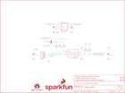

Contents
========

* [PRS13034 > Edison I2C Breakout Block](#prs13034--edison-i2c-breakout-block)
	* [Schematic](#schematic)
	* [PCB](#pcb)
	* [Interactive BOM](#interactive-bom)
	* [OOMP Parts](#oomp-parts)
	* [Images](#images)
	* [Tags](#tags)
  
![][im]
# PRS13034 > Edison I2C Breakout Block

- ID: PROJ-SPAR-13034-STAN-01
- Hex ID: PRS13034
- Name: Sparkfun
- Description: Sparkfun
- Long Link: [http://oom.lt/PROJ-SPAR-13034-STAN-01](http://oom.lt/PROJ-SPAR-13034-STAN-01)
- Short Link: [http://oom.lt/PRS13034](http://oom.lt/PRS13034)

## Schematic
  

## PCB
  

## Interactive BOM

- Interactive BOM page: [ibom.html](https://htmlpreview.github.io/?https://github.com/oomlout/oomlout_OOMP_projects/blob/main/PROJ-SPAR-13034-STAN-01/kicad/bom/ibom.html)

## OOMP Parts
  

|OOMP Parts|
| :---: |
|C1 C1,CAPC-0603-X-UF1D-01|
|C2 C2,CAPC-0603-X-UF1D-01|
|C3 C3,CAPC-1206-X-UF10-01|
|C4 C4,CAPC-1206-X-UF10-01|
|[JP2 HEAD-I01-X-PI04-01 2.54 mm 4 Pin Header](https://github.com/oomlout/oomlout_OOMP_parts/tree/main/HEAD-I01-X-PI04-01/)|
|[R1 RESE-0603-X-O103-01 SMD (0603) 10k Ohm Resistor](https://github.com/oomlout/oomlout_OOMP_parts/tree/main/RESE-0603-X-O103-01/)|
|[R2 RESE-0603-X-O103-01 SMD (0603) 10k Ohm Resistor](https://github.com/oomlout/oomlout_OOMP_parts/tree/main/RESE-0603-X-O103-01/)|
|R3 R3,RESE-0603-X-O2003-01|
|R4 R4,RESE-0603-X-UNMATCHED-01|
|R5 R5,RESE-0603-X-UNMATCHED-01|
|U$2 U$2,UNMATCHED-UNMATCHED-X-UNMATCHED-01|
|U$3 U$3,HEAD-I01-X-UNMATCHED-01|
|U1 U1,UNMATCHED-SO235-X-UNMATCHED-01|
|U2 U2,UNMATCHED-UNMATCHED-X-UNMATCHED-01|

## Images
  
  

|kicadPcb3d|kicadPcb3dFront|kicadPcb3dBack|eagleImage|eagleSchemImage|
| :---: | :---: | :---: | :---: | :---: |
||||||

## Tags

- hexID: PRS13034
- oompType: PROJ
- oompSize: SPAR
- oompColor: 13034
- oompDesc: STAN
- oompIndex: 01
- oompName: Edison I2C Breakout Block
- sources: All source files from https://github.com/sparkfun/Edison_I2C_Breakout_Block (source licence details in srcLicense.md)
- linkBuyPage: https://www.sparkfun.com/products/13034
- oompID: PROJ-SPAR-13034-STAN-01
- oompParts: C1,CAPC-0603-X-UF1D-01
- oompParts: C2,CAPC-0603-X-UF1D-01
- oompParts: C3,CAPC-1206-X-UF10-01
- oompParts: C4,CAPC-1206-X-UF10-01
- oompParts: JP2,HEAD-I01-X-PI04-01
- oompParts: R1,RESE-0603-X-O103-01
- oompParts: R2,RESE-0603-X-O103-01
- oompParts: R3,RESE-0603-X-O2003-01
- oompParts: R4,RESE-0603-X-UNMATCHED-01
- oompParts: R5,RESE-0603-X-UNMATCHED-01
- oompParts: U$2,UNMATCHED-UNMATCHED-X-UNMATCHED-01
- oompParts: U$3,HEAD-I01-X-UNMATCHED-01
- oompParts: U1,UNMATCHED-SO235-X-UNMATCHED-01
- oompParts: U2,UNMATCHED-UNMATCHED-X-UNMATCHED-01
- rawParts: C1,0.1uF,0.1UF-25V(+80/-20%)(0603),0603-CAP,CAP-00810,CAP-00810,0.1uF,
- rawParts: C2,0.1uF,0.1UF-25V(+80/-20%)(0603),0603-CAP,CAP-00810,CAP-00810,0.1uF,
- rawParts: C3,10uF,10UF-6.3V-20%(1206),1206,CAP-10057,CAP-10057,10uF,
- rawParts: C4,10uF,10UF-6.3V-20%(1206),1206,CAP-10057,CAP-10057,10uF,
- rawParts: FID1,FIDUCIAL1X2,FIDUCIAL1X2,FIDUCIAL-1X2,Fiducial Alignment Points,,,
- rawParts: FID2,FIDUCIAL1X2,FIDUCIAL1X2,FIDUCIAL-1X2,Fiducial Alignment Points,,,
- rawParts: FID3,FIDUCIAL1X2,FIDUCIAL1X2,FIDUCIAL-1X2,Fiducial Alignment Points,,,
- rawParts: FID4,FIDUCIAL1X2,FIDUCIAL1X2,FIDUCIAL-1X2,Fiducial Alignment Points,,,
- rawParts: FRAME1,FRAME-LETTER,FRAME-LETTER,CREATIVE_COMMONS,Schematic Frame,,,
- rawParts: FRAME2,FRAME-LETTER,FRAME-LETTER,CREATIVE_COMMONS,Schematic Frame,,,
- rawParts: JP2,,M04SMD_RA_FEMALE,1X04_SMD_RA_FEMALE,Header 4,,,
- rawParts: LOGO1,SFE_LOGO_NAME_FLAME.1_INCH,SFE_LOGO_NAME_FLAME.1_INCH,SFE_LOGO_NAME_FLAME_.1,SFE Logo, name and flame,,,
- rawParts: LOGO2,OSHW-LOGOS,OSHW-LOGOS,OSHW-LOGO-S,Open Source Hardware Logo This logo indicates the piece of hardware it is found on incorporates a OSHW license and/or adheres to the definition of open source hardware found here: http://freedomdefined.org/OSHW,,,
- rawParts: LOGO3,SFE_LOGO_NAME_FLAME.1_INCH,SFE_LOGO_NAME_FLAME.1_INCH,SFE_LOGO_NAME_FLAME_.1,SFE Logo, name and flame,,,
- rawParts: LOGO4,OSHW-LOGOS,OSHW-LOGOS,OSHW-LOGO-S,Open Source Hardware Logo This logo indicates the piece of hardware it is found on incorporates a OSHW license and/or adheres to the definition of open source hardware found here: http://freedomdefined.org/OSHW,,,
- rawParts: R1,10K,10KOHM1/10W1%(0603)0603,0603-RES,RES-00824,RES-00824,10K,
- rawParts: R2,10K,10KOHM1/10W1%(0603)0603,0603-RES,RES-00824,RES-00824,10K,
- rawParts: R3,200k,200KOHM1/10W1%(0603)200K,0603-RES,RES-09385,RES-09385,200k,
- rawParts: R4,DNP,2.2KOHM1/10W1%(0603),0603-RES,RES-08272,RES-08272,2.2k,
- rawParts: R5,DNP,2.2KOHM1/10W1%(0603),0603-RES,RES-08272,RES-08272,2.2k,
- rawParts: SJ1,Power Select,JUMPER-PAD-3-2OF3_NC_BY_TRACE,PAD-JUMPER-3-2OF3_NC_BY_TRACE_YES_SILK_FULL_BOX,,,,
- rawParts: U$2,EDISON_CONNECTOR_FULLMOUNTING_HOLES,EDISON_CONNECTOR_FULLMOUNTING_HOLES,EDISON_DAUGHTER,,,,
- rawParts: U$3,EDISON_CONNECTOR_FULLHEADER,EDISON_CONNECTOR_FULLHEADER,DF40C-70DP-0.4(51),,,,
- rawParts: U1,MIC5205,MIC52053.3V,SOT23-5,MIC5205 150mA vreg,VREG-00822,,
- rawParts: U2,PCA9306,PCA9306PCA9306DC-1:1,PCA9306DC-1:1,Bidirectional I2C level shifter.,IC-10023,PCA9306,

[im]: kicadPcb3d_450.png
