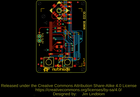
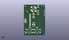
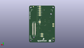
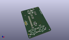

Contents
========

* [PROJ-SPAR-13035-STAN-01>Edison OLED Block](#proj-spar-13035-stan-01edison-oled-block)
	* [Images](#images)
	* [Interactive BOM](#interactive-bom)
	* [Tags](#tags)
  
![][im]
# PROJ-SPAR-13035-STAN-01>Edison OLED Block

- ID: PROJ-SPAR-13035-STAN-01
- Hex ID: PRS13035
- Name: Edison OLED Block
- Description: 

## Images
  
  

|eagleImage|kicadPcb3dFront|kicadPcb3dBack|kicadPcb3d|
| :---: | :---: | :---: | :---: |
|||||

## Interactive BOM

- Interactive BOM page: [ibom.html](kicad/bom/ibom.html)

## Tags

- hexID: PRS13035
- oompType: PROJ
- oompSize: SPAR
- oompColor: 13035
- oompDesc: STAN
- oompIndex: 01
- oompName: Edison OLED Block
- sources: All source files from https://github.com/sparkfun/Edison_OLED_Block (source licence details in srcLicense.md)
- linkBuyPage: https://www.sparkfun.com/products/13035
- oompID: PROJ-SPAR-13035-STAN-01
- oompParts: C1,UNMATCHED-UNMATCHED-UNMATCHED-UNMATCHED-UNMATCHED
- oompParts: C2,UNMATCHED-UNMATCHED-UNMATCHED-UNMATCHED-UNMATCHED
- oompParts: C3,UNMATCHED-UNMATCHED-UNMATCHED-UNMATCHED-UNMATCHED
- oompParts: C4,UNMATCHED-UNMATCHED-UNMATCHED-UNMATCHED-UNMATCHED
- oompParts: C5,UNMATCHED-UNMATCHED-UNMATCHED-UNMATCHED-UNMATCHED
- oompParts: C6,UNMATCHED-UNMATCHED-UNMATCHED-UNMATCHED-UNMATCHED
- oompParts: FRAME1,UNMATCHED-UNMATCHED-UNMATCHED-UNMATCHED-UNMATCHED
- oompParts: FRAME2,UNMATCHED-UNMATCHED-UNMATCHED-UNMATCHED-UNMATCHED
- oompParts: J1,UNMATCHED-UNMATCHED-UNMATCHED-UNMATCHED-UNMATCHED
- oompParts: JP1,UNMATCHED-UNMATCHED-UNMATCHED-UNMATCHED-UNMATCHED
- oompParts: LOGO2,UNMATCHED-UNMATCHED-UNMATCHED-UNMATCHED-UNMATCHED
- oompParts: OLED1,UNMATCHED-UNMATCHED-UNMATCHED-UNMATCHED-UNMATCHED
- oompParts: R1,UNMATCHED-UNMATCHED-UNMATCHED-UNMATCHED-UNMATCHED
- oompParts: R2,UNMATCHED-UNMATCHED-UNMATCHED-UNMATCHED-UNMATCHED
- oompParts: R3,UNMATCHED-UNMATCHED-UNMATCHED-UNMATCHED-UNMATCHED
- oompParts: R4,UNMATCHED-UNMATCHED-UNMATCHED-UNMATCHED-UNMATCHED
- oompParts: R5,UNMATCHED-UNMATCHED-UNMATCHED-UNMATCHED-UNMATCHED
- oompParts: R6,UNMATCHED-UNMATCHED-UNMATCHED-UNMATCHED-UNMATCHED
- oompParts: R7,UNMATCHED-UNMATCHED-UNMATCHED-UNMATCHED-UNMATCHED
- oompParts: R8,UNMATCHED-UNMATCHED-UNMATCHED-UNMATCHED-UNMATCHED
- oompParts: S1,UNMATCHED-UNMATCHED-UNMATCHED-UNMATCHED-UNMATCHED
- oompParts: S2,UNMATCHED-UNMATCHED-UNMATCHED-UNMATCHED-UNMATCHED
- oompParts: S3,UNMATCHED-UNMATCHED-UNMATCHED-UNMATCHED-UNMATCHED
- oompParts: SJ1,UNMATCHED-UNMATCHED-UNMATCHED-UNMATCHED-UNMATCHED
- oompParts: SJ2,UNMATCHED-UNMATCHED-UNMATCHED-UNMATCHED-UNMATCHED
- oompParts: SJ3,UNMATCHED-UNMATCHED-UNMATCHED-UNMATCHED-UNMATCHED
- oompParts: SJ4,UNMATCHED-UNMATCHED-UNMATCHED-UNMATCHED-UNMATCHED
- oompParts: SJ5,UNMATCHED-UNMATCHED-UNMATCHED-UNMATCHED-UNMATCHED
- oompParts: SJ6,UNMATCHED-UNMATCHED-UNMATCHED-UNMATCHED-UNMATCHED
- oompParts: SJ7,UNMATCHED-UNMATCHED-UNMATCHED-UNMATCHED-UNMATCHED
- oompParts: SJ8,UNMATCHED-UNMATCHED-UNMATCHED-UNMATCHED-UNMATCHED
- rawParts: C1,2.2uF,CAP0805,0805,Capacitor,,,
- rawParts: C2,1uF X5R,CAP0805,0805,Capacitor,,,
- rawParts: C3,1uF X5R,CAP0805,0805,Capacitor,,,
- rawParts: C4,1uF,CAP0603-CAP,0603-CAP,Capacitor,,,
- rawParts: C5,4.7uF/16V,CAP1206,1206,Capacitor,,,
- rawParts: C6,1uF,CAP0603-CAP,0603-CAP,Capacitor,,,
- rawParts: FID1,FIDUCIAL1X2,FIDUCIAL1X2,FIDUCIAL-1X2,Fiducial Alignment Points,,,
- rawParts: FID2,FIDUCIAL1X2,FIDUCIAL1X2,FIDUCIAL-1X2,Fiducial Alignment Points,,,
- rawParts: FID3,FIDUCIAL1X2,FIDUCIAL1X2,FIDUCIAL-1X2,Fiducial Alignment Points,,,
- rawParts: FID4,FIDUCIAL1X2,FIDUCIAL1X2,FIDUCIAL-1X2,Fiducial Alignment Points,,,
- rawParts: FRAME1,FRAME-LETTER,FRAME-LETTER,CREATIVE_COMMONS,Schematic Frame,,,
- rawParts: FRAME2,FRAME-LETTER,FRAME-LETTER,CREATIVE_COMMONS,Schematic Frame,,,
- rawParts: J1,EDISON_CONNECTOR_FULLMOUNTING_HOLES,EDISON_CONNECTOR_FULLMOUNTING_HOLES,EDISON_DAUGHTER,,,,
- rawParts: JP1,M02PTH,M02PTH,1X02,Standard 2-pin 0.1 header. Use with,,,
- rawParts: LOGO2,OSHW-LOGOS,OSHW-LOGOS,OSHW-LOGO-S,Open Source Hardware Logo This logo indicates the piece of hardware it is found on incorporates a OSHW license and/or adheres to the definition of open source hardware found here: http://freedomdefined.org/OSHW,,,
- rawParts: OLED1,OLED0.66,OLED0.66,OLED-0.66-64X48,,,,
- rawParts: R1,390k,RESISTOR0603-RES,0603-RES,Resistor,,,
- rawParts: R2,10K,10KOHM1/10W1%(0603)0603,0603-RES,RES-00824,RES-00824,10K,
- rawParts: R3,10K,10KOHM1/10W1%(0603)0603,0603-RES,RES-00824,RES-00824,10K,
- rawParts: R4,10K,10KOHM1/10W1%(0603)0603,0603-RES,RES-00824,RES-00824,10K,
- rawParts: R5,10K,10KOHM1/10W1%(0603)0603,0603-RES,RES-00824,RES-00824,10K,
- rawParts: R6,10K,10KOHM1/10W1%(0603)0603,0603-RES,RES-00824,RES-00824,10K,
- rawParts: R7,10K,10KOHM1/10W1%(0603)0603,0603-RES,RES-00824,RES-00824,10K,
- rawParts: R8,10K,10KOHM1/10W1%(0603)0603,0603-RES,RES-00824,RES-00824,10K,
- rawParts: S1,Button A,SWITCH-MOMENTARY-2SMD-4,TACTILE_SWITCH_TALL,Various NO switches- pushbuttons, reed, etc,SWCH-11966,,
- rawParts: S2,Button B,SWITCH-MOMENTARY-2SMD-4,TACTILE_SWITCH_TALL,Various NO switches- pushbuttons, reed, etc,SWCH-11966,,
- rawParts: S3,,JOYSTICK_MINI,JOYSTICK_MINI,Small 5-way tactile joystick, COM-10063,,,
- rawParts: SJ1,,JUMPER-PAD-2-NC_BY_TRACE,PAD-JUMPER-2-NC_BY_TRACE_YES_SILK,,,,
- rawParts: SJ2,CS_SEL,JUMPER-PAD-3-2OF3_NC_BY_TRACE,PAD-JUMPER-3-2OF3_NC_BY_TRACE_YES_SILK_FULL_BOX,,,,
- rawParts: SJ3,,JUMPER-PAD-2-NC_BY_TRACE,PAD-JUMPER-2-NC_BY_TRACE_YES_SILK,,,,
- rawParts: SJ4,,JUMPER-PAD-2-NC_BY_TRACE,PAD-JUMPER-2-NC_BY_TRACE_YES_SILK,,,,
- rawParts: SJ5,,JUMPER-PAD-2-NC_BY_TRACE,PAD-JUMPER-2-NC_BY_TRACE_YES_SILK,,,,
- rawParts: SJ6,,JUMPER-PAD-2-NC_BY_TRACE,PAD-JUMPER-2-NC_BY_TRACE_YES_SILK,,,,
- rawParts: SJ7,,JUMPER-PAD-2-NC_BY_TRACE,PAD-JUMPER-2-NC_BY_TRACE_YES_SILK,,,,
- rawParts: SJ8,,JUMPER-PAD-2-NC_BY_TRACE,PAD-JUMPER-2-NC_BY_TRACE_YES_SILK,,,,

[im]: kicadPcb3d_450.png
