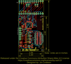
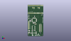
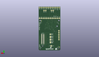
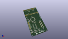

Contents
========

* [PROJ-SPAR-13036-STAN-01>Edison Arduino Block](#proj-spar-13036-stan-01edison-arduino-block)
	* [Images](#images)
	* [Interactive BOM](#interactive-bom)
	* [OOMP Parts](#oomp-parts)
	* [Tags](#tags)
  
![][im]
# PROJ-SPAR-13036-STAN-01>Edison Arduino Block

- ID: PROJ-SPAR-13036-STAN-01
- Hex ID: PRS13036
- Name: Edison Arduino Block
- Description: 

## Images
  
  

|eagleImage|kicadPcb3dFront|kicadPcb3dBack|kicadPcb3d|
| :---: | :---: | :---: | :---: |
|||||

## Interactive BOM

- Interactive BOM page: [ibom.html](kicad/bom/ibom.html)

## OOMP Parts
  

|OOMP Parts|
| :---: |
|<table><tr><td></td><td> C1</td><td>[CAPC-0603-X-NF100-V50 SMD (0603) 100 nF Capacitor (Ceramic) 50v](https://github.com/oomlout/oomlout_OOMP_parts/tree/main/CAPC-0603-X-NF100-V50/)</td><td>[C6N100](https://github.com/oomlout/oomlout_OOMP_parts/tree/main/CAPC-0603-X-NF100-V50/)</td></tr></table>|
|<table><tr><td></td><td> C2</td><td>[CAPC-0603-X-NF100-V50 SMD (0603) 100 nF Capacitor (Ceramic) 50v](https://github.com/oomlout/oomlout_OOMP_parts/tree/main/CAPC-0603-X-NF100-V50/)</td><td>[C6N100](https://github.com/oomlout/oomlout_OOMP_parts/tree/main/CAPC-0603-X-NF100-V50/)</td></tr></table>|
|<table><tr><td></td><td> C3</td><td>[CAPC-0603-X-NF100-V50 SMD (0603) 100 nF Capacitor (Ceramic) 50v](https://github.com/oomlout/oomlout_OOMP_parts/tree/main/CAPC-0603-X-NF100-V50/)</td><td>[C6N100](https://github.com/oomlout/oomlout_OOMP_parts/tree/main/CAPC-0603-X-NF100-V50/)</td></tr></table>|
|<table><tr><td></td><td> C4</td><td>[CAPC-0603-X-NF100-V50 SMD (0603) 100 nF Capacitor (Ceramic) 50v](https://github.com/oomlout/oomlout_OOMP_parts/tree/main/CAPC-0603-X-NF100-V50/)</td><td>[C6N100](https://github.com/oomlout/oomlout_OOMP_parts/tree/main/CAPC-0603-X-NF100-V50/)</td></tr></table>|
|<table><tr><td></td><td> C5</td><td>[CAPC-0603-X-NF100-V50 SMD (0603) 100 nF Capacitor (Ceramic) 50v](https://github.com/oomlout/oomlout_OOMP_parts/tree/main/CAPC-0603-X-NF100-V50/)</td><td>[C6N100](https://github.com/oomlout/oomlout_OOMP_parts/tree/main/CAPC-0603-X-NF100-V50/)</td></tr></table>|
|<table><tr><td></td><td> C10</td><td>[CAPC-0603-X-NF100-V50 SMD (0603) 100 nF Capacitor (Ceramic) 50v](https://github.com/oomlout/oomlout_OOMP_parts/tree/main/CAPC-0603-X-NF100-V50/)</td><td>[C6N100](https://github.com/oomlout/oomlout_OOMP_parts/tree/main/CAPC-0603-X-NF100-V50/)</td></tr></table>|
|CAPC-UNMATCHED-X-UNMATCHED-01, C13, 8.889999999999999, 6.35, 270,C13, 10uF, EIA3216, SparkFun, (0.35, 0.25), R270|
|CAPC-UNMATCHED-X-UNMATCHED-01, C19, 16.509999999999998, 6.35, 270,C19, 10uF, EIA3216, SparkFun, (0.65, 0.25), R270|
|UNMATCHED-UNMATCHED-X-UNMATCHED-01, D3, 2.921, 10.16, 270,D3, Green, 0603-LED-ALT1, Testing, (0.115, 0.4), R270|
|ERROR, JP1 FTDI Basic, 0, 0, 0,JP1, FTDI, Basic, 1X06, SparkFun, (0.0775, 1.1), R270|
|<table><tr><td></td><td> JP2</td><td>[HEAD-I01-X-PI12-01 2.54 mm 12 Pin Header](https://github.com/oomlout/oomlout_OOMP_parts/tree/main/HEAD-I01-X-PI12-01/)</td><td>[H12](https://github.com/oomlout/oomlout_OOMP_parts/tree/main/HEAD-I01-X-PI12-01/)</td></tr></table>|
|<table><tr><td></td><td> JP3</td><td>[HEAD-I01-X-PI12-01 2.54 mm 12 Pin Header](https://github.com/oomlout/oomlout_OOMP_parts/tree/main/HEAD-I01-X-PI12-01/)</td><td>[H12](https://github.com/oomlout/oomlout_OOMP_parts/tree/main/HEAD-I01-X-PI12-01/)</td></tr></table>|
|<table><tr><td></td><td> JP4</td><td>[HEAD-I01-X-PI02-01 2.54 mm 2 Pin Header](https://github.com/oomlout/oomlout_OOMP_parts/tree/main/HEAD-I01-X-PI02-01/)</td><td>[H02](https://github.com/oomlout/oomlout_OOMP_parts/tree/main/HEAD-I01-X-PI02-01/)</td></tr></table>|
|<table><tr><td></td><td> JP5</td><td>[HEAD-I01-X-PI02-01 2.54 mm 2 Pin Header](https://github.com/oomlout/oomlout_OOMP_parts/tree/main/HEAD-I01-X-PI02-01/)</td><td>[H02](https://github.com/oomlout/oomlout_OOMP_parts/tree/main/HEAD-I01-X-PI02-01/)</td></tr></table>|
|UNMATCHED-UNMATCHED-X-UNMATCHED-01, LED1, 2.794, 6.35, 90,LED1, Red, 0603-LED-ALT1, Testing, (0.11, 0.25), R90|
|<table><tr><td></td><td> R2</td><td>[RESE-0603-X-O103-01 SMD (0603) 10k Ohm Resistor](https://github.com/oomlout/oomlout_OOMP_parts/tree/main/RESE-0603-X-O103-01/)</td><td>[R6103](https://github.com/oomlout/oomlout_OOMP_parts/tree/main/RESE-0603-X-O103-01/)</td></tr></table>|
|<table><tr><td></td><td> R6</td><td>[RESE-0603-X-O331-01 SMD (0603) 330 Ohm Resistor](https://github.com/oomlout/oomlout_OOMP_parts/tree/main/RESE-0603-X-O331-01/)</td><td>[R6331](https://github.com/oomlout/oomlout_OOMP_parts/tree/main/RESE-0603-X-O331-01/)</td></tr></table>|
|<table><tr><td></td><td> R11</td><td>[RESE-0603-X-O103-01 SMD (0603) 10k Ohm Resistor](https://github.com/oomlout/oomlout_OOMP_parts/tree/main/RESE-0603-X-O103-01/)</td><td>[R6103](https://github.com/oomlout/oomlout_OOMP_parts/tree/main/RESE-0603-X-O103-01/)</td></tr></table>|
|UNMATCHED-UNMATCHED-X-UNMATCHED-01, S1, 1.778, 37.846, 270,S1, RESET, TACTILE_SWITCH-SMD-RIGHT-ANGLE, SparkFun-Electromechanical, (0.07, 1.49), R270|
|ERROR, U1 MIC5205-3.3V (150mA), 0, 0, 0,U1, MIC5205-3.3V, (150mA), SOT23-5, SparkFun, (0.5, 0.25), R90|
|UNMATCHED-UNMATCHED-X-UNMATCHED-01, U2, 27.94, 3.8099999999999996, M0,U2, EDISON_CONNECTOR_FULLMOUNTING_HOLES, EDISON_DAUGHTER, Edison, (1.1, 0.15), MR0|
|UNMATCHED-UNMATCHED-X-UNMATCHED-01, U3, 24.639999996, 16.1798, M90,U3, EDISON_CONNECTOR_FULLHEADER, DF40C-70DP-0.4(51), Edison, (0.97007874, 0.637), MR90|
|UNMATCHED-UNMATCHED-X-UNMATCHED-01, U4, 12.7, 31.75, 90,U4, ATMEGA328, TQFP32-08, SparkFun, (0.5, 1.25), R90|
|UNMATCHED-UNMATCHED-X-UNMATCHED-01, U5, 11.43, 16.509999999999998, 90,U5, SO14, SparkFun-DigitalIC, (0.45, 0.65), R90|
|UNMATCHED-UNMATCHED-X-UNMATCHED-01, Y1, 15.239999999999998, 24.13, 0,Y1, 8MHZ, RESONATOR-SMD, SparkFun-FreqCtrl, (0.6, 0.95), R0|

## Tags

- hexID: PRS13036
- oompType: PROJ
- oompSize: SPAR
- oompColor: 13036
- oompDesc: STAN
- oompIndex: 01
- oompName: Edison Arduino Block
- sources: All source files from https://github.com/sparkfun/Edison_Arduino_Block (source licence details in srcLicense.md)
- linkBuyPage: https://www.sparkfun.com/products/13036
- oompPart: CAPC-0603-X-NF100-V50, C1, 13.334999999999999, 39.37, 270
- oompPart: CAPC-0603-X-NF100-V50, C2, 5.715, 30.479999999999997, 270
- oompPart: CAPC-0603-X-NF100-V50, C3, 11.43, 25.4, 0
- oompPart: CAPC-0603-X-NF100-V50, C4, 8.889999999999999, 10.795, 180
- oompPart: CAPC-0603-X-NF100-V50, C5, 13.97, 10.795, 0
- oompPart: CAPC-0603-X-NF100-V50, C10, 6.35, 6.35, 90
- oompPart: CAPC-UNMATCHED-X-UNMATCHED-01, C13, 8.889999999999999, 6.35, 270
- oompPart: CAPC-UNMATCHED-X-UNMATCHED-01, C19, 16.509999999999998, 6.35, 270
- oompPart: UNMATCHED-UNMATCHED-X-UNMATCHED-01, D3, 2.921, 10.16, 270
- oompPart: SKIP-UNMATCHED-X-UNMATCHED-01, FID1, 1.27, 4.571999999999999, 0
- oompPart: SKIP-UNMATCHED-X-UNMATCHED-01, FID2, 26.669999999999998, 41.91, 0
- oompPart: SKIP-UNMATCHED-X-UNMATCHED-01, FID3, 1.27, 4.571999999999999, M0
- oompPart: SKIP-UNMATCHED-X-UNMATCHED-01, FID4, 26.669999999999998, 41.91, M0
- oompPart: ERROR, JP1 FTDI Basic, 0, 0, 0
- oompPart: HEAD-I01-X-PI12-01, JP2, 1.27, 60.959999999999994, 0
- oompPart: HEAD-I01-X-PI12-01, JP3, 1.27, 45.72, 0
- oompPart: HEAD-I01-X-PI02-01, JP4, 12.572999999999999, 56.76899999999999, 180
- oompPart: HEAD-I01-X-PI02-01, JP5, 22.987, 56.76899999999999, 180
- oompPart: UNMATCHED-UNMATCHED-X-UNMATCHED-01, LED1, 2.794, 6.35, 90
- oompPart: RESE-0603-X-O103-01, R2, 4.444999999999999, 30.479999999999997, 270
- oompPart: RESE-0603-X-O331-01, R6, 2.921, 11.43, 180
- oompPart: RESE-0603-X-O103-01, R11, 2.794, 7.746999999999999, 180
- oompPart: UNMATCHED-UNMATCHED-X-UNMATCHED-01, S1, 1.778, 37.846, 270
- oompPart: SKIP-UNMATCHED-X-UNMATCHED-01, SJ1, 13.97, 15.239999999999998, M270
- oompPart: SKIP-UNMATCHED-X-UNMATCHED-01, SJ2, 13.97, 19.049999999999997, M270
- oompPart: SKIP-UNMATCHED-X-UNMATCHED-01, SJ3, 13.97, 11.43, M270
- oompPart: SKIP-UNMATCHED-X-UNMATCHED-01, SJ4, 12.7, 6.35, M180
- oompPart: SKIP-UNMATCHED-X-UNMATCHED-01, SJ5, 13.97, 22.86, M90
- oompPart: ERROR, U1 MIC5205-3.3V (150mA), 0, 0, 0
- oompPart: UNMATCHED-UNMATCHED-X-UNMATCHED-01, U2, 27.94, 3.8099999999999996, M0
- oompPart: UNMATCHED-UNMATCHED-X-UNMATCHED-01, U3, 24.639999996, 16.1798, M90
- oompPart: UNMATCHED-UNMATCHED-X-UNMATCHED-01, U4, 12.7, 31.75, 90
- oompPart: UNMATCHED-UNMATCHED-X-UNMATCHED-01, U5, 11.43, 16.509999999999998, 90
- oompPart: UNMATCHED-UNMATCHED-X-UNMATCHED-01, Y1, 15.239999999999998, 24.13, 0
- rawPart: C1, 0.1uF, 0603-CAP, SparkFun, (0.525, 1.55), R270
- rawPart: C2, 0.1uF, 0603-CAP, SparkFun, (0.225, 1.2), R270
- rawPart: C3, 0.1uF, 0603-CAP, SparkFun, (0.45, 1), R0
- rawPart: C4, 0.1uF, 0603-CAP, SparkFun, (0.35, 0.425), R180
- rawPart: C5, 0.1uF, 0603-CAP, SparkFun, (0.55, 0.425), R0
- rawPart: C10, 0.1uF, 0603-CAP, SparkFun, (0.25, 0.25), R90
- rawPart: C13, 10uF, EIA3216, SparkFun, (0.35, 0.25), R270
- rawPart: C19, 10uF, EIA3216, SparkFun, (0.65, 0.25), R270
- rawPart: D3, Green, 0603-LED-ALT1, Testing, (0.115, 0.4), R270
- rawPart: FID1, FIDUCIAL1X2, FIDUCIAL-1X2, SparkFun-Aesthetics, (0.05, 0.18), R0
- rawPart: FID2, FIDUCIAL1X2, FIDUCIAL-1X2, SparkFun-Aesthetics, (1.05, 1.65), R0
- rawPart: FID3, FIDUCIAL1X2, FIDUCIAL-1X2, SparkFun-Aesthetics, (0.05, 0.18), MR0
- rawPart: FID4, FIDUCIAL1X2, FIDUCIAL-1X2, SparkFun-Aesthetics, (1.05, 1.65), MR0
- rawPart: JP1, FTDI, Basic, 1X06, SparkFun, (0.0775, 1.1), R270
- rawPart: JP2, M12NO_SILK, 1X12_NO_SILK, SparkFun-Connectors, (0.05, 2.4), R0
- rawPart: JP3, M12NO_SILK, 1X12_NO_SILK, SparkFun-Connectors, (0.05, 1.8), R0
- rawPart: JP4, M021X02_NO_SILK, 1X02_NO_SILK, SparkFun-Connectors, (0.495, 2.235), R180
- rawPart: JP5, M021X02_NO_SILK, 1X02_NO_SILK, SparkFun-Connectors, (0.905, 2.235), R180
- rawPart: LED1, Red, 0603-LED-ALT1, Testing, (0.11, 0.25), R90
- rawPart: R2, 10K, 0603-RES, SparkFun, (0.175, 1.2), R270
- rawPart: R6, 330, 0603-RES, SparkFun, (0.115, 0.45), R180
- rawPart: R11, 10K, 0603-RES, SparkFun, (0.11, 0.305), R180
- rawPart: S1, RESET, TACTILE_SWITCH-SMD-RIGHT-ANGLE, SparkFun-Electromechanical, (0.07, 1.49), R270
- rawPart: SJ1, TX, PAD-JUMPER-3-2OF3_NC_BY_TRACE_YES_SILK_FULL_BOX, SparkFun-Passives, (0.55, 0.6), MR270
- rawPart: SJ2, RX, PAD-JUMPER-3-2OF3_NC_BY_TRACE_YES_SILK_FULL_BOX, SparkFun-Passives, (0.55, 0.75), MR270
- rawPart: SJ3, TX, PAD-JUMPER-3-2OF3_NC_BY_TRACE_YES_SILK_FULL_BOX, SparkFun-Passives, (0.55, 0.45), MR270
- rawPart: SJ4, VIN, PAD-JUMPER-2-NC_BY_TRACE_YES_SILK, SparkFun-Passives, (0.5, 0.25), MR180
- rawPart: SJ5, DCIN, PAD-JUMPER-2-NO_YES_SILK, SparkFun-Passives, (0.55, 0.9), MR90
- rawPart: U1, MIC5205-3.3V, (150mA), SOT23-5, SparkFun, (0.5, 0.25), R90
- rawPart: U2, EDISON_CONNECTOR_FULLMOUNTING_HOLES, EDISON_DAUGHTER, Edison, (1.1, 0.15), MR0
- rawPart: U3, EDISON_CONNECTOR_FULLHEADER, DF40C-70DP-0.4(51), Edison, (0.97007874, 0.637), MR90
- rawPart: U4, ATMEGA328, TQFP32-08, SparkFun, (0.5, 1.25), R90
- rawPart: U5, SO14, SparkFun-DigitalIC, (0.45, 0.65), R90
- rawPart: Y1, 8MHZ, RESONATOR-SMD, SparkFun-FreqCtrl, (0.6, 0.95), R0
- oompID: PROJ-SPAR-13036-STAN-01

[im]: kicadPcb3d_450.png
