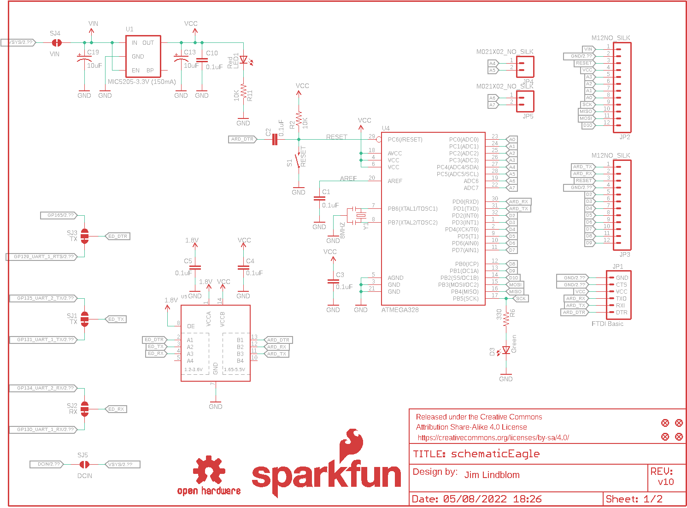

Contents
========

* [PRS13036 > Sparkfun](#prs13036--sparkfun)
	* [Schematic](#schematic)
	* [Interactive BOM](#interactive-bom)
	* [OOMP Parts](#oomp-parts)
	* [Images](#images)
	* [Tags](#tags)
  
![][im]
# PRS13036 > Sparkfun

- ID: PROJ-SPAR-13036-STAN-01
- Hex ID: PRS13036
- Name: Sparkfun
- Description: Sparkfun
- Long Link: [http://oom.lt/PROJ-SPAR-13036-STAN-01](http://oom.lt/PROJ-SPAR-13036-STAN-01)
- Short Link: [http://oom.lt/PRS13036](http://oom.lt/PRS13036)

## Schematic
  

## Interactive BOM

- Interactive BOM page: [ibom.html](https://htmlpreview.github.io/?https://github.com/oomlout/oomlout_OOMP_projects/blob/main/PROJ-SPAR-13036-STAN-01/kicad/bom/ibom.html)

## OOMP Parts
  

|OOMP Parts|
| :---: |
|C1,CAPC-0603-X-NF100-V50,C1,0.1uF,CAP0603-CAP,0603-CAP,Capacitor,,,|
|C2,CAPC-0603-X-NF100-V50,C2,0.1uF,CAP0603-CAP,0603-CAP,Capacitor,,,|
|C3,CAPC-0603-X-NF100-V50,C3,0.1uF,CAP0603-CAP,0603-CAP,Capacitor,,,|
|C4,CAPC-0603-X-NF100-V50,C4,0.1uF,CAP0603-CAP,0603-CAP,Capacitor,,,|
|C5,CAPC-0603-X-NF100-V50,C5,0.1uF,CAP0603-CAP,0603-CAP,Capacitor,,,|
|C10,CAPC-0603-X-NF100-V50,C10,0.1uF,CAP0603-CAP,0603-CAP,Capacitor,,,|
|C13,CAPX-UNMATCHED-X-UF10-01,C13,10uF,CAP_POL1206,EIA3216,Capacitor Polarized,,,|
|C19,CAPX-UNMATCHED-X-UF10-01,C19,10uF,CAP_POL1206,EIA3216,Capacitor Polarized,,,|
|D3,LEDS-UNMATCHED-G-STAN-01,D3,Green,LED,0603-LED-ALT1,LEDs,,,|
|JP1,HEAD-I01-X-PI06-01,FID1,FIDUCIAL1X2,FIDUCIAL1X2,FIDUCIAL-1X2,Fiducial Alignment Points,,,|
|JP2,HEAD-I01-X-PI12-01,FID2,FIDUCIAL1X2,FIDUCIAL1X2,FIDUCIAL-1X2,Fiducial Alignment Points,,,|
|JP3,HEAD-I01-X-PI12-01,FID3,FIDUCIAL1X2,FIDUCIAL1X2,FIDUCIAL-1X2,Fiducial Alignment Points,,,|
|JP4,HEAD-I01-X-PI02-01,FID4,FIDUCIAL1X2,FIDUCIAL1X2,FIDUCIAL-1X2,Fiducial Alignment Points,,,|
|JP5,HEAD-I01-X-PI02-01,FRAME1,FRAME-LETTER,FRAME-LETTER,CREATIVE_COMMONS,Schematic Frame,,,|
|LED1,LEDS-UNMATCHED-G-STAN-01,FRAME2,FRAME-LETTER,FRAME-LETTER,CREATIVE_COMMONS,Schematic Frame,,,|
|R2,RESE-0603-X-O103-01,JP1,FTDI Basic,ARDUINO_SERIAL_PROGRAMPTH,1X06,,,,|
|R6,RESE-0603-X-O331-01,JP2,M12NO_SILK,M12NO_SILK,1X12_NO_SILK,Header 12,,,|
|R11,RESE-0603-X-O103-01,JP3,M12NO_SILK,M12NO_SILK,1X12_NO_SILK,Header 12,,,|
|S1,UNMATCHED-UNMATCHED-X-UNMATCHED-01,JP4,M021X02_NO_SILK,M021X02_NO_SILK,1X02_NO_SILK,Standard 2-pin 0.1 header. Use with,,,|
|U1,UNMATCHED-SO235-X-UNMATCHED-01,JP5,M021X02_NO_SILK,M021X02_NO_SILK,1X02_NO_SILK,Standard 2-pin 0.1 header. Use with,,,|
|U2,UNMATCHED-UNMATCHED-X-UNMATCHED-01,LED1,Red,LED,0603-LED-ALT1,LEDs,,,|
|U3,HEAD-I01-X-UNMATCHED-01,LOGO1,OSHW-LOGOS,OSHW-LOGOS,OSHW-LOGO-S,Open Source Hardware Logo This logo indicates the piece of hardware it is found on incorporates a OSHW license and/or adheres to the definition of open source hardware found here: http://freedomdefined.org/OSHW,,,|
|U4,UNMATCHED-UNMATCHED-X-UNMATCHED-01,LOGO4,SFE_LOGO_NAME_FLAME.1_INCH,SFE_LOGO_NAME_FLAME.1_INCH,SFE_LOGO_NAME_FLAME_.1,SFE Logo, name and flame,,,|
|U5,UNMATCHED-UNMATCHED-X-UNMATCHED-01,R2,10K,RESISTOR0603-RES,0603-RES,Resistor,,,|
|Y1,UNMATCHED-UNMATCHED-X-UNMATCHED-01,R6,330,RESISTOR0603-RES,0603-RES,Resistor,,,|

## Images
  
  

|kicadPcb3d|kicadPcb3dFront|kicadPcb3dBack|eagleImage|eagleSchemImage|
| :---: | :---: | :---: | :---: | :---: |
||||||

## Tags

- hexID: PRS13036
- oompType: PROJ
- oompSize: SPAR
- oompColor: 13036
- oompDesc: STAN
- oompIndex: 01
- oompName: Edison Arduino Block
- sources: All source files from https://github.com/sparkfun/Edison_Arduino_Block (source licence details in srcLicense.md)
- linkBuyPage: https://www.sparkfun.com/products/13036
- oompID: PROJ-SPAR-13036-STAN-01
- oompParts: C1,CAPC-0603-X-NF100-V50
- oompParts: C2,CAPC-0603-X-NF100-V50
- oompParts: C3,CAPC-0603-X-NF100-V50
- oompParts: C4,CAPC-0603-X-NF100-V50
- oompParts: C5,CAPC-0603-X-NF100-V50
- oompParts: C10,CAPC-0603-X-NF100-V50
- oompParts: C13,CAPX-UNMATCHED-X-UF10-01
- oompParts: C19,CAPX-UNMATCHED-X-UF10-01
- oompParts: D3,LEDS-UNMATCHED-G-STAN-01
- oompParts: JP1,HEAD-I01-X-PI06-01
- oompParts: JP2,HEAD-I01-X-PI12-01
- oompParts: JP3,HEAD-I01-X-PI12-01
- oompParts: JP4,HEAD-I01-X-PI02-01
- oompParts: JP5,HEAD-I01-X-PI02-01
- oompParts: LED1,LEDS-UNMATCHED-G-STAN-01
- oompParts: R2,RESE-0603-X-O103-01
- oompParts: R6,RESE-0603-X-O331-01
- oompParts: R11,RESE-0603-X-O103-01
- oompParts: S1,UNMATCHED-UNMATCHED-X-UNMATCHED-01
- oompParts: U1,UNMATCHED-SO235-X-UNMATCHED-01
- oompParts: U2,UNMATCHED-UNMATCHED-X-UNMATCHED-01
- oompParts: U3,HEAD-I01-X-UNMATCHED-01
- oompParts: U4,UNMATCHED-UNMATCHED-X-UNMATCHED-01
- oompParts: U5,UNMATCHED-UNMATCHED-X-UNMATCHED-01
- oompParts: Y1,UNMATCHED-UNMATCHED-X-UNMATCHED-01
- rawParts: C1,0.1uF,CAP0603-CAP,0603-CAP,Capacitor,,,
- rawParts: C2,0.1uF,CAP0603-CAP,0603-CAP,Capacitor,,,
- rawParts: C3,0.1uF,CAP0603-CAP,0603-CAP,Capacitor,,,
- rawParts: C4,0.1uF,CAP0603-CAP,0603-CAP,Capacitor,,,
- rawParts: C5,0.1uF,CAP0603-CAP,0603-CAP,Capacitor,,,
- rawParts: C10,0.1uF,CAP0603-CAP,0603-CAP,Capacitor,,,
- rawParts: C13,10uF,CAP_POL1206,EIA3216,Capacitor Polarized,,,
- rawParts: C19,10uF,CAP_POL1206,EIA3216,Capacitor Polarized,,,
- rawParts: D3,Green,LED,0603-LED-ALT1,LEDs,,,
- rawParts: FID1,FIDUCIAL1X2,FIDUCIAL1X2,FIDUCIAL-1X2,Fiducial Alignment Points,,,
- rawParts: FID2,FIDUCIAL1X2,FIDUCIAL1X2,FIDUCIAL-1X2,Fiducial Alignment Points,,,
- rawParts: FID3,FIDUCIAL1X2,FIDUCIAL1X2,FIDUCIAL-1X2,Fiducial Alignment Points,,,
- rawParts: FID4,FIDUCIAL1X2,FIDUCIAL1X2,FIDUCIAL-1X2,Fiducial Alignment Points,,,
- rawParts: FRAME1,FRAME-LETTER,FRAME-LETTER,CREATIVE_COMMONS,Schematic Frame,,,
- rawParts: FRAME2,FRAME-LETTER,FRAME-LETTER,CREATIVE_COMMONS,Schematic Frame,,,
- rawParts: JP1,FTDI Basic,ARDUINO_SERIAL_PROGRAMPTH,1X06,,,,
- rawParts: JP2,M12NO_SILK,M12NO_SILK,1X12_NO_SILK,Header 12,,,
- rawParts: JP3,M12NO_SILK,M12NO_SILK,1X12_NO_SILK,Header 12,,,
- rawParts: JP4,M021X02_NO_SILK,M021X02_NO_SILK,1X02_NO_SILK,Standard 2-pin 0.1 header. Use with,,,
- rawParts: JP5,M021X02_NO_SILK,M021X02_NO_SILK,1X02_NO_SILK,Standard 2-pin 0.1 header. Use with,,,
- rawParts: LED1,Red,LED,0603-LED-ALT1,LEDs,,,
- rawParts: LOGO1,OSHW-LOGOS,OSHW-LOGOS,OSHW-LOGO-S,Open Source Hardware Logo This logo indicates the piece of hardware it is found on incorporates a OSHW license and/or adheres to the definition of open source hardware found here: http://freedomdefined.org/OSHW,,,
- rawParts: LOGO4,SFE_LOGO_NAME_FLAME.1_INCH,SFE_LOGO_NAME_FLAME.1_INCH,SFE_LOGO_NAME_FLAME_.1,SFE Logo, name and flame,,,
- rawParts: R2,10K,RESISTOR0603-RES,0603-RES,Resistor,,,
- rawParts: R6,330,RESISTOR0603-RES,0603-RES,Resistor,,,
- rawParts: R11,10K,RESISTOR0603-RES,0603-RES,Resistor,,,
- rawParts: S1,RESET,SWITCH-MOMENTARY-2TACTILE-SWITCH-SMD-RIGHT-ANGLE,TACTILE_SWITCH-SMD-RIGHT-ANGLE,Various NO switches- pushbuttons, reed, etc,COMP-12265,,
- rawParts: SJ1,TX,JUMPER-PAD-3-2OF3_NC_BY_TRACE,PAD-JUMPER-3-2OF3_NC_BY_TRACE_YES_SILK_FULL_BOX,,,,
- rawParts: SJ2,RX,JUMPER-PAD-3-2OF3_NC_BY_TRACE,PAD-JUMPER-3-2OF3_NC_BY_TRACE_YES_SILK_FULL_BOX,,,,
- rawParts: SJ3,TX,JUMPER-PAD-3-2OF3_NC_BY_TRACE,PAD-JUMPER-3-2OF3_NC_BY_TRACE_YES_SILK_FULL_BOX,,,,
- rawParts: SJ4,VIN,JUMPER-PAD-2-NC_BY_TRACE,PAD-JUMPER-2-NC_BY_TRACE_YES_SILK,,,,
- rawParts: SJ5,DCIN,JUMPER-PAD-2-NOYES_SILK,PAD-JUMPER-2-NO_YES_SILK,,,,
- rawParts: U1,MIC5205-3.3V (150mA),V_REG_LDOSMD,SOT23-5,Voltage Regulator LDO,,,
- rawParts: U2,EDISON_CONNECTOR_FULLMOUNTING_HOLES,EDISON_CONNECTOR_FULLMOUNTING_HOLES,EDISON_DAUGHTER,,,,
- rawParts: U3,EDISON_CONNECTOR_FULLHEADER,EDISON_CONNECTOR_FULLHEADER,DF40C-70DP-0.4(51),,,,
- rawParts: U4,ATMEGA328,ATMEGA168,TQFP32-08,,,,
- rawParts: U5,,TXB0104PWRSOIC14,SO14,4-Bit Bi-Directional Level Shifter,IC-11329,,
- rawParts: Y1,8MHZ,RESONATOR8MHZ,RESONATOR-SMD,Resonator,XTAL-08895,8MHZ,

[im]: kicadPcb3d_450.png
