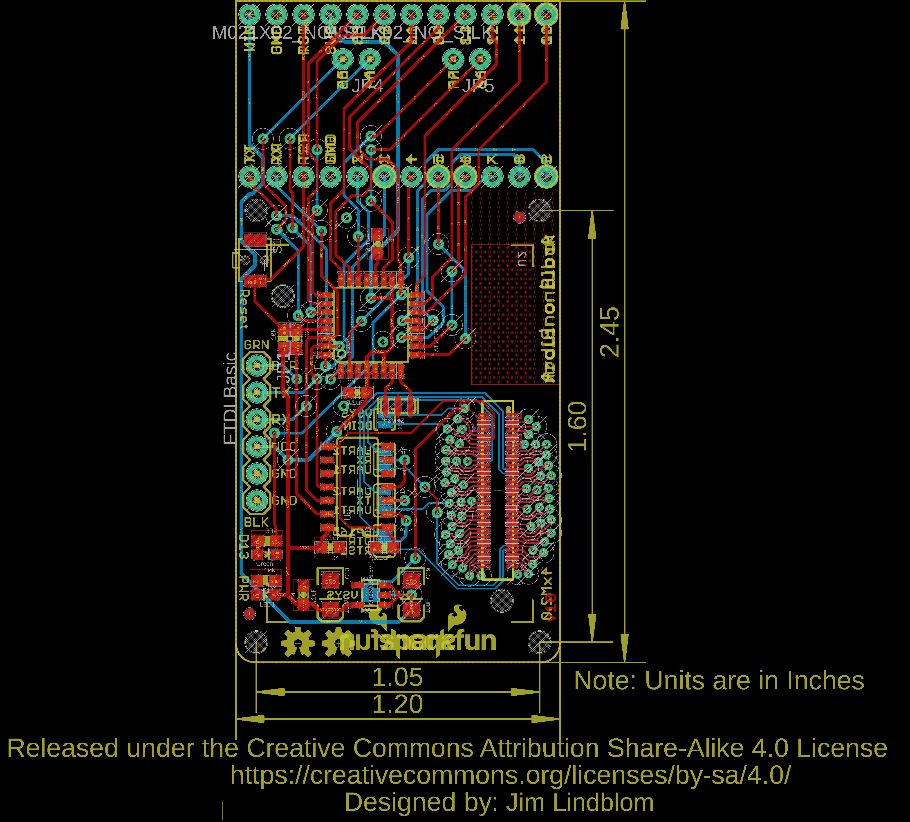
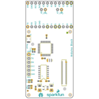
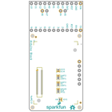
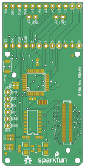
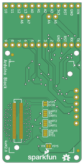

Contents
========

* [PRS13036 > Edison Arduino Block](#prs13036--edison-arduino-block)
	* [Schematic](#schematic)
	* [PCB](#pcb)
	* [Interactive BOM](#interactive-bom)
	* [OOMP Parts](#oomp-parts)
	* [Images](#images)
	* [Tags](#tags)
  
![][im]
# PRS13036 > Edison Arduino Block

- ID: PROJ-SPAR-13036-STAN-01
- Hex ID: PRS13036
- Name: Sparkfun
- Description: Sparkfun
- Long Link: [http://oom.lt/PROJ-SPAR-13036-STAN-01](http://oom.lt/PROJ-SPAR-13036-STAN-01)
- Short Link: [http://oom.lt/PRS13036](http://oom.lt/PRS13036)

## Schematic
  

## PCB
  

## Interactive BOM

- Interactive BOM page: [ibom.html](https://htmlpreview.github.io/?https://github.com/oomlout/oomlout_OOMP_projects/blob/main/PROJ-SPAR-13036-STAN-01/kicad/bom/ibom.html)

## OOMP Parts
  

|OOMP ID|Name|Identifier|
| :---: | :---: | :---: |
|[CAPC-0603-X-NF100-V50](https://github.com/oomlout/oomlout_OOMP_parts/tree/main/CAPC-0603-X-NF100-V50/)|[SMD (0603) 100 nF Capacitor (Ceramic) 50v](https://github.com/oomlout/oomlout_OOMP_parts/tree/main/CAPC-0603-X-NF100-V50/)|[C1, C2, C3, C4, C5, C10](https://github.com/oomlout/oomlout_OOMP_parts/tree/main/CAPC-0603-X-NF100-V50/)|
|CAPT-3216-X-UF10-01||C13, C19|
|LEDS-UNMATCHED-G-STAN-01||D3|
|[HEAD-I01-X-PI06-01](https://github.com/oomlout/oomlout_OOMP_parts/tree/main/HEAD-I01-X-PI06-01/)|[2.54 mm 6 Pin Header](https://github.com/oomlout/oomlout_OOMP_parts/tree/main/HEAD-I01-X-PI06-01/)|[JP1](https://github.com/oomlout/oomlout_OOMP_parts/tree/main/HEAD-I01-X-PI06-01/)|
|[HEAD-I01-X-PI12-01](https://github.com/oomlout/oomlout_OOMP_parts/tree/main/HEAD-I01-X-PI12-01/)|[2.54 mm 12 Pin Header](https://github.com/oomlout/oomlout_OOMP_parts/tree/main/HEAD-I01-X-PI12-01/)|[JP2, JP3](https://github.com/oomlout/oomlout_OOMP_parts/tree/main/HEAD-I01-X-PI12-01/)|
|[HEAD-I01-X-PI02-01](https://github.com/oomlout/oomlout_OOMP_parts/tree/main/HEAD-I01-X-PI02-01/)|[2.54 mm 2 Pin Header](https://github.com/oomlout/oomlout_OOMP_parts/tree/main/HEAD-I01-X-PI02-01/)|[JP4, JP5](https://github.com/oomlout/oomlout_OOMP_parts/tree/main/HEAD-I01-X-PI02-01/)|
|LEDS-UNMATCHED-R-STAN-01||LED1|
|[RESE-0603-X-O103-01](https://github.com/oomlout/oomlout_OOMP_parts/tree/main/RESE-0603-X-O103-01/)|[SMD (0603) 10k Ohm Resistor](https://github.com/oomlout/oomlout_OOMP_parts/tree/main/RESE-0603-X-O103-01/)|[R2, R11](https://github.com/oomlout/oomlout_OOMP_parts/tree/main/RESE-0603-X-O103-01/)|
|[RESE-0603-X-O331-01](https://github.com/oomlout/oomlout_OOMP_parts/tree/main/RESE-0603-X-O331-01/)|[SMD (0603) 330 Ohm Resistor](https://github.com/oomlout/oomlout_OOMP_parts/tree/main/RESE-0603-X-O331-01/)|[R6](https://github.com/oomlout/oomlout_OOMP_parts/tree/main/RESE-0603-X-O331-01/)|
|UNMATCHED-UNMATCHED-X-UNMATCHED-01||S1, U2, U4, U5, Y1|
|VREG-SO235-X-KMIC5205-01||U1|
|HEAD-I01-X-UNMATCHED-01||U3|

## Images
  
  

|bominteractivefront|bominteractiveback|kicadPcb3d|kicadPcb3dFront|kicadPcb3dBack|eagleImage|eagleSchemImage|pcbdraw|pcbdrawback|
| :---: | :---: | :---: | :---: | :---: | :---: | :---: | :---: | :---: |
||||||||||

## Tags

- hexID: PRS13036
- oompType: PROJ
- oompSize: SPAR
- oompColor: 13036
- oompDesc: STAN
- oompIndex: 01
- oompName: Edison Arduino Block
- sources: All source files from https://github.com/sparkfun/Edison_Arduino_Block (source licence details in srcLicense.md)
- linkBuyPage: https://www.sparkfun.com/products/13036
- oompID: PROJ-SPAR-13036-STAN-01
- oompParts: C1,CAPC-0603-X-NF100-V50
- oompParts: C2,CAPC-0603-X-NF100-V50
- oompParts: C3,CAPC-0603-X-NF100-V50
- oompParts: C4,CAPC-0603-X-NF100-V50
- oompParts: C5,CAPC-0603-X-NF100-V50
- oompParts: C10,CAPC-0603-X-NF100-V50
- oompParts: C13,CAPT-3216-X-UF10-01
- oompParts: C19,CAPT-3216-X-UF10-01
- oompParts: D3,LEDS-UNMATCHED-G-STAN-01
- oompParts: JP1,HEAD-I01-X-PI06-01
- oompParts: JP2,HEAD-I01-X-PI12-01
- oompParts: JP3,HEAD-I01-X-PI12-01
- oompParts: JP4,HEAD-I01-X-PI02-01
- oompParts: JP5,HEAD-I01-X-PI02-01
- oompParts: LED1,LEDS-UNMATCHED-R-STAN-01
- oompParts: R2,RESE-0603-X-O103-01
- oompParts: R6,RESE-0603-X-O331-01
- oompParts: R11,RESE-0603-X-O103-01
- oompParts: S1,UNMATCHED-UNMATCHED-X-UNMATCHED-01
- oompParts: U1,VREG-SO235-X-KMIC5205-01
- oompParts: U2,UNMATCHED-UNMATCHED-X-UNMATCHED-01
- oompParts: U3,HEAD-I01-X-UNMATCHED-01
- oompParts: U4,UNMATCHED-UNMATCHED-X-UNMATCHED-01
- oompParts: U5,UNMATCHED-UNMATCHED-X-UNMATCHED-01
- oompParts: Y1,UNMATCHED-UNMATCHED-X-UNMATCHED-01
- rawParts: C1,0.1uF,CAP0603-CAP,0603-CAP,Capacitor,,,
- rawParts: C2,0.1uF,CAP0603-CAP,0603-CAP,Capacitor,,,
- rawParts: C3,0.1uF,CAP0603-CAP,0603-CAP,Capacitor,,,
- rawParts: C4,0.1uF,CAP0603-CAP,0603-CAP,Capacitor,,,
- rawParts: C5,0.1uF,CAP0603-CAP,0603-CAP,Capacitor,,,
- rawParts: C10,0.1uF,CAP0603-CAP,0603-CAP,Capacitor,,,
- rawParts: C13,10uF,CAP_POL1206,EIA3216,Capacitor Polarized,,,
- rawParts: C19,10uF,CAP_POL1206,EIA3216,Capacitor Polarized,,,
- rawParts: D3,Green,LED,0603-LED-ALT1,LEDs,,,
- rawParts: FID1,FIDUCIAL1X2,FIDUCIAL1X2,FIDUCIAL-1X2,Fiducial Alignment Points,,,
- rawParts: FID2,FIDUCIAL1X2,FIDUCIAL1X2,FIDUCIAL-1X2,Fiducial Alignment Points,,,
- rawParts: FID3,FIDUCIAL1X2,FIDUCIAL1X2,FIDUCIAL-1X2,Fiducial Alignment Points,,,
- rawParts: FID4,FIDUCIAL1X2,FIDUCIAL1X2,FIDUCIAL-1X2,Fiducial Alignment Points,,,
- rawParts: FRAME1,FRAME-LETTER,FRAME-LETTER,CREATIVE_COMMONS,Schematic Frame,,,
- rawParts: FRAME2,FRAME-LETTER,FRAME-LETTER,CREATIVE_COMMONS,Schematic Frame,,,
- rawParts: JP1,FTDI Basic,ARDUINO_SERIAL_PROGRAMPTH,1X06,,,,
- rawParts: JP2,M12NO_SILK,M12NO_SILK,1X12_NO_SILK,Header 12,,,
- rawParts: JP3,M12NO_SILK,M12NO_SILK,1X12_NO_SILK,Header 12,,,
- rawParts: JP4,M021X02_NO_SILK,M021X02_NO_SILK,1X02_NO_SILK,Standard 2-pin 0.1 header. Use with,,,
- rawParts: JP5,M021X02_NO_SILK,M021X02_NO_SILK,1X02_NO_SILK,Standard 2-pin 0.1 header. Use with,,,
- rawParts: LED1,Red,LED,0603-LED-ALT1,LEDs,,,
- rawParts: LOGO1,OSHW-LOGOS,OSHW-LOGOS,OSHW-LOGO-S,Open Source Hardware Logo This logo indicates the piece of hardware it is found on incorporates a OSHW license and/or adheres to the definition of open source hardware found here: http://freedomdefined.org/OSHW,,,
- rawParts: LOGO4,SFE_LOGO_NAME_FLAME.1_INCH,SFE_LOGO_NAME_FLAME.1_INCH,SFE_LOGO_NAME_FLAME_.1,SFE Logo, name and flame,,,
- rawParts: R2,10K,RESISTOR0603-RES,0603-RES,Resistor,,,
- rawParts: R6,330,RESISTOR0603-RES,0603-RES,Resistor,,,
- rawParts: R11,10K,RESISTOR0603-RES,0603-RES,Resistor,,,
- rawParts: S1,RESET,SWITCH-MOMENTARY-2TACTILE-SWITCH-SMD-RIGHT-ANGLE,TACTILE_SWITCH-SMD-RIGHT-ANGLE,Various NO switches- pushbuttons, reed, etc,COMP-12265,,
- rawParts: SJ1,TX,JUMPER-PAD-3-2OF3_NC_BY_TRACE,PAD-JUMPER-3-2OF3_NC_BY_TRACE_YES_SILK_FULL_BOX,,,,
- rawParts: SJ2,RX,JUMPER-PAD-3-2OF3_NC_BY_TRACE,PAD-JUMPER-3-2OF3_NC_BY_TRACE_YES_SILK_FULL_BOX,,,,
- rawParts: SJ3,TX,JUMPER-PAD-3-2OF3_NC_BY_TRACE,PAD-JUMPER-3-2OF3_NC_BY_TRACE_YES_SILK_FULL_BOX,,,,
- rawParts: SJ4,VIN,JUMPER-PAD-2-NC_BY_TRACE,PAD-JUMPER-2-NC_BY_TRACE_YES_SILK,,,,
- rawParts: SJ5,DCIN,JUMPER-PAD-2-NOYES_SILK,PAD-JUMPER-2-NO_YES_SILK,,,,
- rawParts: U1,MIC5205-3.3V (150mA),V_REG_LDOSMD,SOT23-5,Voltage Regulator LDO,,,
- rawParts: U2,EDISON_CONNECTOR_FULLMOUNTING_HOLES,EDISON_CONNECTOR_FULLMOUNTING_HOLES,EDISON_DAUGHTER,,,,
- rawParts: U3,EDISON_CONNECTOR_FULLHEADER,EDISON_CONNECTOR_FULLHEADER,DF40C-70DP-0.4(51),,,,
- rawParts: U4,ATMEGA328,ATMEGA168,TQFP32-08,,,,
- rawParts: U5,,TXB0104PWRSOIC14,SO14,4-Bit Bi-Directional Level Shifter,IC-11329,,
- rawParts: Y1,8MHZ,RESONATOR8MHZ,RESONATOR-SMD,Resonator,XTAL-08895,8MHZ,

[im]: kicadPcb3d_450.png
