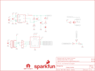

Contents
========

* [PRS13040 > Edison UART Block](#prs13040--edison-uart-block)
	* [Schematic](#schematic)
	* [PCB](#pcb)
	* [Interactive BOM](#interactive-bom)
	* [OOMP Parts](#oomp-parts)
	* [Images](#images)
	* [Tags](#tags)
  
![][im]
# PRS13040 > Edison UART Block

- ID: PROJ-SPAR-13040-STAN-01
- Hex ID: PRS13040
- Name: Sparkfun
- Description: Sparkfun
- Long Link: [http://oom.lt/PROJ-SPAR-13040-STAN-01](http://oom.lt/PROJ-SPAR-13040-STAN-01)
- Short Link: [http://oom.lt/PRS13040](http://oom.lt/PRS13040)

## Schematic
  

## PCB
  

## Interactive BOM

- Interactive BOM page: [ibom.html](https://htmlpreview.github.io/?https://github.com/oomlout/oomlout_OOMP_projects/blob/main/PROJ-SPAR-13040-STAN-01/kicad/bom/ibom.html)

## OOMP Parts
  

|OOMP Parts|
| :---: |
|CAPC-0603-X-UF1D-01 C1, C2|
|[CAPC-1206-X-UF10-V25  SMD (1206) 10 uF Capacitor (Ceramic) 25v  C8](https://github.com/oomlout/oomlout_OOMP_parts/tree/main/CAPC-1206-X-UF10-V25/)|
|CAPC-0603-X-PF47-01 C9|
|[CAPC-0603-X-UF47D-V10  SMD (0603) 4.7 uF Capacitor (Ceramic) 10v  C10](https://github.com/oomlout/oomlout_OOMP_parts/tree/main/CAPC-0603-X-UF47D-V10/)|
|[LEDS-0603-L-STAN-01  SMD (0603) Blue LED  D3](https://github.com/oomlout/oomlout_OOMP_parts/tree/main/LEDS-0603-L-STAN-01/)|
|UNMATCHED-UNMATCHED-X-UNMATCHED-01 E1, L1, S1, S2, U1, U4|
|[HEAD-I01-X-PI06-01  2.54 mm 6 Pin Header  JP2](https://github.com/oomlout/oomlout_OOMP_parts/tree/main/HEAD-I01-X-PI06-01/)|
|UNMATCHED-SO23-X-KBSS138-01 Q1|
|[RESE-0603-X-O102-01  SMD (0603) 1k Ohm Resistor  R5, R15](https://github.com/oomlout/oomlout_OOMP_parts/tree/main/RESE-0603-X-O102-01/)|
|[RESE-0603-X-O103-01  SMD (0603) 10k Ohm Resistor  R8](https://github.com/oomlout/oomlout_OOMP_parts/tree/main/RESE-0603-X-O103-01/)|
|[RESE-0603-X-O220-01  SMD (0603) 22 Ohm Resistor  R9](https://github.com/oomlout/oomlout_OOMP_parts/tree/main/RESE-0603-X-O220-01/)|
|RESE-0603-X-O6803-01 R13|
|RESE-0603-X-O1203-01 R14|
|HEAD-I01-X-UNMATCHED-01 U$3|

## Images
  
  

|kicadPcb3d|kicadPcb3dFront|kicadPcb3dBack|eagleImage|eagleSchemImage|
| :---: | :---: | :---: | :---: | :---: |
||||||

## Tags

- hexID: PRS13040
- oompType: PROJ
- oompSize: SPAR
- oompColor: 13040
- oompDesc: STAN
- oompIndex: 01
- oompName: Edison UART Block
- sources: All source files from https://github.com/sparkfun/Edison_UART_Block (source licence details in srcLicense.md)
- linkBuyPage: https://www.sparkfun.com/products/13040
- oompID: PROJ-SPAR-13040-STAN-01
- oompParts: C1,CAPC-0603-X-UF1D-01
- oompParts: C2,CAPC-0603-X-UF1D-01
- oompParts: C8,CAPC-1206-X-UF10-V25
- oompParts: C9,CAPC-0603-X-PF47-01
- oompParts: C10,CAPC-0603-X-UF47D-V10
- oompParts: D3,LEDS-0603-L-STAN-01
- oompParts: E1,UNMATCHED-UNMATCHED-X-UNMATCHED-01
- oompParts: JP2,HEAD-I01-X-PI06-01
- oompParts: L1,UNMATCHED-UNMATCHED-X-UNMATCHED-01
- oompParts: Q1,UNMATCHED-SO23-X-KBSS138-01
- oompParts: R5,RESE-0603-X-O102-01
- oompParts: R8,RESE-0603-X-O103-01
- oompParts: R9,RESE-0603-X-O220-01
- oompParts: R13,RESE-0603-X-O6803-01
- oompParts: R14,RESE-0603-X-O1203-01
- oompParts: R15,RESE-0603-X-O102-01
- oompParts: S1,UNMATCHED-UNMATCHED-X-UNMATCHED-01
- oompParts: S2,UNMATCHED-UNMATCHED-X-UNMATCHED-01
- oompParts: U$3,HEAD-I01-X-UNMATCHED-01
- oompParts: U1,UNMATCHED-UNMATCHED-X-UNMATCHED-01
- oompParts: U4,UNMATCHED-UNMATCHED-X-UNMATCHED-01
- rawParts: C1,0.1uF,0.1UF-25V(+80/-20%)(0603),0603-CAP,CAP-00810,CAP-00810,0.1uF,
- rawParts: C2,0.1uF,0.1UF-25V(+80/-20%)(0603),0603-CAP,CAP-00810,CAP-00810,0.1uF,
- rawParts: C8,10uF,10UF-6.3V-20%(1206),1206,CAP-10057,CAP-10057,10uF,
- rawParts: C9,47pF,47PF-50V-5%(0603),0603-CAP,CAP-08913,CAP-08913,47pF,
- rawParts: C10,4.7uF,4.7UF-6.3V-10%(0603)0603,0603-CAP,CAP-08280,CAP-08280,4.7uF,
- rawParts: D3,BLUE,LED-BLUE0603,LED-0603,Blue LEDs for production use,DIO-08575,BLUE,
- rawParts: E1,EDISON_CONNECTOR_FULLMOUNTING_HOLES,EDISON_CONNECTOR_FULLMOUNTING_HOLES,EDISON_DAUGHTER,,,,
- rawParts: FID1,FIDUCIAL1X2,FIDUCIAL1X2,FIDUCIAL-1X2,Fiducial Alignment Points,,,
- rawParts: FID2,FIDUCIAL1X2,FIDUCIAL1X2,FIDUCIAL-1X2,Fiducial Alignment Points,,,
- rawParts: FID3,FIDUCIAL1X2,FIDUCIAL1X2,FIDUCIAL-1X2,Fiducial Alignment Points,,,
- rawParts: FID4,FIDUCIAL1X2,FIDUCIAL1X2,FIDUCIAL-1X2,Fiducial Alignment Points,,,
- rawParts: FRAME1,FRAME-LETTER,FRAME-LETTER,CREATIVE_COMMONS,Schematic Frame,,,
- rawParts: FRAME2,FRAME-LETTER,FRAME-LETTER,CREATIVE_COMMONS,Schematic Frame,,,
- rawParts: JP2,,M06SMD,1X06-SMD,Header 6,,,
- rawParts: L1,,INDUCTOR,INDUCTOR-SRP4020,Inductors,,,
- rawParts: LOGO1,SFE_LOGO_NAME_FLAME.1_INCH,SFE_LOGO_NAME_FLAME.1_INCH,SFE_LOGO_NAME_FLAME_.1,SFE Logo, name and flame,,,
- rawParts: LOGO4,OSHW-LOGOS,OSHW-LOGOS,OSHW-LOGO-S,Open Source Hardware Logo This logo indicates the piece of hardware it is found on incorporates a OSHW license and/or adheres to the definition of open source hardware found here: http://freedomdefined.org/OSHW,,,
- rawParts: Q1,BSS138,MOSFET-NCHANNELBSS138,SOT23-3,Common NMOSFET Parts,TRANS-00830,,
- rawParts: R5,1K,1KOHM1/10W1%(0603),0603-RES,RES-07856,RES-07856,1K,
- rawParts: R8,10K,10KOHM1/10W1%(0603)0603,0603-RES,RES-00824,RES-00824,10K,
- rawParts: R9,22,22OHM1/10W1%(0603),0603-RES,RES-08698,RES-08698,22,
- rawParts: R13,680k,RESISTOR0603,0603-RES,Resistor,,,
- rawParts: R14,120k,RESISTOR0603,0603-RES,Resistor,,,
- rawParts: R15,1K,1KOHM1/10W1%(0603),0603-RES,RES-07856,RES-07856,1K,
- rawParts: S1,POWER,SWITCH-MOMENTARY-2TACTILE-SWITCH-SMD-RIGHT-ANGLE,TACTILE_SWITCH-SMD-RIGHT-ANGLE,Various NO switches- pushbuttons, reed, etc,COMP-12265,,
- rawParts: S2,DPDT,SWITCH-DPDTAYZ0202,AYZ0202,DPDT Version of the COM-00597,SWCH-08179,DPDT,
- rawParts: SJ3,JUMPER-PAD-2-NC_BY_TRACE,JUMPER-PAD-2-NC_BY_TRACE,PAD-JUMPER-2-NC_BY_TRACE_YES_SILK,,,,
- rawParts: U$3,EDISON_CONNECTOR_FULLHEADER,EDISON_CONNECTOR_FULLHEADER,DF40C-70DP-0.4(51),,,,
- rawParts: U1,,TXB0104PWRSOIC14,SO14,4-Bit Bi-Directional Level Shifter,IC-11329,,
- rawParts: U4,TPS62065,TPS62065,WSON-8-PAD,Texas Instruments TPS62172,,,

[im]: kicadPcb3d_450.png
