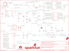

Contents
========

* [PRS13044 > Sparkfun](#prs13044--sparkfun)
	* [Schematic](#schematic)
	* [Interactive BOM](#interactive-bom)
	* [OOMP Parts](#oomp-parts)
	* [Images](#images)
	* [Tags](#tags)
  
![][im]
# PRS13044 > Sparkfun

- ID: PROJ-SPAR-13044-STAN-01
- Hex ID: PRS13044
- Name: Sparkfun
- Description: Sparkfun
- Long Link: [http://oom.lt/PROJ-SPAR-13044-STAN-01](http://oom.lt/PROJ-SPAR-13044-STAN-01)
- Long Link: [http://oom.lt/PRS13044](http://oom.lt/PRS13044)

## Schematic
  
![][schem]
## Interactive BOM

- Interactive BOM page: [ibom.html](https://htmlpreview.github.io/?https://github.com/oomlout/oomlout_OOMP_projects/blob/main/PROJ-SPAR-13044-STAN-01/kicad/bom/ibom.html)

## OOMP Parts
  

|OOMP Parts|
| :---: |
|C1,UNMATCHED-UNMATCHED-UNMATCHED-UNMATCHED-UNMATCHED,C1,0.1uF,0.1UF-25V(+80/-20%)(0603),0603-CAP,CAP-00810,,,CAP-00810,0.1uF,|
|C2,UNMATCHED-UNMATCHED-UNMATCHED-UNMATCHED-UNMATCHED,C2,0.1uF,0.1UF-25V(+80/-20%)(0603),0603-CAP,CAP-00810,,,CAP-00810,0.1uF,|
|C3,UNMATCHED-UNMATCHED-UNMATCHED-UNMATCHED-UNMATCHED,C3,10uF,CAP0805,0805,Capacitor,,,CAP-11330,,|
|C4,UNMATCHED-UNMATCHED-UNMATCHED-UNMATCHED-UNMATCHED,C4,0.1uF,0.1UF-25V(+80/-20%)(0603),0603-CAP,CAP-00810,,,CAP-00810,0.1uF,|
|C5,UNMATCHED-UNMATCHED-UNMATCHED-UNMATCHED-UNMATCHED,C5,0.1uF,0.1UF-25V(+80/-20%)(0603),0603-CAP,CAP-00810,,,CAP-00810,0.1uF,|
|C6,UNMATCHED-UNMATCHED-UNMATCHED-UNMATCHED-UNMATCHED,C6,0.1uF,0.1UF-25V(+80/-20%)(0603),0603-CAP,CAP-00810,,,CAP-00810,0.1uF,|
|C7,UNMATCHED-UNMATCHED-UNMATCHED-UNMATCHED-UNMATCHED,C7,0.1uF,0.1UF-25V(+80/-20%)(0603),0603-CAP,CAP-00810,,,CAP-00810,0.1uF,|
|C8,UNMATCHED-UNMATCHED-UNMATCHED-UNMATCHED-UNMATCHED,C8,22uF,22UF-6.3V-20%(0805),0805,CAP-08402,,,CAP-08402,22uF,|
|C9,UNMATCHED-UNMATCHED-UNMATCHED-UNMATCHED-UNMATCHED,C9,9.0pF,9.0PF-50V-10%(0603),0603-CAP,CAP-09341,,,CAP-09341,9.0pF,|
|C10,UNMATCHED-UNMATCHED-UNMATCHED-UNMATCHED-UNMATCHED,C10,4.7uF,4.7UF-6.3V-10%(0603)0603,0603-CAP,CAP-08280,,,CAP-08280,4.7uF,|
|C11,UNMATCHED-UNMATCHED-UNMATCHED-UNMATCHED-UNMATCHED,C11,0.1uF,0.1UF-25V(+80/-20%)(0603),0603-CAP,CAP-00810,,,CAP-00810,0.1uF,|
|C12,UNMATCHED-UNMATCHED-UNMATCHED-UNMATCHED-UNMATCHED,C12,1.0uF,1.0UF-16V-10%(0603),0603-CAP,CAP-00868,,,CAP-00868,1.0uF,|
|C13,UNMATCHED-UNMATCHED-UNMATCHED-UNMATCHED-UNMATCHED,C13,1.0uF,1.0UF-16V-10%(0603),0603-CAP,CAP-00868,,,CAP-00868,1.0uF,|
|D1,UNMATCHED-UNMATCHED-UNMATCHED-UNMATCHED-UNMATCHED,D1,BAT20J,DIODE-SCHOTTKY-BAT20J,SOD-323,Schottky diodes in SFEs production catalog,,,DIO-11623,BAT20J,|
|D3,UNMATCHED-UNMATCHED-UNMATCHED-UNMATCHED-UNMATCHED,D3,BLUE,LED-BLUE0603,LED-0603,Blue LEDs for production use,,,DIO-08575,BLUE,|
|F1,UNMATCHED-UNMATCHED-UNMATCHED-UNMATCHED-UNMATCHED,F1,PTCSMD,PTCSMD,PTC-1206,Resettable Fuse PTC,,,RES-11150,,|
|FRAME1,UNMATCHED-UNMATCHED-UNMATCHED-UNMATCHED-UNMATCHED,FID1,FIDUCIAL1X2,FIDUCIAL1X2,FIDUCIAL-1X2,Fiducial Alignment Points,,,,,|
|FRAME2,UNMATCHED-UNMATCHED-UNMATCHED-UNMATCHED-UNMATCHED,FID2,FIDUCIAL1X2,FIDUCIAL1X2,FIDUCIAL-1X2,Fiducial Alignment Points,,,,,|
|FRAME3,UNMATCHED-UNMATCHED-UNMATCHED-UNMATCHED-UNMATCHED,FID3,FIDUCIAL1X2,FIDUCIAL1X2,FIDUCIAL-1X2,Fiducial Alignment Points,,,,,|
|JP1,UNMATCHED-UNMATCHED-UNMATCHED-UNMATCHED-UNMATCHED,FID4,FIDUCIAL1X2,FIDUCIAL1X2,FIDUCIAL-1X2,Fiducial Alignment Points,,,,,|
|JP3,UNMATCHED-UNMATCHED-UNMATCHED-UNMATCHED-UNMATCHED,FRAME1,FRAME-LETTER,FRAME-LETTER,CREATIVE_COMMONS,Schematic Frame,,,,,|
|L1,UNMATCHED-UNMATCHED-UNMATCHED-UNMATCHED-UNMATCHED,FRAME2,FRAME-LETTER,FRAME-LETTER,CREATIVE_COMMONS,Schematic Frame,,,,,|
|LOGO1,UNMATCHED-UNMATCHED-UNMATCHED-UNMATCHED-UNMATCHED,FRAME3,FRAME-LETTER,FRAME-LETTER,CREATIVE_COMMONS,Schematic Frame,,,,,|
|LOGO3,UNMATCHED-UNMATCHED-UNMATCHED-UNMATCHED-UNMATCHED,JP1,RASPBERRYPI-GPIOPTH,RASPBERRYPI-GPIOPTH,2X13-SHROUDED,RASPBERRY PI I/O HEADER,sparkfun,PRT-11490,,,|
|LOGO4,UNMATCHED-UNMATCHED-UNMATCHED-UNMATCHED-UNMATCHED,JP3,USB_MICROB,USB_MICROB_PLUGCONN-11752,USB-B-MICRO-SMD_V03,USB Micro-B connectors,,,CONN-11752,,|
|Q1,UNMATCHED-UNMATCHED-UNMATCHED-UNMATCHED-UNMATCHED,L1,1.0uH,INDUCTOR,INDUCTOR-SRP4020,Inductors,,,NDUC-12274,,|
|R1,UNMATCHED-UNMATCHED-UNMATCHED-UNMATCHED-UNMATCHED,LOGO1,OSHW-LOGOS,OSHW-LOGOS,OSHW-LOGO-S,Open Source Hardware Logo This logo indicates the piece of hardware it is found on incorporates a OSHW license and/or adheres to the definition of open source hardware found here: http://freedomdefined.org/OSHW,,,,,|
|R2,UNMATCHED-UNMATCHED-UNMATCHED-UNMATCHED-UNMATCHED,LOGO3,SFE_LOGO_FLAME.2_INCH,SFE_LOGO_FLAME.2_INCH,SFE_LOGO_FLAME_.2,SFE Logo, flame only,,,,,|
|R3,UNMATCHED-UNMATCHED-UNMATCHED-UNMATCHED-UNMATCHED,LOGO4,SFE_LOGO_NAME_FLAME.1_INCH,SFE_LOGO_NAME_FLAME.1_INCH,SFE_LOGO_NAME_FLAME_.1,SFE Logo, name and flame,,,,,|
|R4,UNMATCHED-UNMATCHED-UNMATCHED-UNMATCHED-UNMATCHED,Q1,200mA/50V,MOSFET-NCHANNELBSS138,SOT23-3,Common NMOSFET Parts,,,TRANS-00830,200mA/50V,|
|R5,UNMATCHED-UNMATCHED-UNMATCHED-UNMATCHED-UNMATCHED,R1,10K,10KOHM-1/10W-1%(0603)0603,0603-RES,RES-00824,,,RES-00824,10K,|
|R6,UNMATCHED-UNMATCHED-UNMATCHED-UNMATCHED-UNMATCHED,R2,10K,10KOHM-1/10W-1%(0603)0603,0603-RES,RES-00824,,,RES-00824,10K,|
|R7,UNMATCHED-UNMATCHED-UNMATCHED-UNMATCHED-UNMATCHED,R3,200k,200KOHM1/10W1%(0603)200K,0603-RES,RES-09385,,,RES-09385,200k,|
|R8,UNMATCHED-UNMATCHED-UNMATCHED-UNMATCHED-UNMATCHED,R4,DNP,RESISTOR0603-RES,0603-RES,Resistor,,,,,|
|R9,UNMATCHED-UNMATCHED-UNMATCHED-UNMATCHED-UNMATCHED,R5,DNP,RESISTOR0603-RES,0603-RES,Resistor,,,,,|
|R10,UNMATCHED-UNMATCHED-UNMATCHED-UNMATCHED-UNMATCHED,R6,1K,1KOHM-1/10W-1%(0603),0603-RES,RES-07856,,,RES-07856,1K,|
|R11,UNMATCHED-UNMATCHED-UNMATCHED-UNMATCHED-UNMATCHED,R7,680k,RESISTOR0603,0603-RES,Resistor,,,RES-12280,,|
|S1,UNMATCHED-UNMATCHED-UNMATCHED-UNMATCHED-UNMATCHED,R8,120k,RESISTOR0603,0603-RES,Resistor,,,RES-12279,,|
|SJ1,UNMATCHED-UNMATCHED-UNMATCHED-UNMATCHED-UNMATCHED,R9,10K,10KOHM-1/10W-1%(0603)0603,0603-RES,RES-00824,,,RES-00824,10K,|
|SJ2,UNMATCHED-UNMATCHED-UNMATCHED-UNMATCHED-UNMATCHED,R10,220,RESISTOR0603,0603-RES,Resistor,,,RES-07861,,|
|SJ3,UNMATCHED-UNMATCHED-UNMATCHED-UNMATCHED-UNMATCHED,R11,1K,1KOHM-1/10W-1%(0603),0603-RES,RES-07856,,,RES-07856,1K,|
|TP1,UNMATCHED-UNMATCHED-UNMATCHED-UNMATCHED-UNMATCHED,S1,POWER,SWITCH-MOMENTARY-2TACTILE-SWITCH-SMD-RIGHT-ANGLE,TACTILE_SWITCH-SMD-RIGHT-ANGLE,Various NO switches- pushbuttons, reed, etc,,,COMP-12265,,|
|U1,UNMATCHED-UNMATCHED-UNMATCHED-UNMATCHED-UNMATCHED,SJ1,JUMPER-PAD-2-NOYES_SILK,JUMPER-PAD-2-NOYES_SILK,PAD-JUMPER-2-NO_YES_SILK,,,,,,|
|U2,UNMATCHED-UNMATCHED-UNMATCHED-UNMATCHED-UNMATCHED,SJ2,JUMPER-PAD-3-NC_BY_PASTE,JUMPER-PAD-3-NC_BY_PASTE,PAD-JUMPER-3-NC_BY_PASTE_YES_SILK_FULL_BOX,,,,,,|
|U3,UNMATCHED-UNMATCHED-UNMATCHED-UNMATCHED-UNMATCHED,SJ3,JUMPER-PAD-2-NC_BY_TRACE,JUMPER-PAD-2-NC_BY_TRACE,PAD-JUMPER-2-NC_BY_TRACE_YES_SILK,,,,,,|
|U4,UNMATCHED-UNMATCHED-UNMATCHED-UNMATCHED-UNMATCHED,TP1,TEST-POINT3X5,TEST-POINT3X5,PAD.03X.05,Bare copper test points for troubleshooting or ICT,,,,,|
|U5,UNMATCHED-UNMATCHED-UNMATCHED-UNMATCHED-UNMATCHED,U1,PCA9306,PCA9306PCA9306DC-1:1,PCA9306DC-1:1,Bidirectional I2C level shifter.,,,IC-10023,PCA9306,|
|U6,UNMATCHED-UNMATCHED-UNMATCHED-UNMATCHED-UNMATCHED,U2,EDISON_CONNECTOR_FULLMOUNTING_HOLES,EDISON_CONNECTOR_FULLMOUNTING_HOLES,EDISON_DAUGHTER,,,,,,|
|U7,UNMATCHED-UNMATCHED-UNMATCHED-UNMATCHED-UNMATCHED,U3,EDISON_CONNECTOR_FULLHEADER,EDISON_CONNECTOR_FULLHEADER,DF40C-70DP-0.4(51),,,,,,|

## Images
  
  

|kicadPcb3d|kicadPcb3dFront|kicadPcb3dBack|eagleImage|eagleSchemImage|
| :---: | :---: | :---: | :---: | :---: |
||||||

## Tags

- hexID: PRS13044
- oompType: PROJ
- oompSize: SPAR
- oompColor: 13044
- oompDesc: STAN
- oompIndex: 01
- oompName: Edison Pi Block
- sources: All source files from https://github.com/sparkfun/Edison_Pi_Block (source licence details in srcLicense.md)
- linkBuyPage: https://www.sparkfun.com/products/13044
- oompID: PROJ-SPAR-13044-STAN-01
- oompParts: C1,UNMATCHED-UNMATCHED-UNMATCHED-UNMATCHED-UNMATCHED
- oompParts: C2,UNMATCHED-UNMATCHED-UNMATCHED-UNMATCHED-UNMATCHED
- oompParts: C3,UNMATCHED-UNMATCHED-UNMATCHED-UNMATCHED-UNMATCHED
- oompParts: C4,UNMATCHED-UNMATCHED-UNMATCHED-UNMATCHED-UNMATCHED
- oompParts: C5,UNMATCHED-UNMATCHED-UNMATCHED-UNMATCHED-UNMATCHED
- oompParts: C6,UNMATCHED-UNMATCHED-UNMATCHED-UNMATCHED-UNMATCHED
- oompParts: C7,UNMATCHED-UNMATCHED-UNMATCHED-UNMATCHED-UNMATCHED
- oompParts: C8,UNMATCHED-UNMATCHED-UNMATCHED-UNMATCHED-UNMATCHED
- oompParts: C9,UNMATCHED-UNMATCHED-UNMATCHED-UNMATCHED-UNMATCHED
- oompParts: C10,UNMATCHED-UNMATCHED-UNMATCHED-UNMATCHED-UNMATCHED
- oompParts: C11,UNMATCHED-UNMATCHED-UNMATCHED-UNMATCHED-UNMATCHED
- oompParts: C12,UNMATCHED-UNMATCHED-UNMATCHED-UNMATCHED-UNMATCHED
- oompParts: C13,UNMATCHED-UNMATCHED-UNMATCHED-UNMATCHED-UNMATCHED
- oompParts: D1,UNMATCHED-UNMATCHED-UNMATCHED-UNMATCHED-UNMATCHED
- oompParts: D3,UNMATCHED-UNMATCHED-UNMATCHED-UNMATCHED-UNMATCHED
- oompParts: F1,UNMATCHED-UNMATCHED-UNMATCHED-UNMATCHED-UNMATCHED
- oompParts: FRAME1,UNMATCHED-UNMATCHED-UNMATCHED-UNMATCHED-UNMATCHED
- oompParts: FRAME2,UNMATCHED-UNMATCHED-UNMATCHED-UNMATCHED-UNMATCHED
- oompParts: FRAME3,UNMATCHED-UNMATCHED-UNMATCHED-UNMATCHED-UNMATCHED
- oompParts: JP1,UNMATCHED-UNMATCHED-UNMATCHED-UNMATCHED-UNMATCHED
- oompParts: JP3,UNMATCHED-UNMATCHED-UNMATCHED-UNMATCHED-UNMATCHED
- oompParts: L1,UNMATCHED-UNMATCHED-UNMATCHED-UNMATCHED-UNMATCHED
- oompParts: LOGO1,UNMATCHED-UNMATCHED-UNMATCHED-UNMATCHED-UNMATCHED
- oompParts: LOGO3,UNMATCHED-UNMATCHED-UNMATCHED-UNMATCHED-UNMATCHED
- oompParts: LOGO4,UNMATCHED-UNMATCHED-UNMATCHED-UNMATCHED-UNMATCHED
- oompParts: Q1,UNMATCHED-UNMATCHED-UNMATCHED-UNMATCHED-UNMATCHED
- oompParts: R1,UNMATCHED-UNMATCHED-UNMATCHED-UNMATCHED-UNMATCHED
- oompParts: R2,UNMATCHED-UNMATCHED-UNMATCHED-UNMATCHED-UNMATCHED
- oompParts: R3,UNMATCHED-UNMATCHED-UNMATCHED-UNMATCHED-UNMATCHED
- oompParts: R4,UNMATCHED-UNMATCHED-UNMATCHED-UNMATCHED-UNMATCHED
- oompParts: R5,UNMATCHED-UNMATCHED-UNMATCHED-UNMATCHED-UNMATCHED
- oompParts: R6,UNMATCHED-UNMATCHED-UNMATCHED-UNMATCHED-UNMATCHED
- oompParts: R7,UNMATCHED-UNMATCHED-UNMATCHED-UNMATCHED-UNMATCHED
- oompParts: R8,UNMATCHED-UNMATCHED-UNMATCHED-UNMATCHED-UNMATCHED
- oompParts: R9,UNMATCHED-UNMATCHED-UNMATCHED-UNMATCHED-UNMATCHED
- oompParts: R10,UNMATCHED-UNMATCHED-UNMATCHED-UNMATCHED-UNMATCHED
- oompParts: R11,UNMATCHED-UNMATCHED-UNMATCHED-UNMATCHED-UNMATCHED
- oompParts: S1,UNMATCHED-UNMATCHED-UNMATCHED-UNMATCHED-UNMATCHED
- oompParts: SJ1,UNMATCHED-UNMATCHED-UNMATCHED-UNMATCHED-UNMATCHED
- oompParts: SJ2,UNMATCHED-UNMATCHED-UNMATCHED-UNMATCHED-UNMATCHED
- oompParts: SJ3,UNMATCHED-UNMATCHED-UNMATCHED-UNMATCHED-UNMATCHED
- oompParts: TP1,UNMATCHED-UNMATCHED-UNMATCHED-UNMATCHED-UNMATCHED
- oompParts: U1,UNMATCHED-UNMATCHED-UNMATCHED-UNMATCHED-UNMATCHED
- oompParts: U2,UNMATCHED-UNMATCHED-UNMATCHED-UNMATCHED-UNMATCHED
- oompParts: U3,UNMATCHED-UNMATCHED-UNMATCHED-UNMATCHED-UNMATCHED
- oompParts: U4,UNMATCHED-UNMATCHED-UNMATCHED-UNMATCHED-UNMATCHED
- oompParts: U5,UNMATCHED-UNMATCHED-UNMATCHED-UNMATCHED-UNMATCHED
- oompParts: U6,UNMATCHED-UNMATCHED-UNMATCHED-UNMATCHED-UNMATCHED
- oompParts: U7,UNMATCHED-UNMATCHED-UNMATCHED-UNMATCHED-UNMATCHED
- rawParts: C1,0.1uF,0.1UF-25V(+80/-20%)(0603),0603-CAP,CAP-00810,,,CAP-00810,0.1uF,
- rawParts: C2,0.1uF,0.1UF-25V(+80/-20%)(0603),0603-CAP,CAP-00810,,,CAP-00810,0.1uF,
- rawParts: C3,10uF,CAP0805,0805,Capacitor,,,CAP-11330,,
- rawParts: C4,0.1uF,0.1UF-25V(+80/-20%)(0603),0603-CAP,CAP-00810,,,CAP-00810,0.1uF,
- rawParts: C5,0.1uF,0.1UF-25V(+80/-20%)(0603),0603-CAP,CAP-00810,,,CAP-00810,0.1uF,
- rawParts: C6,0.1uF,0.1UF-25V(+80/-20%)(0603),0603-CAP,CAP-00810,,,CAP-00810,0.1uF,
- rawParts: C7,0.1uF,0.1UF-25V(+80/-20%)(0603),0603-CAP,CAP-00810,,,CAP-00810,0.1uF,
- rawParts: C8,22uF,22UF-6.3V-20%(0805),0805,CAP-08402,,,CAP-08402,22uF,
- rawParts: C9,9.0pF,9.0PF-50V-10%(0603),0603-CAP,CAP-09341,,,CAP-09341,9.0pF,
- rawParts: C10,4.7uF,4.7UF-6.3V-10%(0603)0603,0603-CAP,CAP-08280,,,CAP-08280,4.7uF,
- rawParts: C11,0.1uF,0.1UF-25V(+80/-20%)(0603),0603-CAP,CAP-00810,,,CAP-00810,0.1uF,
- rawParts: C12,1.0uF,1.0UF-16V-10%(0603),0603-CAP,CAP-00868,,,CAP-00868,1.0uF,
- rawParts: C13,1.0uF,1.0UF-16V-10%(0603),0603-CAP,CAP-00868,,,CAP-00868,1.0uF,
- rawParts: D1,BAT20J,DIODE-SCHOTTKY-BAT20J,SOD-323,Schottky diodes in SFEs production catalog,,,DIO-11623,BAT20J,
- rawParts: D3,BLUE,LED-BLUE0603,LED-0603,Blue LEDs for production use,,,DIO-08575,BLUE,
- rawParts: F1,PTCSMD,PTCSMD,PTC-1206,Resettable Fuse PTC,,,RES-11150,,
- rawParts: FID1,FIDUCIAL1X2,FIDUCIAL1X2,FIDUCIAL-1X2,Fiducial Alignment Points,,,,,
- rawParts: FID2,FIDUCIAL1X2,FIDUCIAL1X2,FIDUCIAL-1X2,Fiducial Alignment Points,,,,,
- rawParts: FID3,FIDUCIAL1X2,FIDUCIAL1X2,FIDUCIAL-1X2,Fiducial Alignment Points,,,,,
- rawParts: FID4,FIDUCIAL1X2,FIDUCIAL1X2,FIDUCIAL-1X2,Fiducial Alignment Points,,,,,
- rawParts: FRAME1,FRAME-LETTER,FRAME-LETTER,CREATIVE_COMMONS,Schematic Frame,,,,,
- rawParts: FRAME2,FRAME-LETTER,FRAME-LETTER,CREATIVE_COMMONS,Schematic Frame,,,,,
- rawParts: FRAME3,FRAME-LETTER,FRAME-LETTER,CREATIVE_COMMONS,Schematic Frame,,,,,
- rawParts: JP1,RASPBERRYPI-GPIOPTH,RASPBERRYPI-GPIOPTH,2X13-SHROUDED,RASPBERRY PI I/O HEADER,sparkfun,PRT-11490,,,
- rawParts: JP3,USB_MICROB,USB_MICROB_PLUGCONN-11752,USB-B-MICRO-SMD_V03,USB Micro-B connectors,,,CONN-11752,,
- rawParts: L1,1.0uH,INDUCTOR,INDUCTOR-SRP4020,Inductors,,,NDUC-12274,,
- rawParts: LOGO1,OSHW-LOGOS,OSHW-LOGOS,OSHW-LOGO-S,Open Source Hardware Logo This logo indicates the piece of hardware it is found on incorporates a OSHW license and/or adheres to the definition of open source hardware found here: http://freedomdefined.org/OSHW,,,,,
- rawParts: LOGO3,SFE_LOGO_FLAME.2_INCH,SFE_LOGO_FLAME.2_INCH,SFE_LOGO_FLAME_.2,SFE Logo, flame only,,,,,
- rawParts: LOGO4,SFE_LOGO_NAME_FLAME.1_INCH,SFE_LOGO_NAME_FLAME.1_INCH,SFE_LOGO_NAME_FLAME_.1,SFE Logo, name and flame,,,,,
- rawParts: Q1,200mA/50V,MOSFET-NCHANNELBSS138,SOT23-3,Common NMOSFET Parts,,,TRANS-00830,200mA/50V,
- rawParts: R1,10K,10KOHM-1/10W-1%(0603)0603,0603-RES,RES-00824,,,RES-00824,10K,
- rawParts: R2,10K,10KOHM-1/10W-1%(0603)0603,0603-RES,RES-00824,,,RES-00824,10K,
- rawParts: R3,200k,200KOHM1/10W1%(0603)200K,0603-RES,RES-09385,,,RES-09385,200k,
- rawParts: R4,DNP,RESISTOR0603-RES,0603-RES,Resistor,,,,,
- rawParts: R5,DNP,RESISTOR0603-RES,0603-RES,Resistor,,,,,
- rawParts: R6,1K,1KOHM-1/10W-1%(0603),0603-RES,RES-07856,,,RES-07856,1K,
- rawParts: R7,680k,RESISTOR0603,0603-RES,Resistor,,,RES-12280,,
- rawParts: R8,120k,RESISTOR0603,0603-RES,Resistor,,,RES-12279,,
- rawParts: R9,10K,10KOHM-1/10W-1%(0603)0603,0603-RES,RES-00824,,,RES-00824,10K,
- rawParts: R10,220,RESISTOR0603,0603-RES,Resistor,,,RES-07861,,
- rawParts: R11,1K,1KOHM-1/10W-1%(0603),0603-RES,RES-07856,,,RES-07856,1K,
- rawParts: S1,POWER,SWITCH-MOMENTARY-2TACTILE-SWITCH-SMD-RIGHT-ANGLE,TACTILE_SWITCH-SMD-RIGHT-ANGLE,Various NO switches- pushbuttons, reed, etc,,,COMP-12265,,
- rawParts: SJ1,JUMPER-PAD-2-NOYES_SILK,JUMPER-PAD-2-NOYES_SILK,PAD-JUMPER-2-NO_YES_SILK,,,,,,
- rawParts: SJ2,JUMPER-PAD-3-NC_BY_PASTE,JUMPER-PAD-3-NC_BY_PASTE,PAD-JUMPER-3-NC_BY_PASTE_YES_SILK_FULL_BOX,,,,,,
- rawParts: SJ3,JUMPER-PAD-2-NC_BY_TRACE,JUMPER-PAD-2-NC_BY_TRACE,PAD-JUMPER-2-NC_BY_TRACE_YES_SILK,,,,,,
- rawParts: TP1,TEST-POINT3X5,TEST-POINT3X5,PAD.03X.05,Bare copper test points for troubleshooting or ICT,,,,,
- rawParts: U1,PCA9306,PCA9306PCA9306DC-1:1,PCA9306DC-1:1,Bidirectional I2C level shifter.,,,IC-10023,PCA9306,
- rawParts: U2,EDISON_CONNECTOR_FULLMOUNTING_HOLES,EDISON_CONNECTOR_FULLMOUNTING_HOLES,EDISON_DAUGHTER,,,,,,
- rawParts: U3,EDISON_CONNECTOR_FULLHEADER,EDISON_CONNECTOR_FULLHEADER,DF40C-70DP-0.4(51),,,,,,
- rawParts: U4,TPS62065,TPS62065,WSON-8-PAD,TPS62065 DC/DC step-Down regulator.,,,IC-12273,,
- rawParts: U5,MIC5219 3.3V,V_REG_MIC52193.3V,SOT23-5,V_REG MIC5219,,,VREG-09872,MIC5219 3.3V,
- rawParts: U6,TXB0108,TXB0108,UFDFN-20,8-Bit Bi-Directional Level Shifter,,,IC-12292,,
- rawParts: U7,TXB0108,TXB0108,UFDFN-20,8-Bit Bi-Directional Level Shifter,,,IC-12292,,

[im]: kicadPcb3d_450.png
[schem]: eagleSchemImage.png
