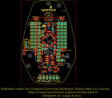
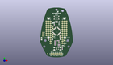
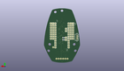
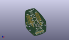

Contents
========

* [PROJ-SPAR-13058-STAN-01>MiP ProMini-Pack](#proj-spar-13058-stan-01mip-promini-pack)
	* [Images](#images)
	* [Interactive BOM](#interactive-bom)
	* [OOMP Parts](#oomp-parts)
	* [Tags](#tags)
  
![][im]
# PROJ-SPAR-13058-STAN-01>MiP ProMini-Pack

- ID: PROJ-SPAR-13058-STAN-01
- Hex ID: PRS13058
- Name: MiP ProMini-Pack
- Description: 

## Images
  
  

|eagleImage|kicadPcb3dFront|kicadPcb3dBack|kicadPcb3d|
| :---: | :---: | :---: | :---: |
|||||

## Interactive BOM

- Interactive BOM page: [ibom.html](kicad/bom/ibom.html)

## OOMP Parts
  

|OOMP Parts|
| :---: |
|CAPE-0603-X-NF100-01, C1, 845.0, 1580.0, 0,C1, 0.1uF, 0603-CAP, SparkFun-Capacitors, (845, 1580), R0|
|CAPE-0603-X-NF100-01, C2, 650.0, 935.0, 270,C2, 0.1uF, 0603-CAP, SparkFun-Capacitors, (650, 935), R270|
|CAPE-0603-X-NF100-01, C3, 730.0, 1625.0, 270,C3, 0.1uF, 0603-CAP, SparkFun-Capacitors, (730, 1625), R270|
|CAPE-0603-X-NF100-01, C4, 925.0, 850.0, 0,C4, 0.1uF, 0603-CAP, SparkFun-Capacitors, (925, 850), R0|
|CAPE-0603-X-NF100-01, C10, 1130.0, 450.0, 270,C10, 0.1uF, 0603-CAP, SparkFun-Capacitors, (1130, 450), R270|
|CAPE-UNMATCHED-X-UNMATCHED-01, C13, 1040.0, 450.0, 90,C13, 10uF, EIA3216, SparkFun, (1040, 450), R90|
|CAPE-UNMATCHED-X-UNMATCHED-01, C19, 730.0, 450.0, 90,C19, 10uF, EIA3216, SparkFun, (730, 450), R90|
|UNMATCHED-0603-X-UNMATCHED-01, D3, 845.0, 1830.0, 90,D3, Green, LED-0603, SparkFun-LED, (845, 1830), R90|
|UNMATCHED-0603-X-UNMATCHED-01, D4, 1165.0, 610.0, 90,D4, GREEN, LED-0603, SparkFun-LED, (1165, 610), R90|
|UNMATCHED-UNMATCHED-X-UNMATCHED-01, F1, 100.0, 950.0, 90,F1, PTCSMD, PTC-1206, SparkFun-PowerIC, (100, 950), R90|
|ERROR, JP1 FTDI Basic, 0, 0, 0,JP1, FTDI, Basic, 1X06, SparkFun, (590, 190), R0|
|UNMATCHED-UNMATCHED-X-UNMATCHED-01, JP2, 655.0, 1165.0, M270,JP2, 1X02, SparkFun, (655, 1165), MR270|
|UNMATCHED-UNMATCHED-X-UNMATCHED-01, JP3, 655.0, 1575.0, M270,JP3, 1X02, SparkFun, (655, 1575), MR270|
|UNMATCHED-UNMATCHED-X-UNMATCHED-01, JP4, 1340.0, 1820.0, M270,JP4, 1X08, SparkFun-Connectors, (1340, 1820), MR270|
|UNMATCHED-UNMATCHED-X-UNMATCHED-01, JP5, 340.0, 1820.0, M270,JP5, 1X08, SparkFun-Connectors, (340, 1820), MR270|
|UNMATCHED-UNMATCHED-X-UNMATCHED-01, JP6, 540.0, 720.0, M90,JP6, 1X12, SparkFun, (540, 720), MR90|
|UNMATCHED-UNMATCHED-X-UNMATCHED-01, JP7, 1140.0, 1820.0, M270,JP7, 1X12, SparkFun, (1140, 1820), MR270|
|UNMATCHED-UNMATCHED-X-UNMATCHED-01, JP8, 1240.0, 1820.0, M270,JP8, 1X08, SparkFun-Connectors, (1240, 1820), MR270|
|UNMATCHED-UNMATCHED-X-UNMATCHED-01, JP9, 440.0, 1820.0, M270,JP9, 1X08, SparkFun-Connectors, (440, 1820), MR270|
|UNMATCHED-UNMATCHED-X-UNMATCHED-01, JP10, 1240.0, 720.0, 0,JP10, M01PTH, 1X01, SparkFun-Connectors, (1240, 720), R0|
|UNMATCHED-UNMATCHED-X-UNMATCHED-01, JP11, 160.0, 1090.0, M90,JP11, 1X04-1.5MM_JST, SparkFun-Connectors, (160, 1090), MR90|
|UNMATCHED-UNMATCHED-X-UNMATCHED-01, Q1, 1020.0, 1080.0, 270,Q1, 8MHz, RESONATOR-SMD, SparkFun-FreqCtrl, (1020, 1080), R270|
|RESE-0603-X-UNMATCHED-01, R1, 770.0, 1165.0, M180,R1, DNP, 0603-RES, SparkFun, (770, 1165), MR180|
|<table><tr><td></td><td> R2</td><td>[RESE-0603-X-O103-01 SMD (0603) 10k Ohm Resistor](https://github.com/oomlout/oomlout_OOMP_parts/tree/main/RESE-0603-X-O103-01/)</td><td>[R6103](https://github.com/oomlout/oomlout_OOMP_parts/tree/main/RESE-0603-X-O103-01/)</td></tr></table>|
|RESE-0603-X-UNMATCHED-01, R3, 770.0, 1065.0, M180,R3, DNP, 0603-RES, SparkFun, (770, 1065), MR180|
|<table><tr><td></td><td> R4</td><td>[RESE-0603-X-O103-01 SMD (0603) 10k Ohm Resistor](https://github.com/oomlout/oomlout_OOMP_parts/tree/main/RESE-0603-X-O103-01/)</td><td>[R6103](https://github.com/oomlout/oomlout_OOMP_parts/tree/main/RESE-0603-X-O103-01/)</td></tr></table>|
|<table><tr><td></td><td> R5</td><td>[RESE-0603-X-O103-01 SMD (0603) 10k Ohm Resistor](https://github.com/oomlout/oomlout_OOMP_parts/tree/main/RESE-0603-X-O103-01/)</td><td>[R6103](https://github.com/oomlout/oomlout_OOMP_parts/tree/main/RESE-0603-X-O103-01/)</td></tr></table>|
|<table><tr><td></td><td> R6</td><td>[RESE-0603-X-O331-01 SMD (0603) 330 Ohm Resistor](https://github.com/oomlout/oomlout_OOMP_parts/tree/main/RESE-0603-X-O331-01/)</td><td>[R6331](https://github.com/oomlout/oomlout_OOMP_parts/tree/main/RESE-0603-X-O331-01/)</td></tr></table>|
|RESE-0603-X-UNMATCHED-01, R7, 960.0, 600.0, 0,R7, 1K, 0603-RES, SparkFun-Resistors, (960, 600), R0|
|RESE-0603-X-UNMATCHED-01, R8, 790.0, 835.0, 180,R8, 1K, 0603-RES, SparkFun-Resistors, (790, 835), R180|
|RESE-0603-X-UNMATCHED-01, R9, 790.0, 770.0, 180,R9, 1K, 0603-RES, SparkFun-Resistors, (790, 770), R180|
|RESE-0603-X-UNMATCHED-01, R10, 790.0, 705.0, 180,R10, 1K, 0603-RES, SparkFun-Resistors, (790, 705), R180|
|RESE-0603-X-UNMATCHED-01, R11, 790.0, 640.0, 180,R11, 1K, 0603-RES, SparkFun-Resistors, (790, 640), R180|
|UNMATCHED-UNMATCHED-X-UNMATCHED-01, S1, 840.0, 2010.0, 0,S1, Reset, TACTILE-SWITCH-SMD, SparkFun-Electromechanical, (840, 2010), R0|
|UNMATCHED-UNMATCHED-X-UNMATCHED-01, SJ1, 430.0, 1020.0, 0,SJ1, PAD-JUMPER-3-2OF3_NC_BY_PASTE_YES_SILK_FULL_BOX, SparkFun-Passives, (430, 1020), R0|
|UNMATCHED-UNMATCHED-X-UNMATCHED-01, SJ2, 1265.0, 1020.0, 180,SJ2, PAD-JUMPER-3-2OF3_NC_BY_PASTE_YES_SILK_FULL_BOX, SparkFun-Passives, (1265, 1020), R180|
|UNMATCHED-UNMATCHED-X-UNMATCHED-01, SJ3, 440.0, 1960.0, 0,SJ3, PAD-JUMPER-3-2OF3_NC_BY_PASTE_YES_SILK_FULL_BOX, SparkFun-Passives, (440, 1960), R0|
|UNMATCHED-UNMATCHED-X-UNMATCHED-01, SJ4, 1240.0, 1960.0, 180,SJ4, PAD-JUMPER-3-2OF3_NC_BY_PASTE_YES_SILK_FULL_BOX, SparkFun-Passives, (1240, 1960), R180|
|ERROR, SJ5 D2 Jumper, 0, 0, 0,SJ5, D2, Jumper, PAD-JUMPER-2-NC_BY_TRACE_YES_SILK, SparkFun-Passives, (1230, 860), R90|
|UNMATCHED-UNMATCHED-X-UNMATCHED-01, U1, 850.0, 1320.0, 135,U1, ATMEGA328, TQFP32-08, SparkFun-DigitalIC, (850, 1320), R135|
|UNMATCHED-UNMATCHED-X-UNMATCHED-01, U2, 890.0, 450.0, 270,U2, MIC5205, SOT23-5, SparkFun-PowerIC, (890, 450), R270|
|UNMATCHED-UNMATCHED-X-UNMATCHED-01, U3, 960.0, 770.0, 0,U3, TS3USB221A, QFN-10-RSE, SparkFun-AnalogIC, (960, 770), R0|

## Tags

- hexID: PRS13058
- oompType: PROJ
- oompSize: SPAR
- oompColor: 13058
- oompDesc: STAN
- oompIndex: 01
- oompName: MiP ProMini-Pack
- sources: All source files from https://github.com/sparkfun/MiP_ProMini-Pack (source licence details in srcLicense.md)
- linkBuyPage: https://www.sparkfun.com/products/13058
- oompPart: CAPE-0603-X-NF100-01, C1, 845.0, 1580.0, 0
- oompPart: CAPE-0603-X-NF100-01, C2, 650.0, 935.0, 270
- oompPart: CAPE-0603-X-NF100-01, C3, 730.0, 1625.0, 270
- oompPart: CAPE-0603-X-NF100-01, C4, 925.0, 850.0, 0
- oompPart: CAPE-0603-X-NF100-01, C10, 1130.0, 450.0, 270
- oompPart: CAPE-UNMATCHED-X-UNMATCHED-01, C13, 1040.0, 450.0, 90
- oompPart: CAPE-UNMATCHED-X-UNMATCHED-01, C19, 730.0, 450.0, 90
- oompPart: UNMATCHED-0603-X-UNMATCHED-01, D3, 845.0, 1830.0, 90
- oompPart: UNMATCHED-0603-X-UNMATCHED-01, D4, 1165.0, 610.0, 90
- oompPart: UNMATCHED-UNMATCHED-X-UNMATCHED-01, F1, 100.0, 950.0, 90
- oompPart: SKIP-UNMATCHED-X-UNMATCHED-01, FID1, 400.0, 200.0, 0
- oompPart: SKIP-UNMATCHED-X-UNMATCHED-01, FID2, 1300.0, 2200.0, 0
- oompPart: ERROR, JP1 FTDI Basic, 0, 0, 0
- oompPart: UNMATCHED-UNMATCHED-X-UNMATCHED-01, JP2, 655.0, 1165.0, M270
- oompPart: UNMATCHED-UNMATCHED-X-UNMATCHED-01, JP3, 655.0, 1575.0, M270
- oompPart: UNMATCHED-UNMATCHED-X-UNMATCHED-01, JP4, 1340.0, 1820.0, M270
- oompPart: UNMATCHED-UNMATCHED-X-UNMATCHED-01, JP5, 340.0, 1820.0, M270
- oompPart: UNMATCHED-UNMATCHED-X-UNMATCHED-01, JP6, 540.0, 720.0, M90
- oompPart: UNMATCHED-UNMATCHED-X-UNMATCHED-01, JP7, 1140.0, 1820.0, M270
- oompPart: UNMATCHED-UNMATCHED-X-UNMATCHED-01, JP8, 1240.0, 1820.0, M270
- oompPart: UNMATCHED-UNMATCHED-X-UNMATCHED-01, JP9, 440.0, 1820.0, M270
- oompPart: UNMATCHED-UNMATCHED-X-UNMATCHED-01, JP10, 1240.0, 720.0, 0
- oompPart: UNMATCHED-UNMATCHED-X-UNMATCHED-01, JP11, 160.0, 1090.0, M90
- oompPart: UNMATCHED-UNMATCHED-X-UNMATCHED-01, Q1, 1020.0, 1080.0, 270
- oompPart: RESE-0603-X-UNMATCHED-01, R1, 770.0, 1165.0, M180
- oompPart: RESE-0603-X-O103-01, R2, 447.0, 908.0, 90
- oompPart: RESE-0603-X-UNMATCHED-01, R3, 770.0, 1065.0, M180
- oompPart: RESE-0603-X-O103-01, R4, 960.0, 665.0, 0
- oompPart: RESE-0603-X-O103-01, R5, 1020.0, 940.0, 270
- oompPart: RESE-0603-X-O331-01, R6, 845.0, 1770.0, 0
- oompPart: RESE-0603-X-UNMATCHED-01, R7, 960.0, 600.0, 0
- oompPart: RESE-0603-X-UNMATCHED-01, R8, 790.0, 835.0, 180
- oompPart: RESE-0603-X-UNMATCHED-01, R9, 790.0, 770.0, 180
- oompPart: RESE-0603-X-UNMATCHED-01, R10, 790.0, 705.0, 180
- oompPart: RESE-0603-X-UNMATCHED-01, R11, 790.0, 640.0, 180
- oompPart: UNMATCHED-UNMATCHED-X-UNMATCHED-01, S1, 840.0, 2010.0, 0
- oompPart: UNMATCHED-UNMATCHED-X-UNMATCHED-01, SJ1, 430.0, 1020.0, 0
- oompPart: UNMATCHED-UNMATCHED-X-UNMATCHED-01, SJ2, 1265.0, 1020.0, 180
- oompPart: UNMATCHED-UNMATCHED-X-UNMATCHED-01, SJ3, 440.0, 1960.0, 0
- oompPart: UNMATCHED-UNMATCHED-X-UNMATCHED-01, SJ4, 1240.0, 1960.0, 180
- oompPart: ERROR, SJ5 D2 Jumper, 0, 0, 0
- oompPart: UNMATCHED-UNMATCHED-X-UNMATCHED-01, U1, 850.0, 1320.0, 135
- oompPart: UNMATCHED-UNMATCHED-X-UNMATCHED-01, U2, 890.0, 450.0, 270
- oompPart: UNMATCHED-UNMATCHED-X-UNMATCHED-01, U3, 960.0, 770.0, 0
- rawPart: C1, 0.1uF, 0603-CAP, SparkFun-Capacitors, (845, 1580), R0
- rawPart: C2, 0.1uF, 0603-CAP, SparkFun-Capacitors, (650, 935), R270
- rawPart: C3, 0.1uF, 0603-CAP, SparkFun-Capacitors, (730, 1625), R270
- rawPart: C4, 0.1uF, 0603-CAP, SparkFun-Capacitors, (925, 850), R0
- rawPart: C10, 0.1uF, 0603-CAP, SparkFun-Capacitors, (1130, 450), R270
- rawPart: C13, 10uF, EIA3216, SparkFun, (1040, 450), R90
- rawPart: C19, 10uF, EIA3216, SparkFun, (730, 450), R90
- rawPart: D3, Green, LED-0603, SparkFun-LED, (845, 1830), R90
- rawPart: D4, GREEN, LED-0603, SparkFun-LED, (1165, 610), R90
- rawPart: F1, PTCSMD, PTC-1206, SparkFun-PowerIC, (100, 950), R90
- rawPart: FID1, FIDUCIAL1X2, FIDUCIAL-1X2, SparkFun-Aesthetics, (400, 200), R0
- rawPart: FID2, FIDUCIAL1X2, FIDUCIAL-1X2, SparkFun-Aesthetics, (1300, 2200), R0
- rawPart: JP1, FTDI, Basic, 1X06, SparkFun, (590, 190), R0
- rawPart: JP2, 1X02, SparkFun, (655, 1165), MR270
- rawPart: JP3, 1X02, SparkFun, (655, 1575), MR270
- rawPart: JP4, 1X08, SparkFun-Connectors, (1340, 1820), MR270
- rawPart: JP5, 1X08, SparkFun-Connectors, (340, 1820), MR270
- rawPart: JP6, 1X12, SparkFun, (540, 720), MR90
- rawPart: JP7, 1X12, SparkFun, (1140, 1820), MR270
- rawPart: JP8, 1X08, SparkFun-Connectors, (1240, 1820), MR270
- rawPart: JP9, 1X08, SparkFun-Connectors, (440, 1820), MR270
- rawPart: JP10, M01PTH, 1X01, SparkFun-Connectors, (1240, 720), R0
- rawPart: JP11, 1X04-1.5MM_JST, SparkFun-Connectors, (160, 1090), MR90
- rawPart: Q1, 8MHz, RESONATOR-SMD, SparkFun-FreqCtrl, (1020, 1080), R270
- rawPart: R1, DNP, 0603-RES, SparkFun, (770, 1165), MR180
- rawPart: R2, 10K, 0603-RES, SparkFun, (447, 908), R90
- rawPart: R3, DNP, 0603-RES, SparkFun, (770, 1065), MR180
- rawPart: R4, 10K, 0603-RES, SparkFun-Resistors, (960, 665), R0
- rawPart: R5, 10K, 0603-RES, SparkFun-Resistors, (1020, 940), R270
- rawPart: R6, 330, 0603-RES, SparkFun-Resistors, (845, 1770), R0
- rawPart: R7, 1K, 0603-RES, SparkFun-Resistors, (960, 600), R0
- rawPart: R8, 1K, 0603-RES, SparkFun-Resistors, (790, 835), R180
- rawPart: R9, 1K, 0603-RES, SparkFun-Resistors, (790, 770), R180
- rawPart: R10, 1K, 0603-RES, SparkFun-Resistors, (790, 705), R180
- rawPart: R11, 1K, 0603-RES, SparkFun-Resistors, (790, 640), R180
- rawPart: S1, Reset, TACTILE-SWITCH-SMD, SparkFun-Electromechanical, (840, 2010), R0
- rawPart: SJ1, PAD-JUMPER-3-2OF3_NC_BY_PASTE_YES_SILK_FULL_BOX, SparkFun-Passives, (430, 1020), R0
- rawPart: SJ2, PAD-JUMPER-3-2OF3_NC_BY_PASTE_YES_SILK_FULL_BOX, SparkFun-Passives, (1265, 1020), R180
- rawPart: SJ3, PAD-JUMPER-3-2OF3_NC_BY_PASTE_YES_SILK_FULL_BOX, SparkFun-Passives, (440, 1960), R0
- rawPart: SJ4, PAD-JUMPER-3-2OF3_NC_BY_PASTE_YES_SILK_FULL_BOX, SparkFun-Passives, (1240, 1960), R180
- rawPart: SJ5, D2, Jumper, PAD-JUMPER-2-NC_BY_TRACE_YES_SILK, SparkFun-Passives, (1230, 860), R90
- rawPart: U1, ATMEGA328, TQFP32-08, SparkFun-DigitalIC, (850, 1320), R135
- rawPart: U2, MIC5205, SOT23-5, SparkFun-PowerIC, (890, 450), R270
- rawPart: U3, TS3USB221A, QFN-10-RSE, SparkFun-AnalogIC, (960, 770), R0

[im]: kicadPcb3d_450.png
