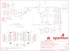

Contents
========

* [PRS13058 > MiP ProMini-Pack](#prs13058--mip-promini-pack)
	* [Schematic](#schematic)
	* [PCB](#pcb)
	* [Interactive BOM](#interactive-bom)
	* [OOMP Parts](#oomp-parts)
	* [Images](#images)
	* [Tags](#tags)
  
![][im]
# PRS13058 > MiP ProMini-Pack

- ID: PROJ-SPAR-13058-STAN-01
- Hex ID: PRS13058
- Name: Sparkfun
- Description: Sparkfun
- Long Link: [http://oom.lt/PROJ-SPAR-13058-STAN-01](http://oom.lt/PROJ-SPAR-13058-STAN-01)
- Short Link: [http://oom.lt/PRS13058](http://oom.lt/PRS13058)

## Schematic
  

## PCB
  

## Interactive BOM

- Interactive BOM page: [ibom.html](https://htmlpreview.github.io/?https://github.com/oomlout/oomlout_OOMP_projects/blob/main/PROJ-SPAR-13058-STAN-01/kicad/bom/ibom.html)

## OOMP Parts
  

|OOMP Parts|
| :---: |
|CAPC-0603-X-UF1D-01 C1, C2, C3, C4, C10|
|CAPT-3216-X-UF10-01 C13, C19|
|[LEDS-0603-G-STAN-01  SMD (0603) Green LED  D3, D4](https://github.com/oomlout/oomlout_OOMP_parts/tree/main/LEDS-0603-G-STAN-01/)|
|REFU-1206-X-UNMATCHED-01 F1|
|[HEAD-I01-X-PI06-01  2.54 mm 6 Pin Header  JP1](https://github.com/oomlout/oomlout_OOMP_parts/tree/main/HEAD-I01-X-PI06-01/)|
|[HEAD-I01-X-PI02-01  2.54 mm 2 Pin Header  JP2, JP3](https://github.com/oomlout/oomlout_OOMP_parts/tree/main/HEAD-I01-X-PI02-01/)|
|[HEAD-I01-X-PI08-01  2.54 mm 8 Pin Header  JP4, JP5, JP8, JP9](https://github.com/oomlout/oomlout_OOMP_parts/tree/main/HEAD-I01-X-PI08-01/)|
|[HEAD-I01-X-PI12-01  2.54 mm 12 Pin Header  JP6, JP7](https://github.com/oomlout/oomlout_OOMP_parts/tree/main/HEAD-I01-X-PI12-01/)|
|HEAD-I01-X-PI01-01 JP10|
|HEAD-UNMATCHED-X-PI04-01 JP11|
|UNMATCHED-UNMATCHED-X-UNMATCHED-01 Q1, S1, U1, U3|
|RESE-0603-X-UNMATCHED-01 R1, R3|
|[RESE-0603-X-O103-01  SMD (0603) 10k Ohm Resistor  R2, R4, R5](https://github.com/oomlout/oomlout_OOMP_parts/tree/main/RESE-0603-X-O103-01/)|
|[RESE-0603-X-O331-01  SMD (0603) 330 Ohm Resistor  R6](https://github.com/oomlout/oomlout_OOMP_parts/tree/main/RESE-0603-X-O331-01/)|
|[RESE-0603-X-O102-01  SMD (0603) 1k Ohm Resistor  R7, R8, R9, R10, R11](https://github.com/oomlout/oomlout_OOMP_parts/tree/main/RESE-0603-X-O102-01/)|
|VREG-SO235-X-KMIC5205-01 U2|

## Images
  
  

|kicadPcb3d|kicadPcb3dFront|kicadPcb3dBack|eagleImage|eagleSchemImage|
| :---: | :---: | :---: | :---: | :---: |
||||||

## Tags

- hexID: PRS13058
- oompType: PROJ
- oompSize: SPAR
- oompColor: 13058
- oompDesc: STAN
- oompIndex: 01
- oompName: MiP ProMini-Pack
- sources: All source files from https://github.com/sparkfun/MiP_ProMini-Pack (source licence details in srcLicense.md)
- linkBuyPage: https://www.sparkfun.com/products/13058
- oompID: PROJ-SPAR-13058-STAN-01
- oompParts: C1,CAPC-0603-X-UF1D-01
- oompParts: C2,CAPC-0603-X-UF1D-01
- oompParts: C3,CAPC-0603-X-UF1D-01
- oompParts: C4,CAPC-0603-X-UF1D-01
- oompParts: C10,CAPC-0603-X-UF1D-01
- oompParts: C13,CAPT-3216-X-UF10-01
- oompParts: C19,CAPT-3216-X-UF10-01
- oompParts: D3,LEDS-0603-G-STAN-01
- oompParts: D4,LEDS-0603-G-STAN-01
- oompParts: F1,REFU-1206-X-UNMATCHED-01
- oompParts: JP1,HEAD-I01-X-PI06-01
- oompParts: JP2,HEAD-I01-X-PI02-01
- oompParts: JP3,HEAD-I01-X-PI02-01
- oompParts: JP4,HEAD-I01-X-PI08-01
- oompParts: JP5,HEAD-I01-X-PI08-01
- oompParts: JP6,HEAD-I01-X-PI12-01
- oompParts: JP7,HEAD-I01-X-PI12-01
- oompParts: JP8,HEAD-I01-X-PI08-01
- oompParts: JP9,HEAD-I01-X-PI08-01
- oompParts: JP10,HEAD-I01-X-PI01-01
- oompParts: JP11,HEAD-UNMATCHED-X-PI04-01
- oompParts: Q1,UNMATCHED-UNMATCHED-X-UNMATCHED-01
- oompParts: R1,RESE-0603-X-UNMATCHED-01
- oompParts: R2,RESE-0603-X-O103-01
- oompParts: R3,RESE-0603-X-UNMATCHED-01
- oompParts: R4,RESE-0603-X-O103-01
- oompParts: R5,RESE-0603-X-O103-01
- oompParts: R6,RESE-0603-X-O331-01
- oompParts: R7,RESE-0603-X-O102-01
- oompParts: R8,RESE-0603-X-O102-01
- oompParts: R9,RESE-0603-X-O102-01
- oompParts: R10,RESE-0603-X-O102-01
- oompParts: R11,RESE-0603-X-O102-01
- oompParts: S1,UNMATCHED-UNMATCHED-X-UNMATCHED-01
- oompParts: U1,UNMATCHED-UNMATCHED-X-UNMATCHED-01
- oompParts: U2,VREG-SO235-X-KMIC5205-01
- oompParts: U3,UNMATCHED-UNMATCHED-X-UNMATCHED-01
- rawParts: C1,0.1uF,0.1UF-25V(+80/-20%)(0603),0603-CAP,CAP-00810,CAP-00810,0.1uF,
- rawParts: C2,0.1uF,0.1UF-25V(+80/-20%)(0603),0603-CAP,CAP-00810,CAP-00810,0.1uF,
- rawParts: C3,0.1uF,0.1UF-25V(+80/-20%)(0603),0603-CAP,CAP-00810,CAP-00810,0.1uF,
- rawParts: C4,0.1uF,0.1UF-25V(+80/-20%)(0603),0603-CAP,CAP-00810,CAP-00810,0.1uF,
- rawParts: C10,0.1uF,0.1UF-25V(+80/-20%)(0603),0603-CAP,CAP-00810,CAP-00810,0.1uF,
- rawParts: C13,10uF,CAP_POL1206,EIA3216,Capacitor Polarized,,,
- rawParts: C19,10uF,CAP_POL1206,EIA3216,Capacitor Polarized,,,
- rawParts: D3,Green,LED-GREEN0603,LED-0603,Various green LEDs,DIO-00821,GREEN,
- rawParts: D4,GREEN,LED-GREEN0603,LED-0603,Various green LEDs,DIO-00821,GREEN,
- rawParts: F1,PTCSMD,PTCSMD,PTC-1206,Resettable Fuse PTC,RES-11150,,
- rawParts: FID1,FIDUCIAL1X2,FIDUCIAL1X2,FIDUCIAL-1X2,Fiducial Alignment Points,,,
- rawParts: FID2,FIDUCIAL1X2,FIDUCIAL1X2,FIDUCIAL-1X2,Fiducial Alignment Points,,,
- rawParts: FRAME1,FRAME-LETTER,FRAME-LETTER,CREATIVE_COMMONS,Schematic Frame,,,
- rawParts: JP1,FTDI Basic,ARDUINO_SERIAL_PROGRAMPTH,1X06,,,,
- rawParts: JP2,,M02PTH,1X02,Header 2,,,
- rawParts: JP3,,M02PTH,1X02,Header 2,,,
- rawParts: JP4,,M081X08,1X08,Header 8,,,
- rawParts: JP5,,M081X08,1X08,Header 8,,,
- rawParts: JP6,,M12PTH,1X12,Header 12,,,
- rawParts: JP7,,M12PTH,1X12,Header 12,,,
- rawParts: JP8,,M081X08,1X08,Header 8,,,
- rawParts: JP9,,M081X08,1X08,Header 8,,,
- rawParts: JP10,M01PTH,M01PTH,1X01,Header 1,,,
- rawParts: JP11,,M04JST,1X04-1.5MM_JST,Header 4,,,
- rawParts: LOGO1,SFE_LOGO_NAME_FLAME.1_INCH,SFE_LOGO_NAME_FLAME.1_INCH,SFE_LOGO_NAME_FLAME_.1,SFE Logo, name and flame,,,
- rawParts: LOGO2,OSHW-LOGOS,OSHW-LOGOS,OSHW-LOGO-S,Open Source Hardware Logo This logo indicates the piece of hardware it is found on incorporates a OSHW license and/or adheres to the definition of open source hardware found here: http://freedomdefined.org/OSHW,,,
- rawParts: Q1,8MHz,RESONATOR8MHZ,RESONATOR-SMD,Resonator,XTAL-08895,8MHZ,
- rawParts: R1,DNP,RESISTOR0603-RES,0603-RES,Resistor,,,
- rawParts: R2,10K,RESISTOR0603-RES,0603-RES,Resistor,,,
- rawParts: R3,DNP,RESISTOR0603-RES,0603-RES,Resistor,,,
- rawParts: R4,10K,10KOHM1/10W1%(0603)0603,0603-RES,RES-00824,RES-00824,10K,
- rawParts: R5,10K,10KOHM1/10W1%(0603)0603,0603-RES,RES-00824,RES-00824,10K,
- rawParts: R6,330,330OHM1/10W1%(0603),0603-RES,RES-00818,RES-00818,330,
- rawParts: R7,1K,1KOHM1/10W1%(0603),0603-RES,RES-07856,RES-07856,1K,
- rawParts: R8,1K,1KOHM1/10W1%(0603),0603-RES,RES-07856,RES-07856,1K,
- rawParts: R9,1K,1KOHM1/10W1%(0603),0603-RES,RES-07856,RES-07856,1K,
- rawParts: R10,1K,1KOHM1/10W1%(0603),0603-RES,RES-07856,RES-07856,1K,
- rawParts: R11,1K,1KOHM1/10W1%(0603),0603-RES,RES-07856,RES-07856,1K,
- rawParts: S1,Reset,SWITCH-MOMENTARY-2SMD,TACTILE-SWITCH-SMD,Various NO switches- pushbuttons, reed, etc,SWCH-08247,,
- rawParts: SJ1,,JUMPER-PAD-3-2OF3_NC_BY_PASTE,PAD-JUMPER-3-2OF3_NC_BY_PASTE_YES_SILK_FULL_BOX,,,,
- rawParts: SJ2,,JUMPER-PAD-3-2OF3_NC_BY_PASTE,PAD-JUMPER-3-2OF3_NC_BY_PASTE_YES_SILK_FULL_BOX,,,,
- rawParts: SJ3,,JUMPER-PAD-3-2OF3_NC_BY_PASTE,PAD-JUMPER-3-2OF3_NC_BY_PASTE_YES_SILK_FULL_BOX,,,,
- rawParts: SJ4,,JUMPER-PAD-3-2OF3_NC_BY_PASTE,PAD-JUMPER-3-2OF3_NC_BY_PASTE_YES_SILK_FULL_BOX,,,,
- rawParts: SJ5,D2 Jumper,JUMPER-PAD-2-NC_BY_TRACE,PAD-JUMPER-2-NC_BY_TRACE_YES_SILK,,,,
- rawParts: U1,ATMEGA328,ATMEGA328_SMT,TQFP32-08,32-Pin Atmega328 part,IC-09069,ATMEGA328P,
- rawParts: U2,MIC5205,MIC52053.3V,SOT23-5,MIC5205 150mA vreg,VREG-00822,,
- rawParts: U3,TS3USB221A,TS3USB221A,QFN-10-RSE,DPDT Analog Mux,IC-12115,TS3USB221A,

[im]: kicadPcb3d_450.png
