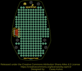
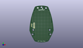
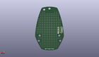
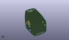

Contents
========

* [PROJ-SPAR-13067-STAN-01>MiP Proto-Pack](#proj-spar-13067-stan-01mip-proto-pack)
	* [Images](#images)
	* [Interactive BOM](#interactive-bom)
	* [OOMP Parts](#oomp-parts)
	* [Tags](#tags)
  
![][im]
# PROJ-SPAR-13067-STAN-01>MiP Proto-Pack

- ID: PROJ-SPAR-13067-STAN-01
- Hex ID: PRS13067
- Name: MiP Proto-Pack
- Description: 

## Images
  
  

|eagleImage|kicadPcb3dFront|kicadPcb3dBack|kicadPcb3d|
| :---: | :---: | :---: | :---: |
|||||

## Interactive BOM

- Interactive BOM page: [ibom.html](kicad/bom/ibom.html)

## OOMP Parts
  

|OOMP Parts|
| :---: |
|<table><tr><td></td><td> JP1</td><td>[HEAD-I01-X-PI04-01 2.54 mm 4 Pin Header](https://github.com/oomlout/oomlout_OOMP_parts/tree/main/HEAD-I01-X-PI04-01/)</td><td>[H04](https://github.com/oomlout/oomlout_OOMP_parts/tree/main/HEAD-I01-X-PI04-01/)</td></tr></table>|
|UNMATCHED-UNMATCHED-X-UNMATCHED-01, JP11, -17.272000000000002, 27.432, M90,JP11, 1X04-1.5MM_JST, SparkFun-Connectors, (-0.68, 1.08), MR90|

## Tags

- hexID: PRS13067
- oompType: PROJ
- oompSize: SPAR
- oompColor: 13067
- oompDesc: STAN
- oompIndex: 01
- oompName: MiP Proto-Pack
- sources: All source files from https://github.com/sparkfun/MiP_Proto-Pack (source licence details in srcLicense.md)
- linkBuyPage: https://www.sparkfun.com/products/13067
- oompID: PROJ-SPAR-13067-STAN-01
- oompPart: HEAD-I01-X-PI04-01, JP1, -12.7, 25.4, 90
- oompPart: UNMATCHED-UNMATCHED-X-UNMATCHED-01, JP11, -17.272000000000002, 27.432, M90
- rawPart: JP1, 1X04, SparkFun-Connectors, (-0.5, 1), R90
- rawPart: JP11, 1X04-1.5MM_JST, SparkFun-Connectors, (-0.68, 1.08), MR90

[im]: kicadPcb3d_450.png
