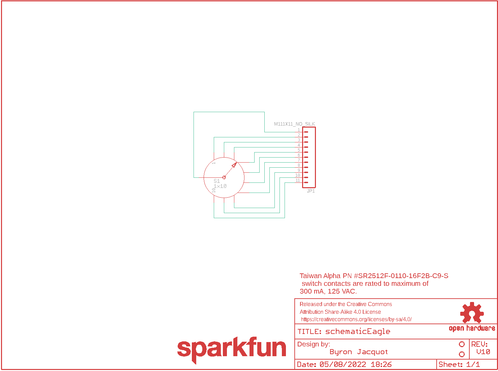
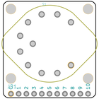
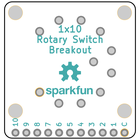
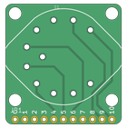
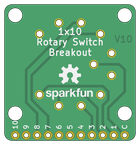

Contents
========

* [PRS13098 > Rotary Switch Breakout](#prs13098--rotary-switch-breakout)
	* [Schematic](#schematic)
	* [PCB](#pcb)
	* [Interactive BOM](#interactive-bom)
	* [OOMP Parts](#oomp-parts)
	* [Images](#images)
	* [Tags](#tags)
  
![][im]
# PRS13098 > Rotary Switch Breakout

- ID: PROJ-SPAR-13098-STAN-01
- Hex ID: PRS13098
- Name: Sparkfun
- Description: Sparkfun
- Long Link: [http://oom.lt/PROJ-SPAR-13098-STAN-01](http://oom.lt/PROJ-SPAR-13098-STAN-01)
- Short Link: [http://oom.lt/PRS13098](http://oom.lt/PRS13098)

## Schematic
  

## PCB
  

## Interactive BOM

- Interactive BOM page: [ibom.html](https://htmlpreview.github.io/?https://github.com/oomlout/oomlout_OOMP_projects/blob/main/PROJ-SPAR-13098-STAN-01/kicad/bom/ibom.html)

## OOMP Parts
  

|OOMP ID|Name|Identifier|
| :---: | :---: | :---: |
|HEAD-I01-X-PI11-01||JP1|
|UNMATCHED-UNMATCHED-X-UNMATCHED-01||S1|

## Images
  
  

|bominteractivefront|bominteractiveback|kicadPcb3d|kicadPcb3dFront|kicadPcb3dBack|eagleImage|eagleSchemImage|pcbdraw|pcbdrawback|
| :---: | :---: | :---: | :---: | :---: | :---: | :---: | :---: | :---: |
||||||||||

## Tags

- hexID: PRS13098
- oompType: PROJ
- oompSize: SPAR
- oompColor: 13098
- oompDesc: STAN
- oompIndex: 01
- oompName: Rotary Switch Breakout
- sources: All source files from https://github.com/sparkfun/Rotary_Switch_Breakout (source licence details in srcLicense.md)
- linkBuyPage: https://www.sparkfun.com/products/13098
- oompID: PROJ-SPAR-13098-STAN-01
- oompParts: JP1,HEAD-I01-X-PI11-01
- oompParts: S1,UNMATCHED-UNMATCHED-X-UNMATCHED-01
- rawParts: FRAME1,FRAME-LETTER,FRAME-LETTER,CREATIVE_COMMONS,Schematic Frame,,,
- rawParts: JP1,M111X11_NO_SILK,M111X11_NO_SILK,1X11_NO_SILK,Header 11,,,
- rawParts: LOGO1,OSHW-LOGOM,OSHW-LOGOM,OSHW-LOGO-M,Open Source Hardware Logo This logo indicates the piece of hardware it is found on incorporates a OSHW license and/or adheres to the definition of open source hardware found here: http://freedomdefined.org/OSHW,,,
- rawParts: LOGO3,SFE_LOGO_NAME.1_INCH,SFE_LOGO_NAME.1_INCH,SFE_LOGO_NAME_.1,SFE Logo, name only,,,
- rawParts: S1,1x10,SWITCH_ROTARY_1X10KIT,ROTARY_SWITCH_1X10_KIT,SWCH-12120,SWCH-12120,1x10,
- rawParts: STANDOFF2,STAND-OFF,STAND-OFF,STAND-OFF,#4 Stand Off,,,
- rawParts: STANDOFF4,STAND-OFF,STAND-OFF,STAND-OFF,#4 Stand Off,,,

[im]: kicadPcb3d_450.png
