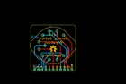
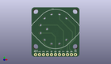
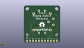
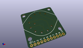

Contents
========

* [PROJ-SPAR-13098-STAN-01>Rotary Switch Breakout](#proj-spar-13098-stan-01rotary-switch-breakout)
	* [Images](#images)
	* [Interactive BOM](#interactive-bom)
	* [OOMP Parts](#oomp-parts)
	* [Tags](#tags)
  
![][im]
# PROJ-SPAR-13098-STAN-01>Rotary Switch Breakout

- ID: PROJ-SPAR-13098-STAN-01
- Hex ID: PRS13098
- Name: Rotary Switch Breakout
- Description: 

## Images
  
  

|eagleImage|kicadPcb3dFront|kicadPcb3dBack|kicadPcb3d|
| :---: | :---: | :---: | :---: |
|||||

## Interactive BOM

- Interactive BOM page: [ibom.html](kicad/bom/ibom.html)

## OOMP Parts
  

|OOMP Parts|
| :---: |
|HEAD-I01-X-PI11-01, JP1, 2.54, 1.27, 0,JP1, M111X11_NO_SILK, 1X11_NO_SILK, SparkFun-Connectors, (0.1, 0.05), R0|
|UNMATCHED-UNMATCHED-X-UNMATCHED-01, S1, 15.239999999999998, 17.779999999999998, 270,S1, 1x10, ROTARY_SWITCH_1X10_KIT, SparkFun-Electromechanical, (0.6, 0.7), R270|

## Tags

- hexID: PRS13098
- oompType: PROJ
- oompSize: SPAR
- oompColor: 13098
- oompDesc: STAN
- oompIndex: 01
- oompName: Rotary Switch Breakout
- sources: All source files from https://github.com/sparkfun/Rotary_Switch_Breakout (source licence details in srcLicense.md)
- linkBuyPage: https://www.sparkfun.com/products/13098
- oompID: PROJ-SPAR-13098-STAN-01
- oompPart: HEAD-I01-X-PI11-01, JP1, 2.54, 1.27, 0
- oompPart: UNMATCHED-UNMATCHED-X-UNMATCHED-01, S1, 15.239999999999998, 17.779999999999998, 270
- rawPart: JP1, M111X11_NO_SILK, 1X11_NO_SILK, SparkFun-Connectors, (0.1, 0.05), R0
- rawPart: S1, 1x10, ROTARY_SWITCH_1X10_KIT, SparkFun-Electromechanical, (0.6, 0.7), R270

[im]: kicadPcb3d_450.png
