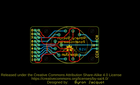
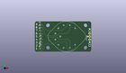
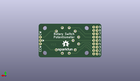
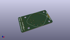

Contents
========

* [PROJ-SPAR-13099-STAN-01>Rotary Switch Potentiometer](#proj-spar-13099-stan-01rotary-switch-potentiometer)
	* [Images](#images)
	* [Interactive BOM](#interactive-bom)
	* [OOMP Parts](#oomp-parts)
	* [Tags](#tags)
  
![][im]
# PROJ-SPAR-13099-STAN-01>Rotary Switch Potentiometer

- ID: PROJ-SPAR-13099-STAN-01
- Hex ID: PRS13099
- Name: Rotary Switch Potentiometer
- Description: 

## Images
  
  

|eagleImage|kicadPcb3dFront|kicadPcb3dBack|kicadPcb3d|
| :---: | :---: | :---: | :---: |
|||||

## Interactive BOM

- Interactive BOM page: [ibom.html](kicad/bom/ibom.html)

## OOMP Parts
  

|OOMP Parts|
| :---: |
|UNMATCHED-UNMATCHED-X-UNMATCHED-01, JP1, 45.72, 10.16, 90,JP1, 1X03_NO_SILK, SparkFun-Connectors, (1.8, 0.4), R90|
|RESE-UNMATCHED-X-UNMATCHED-01, R1, 3.175, 2.54, 0,R1, AXIAL-0.1EZ, SparkFun-Resistors, (0.125, 0.1), R0|
|RESE-UNMATCHED-X-UNMATCHED-01, R2, 3.175, 5.08, 0,R2, AXIAL-0.1EZ, SparkFun-Resistors, (0.125, 0.2), R0|
|RESE-UNMATCHED-X-UNMATCHED-01, R3, 5.715, 7.619999999999999, 180,R3, AXIAL-0.1EZ, SparkFun-Resistors, (0.225, 0.3), R180|
|RESE-UNMATCHED-X-UNMATCHED-01, R4, 5.715, 10.16, 180,R4, AXIAL-0.1EZ, SparkFun-Resistors, (0.225, 0.4), R180|
|RESE-UNMATCHED-X-UNMATCHED-01, R5, 5.715, 12.7, 180,R5, AXIAL-0.1EZ, SparkFun-Resistors, (0.225, 0.5), R180|
|RESE-UNMATCHED-X-UNMATCHED-01, R6, 5.715, 15.239999999999998, 180,R6, AXIAL-0.1EZ, SparkFun-Resistors, (0.225, 0.6), R180|
|RESE-UNMATCHED-X-UNMATCHED-01, R7, 3.175, 17.779999999999998, 0,R7, AXIAL-0.1EZ, SparkFun-Resistors, (0.125, 0.7), R0|
|RESE-UNMATCHED-X-UNMATCHED-01, R8, 3.175, 20.32, 0,R8, AXIAL-0.1EZ, SparkFun-Resistors, (0.125, 0.8), R0|
|RESE-UNMATCHED-X-UNMATCHED-01, R9, 3.175, 22.86, 0,R9, AXIAL-0.1EZ, SparkFun-Resistors, (0.125, 0.9), R0|
|UNMATCHED-UNMATCHED-X-UNMATCHED-01, SW1, 26.669999999999998, 12.7, 270,SW1, 1x10, ROTARY_SWITCH_1X10_KIT, SparkFun-Electromechanical, (1.05, 0.5), R270|

## Tags

- hexID: PRS13099
- oompType: PROJ
- oompSize: SPAR
- oompColor: 13099
- oompDesc: STAN
- oompIndex: 01
- oompName: Rotary Switch Potentiometer
- sources: All source files from https://github.com/sparkfun/Rotary_Switch_Potentiometer (source licence details in srcLicense.md)
- linkBuyPage: https://www.sparkfun.com/products/13099
- oompPart: UNMATCHED-UNMATCHED-X-UNMATCHED-01, JP1, 45.72, 10.16, 90
- oompPart: RESE-UNMATCHED-X-UNMATCHED-01, R1, 3.175, 2.54, 0
- oompPart: RESE-UNMATCHED-X-UNMATCHED-01, R2, 3.175, 5.08, 0
- oompPart: RESE-UNMATCHED-X-UNMATCHED-01, R3, 5.715, 7.619999999999999, 180
- oompPart: RESE-UNMATCHED-X-UNMATCHED-01, R4, 5.715, 10.16, 180
- oompPart: RESE-UNMATCHED-X-UNMATCHED-01, R5, 5.715, 12.7, 180
- oompPart: RESE-UNMATCHED-X-UNMATCHED-01, R6, 5.715, 15.239999999999998, 180
- oompPart: RESE-UNMATCHED-X-UNMATCHED-01, R7, 3.175, 17.779999999999998, 0
- oompPart: RESE-UNMATCHED-X-UNMATCHED-01, R8, 3.175, 20.32, 0
- oompPart: RESE-UNMATCHED-X-UNMATCHED-01, R9, 3.175, 22.86, 0
- oompPart: UNMATCHED-UNMATCHED-X-UNMATCHED-01, SW1, 26.669999999999998, 12.7, 270
- rawPart: JP1, 1X03_NO_SILK, SparkFun-Connectors, (1.8, 0.4), R90
- rawPart: R1, AXIAL-0.1EZ, SparkFun-Resistors, (0.125, 0.1), R0
- rawPart: R2, AXIAL-0.1EZ, SparkFun-Resistors, (0.125, 0.2), R0
- rawPart: R3, AXIAL-0.1EZ, SparkFun-Resistors, (0.225, 0.3), R180
- rawPart: R4, AXIAL-0.1EZ, SparkFun-Resistors, (0.225, 0.4), R180
- rawPart: R5, AXIAL-0.1EZ, SparkFun-Resistors, (0.225, 0.5), R180
- rawPart: R6, AXIAL-0.1EZ, SparkFun-Resistors, (0.225, 0.6), R180
- rawPart: R7, AXIAL-0.1EZ, SparkFun-Resistors, (0.125, 0.7), R0
- rawPart: R8, AXIAL-0.1EZ, SparkFun-Resistors, (0.125, 0.8), R0
- rawPart: R9, AXIAL-0.1EZ, SparkFun-Resistors, (0.125, 0.9), R0
- rawPart: SW1, 1x10, ROTARY_SWITCH_1X10_KIT, SparkFun-Electromechanical, (1.05, 0.5), R270

[im]: kicadPcb3d_450.png
