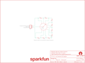

Contents
========

* [PRS13099 > Rotary Switch Potentiometer](#prs13099--rotary-switch-potentiometer)
	* [Schematic](#schematic)
	* [PCB](#pcb)
	* [Interactive BOM](#interactive-bom)
	* [OOMP Parts](#oomp-parts)
	* [Images](#images)
	* [Tags](#tags)
  
![][im]
# PRS13099 > Rotary Switch Potentiometer

- ID: PROJ-SPAR-13099-STAN-01
- Hex ID: PRS13099
- Name: Sparkfun
- Description: Sparkfun
- Long Link: [http://oom.lt/PROJ-SPAR-13099-STAN-01](http://oom.lt/PROJ-SPAR-13099-STAN-01)
- Short Link: [http://oom.lt/PRS13099](http://oom.lt/PRS13099)

## Schematic
  

## PCB
  

## Interactive BOM

- Interactive BOM page: [ibom.html](https://htmlpreview.github.io/?https://github.com/oomlout/oomlout_OOMP_projects/blob/main/PROJ-SPAR-13099-STAN-01/kicad/bom/ibom.html)

## OOMP Parts
  

|OOMP Parts|
| :---: |
|[HEAD-I01-X-PI03-01  2.54 mm 3 Pin Header  JP1](https://github.com/oomlout/oomlout_OOMP_parts/tree/main/HEAD-I01-X-PI03-01/)|
|RESE-UNMATCHED-X-UNMATCHED-01 R1, R2, R3, R4, R5, R6, R7, R8, R9|
|UNMATCHED-UNMATCHED-X-UNMATCHED-01 SW1|

## Images
  
  

|bominteractivefront|bominteractiveback|kicadPcb3d|kicadPcb3dFront|kicadPcb3dBack|eagleImage|eagleSchemImage|pcbdraw|pcbdrawback|
| :---: | :---: | :---: | :---: | :---: | :---: | :---: | :---: | :---: |
||||||||||

## Tags

- hexID: PRS13099
- oompType: PROJ
- oompSize: SPAR
- oompColor: 13099
- oompDesc: STAN
- oompIndex: 01
- oompName: Rotary Switch Potentiometer
- sources: All source files from https://github.com/sparkfun/Rotary_Switch_Potentiometer (source licence details in srcLicense.md)
- linkBuyPage: https://www.sparkfun.com/products/13099
- oompID: PROJ-SPAR-13099-STAN-01
- oompParts: JP1,HEAD-I01-X-PI03-01
- oompParts: R1,RESE-UNMATCHED-X-UNMATCHED-01
- oompParts: R2,RESE-UNMATCHED-X-UNMATCHED-01
- oompParts: R3,RESE-UNMATCHED-X-UNMATCHED-01
- oompParts: R4,RESE-UNMATCHED-X-UNMATCHED-01
- oompParts: R5,RESE-UNMATCHED-X-UNMATCHED-01
- oompParts: R6,RESE-UNMATCHED-X-UNMATCHED-01
- oompParts: R7,RESE-UNMATCHED-X-UNMATCHED-01
- oompParts: R8,RESE-UNMATCHED-X-UNMATCHED-01
- oompParts: R9,RESE-UNMATCHED-X-UNMATCHED-01
- oompParts: SW1,UNMATCHED-UNMATCHED-X-UNMATCHED-01
- rawParts: FRAME1,FRAME-LETTER,FRAME-LETTER,CREATIVE_COMMONS,Schematic Frame,,,
- rawParts: JP1,,M031X03_NO_SILK,1X03_NO_SILK,Header 3,,,
- rawParts: LOGO1,OSHW-LOGOM,OSHW-LOGOM,OSHW-LOGO-M,Open Source Hardware Logo This logo indicates the piece of hardware it is found on incorporates a OSHW license and/or adheres to the definition of open source hardware found here: http://freedomdefined.org/OSHW,,,
- rawParts: LOGO3,SFE_LOGO_NAME.1_INCH,SFE_LOGO_NAME.1_INCH,SFE_LOGO_NAME_.1,SFE Logo, name only,,,
- rawParts: R1,,RESISTORPTH-1/4W-VERT-KIT,AXIAL-0.1EZ,Resistor,,,
- rawParts: R2,,RESISTORPTH-1/4W-VERT-KIT,AXIAL-0.1EZ,Resistor,,,
- rawParts: R3,,RESISTORPTH-1/4W-VERT-KIT,AXIAL-0.1EZ,Resistor,,,
- rawParts: R4,,RESISTORPTH-1/4W-VERT-KIT,AXIAL-0.1EZ,Resistor,,,
- rawParts: R5,,RESISTORPTH-1/4W-VERT-KIT,AXIAL-0.1EZ,Resistor,,,
- rawParts: R6,,RESISTORPTH-1/4W-VERT-KIT,AXIAL-0.1EZ,Resistor,,,
- rawParts: R7,,RESISTORPTH-1/4W-VERT-KIT,AXIAL-0.1EZ,Resistor,,,
- rawParts: R8,,RESISTORPTH-1/4W-VERT-KIT,AXIAL-0.1EZ,Resistor,,,
- rawParts: R9,,RESISTORPTH-1/4W-VERT-KIT,AXIAL-0.1EZ,Resistor,,,
- rawParts: STANDOFF1,STAND-OFF,STAND-OFF,STAND-OFF,#4 Stand Off,,,
- rawParts: STANDOFF2,STAND-OFF,STAND-OFF,STAND-OFF,#4 Stand Off,,,
- rawParts: STANDOFF5,STAND-OFF,STAND-OFF,STAND-OFF,#4 Stand Off,,,
- rawParts: STANDOFF6,STAND-OFF,STAND-OFF,STAND-OFF,#4 Stand Off,,,
- rawParts: SW1,1x10,SWITCH_ROTARY_1X10KIT,ROTARY_SWITCH_1X10_KIT,SWCH-12120,SWCH-12120,1x10,

[im]: kicadPcb3d_450.png
