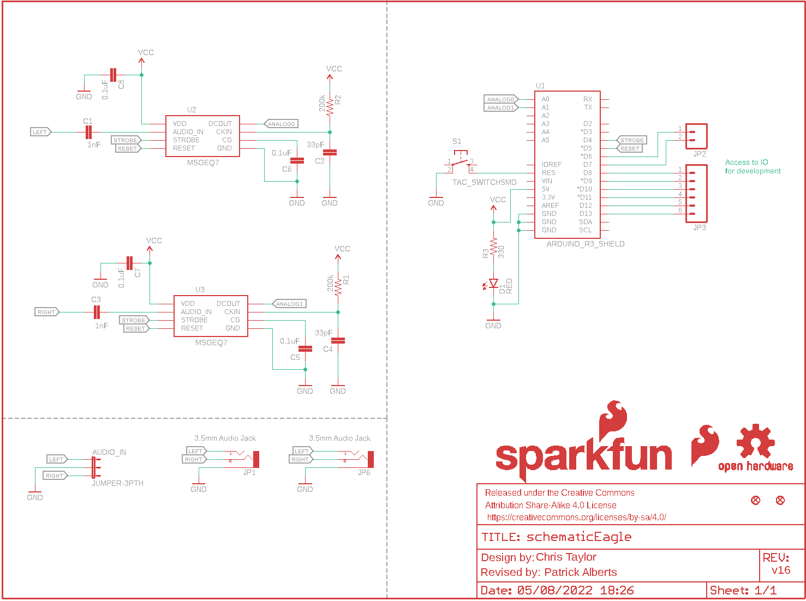
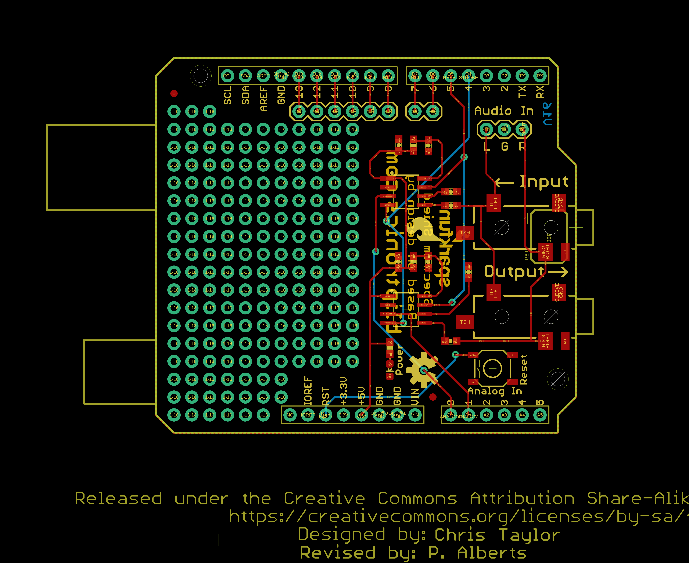

Contents
========

* [PRS13116 > Spectrum Shield](#prs13116--spectrum-shield)
	* [Schematic](#schematic)
	* [PCB](#pcb)
	* [Interactive BOM](#interactive-bom)
	* [OOMP Parts](#oomp-parts)
	* [Images](#images)
	* [Tags](#tags)
  
![][im]
# PRS13116 > Spectrum Shield

- ID: PROJ-SPAR-13116-STAN-01
- Hex ID: PRS13116
- Name: Sparkfun
- Description: Sparkfun
- Long Link: [http://oom.lt/PROJ-SPAR-13116-STAN-01](http://oom.lt/PROJ-SPAR-13116-STAN-01)
- Short Link: [http://oom.lt/PRS13116](http://oom.lt/PRS13116)

## Schematic
  

## PCB
  

## Interactive BOM

- Interactive BOM page: [ibom.html](https://htmlpreview.github.io/?https://github.com/oomlout/oomlout_OOMP_projects/blob/main/PROJ-SPAR-13116-STAN-01/kicad/bom/ibom.html)

## OOMP Parts
  

|OOMP Parts|
| :---: |
|AUDIO_IN AUDIO_IN,UNMATCHED-UNMATCHED-X-UNMATCHED-01|
|C1 C1,CAPC-0603-X-NF1-01|
|C2 C2,CAPC-0603-X-PF33-01|
|C3 C3,CAPC-0603-X-NF1-01|
|C4 C4,CAPC-0603-X-PF33-01|
|C5 C5,CAPC-0603-X-UF1D-01|
|C6 C6,CAPC-0603-X-UF1D-01|
|C7 C7,CAPC-0603-X-UF1D-01|
|C8 C8,CAPC-0603-X-UF1D-01|
|[D1 LEDS-0603-G-STAN-01 SMD (0603) Green LED](https://github.com/oomlout/oomlout_OOMP_parts/tree/main/LEDS-0603-G-STAN-01/)|
|JP1 JP1,UNMATCHED-UNMATCHED-X-UNMATCHED-01|
|[JP2 HEAD-I01-X-PI02-01 2.54 mm 2 Pin Header](https://github.com/oomlout/oomlout_OOMP_parts/tree/main/HEAD-I01-X-PI02-01/)|
|[JP3 HEAD-I01-X-PI06-01 2.54 mm 6 Pin Header](https://github.com/oomlout/oomlout_OOMP_parts/tree/main/HEAD-I01-X-PI06-01/)|
|JP6 JP6,UNMATCHED-UNMATCHED-X-UNMATCHED-01|
|R1 R1,RESE-0603-X-O2003-01|
|R2 R2,RESE-0603-X-O2003-01|
|[R3 RESE-0603-X-O331-01 SMD (0603) 330 Ohm Resistor](https://github.com/oomlout/oomlout_OOMP_parts/tree/main/RESE-0603-X-O331-01/)|
|S1 S1,UNMATCHED-UNMATCHED-X-UNMATCHED-01|
|U1 U1,UNMATCHED-UNMATCHED-X-UNMATCHED-01|
|U2 U2,UNMATCHED-UNMATCHED-X-UNMATCHED-01|
|U3 U3,UNMATCHED-UNMATCHED-X-UNMATCHED-01|

## Images
  
  

|kicadPcb3d|kicadPcb3dFront|kicadPcb3dBack|eagleImage|eagleSchemImage|
| :---: | :---: | :---: | :---: | :---: |
||||||

## Tags

- hexID: PRS13116
- oompType: PROJ
- oompSize: SPAR
- oompColor: 13116
- oompDesc: STAN
- oompIndex: 01
- oompName: Spectrum Shield
- sources: All source files from https://github.com/sparkfun/Spectrum_Shield (source licence details in srcLicense.md)
- linkBuyPage: https://www.sparkfun.com/products/13116
- oompID: PROJ-SPAR-13116-STAN-01
- oompParts: AUDIO_IN,UNMATCHED-UNMATCHED-X-UNMATCHED-01
- oompParts: C1,CAPC-0603-X-NF1-01
- oompParts: C2,CAPC-0603-X-PF33-01
- oompParts: C3,CAPC-0603-X-NF1-01
- oompParts: C4,CAPC-0603-X-PF33-01
- oompParts: C5,CAPC-0603-X-UF1D-01
- oompParts: C6,CAPC-0603-X-UF1D-01
- oompParts: C7,CAPC-0603-X-UF1D-01
- oompParts: C8,CAPC-0603-X-UF1D-01
- oompParts: D1,LEDS-0603-G-STAN-01
- oompParts: JP1,UNMATCHED-UNMATCHED-X-UNMATCHED-01
- oompParts: JP2,HEAD-I01-X-PI02-01
- oompParts: JP3,HEAD-I01-X-PI06-01
- oompParts: JP6,UNMATCHED-UNMATCHED-X-UNMATCHED-01
- oompParts: R1,RESE-0603-X-O2003-01
- oompParts: R2,RESE-0603-X-O2003-01
- oompParts: R3,RESE-0603-X-O331-01
- oompParts: S1,UNMATCHED-UNMATCHED-X-UNMATCHED-01
- oompParts: U1,UNMATCHED-UNMATCHED-X-UNMATCHED-01
- oompParts: U2,UNMATCHED-UNMATCHED-X-UNMATCHED-01
- oompParts: U3,UNMATCHED-UNMATCHED-X-UNMATCHED-01
- rawParts: AUDIO_IN,JUMPER-3PTH,JUMPER-3PTH,1X03,,,,
- rawParts: C1,1nF,1NF/1000PF-50V-10%(0603),0603-CAP,CAP-07886,CAP-07886,1nF,
- rawParts: C2,33pF,33PF-50V-5%-(0603),0603-CAP,CAP-10142,CAP-10142,33pF,
- rawParts: C3,1nF,1NF/1000PF-50V-10%(0603),0603-CAP,CAP-07886,CAP-07886,1nF,
- rawParts: C4,33pF,33PF-50V-5%-(0603),0603-CAP,CAP-10142,CAP-10142,33pF,
- rawParts: C5,0.1uF,0.1UF-25V(+80/-20%)(0603),0603-CAP,CAP-00810,CAP-00810,0.1uF,
- rawParts: C6,0.1uF,0.1UF-25V(+80/-20%)(0603),0603-CAP,CAP-00810,CAP-00810,0.1uF,
- rawParts: C7,0.1uF,0.1UF-25V(+80/-20%)(0603),0603-CAP,CAP-00810,CAP-00810,0.1uF,
- rawParts: C8,0.1uF,0.1UF-25V(+80/-20%)(0603),0603-CAP,CAP-00810,CAP-00810,0.1uF,
- rawParts: D1,RED,LED-RED0603,LED-0603,Assorted Red LEDs,DIO-00819,RED,
- rawParts: FRAME1,FRAME-LETTER,FRAME-LETTER,CREATIVE_COMMONS,Schematic Frame,,,
- rawParts: JP1,3.5mm Audio Jack,AUDIO-JACKSMD2,AUDIO-JACK-3.5MM-SMD,3.5mm Audio Jack,CONN-10353,,
- rawParts: JP2,,M02PTH,1X02,Header 2,,,
- rawParts: JP3,,M06SIP,1X06,Header 6,,,
- rawParts: JP4,FIDUCIAL1X2,FIDUCIAL1X2,FIDUCIAL-1X2,Fiducial Alignment Points,,,
- rawParts: JP5,FIDUCIAL1X2,FIDUCIAL1X2,FIDUCIAL-1X2,Fiducial Alignment Points,,,
- rawParts: JP6,3.5mm Audio Jack,AUDIO-JACKSMD2,AUDIO-JACK-3.5MM-SMD,3.5mm Audio Jack,CONN-10353,,
- rawParts: LOGO1,OSHW-LOGOM,OSHW-LOGOM,OSHW-LOGO-M,Open Source Hardware Logo,,,
- rawParts: LOGO2,SFE_LOGO_FLAME.2_INCH,SFE_LOGO_FLAME.2_INCH,SFE_LOGO_FLAME_.2,SFE Logo, flame only,,,
- rawParts: LOGO3,SFE_LOGO_NAME_FLAME.1_INCH,SFE_LOGO_NAME_FLAME.1_INCH,SFE_LOGO_NAME_FLAME_.1,SFE Logo, name and flame,,,
- rawParts: R1,200k,200KOHM1/10W1%(0603)200K,0603-RES,RES-09385,RES-09385,200k,
- rawParts: R2,200k,220KOHM1/10W1%(0603),0603-RES,RES-08969,RES-08969,220k,
- rawParts: R3,330,330OHM1/10W1%(0603),0603-RES,RES-00818,RES-00818,330,
- rawParts: S1,TAC_SWITCHSMD,TAC_SWITCHSMD,TACTILE-SWITCH-SMD,Momentary Switch,SWCH-08247,TAC_SWITCHSMD,
- rawParts: U1,ARDUINO_R3_SHIELD,ARDUINO_R3_SHIELD,UNO_R3_SHIELD,Shield form compatible with the Arduino Uno R3.,,,
- rawParts: U2,MSGEQ7SOIC,MSGEQ7SOIC,SOIC8,7-band graphic equalizer,IC-10141,,
- rawParts: U3,MSGEQ7SOIC,MSGEQ7SOIC,SOIC8,7-band graphic equalizer,IC-10141,,

[im]: kicadPcb3d_450.png
