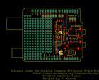
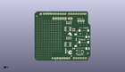
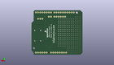
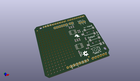

Contents
========

* [PROJ-SPAR-13116-STAN-01>Spectrum Shield](#proj-spar-13116-stan-01spectrum-shield)
	* [Images](#images)
	* [Interactive BOM](#interactive-bom)
	* [OOMP Parts](#oomp-parts)
	* [Tags](#tags)
  
![][im]
# PROJ-SPAR-13116-STAN-01>Spectrum Shield

- ID: PROJ-SPAR-13116-STAN-01
- Hex ID: PRS13116
- Name: Spectrum Shield
- Description: 

## Images
  
  

|eagleImage|kicadPcb3dFront|kicadPcb3dBack|kicadPcb3d|
| :---: | :---: | :---: | :---: |
|||||

## Interactive BOM

- Interactive BOM page: [ibom.html](kicad/bom/ibom.html)

## OOMP Parts
  

|OOMP Parts|
| :---: |
|UNMATCHED-UNMATCHED-X-UNMATCHED-01, AUDIO_IN, 46.99, 43.18, 0,AUDIO_IN, JUMPER-3PTH, 1X03, SparkFun, (1.85, 1.7), R0|
|CAPE-0603-X-UNMATCHED-01, C1, 41.9354, 32.3088, 180,C1, 1nF, 0603-CAP, SparkFun-Capacitors, (1.651, 1.272), R180|
|CAPE-0603-X-UNMATCHED-01, C2, 38.724840508, 40.87368127, 90,C2, 33pF, 0603-CAP, SparkFun-Capacitors, (1.52460002, 1.60920005), R90|
|CAPE-0603-X-UNMATCHED-01, C3, 41.8846, 13.0556, 180,C3, 1nF, 0603-CAP, SparkFun-Capacitors, (1.649, 0.514), R180|
|CAPE-0603-X-UNMATCHED-01, C4, 38.7096, 24.333199999999998, 90,C4, 33pF, 0603-CAP, SparkFun-Capacitors, (1.524, 0.958), R90|
|CAPE-0603-X-NF100-01, C5, 44.449999999999996, 22.86, 270,C5, 0.1uF, 0603-CAP, SparkFun-Capacitors, (1.75, 0.9), R270|
|CAPE-0603-X-NF100-01, C6, 41.91, 34.29, 180,C6, 0.1uF, 0603-CAP, SparkFun-Capacitors, (1.65, 1.35), R180|
|CAPE-0603-X-NF100-01, C7, 34.4932, 24.333199999999998, 90,C7, 0.1uF, 0603-CAP, SparkFun-Capacitors, (1.358, 0.958), R90|
|CAPE-0603-X-NF100-01, C8, 34.516059492, 40.9067, 90,C8, 0.1uF, 0603-CAP, SparkFun-Capacitors, (1.35889998, 1.6105), R90|
|UNMATCHED-0603-X-UNMATCHED-01, D1, 33.248599999999996, 8.915399999999998, 180,D1, RED, LED-0603, SparkFun-LED, (1.309, 0.351), R180|
|ERROR, JP1 3.5mm Audio, 0, 0, 0,JP1, 3.5mm, Audio, Jack, AUDIO-JACK-3.5MM-SMD, SparkFun-Connectors, (2.35, 1.15), R180|
|UNMATCHED-UNMATCHED-X-UNMATCHED-01, JP2, 39.37, 45.72, 180,JP2, 1X02, SparkFun, (1.55, 1.8), R180|
|UNMATCHED-UNMATCHED-X-UNMATCHED-01, JP3, 33.019999999999996, 45.72, 180,JP3, 1X06, SparkFun, (1.3, 1.8), R180|
|UNMATCHED-UNMATCHED-X-UNMATCHED-01, JP4, 39.37, 5.08, 0,JP4, FIDUCIAL1X2, FIDUCIAL-1X2, SparkFun, (1.55, 0.2), R0|
|UNMATCHED-UNMATCHED-X-UNMATCHED-01, JP5, 2.54, 48.26, 0,JP5, FIDUCIAL1X2, FIDUCIAL-1X2, SparkFun, (0.1, 1.9), R0|
|ERROR, JP6 3.5mm Audio, 0, 0, 0,JP6, 3.5mm, Audio, Jack, AUDIO-JACK-3.5MM-SMD, SparkFun-Connectors, (2.35, 0.65), R180|
|<table><tr><td></td><td> R1</td><td>[RESE-0603-X-O204-01 SMD (0603) 200k Ohm Resistor](https://github.com/oomlout/oomlout_OOMP_parts/tree/main/RESE-0603-X-O204-01/)</td><td>[R6204](https://github.com/oomlout/oomlout_OOMP_parts/tree/main/RESE-0603-X-O204-01/)</td></tr></table>|
|<table><tr><td></td><td> R2</td><td>[RESE-0603-X-O204-01 SMD (0603) 200k Ohm Resistor](https://github.com/oomlout/oomlout_OOMP_parts/tree/main/RESE-0603-X-O204-01/)</td><td>[R6204](https://github.com/oomlout/oomlout_OOMP_parts/tree/main/RESE-0603-X-O204-01/)</td></tr></table>|
|<table><tr><td></td><td> R3</td><td>[RESE-0603-X-O331-01 SMD (0603) 330 Ohm Resistor](https://github.com/oomlout/oomlout_OOMP_parts/tree/main/RESE-0603-X-O331-01/)</td><td>[R6331](https://github.com/oomlout/oomlout_OOMP_parts/tree/main/RESE-0603-X-O331-01/)</td></tr></table>|
|UNMATCHED-UNMATCHED-X-UNMATCHED-01, S1, 47.879, 9.143999999999998, 180,S1, TAC_SWITCHSMD, TACTILE-SWITCH-SMD, SparkFun-Retired, (1.885, 0.36), R180|
|UNMATCHED-UNMATCHED-X-UNMATCHED-01, U1, 0.0, 53.339999999999996, 270,U1, ARDUINO_R3_SHIELD, UNO_R3_SHIELD, SparkFun-Boards, (0, 2.1), R270|
|UNMATCHED-UNMATCHED-X-UNMATCHED-01, U2, 35.559999999999995, 34.29, 270,U2, MSGEQ7SOIC, SOIC8, SparkFun-AnalogIC, (1.4, 1.35), R270|
|UNMATCHED-UNMATCHED-X-UNMATCHED-01, U3, 35.559999999999995, 17.525999999999996, 270,U3, MSGEQ7SOIC, SOIC8, SparkFun-AnalogIC, (1.4, 0.69), R270|

## Tags

- hexID: PRS13116
- oompType: PROJ
- oompSize: SPAR
- oompColor: 13116
- oompDesc: STAN
- oompIndex: 01
- oompName: Spectrum Shield
- sources: All source files from https://github.com/sparkfun/Spectrum_Shield (source licence details in srcLicense.md)
- linkBuyPage: https://www.sparkfun.com/products/13116
- oompPart: UNMATCHED-UNMATCHED-X-UNMATCHED-01, AUDIO_IN, 46.99, 43.18, 0
- oompPart: CAPE-0603-X-UNMATCHED-01, C1, 41.9354, 32.3088, 180
- oompPart: CAPE-0603-X-UNMATCHED-01, C2, 38.724840508, 40.87368127, 90
- oompPart: CAPE-0603-X-UNMATCHED-01, C3, 41.8846, 13.0556, 180
- oompPart: CAPE-0603-X-UNMATCHED-01, C4, 38.7096, 24.333199999999998, 90
- oompPart: CAPE-0603-X-NF100-01, C5, 44.449999999999996, 22.86, 270
- oompPart: CAPE-0603-X-NF100-01, C6, 41.91, 34.29, 180
- oompPart: CAPE-0603-X-NF100-01, C7, 34.4932, 24.333199999999998, 90
- oompPart: CAPE-0603-X-NF100-01, C8, 34.516059492, 40.9067, 90
- oompPart: UNMATCHED-0603-X-UNMATCHED-01, D1, 33.248599999999996, 8.915399999999998, 180
- oompPart: ERROR, JP1 3.5mm Audio, 0, 0, 0
- oompPart: UNMATCHED-UNMATCHED-X-UNMATCHED-01, JP2, 39.37, 45.72, 180
- oompPart: UNMATCHED-UNMATCHED-X-UNMATCHED-01, JP3, 33.019999999999996, 45.72, 180
- oompPart: UNMATCHED-UNMATCHED-X-UNMATCHED-01, JP4, 39.37, 5.08, 0
- oompPart: UNMATCHED-UNMATCHED-X-UNMATCHED-01, JP5, 2.54, 48.26, 0
- oompPart: ERROR, JP6 3.5mm Audio, 0, 0, 0
- oompPart: RESE-0603-X-O204-01, R1, 36.6014, 24.333199999999998, 90
- oompPart: RESE-0603-X-O204-01, R2, 36.57599999999999, 40.894, 90
- oompPart: RESE-0603-X-O331-01, R3, 33.248599999999996, 12.090399999999999, 90
- oompPart: UNMATCHED-UNMATCHED-X-UNMATCHED-01, S1, 47.879, 9.143999999999998, 180
- oompPart: UNMATCHED-UNMATCHED-X-UNMATCHED-01, U1, 0.0, 53.339999999999996, 270
- oompPart: UNMATCHED-UNMATCHED-X-UNMATCHED-01, U2, 35.559999999999995, 34.29, 270
- oompPart: UNMATCHED-UNMATCHED-X-UNMATCHED-01, U3, 35.559999999999995, 17.525999999999996, 270
- rawPart: AUDIO_IN, JUMPER-3PTH, 1X03, SparkFun, (1.85, 1.7), R0
- rawPart: C1, 1nF, 0603-CAP, SparkFun-Capacitors, (1.651, 1.272), R180
- rawPart: C2, 33pF, 0603-CAP, SparkFun-Capacitors, (1.52460002, 1.60920005), R90
- rawPart: C3, 1nF, 0603-CAP, SparkFun-Capacitors, (1.649, 0.514), R180
- rawPart: C4, 33pF, 0603-CAP, SparkFun-Capacitors, (1.524, 0.958), R90
- rawPart: C5, 0.1uF, 0603-CAP, SparkFun-Capacitors, (1.75, 0.9), R270
- rawPart: C6, 0.1uF, 0603-CAP, SparkFun-Capacitors, (1.65, 1.35), R180
- rawPart: C7, 0.1uF, 0603-CAP, SparkFun-Capacitors, (1.358, 0.958), R90
- rawPart: C8, 0.1uF, 0603-CAP, SparkFun-Capacitors, (1.35889998, 1.6105), R90
- rawPart: D1, RED, LED-0603, SparkFun-LED, (1.309, 0.351), R180
- rawPart: JP1, 3.5mm, Audio, Jack, AUDIO-JACK-3.5MM-SMD, SparkFun-Connectors, (2.35, 1.15), R180
- rawPart: JP2, 1X02, SparkFun, (1.55, 1.8), R180
- rawPart: JP3, 1X06, SparkFun, (1.3, 1.8), R180
- rawPart: JP4, FIDUCIAL1X2, FIDUCIAL-1X2, SparkFun, (1.55, 0.2), R0
- rawPart: JP5, FIDUCIAL1X2, FIDUCIAL-1X2, SparkFun, (0.1, 1.9), R0
- rawPart: JP6, 3.5mm, Audio, Jack, AUDIO-JACK-3.5MM-SMD, SparkFun-Connectors, (2.35, 0.65), R180
- rawPart: R1, 200k, 0603-RES, SparkFun-Resistors, (1.441, 0.958), R90
- rawPart: R2, 200k, 0603-RES, SparkFun-Resistors, (1.44, 1.61), R90
- rawPart: R3, 330, 0603-RES, SparkFun-Resistors, (1.309, 0.476), R90
- rawPart: S1, TAC_SWITCHSMD, TACTILE-SWITCH-SMD, SparkFun-Retired, (1.885, 0.36), R180
- rawPart: U1, ARDUINO_R3_SHIELD, UNO_R3_SHIELD, SparkFun-Boards, (0, 2.1), R270
- rawPart: U2, MSGEQ7SOIC, SOIC8, SparkFun-AnalogIC, (1.4, 1.35), R270
- rawPart: U3, MSGEQ7SOIC, SOIC8, SparkFun-AnalogIC, (1.4, 0.69), R270

[im]: kicadPcb3d_450.png
