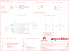

Contents
========

* [PRS13118 > Servo Trigger](#prs13118--servo-trigger)
	* [Schematic](#schematic)
	* [PCB](#pcb)
	* [Interactive BOM](#interactive-bom)
	* [OOMP Parts](#oomp-parts)
	* [Images](#images)
	* [Tags](#tags)
  
![][im]
# PRS13118 > Servo Trigger

- ID: PROJ-SPAR-13118-STAN-01
- Hex ID: PRS13118
- Name: Sparkfun
- Description: Sparkfun
- Long Link: [http://oom.lt/PROJ-SPAR-13118-STAN-01](http://oom.lt/PROJ-SPAR-13118-STAN-01)
- Short Link: [http://oom.lt/PRS13118](http://oom.lt/PRS13118)

## Schematic
  

## PCB
  

## Interactive BOM

- Interactive BOM page: [ibom.html](https://htmlpreview.github.io/?https://github.com/oomlout/oomlout_OOMP_projects/blob/main/PROJ-SPAR-13118-STAN-01/kicad/bom/ibom.html)

## OOMP Parts
  

|OOMP ID|Name|Identifier|
| :---: | :---: | :---: |
|[CAPT-3216-X-UF10-V10](https://github.com/oomlout/oomlout_OOMP_parts/tree/main/CAPT-3216-X-UF10-V10/)|[SMD (3216) 10 uF Capacitor (Tantalum) 10v](https://github.com/oomlout/oomlout_OOMP_parts/tree/main/CAPT-3216-X-UF10-V10/)|[C1](https://github.com/oomlout/oomlout_OOMP_parts/tree/main/CAPT-3216-X-UF10-V10/)|
|[CAPC-0603-X-NF100-V50](https://github.com/oomlout/oomlout_OOMP_parts/tree/main/CAPC-0603-X-NF100-V50/)|[SMD (0603) 100 nF Capacitor (Ceramic) 50v](https://github.com/oomlout/oomlout_OOMP_parts/tree/main/CAPC-0603-X-NF100-V50/)|[C5](https://github.com/oomlout/oomlout_OOMP_parts/tree/main/CAPC-0603-X-NF100-V50/)|
|UNMATCHED-UNMATCHED-X-UNMATCHED-01||FRAME1, JP9, Y1|
|[HEAD-I01-X-PI02-01](https://github.com/oomlout/oomlout_OOMP_parts/tree/main/HEAD-I01-X-PI02-01/)|[2.54 mm 2 Pin Header](https://github.com/oomlout/oomlout_OOMP_parts/tree/main/HEAD-I01-X-PI02-01/)|[JP1, JP3, JP4](https://github.com/oomlout/oomlout_OOMP_parts/tree/main/HEAD-I01-X-PI02-01/)|
|[HEAD-I01-X-PI03-01](https://github.com/oomlout/oomlout_OOMP_parts/tree/main/HEAD-I01-X-PI03-01/)|[2.54 mm 3 Pin Header](https://github.com/oomlout/oomlout_OOMP_parts/tree/main/HEAD-I01-X-PI03-01/)|[JP2](https://github.com/oomlout/oomlout_OOMP_parts/tree/main/HEAD-I01-X-PI03-01/)|
|RESE-UNMATCHED-X-O103-01||R1, R2, R3|
|[RESE-0603-X-O103-01](https://github.com/oomlout/oomlout_OOMP_parts/tree/main/RESE-0603-X-O103-01/)|[SMD (0603) 10k Ohm Resistor](https://github.com/oomlout/oomlout_OOMP_parts/tree/main/RESE-0603-X-O103-01/)|[R4, R5, R6](https://github.com/oomlout/oomlout_OOMP_parts/tree/main/RESE-0603-X-O103-01/)|
|[HEAD-JSTSH-X-PI04-RS](https://github.com/oomlout/oomlout_OOMP_parts/tree/main/HEAD-JSTSH-X-PI04-RS/)|[JST XH (1 mm) 4 Pin Header Right Angle (SMD)](https://github.com/oomlout/oomlout_OOMP_parts/tree/main/HEAD-JSTSH-X-PI04-RS/)|[U1](https://github.com/oomlout/oomlout_OOMP_parts/tree/main/HEAD-JSTSH-X-PI04-RS/)|

## Images
  
  

|bominteractivefront|bominteractiveback|kicadPcb3d|kicadPcb3dFront|kicadPcb3dBack|kicadSchem|eagleImage|eagleSchemImage|pcbdraw|pcbdrawback|
| :---: | :---: | :---: | :---: | :---: | :---: | :---: | :---: | :---: | :---: |
|||||||||||

## Tags

- hexID: PRS13118
- oompType: PROJ
- oompSize: SPAR
- oompColor: 13118
- oompDesc: STAN
- oompIndex: 01
- oompName: Servo Trigger
- sources: All source files from https://github.com/sparkfun/Servo_Trigger (source licence details in srcLicense.md)
- linkBuyPage: https://www.sparkfun.com/products/13118
- oompID: PROJ-SPAR-13118-STAN-01
- oompParts: C1,CAPT-3216-X-UF10-V10
- oompParts: C5,CAPC-0603-X-NF100-V50
- oompParts: FRAME1,UNMATCHED-UNMATCHED-X-UNMATCHED-01
- oompParts: JP1,HEAD-I01-X-PI02-01
- oompParts: JP2,HEAD-I01-X-PI03-01
- oompParts: JP3,HEAD-I01-X-PI02-01
- oompParts: JP4,HEAD-I01-X-PI02-01
- oompParts: JP9,UNMATCHED-UNMATCHED-X-UNMATCHED-01
- oompParts: R1,RESE-UNMATCHED-X-O103-01
- oompParts: R2,RESE-UNMATCHED-X-O103-01
- oompParts: R3,RESE-UNMATCHED-X-O103-01
- oompParts: R4,RESE-0603-X-O103-01
- oompParts: R5,RESE-0603-X-O103-01
- oompParts: R6,RESE-0603-X-O103-01
- oompParts: U1,HEAD-JSTSH-X-PI04-RS
- oompParts: Y1,UNMATCHED-UNMATCHED-X-UNMATCHED-01
- rawParts: C1,10uF,10UF-16V-10%(TANT),EIA3216,CAP-00811,,CAP-00811,10uF,,
- rawParts: C5,0.1uF,0.1UF-25V(+80/-20%)(0603),0603-CAP,CAP-00810,,CAP-00810,0.1uF,,
- rawParts: FID1,FIDUCIAL1X2,FIDUCIAL1X2,FIDUCIAL-1X2,Fiducial Alignment Points,,,,,
- rawParts: FID2,FIDUCIAL1X2,FIDUCIAL1X2,FIDUCIAL-1X2,Fiducial Alignment Points,,,,,
- rawParts: FRAME1,,FRAME-LETTER,CREATIVE_COMMONS,Schematic Frame,Byron Jacquot,,,V10,
- rawParts: JP1,M021X02_NO_SILK,M021X02_NO_SILK,1X02_NO_SILK,Standard 2-pin 0.1 header. Use with,,,,,
- rawParts: JP2,SERVO-OUT,M031X03_NO_SILK,1X03_NO_SILK,Header 3,,,,,
- rawParts: JP3,M021X02_NO_SILK,M021X02_NO_SILK,1X02_NO_SILK,Standard 2-pin 0.1 header. Use with,,,,,
- rawParts: JP4,M021X02_NO_SILK,M021X02_NO_SILK,1X02_NO_SILK,Standard 2-pin 0.1 header. Use with,,,,,
- rawParts: JP9,,AVR_SPI_PRG_6PTH,2X3,AVR ISP 6 Pin,,,,,
- rawParts: LOGO1,OSHW-LOGOM,OSHW-LOGOM,OSHW-LOGO-M,Open Source Hardware Logo This logo indicates the piece of hardware it is found on incorporates a OSHW license and/or adheres to the definition of open source hardware found here: http://freedomdefined.org/OSHW,,,,,
- rawParts: LOGO2,SFE_LOGO_NAME.2_INCH,SFE_LOGO_NAME.2_INCH,SFE_LOGO_NAME_.2,SFE Logo, name only,,,,,
- rawParts: LOGO3,SFE_LOGO_FLAME.2_INCH,SFE_LOGO_FLAME.2_INCH,SFE_LOGO_FLAME_.2,SFE Logo, flame only,,,,,
- rawParts: R1,10k,TRIMPOTRES-11156,TRIMPOT_5MM,Various small potentiometers for set-and-forget applications,,RES-11156,,,
- rawParts: R2,10k,TRIMPOTRES-11156,TRIMPOT_5MM,Various small potentiometers for set-and-forget applications,,RES-11156,,,
- rawParts: R3,10k,TRIMPOTRES-11156,TRIMPOT_5MM,Various small potentiometers for set-and-forget applications,,RES-11156,,,
- rawParts: R4,10K,10KOHM-1/10W-1%(0603)0603,0603-RES,RES-00824,,RES-00824,10K,,
- rawParts: R5,10K,10KOHM-1/10W-1%(0603)0603,0603-RES,RES-00824,,RES-00824,10K,,
- rawParts: R6,10K,10KOHM-1/10W-1%(0603)0603,0603-RES,RES-00824,,RES-00824,10K,,
- rawParts: SJ1,N.O.,JUMPER-PAD-2-NOYES_SILK,PAD-JUMPER-2-NO_YES_SILK,,,,,,
- rawParts: SJ2,N.O.,JUMPER-PAD-2-NOYES_SILK,PAD-JUMPER-2-NO_YES_SILK,,,,,,
- rawParts: STANDOFF1,STAND-OFF,STAND-OFF,STAND-OFF,#4 Stand Off,,,,,
- rawParts: STANDOFF2,STAND-OFF,STAND-OFF,STAND-OFF,#4 Stand Off,,,,,
- rawParts: STANDOFF3,STAND-OFF,STAND-OFF,STAND-OFF,#4 Stand Off,,,,,
- rawParts: STANDOFF4,STAND-OFF,STAND-OFF,STAND-OFF,#4 Stand Off,,,,,
- rawParts: TP1,TEST-POINT3X4,TEST-POINT3X4,PAD.03X.04,Bare copper test points for troubleshooting or ICT,,,,,
- rawParts: TP2,TEST-POINT3X4,TEST-POINT3X4,PAD.03X.04,Bare copper test points for troubleshooting or ICT,,,,,
- rawParts: TP3,TEST-POINT3X4,TEST-POINT3X4,PAD.03X.04,Bare copper test points for troubleshooting or ICT,,,,,
- rawParts: U1,ATTINY84,ATTINY84,SO14,Atmel 14-pin 2/4/8kB flash uC,,IC-11285,,,
- rawParts: Y1,16MHZ,RESONATOR16MHZ,RESONATOR-SMD,Resonator,,XTAL-08900,16MHZ,,

[im]: kicadPcb3d_450.png
