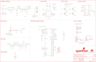

Contents
========

* [PRS13120 > MG2639 Cellular Shield](#prs13120--mg2639-cellular-shield)
	* [Schematic](#schematic)
	* [PCB](#pcb)
	* [Interactive BOM](#interactive-bom)
	* [OOMP Parts](#oomp-parts)
	* [Images](#images)
	* [Tags](#tags)
  
![][im]
# PRS13120 > MG2639 Cellular Shield

- ID: PROJ-SPAR-13120-STAN-01
- Hex ID: PRS13120
- Name: Sparkfun
- Description: Sparkfun
- Long Link: [http://oom.lt/PROJ-SPAR-13120-STAN-01](http://oom.lt/PROJ-SPAR-13120-STAN-01)
- Short Link: [http://oom.lt/PRS13120](http://oom.lt/PRS13120)

## Schematic
  

## PCB
  

## Interactive BOM

- Interactive BOM page: [ibom.html](https://htmlpreview.github.io/?https://github.com/oomlout/oomlout_OOMP_projects/blob/main/PROJ-SPAR-13120-STAN-01/kicad/bom/ibom.html)

## OOMP Parts
  

|OOMP ID|Name|Identifier|
| :---: | :---: | :---: |
|UNMATCHED-UNMATCHED-X-UNMATCHED-01||BAT1, JP3, JP4, S1, S2, TP1, TP2, TP3, U1, U2, U3|
|CAPX-UNMATCHED-X-UF10-01||C1, C9|
|CAPC-0603-X-PF33-01||C2, C3, C7|
|CAPC-0603-X-UNMATCHED-01||C4|
|[CAPC-0603-X-NF100-V50](https://github.com/oomlout/oomlout_OOMP_parts/tree/main/CAPC-0603-X-NF100-V50/)|[SMD (0603) 100 nF Capacitor (Ceramic) 50v](https://github.com/oomlout/oomlout_OOMP_parts/tree/main/CAPC-0603-X-NF100-V50/)|[C5, C8, C10, C11](https://github.com/oomlout/oomlout_OOMP_parts/tree/main/CAPC-0603-X-NF100-V50/)|
|CAPX-7343-X-UF100-01||C6|
|LEDS-1206-R-STAN-01||D1|
|LEDS-1206-Y-STAN-01||D2|
|LEDS-1206-G-STAN-01||D3|
|[HEAD-I01-X-PI02-01](https://github.com/oomlout/oomlout_OOMP_parts/tree/main/HEAD-I01-X-PI02-01/)|[2.54 mm 2 Pin Header](https://github.com/oomlout/oomlout_OOMP_parts/tree/main/HEAD-I01-X-PI02-01/)|[JP2, JP7](https://github.com/oomlout/oomlout_OOMP_parts/tree/main/HEAD-I01-X-PI02-01/)|
|[HEAD-I01-X-PI07-01](https://github.com/oomlout/oomlout_OOMP_parts/tree/main/HEAD-I01-X-PI07-01/)|[2.54 mm 7 Pin Header](https://github.com/oomlout/oomlout_OOMP_parts/tree/main/HEAD-I01-X-PI07-01/)|[JP5](https://github.com/oomlout/oomlout_OOMP_parts/tree/main/HEAD-I01-X-PI07-01/)|
|[HEAD-I01-X-PI05-01](https://github.com/oomlout/oomlout_OOMP_parts/tree/main/HEAD-I01-X-PI05-01/)|[2.54 mm 5 Pin Header](https://github.com/oomlout/oomlout_OOMP_parts/tree/main/HEAD-I01-X-PI05-01/)|[JP6, JP9](https://github.com/oomlout/oomlout_OOMP_parts/tree/main/HEAD-I01-X-PI05-01/)|
|HEAD-I01-X-UNMATCHED-01||JP8|
|UNMATCHED-SO23-X-UNMATCHED-01||Q1|
|[RESE-0603-X-O103-01](https://github.com/oomlout/oomlout_OOMP_parts/tree/main/RESE-0603-X-O103-01/)|[SMD (0603) 10k Ohm Resistor](https://github.com/oomlout/oomlout_OOMP_parts/tree/main/RESE-0603-X-O103-01/)|[R1, R6](https://github.com/oomlout/oomlout_OOMP_parts/tree/main/RESE-0603-X-O103-01/)|
|[RESE-0603-X-O102-01](https://github.com/oomlout/oomlout_OOMP_parts/tree/main/RESE-0603-X-O102-01/)|[SMD (0603) 1k Ohm Resistor](https://github.com/oomlout/oomlout_OOMP_parts/tree/main/RESE-0603-X-O102-01/)|[R2, R5, R7, R8, R9](https://github.com/oomlout/oomlout_OOMP_parts/tree/main/RESE-0603-X-O102-01/)|
|[RESE-0603-X-O472-01](https://github.com/oomlout/oomlout_OOMP_parts/tree/main/RESE-0603-X-O472-01/)|[SMD (0603) 4.7k Ohm Resistor](https://github.com/oomlout/oomlout_OOMP_parts/tree/main/RESE-0603-X-O472-01/)|[R3](https://github.com/oomlout/oomlout_OOMP_parts/tree/main/RESE-0603-X-O472-01/)|
|[RESE-0603-X-O222-01](https://github.com/oomlout/oomlout_OOMP_parts/tree/main/RESE-0603-X-O222-01/)|[SMD (0603) 2.2k Ohm Resistor](https://github.com/oomlout/oomlout_OOMP_parts/tree/main/RESE-0603-X-O222-01/)|[R4](https://github.com/oomlout/oomlout_OOMP_parts/tree/main/RESE-0603-X-O222-01/)|
|[RESE-0603-X-O220-01](https://github.com/oomlout/oomlout_OOMP_parts/tree/main/RESE-0603-X-O220-01/)|[SMD (0603) 22 Ohm Resistor](https://github.com/oomlout/oomlout_OOMP_parts/tree/main/RESE-0603-X-O220-01/)|[R10, R11](https://github.com/oomlout/oomlout_OOMP_parts/tree/main/RESE-0603-X-O220-01/)|

## Images
  
  

|bominteractivefront|bominteractiveback|kicadPcb3d|kicadPcb3dFront|kicadPcb3dBack|kicadSchem|eagleImage|eagleSchemImage|pcbdraw|pcbdrawback|
| :---: | :---: | :---: | :---: | :---: | :---: | :---: | :---: | :---: | :---: |
|||||||||||

## Tags

- hexID: PRS13120
- oompType: PROJ
- oompSize: SPAR
- oompColor: 13120
- oompDesc: STAN
- oompIndex: 01
- oompName: MG2639 Cellular Shield
- sources: All source files from https://github.com/sparkfun/MG2639_Cellular_Shield (source licence details in srcLicense.md)
- linkBuyPage: https://www.sparkfun.com/products/13120
- oompID: PROJ-SPAR-13120-STAN-01
- oompParts: BAT1,UNMATCHED-UNMATCHED-X-UNMATCHED-01
- oompParts: C1,CAPX-UNMATCHED-X-UF10-01
- oompParts: C2,CAPC-0603-X-PF33-01
- oompParts: C3,CAPC-0603-X-PF33-01
- oompParts: C4,CAPC-0603-X-UNMATCHED-01
- oompParts: C5,CAPC-0603-X-NF100-V50
- oompParts: C6,CAPX-7343-X-UF100-01
- oompParts: C7,CAPC-0603-X-PF33-01
- oompParts: C8,CAPC-0603-X-NF100-V50
- oompParts: C9,CAPX-UNMATCHED-X-UF10-01
- oompParts: C10,CAPC-0603-X-NF100-V50
- oompParts: C11,CAPC-0603-X-NF100-V50
- oompParts: D1,LEDS-1206-R-STAN-01
- oompParts: D2,LEDS-1206-Y-STAN-01
- oompParts: D3,LEDS-1206-G-STAN-01
- oompParts: JP2,HEAD-I01-X-PI02-01
- oompParts: JP3,UNMATCHED-UNMATCHED-X-UNMATCHED-01
- oompParts: JP4,UNMATCHED-UNMATCHED-X-UNMATCHED-01
- oompParts: JP5,HEAD-I01-X-PI07-01
- oompParts: JP6,HEAD-I01-X-PI05-01
- oompParts: JP7,HEAD-I01-X-PI02-01
- oompParts: JP8,HEAD-I01-X-UNMATCHED-01
- oompParts: JP9,HEAD-I01-X-PI05-01
- oompParts: Q1,UNMATCHED-SO23-X-UNMATCHED-01
- oompParts: R1,RESE-0603-X-O103-01
- oompParts: R2,RESE-0603-X-O102-01
- oompParts: R3,RESE-0603-X-O472-01
- oompParts: R4,RESE-0603-X-O222-01
- oompParts: R5,RESE-0603-X-O102-01
- oompParts: R6,RESE-0603-X-O103-01
- oompParts: R7,RESE-0603-X-O102-01
- oompParts: R8,RESE-0603-X-O102-01
- oompParts: R9,RESE-0603-X-O102-01
- oompParts: R10,RESE-0603-X-O220-01
- oompParts: R11,RESE-0603-X-O220-01
- oompParts: S1,UNMATCHED-UNMATCHED-X-UNMATCHED-01
- oompParts: S2,UNMATCHED-UNMATCHED-X-UNMATCHED-01
- oompParts: TP1,UNMATCHED-UNMATCHED-X-UNMATCHED-01
- oompParts: TP2,UNMATCHED-UNMATCHED-X-UNMATCHED-01
- oompParts: TP3,UNMATCHED-UNMATCHED-X-UNMATCHED-01
- oompParts: U1,UNMATCHED-UNMATCHED-X-UNMATCHED-01
- oompParts: U2,UNMATCHED-UNMATCHED-X-UNMATCHED-01
- oompParts: U3,UNMATCHED-UNMATCHED-X-UNMATCHED-01
- rawParts: BAT1,12mm coincell,BATTERY12MM,BATTCON_12MM,Battery Holders,BATT-08044,,,
- rawParts: C1,10uF,10UF50V20%(1210),1210,CAP-09824,CAP-09824,,10uF,
- rawParts: C2,33pF,33PF-50V-5%-(0603),0603-CAP,CAP-10142,CAP-10142,,33pF,
- rawParts: C3,33pF,33PF-50V-5%-(0603),0603-CAP,CAP-10142,CAP-10142,,33pF,
- rawParts: C4,1.0uF,1.0UF-16V-10%(0603),0603-CAP,CAP-00868,CAP-00868,,1.0uF,
- rawParts: C5,0.1uF,0.1UF-25V(+80/-20%)(0603),0603-CAP,CAP-00810,CAP-00810,,0.1uF,
- rawParts: C6,100uF,100UF-10V-10%(TANT),EIA7343,CAP-07890,CAP-07890,,100uF,
- rawParts: C7,33pF,33PF-50V-5%-(0603),0603-CAP,CAP-10142,CAP-10142,,33pF,
- rawParts: C8,0.1uF,0.1UF-25V(+80/-20%)(0603),0603-CAP,CAP-00810,CAP-00810,,0.1uF,
- rawParts: C9,10uF,10UF50V20%(1210),1210,CAP-09824,CAP-09824,,10uF,
- rawParts: C10,0.1uF,0.1UF-25V(+80/-20%)(0603),0603-CAP,CAP-00810,CAP-00810,,0.1uF,
- rawParts: C11,0.1uF,0.1UF-25V(+80/-20%)(0603),0603-CAP,CAP-00810,CAP-00810,,0.1uF,
- rawParts: D1,RED,LED-RED1206,LED-1206,Assorted Red LEDs,DIO-00809,,RED,
- rawParts: D2,YELLOW,LED-YELLOWLARGE,LED-1206,Yellow SMD LEDs,DIO-00820,,YELLOW,
- rawParts: D3,GREEN,LED-GREENLARGE,LED-1206,Various green LEDs,DIO-00862,,GREEN,
- rawParts: FID1,FIDUCIAL1X2,FIDUCIAL1X2,FIDUCIAL-1X2,Fiducial Alignment Points,,,,
- rawParts: FID2,FIDUCIAL1X2,FIDUCIAL1X2,FIDUCIAL-1X2,Fiducial Alignment Points,,,,
- rawParts: FRAME1,FRAME-LEDGER,FRAME-LEDGER,CREATIVE_COMMONS,Schematic Frame,,,,
- rawParts: JP1,DNP,M02JST-PTH-2,JST-2-PTH,Standard 2-pin 0.1 header. Use with,CONN-09863,PRT-09914,,
- rawParts: JP2,M02PTH,M02PTH,1X02,Standard 2-pin 0.1 header. Use with,,,,
- rawParts: JP3,ARDUINO_R3_SHIELD,ARDUINO_R3_SHIELDNOLABELS,UNO_R3_SHIELD_NOLABELS,Shield form compatible with the Arduino Uno R3.,,,,
- rawParts: JP4,SIMHOLDER,SIMHOLDERSIM,SIMHOLDER,SIM Socket,CONN-08536,,,
- rawParts: JP5,AUDIO,M07,1X07,Header 7,,,,
- rawParts: JP6,MISC,M05PTH,1X05,Header 5,,,,
- rawParts: JP7,UART2,M02PTH,1X02,Standard 2-pin 0.1 header. Use with,,,,
- rawParts: JP8,FTDI_BASICPTH,FTDI_BASICPTH,FTDI_BASIC,FTDI Basic header with labels,,,,
- rawParts: JP9,USB,M05PTH,1X05,Header 5,,,,
- rawParts: LOGO1,SFE_LOGO_NAME.1_INCH,SFE_LOGO_NAME.1_INCH,SFE_LOGO_NAME_.1,SFE Logo, name only,,,,
- rawParts: LOGO2,SFE_LOGO_NAME_FLAME.2_INCH,SFE_LOGO_NAME_FLAME.2_INCH,SFE_LOGO_NAME_FLAME_.2,SFE Logo, name and flame,,,,
- rawParts: LOGO3,OSHW-LOGOS,OSHW-LOGOS,OSHW-LOGO-S,Open Source Hardware Logo This logo indicates the piece of hardware it is found on incorporates a OSHW license and/or adheres to the definition of open source hardware found here: http://freedomdefined.org/OSHW,,,,
- rawParts: Q1,MMBT2222A,TRANSISTOR_NPNMMBT2222A,SOT23-3,Generic NPN BJT,TRANS-08049,,MMBT2222A,
- rawParts: R1,10K,10KOHM1/10W1%(0603)0603,0603-RES,RES-00824,RES-00824,,10K,
- rawParts: R2,1K,1KOHM1/10W1%(0603),0603-RES,RES-07856,RES-07856,,1K,
- rawParts: R3,4.7K,4.7KOHM1/10W1%(0603),0603,RES-07857,RES-07857,,,
- rawParts: R4,2.2k,2.2KOHM1/10W1%(0603),0603-RES,RES-08272,RES-08272,,2.2k,
- rawParts: R5,1K,1KOHM1/10W1%(0603),0603-RES,RES-07856,RES-07856,,1K,
- rawParts: R6,10K,10KOHM1/10W1%(0603)0603,0603-RES,RES-00824,RES-00824,,10K,
- rawParts: R7,1K,1KOHM1/10W1%(0603),0603-RES,RES-07856,RES-07856,,1K,
- rawParts: R8,1K,1KOHM1/10W1%(0603),0603-RES,RES-07856,RES-07856,,1K,
- rawParts: R9,1K,1KOHM1/10W1%(0603),0603-RES,RES-07856,RES-07856,,1K,
- rawParts: R10,22,22OHM1/10W1%(0603),0603-RES,RES-08698,RES-08698,,22,
- rawParts: R11,22,22OHM1/10W1%(0603),0603-RES,RES-08698,RES-08698,,22,
- rawParts: S1,BOOT,SWITCH-MOMENTARY-2SMD,TACTILE-SWITCH-SMD,Various NO switches- pushbuttons, reed, etc,SWCH-08247,,,
- rawParts: S2,RESET,SWITCH-MOMENTARY-2SMD,TACTILE-SWITCH-SMD,Various NO switches- pushbuttons, reed, etc,SWCH-08247,,,
- rawParts: SJ1,BOOT,JUMPER-PAD-3-2OF3_NC_BY_TRACE,PAD-JUMPER-3-2OF3_NC_BY_TRACE_YES_SILK_FULL_BOX,,,,,
- rawParts: SJ2,VBAT1,JUMPER-PAD-2-NC_BY_TRACE,PAD-JUMPER-2-NC_BY_TRACE_YES_SILK,,,,,
- rawParts: SJ3,VBAT_EN,JUMPER-PAD-2-NOYES_SILK,PAD-JUMPER-2-NO_YES_SILK,,,,,
- rawParts: SJ4,,JUMPER-PAD-2-NC_BY_TRACE,PAD-JUMPER-2-NC_BY_TRACE_YES_SILK,,,,,
- rawParts: SJ5,,JUMPER-PAD-3-2OF3_NC_BY_TRACE,PAD-JUMPER-3-2OF3_NC_BY_TRACE_YES_SILK_FULL_BOX,,,,,
- rawParts: SJ6,,JUMPER-PAD-3-2OF3_NC_BY_TRACE,PAD-JUMPER-3-2OF3_NC_BY_TRACE_YES_SILK_FULL_BOX,,,,,
- rawParts: SJ7,,JUMPER-PAD-3-2OF3_NC_BY_TRACE,PAD-JUMPER-3-2OF3_NC_BY_TRACE_YES_SILK_FULL_BOX,,,,,
- rawParts: SJ8,FTDI_VCCIO,JUMPER-PAD-2-NOYES_SILK,PAD-JUMPER-2-NO_YES_SILK,,,,,
- rawParts: SJ9,,JUMPER-PAD-3-2OF3_NC_BY_TRACE,PAD-JUMPER-3-2OF3_NC_BY_TRACE_YES_SILK_FULL_BOX,,,,,
- rawParts: SJ10,,JUMPER-PAD-3-2OF3_NC_BY_TRACE,PAD-JUMPER-3-2OF3_NC_BY_TRACE_YES_SILK_FULL_BOX,,,,,
- rawParts: STANDOFF1,STAND-OFF,STAND-OFF,STAND-OFF,#4 Stand Off,,,,
- rawParts: STANDOFF2,STAND-OFF,STAND-OFF,STAND-OFF,#4 Stand Off,,,,
- rawParts: STANDOFF3,STAND-OFF,STAND-OFF,STAND-OFF,#4 Stand Off,,,,
- rawParts: STANDOFF4,STAND-OFF,STAND-OFF,STAND-OFF,#4 Stand Off,,,,
- rawParts: TP1,,TEST-POINT3X5,PAD.03X.05,Bare copper test points for troubleshooting or ICT,,,,
- rawParts: TP2,,TEST-POINT3X5,PAD.03X.05,Bare copper test points for troubleshooting or ICT,,,,
- rawParts: TP3,,TEST-POINT3X5,PAD.03X.05,Bare copper test points for troubleshooting or ICT,,,,
- rawParts: U1,SPX29302,SPX29302,Q5-DD_SPX29300,3A LDO regulator,VREG-08337,,,
- rawParts: U2,TXB0104,TXB0104PWRSOIC14,SO14,4-Bit Bi-Directional Level Shifter,IC-11329,,,
- rawParts: U3,MG2639V3,MG2639V3,MG2639,,GPS-12331,,,

[im]: kicadPcb3d_450.png
