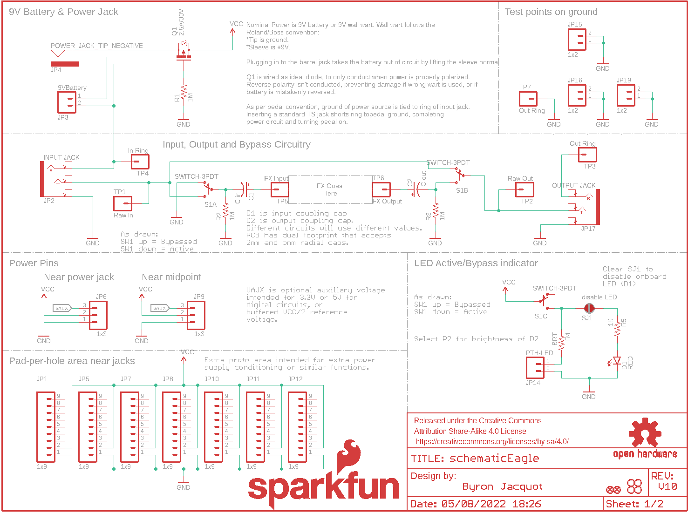
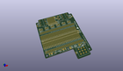
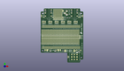
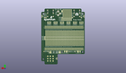
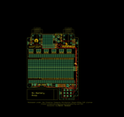
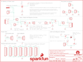

Contents
========

* [PRS13124 > Proto Pedal](#prs13124--proto-pedal)
	* [Schematic](#schematic)
	* [PCB](#pcb)
	* [Interactive BOM](#interactive-bom)
	* [OOMP Parts](#oomp-parts)
	* [Images](#images)
	* [Tags](#tags)
  
![][im]
# PRS13124 > Proto Pedal

- ID: PROJ-SPAR-13124-STAN-01
- Hex ID: PRS13124
- Name: Sparkfun
- Description: Sparkfun
- Long Link: [http://oom.lt/PROJ-SPAR-13124-STAN-01](http://oom.lt/PROJ-SPAR-13124-STAN-01)
- Short Link: [http://oom.lt/PRS13124](http://oom.lt/PRS13124)

## Schematic
  

## PCB
  

## Interactive BOM

- Interactive BOM page: [ibom.html](https://htmlpreview.github.io/?https://github.com/oomlout/oomlout_OOMP_projects/blob/main/PROJ-SPAR-13124-STAN-01/kicad/bom/ibom.html)

## OOMP Parts
  

|OOMP Parts|
| :---: |
|CAPX-UNMATCHED-X-UNMATCHED-01 C1, C2|
|[LEDS-0603-R-STAN-01  SMD (0603) Red LED  D1](https://github.com/oomlout/oomlout_OOMP_parts/tree/main/LEDS-0603-R-STAN-01/)|
|[HEAD-I01-X-PI09-01  2.54 mm 9 Pin Header  JP1, JP5, JP7, JP8, JP10, JP11, JP12](https://github.com/oomlout/oomlout_OOMP_parts/tree/main/HEAD-I01-X-PI09-01/)|
|UNMATCHED-UNMATCHED-X-UNMATCHED-01 JP2, JP17, S1|
|[HEAD-I01-X-PI02-01  2.54 mm 2 Pin Header  JP3, JP14, JP15, JP16, JP19](https://github.com/oomlout/oomlout_OOMP_parts/tree/main/HEAD-I01-X-PI02-01/)|
|[DCJP-21D-X-STAN-01  2.1 mm DC Jack  JP4](https://github.com/oomlout/oomlout_OOMP_parts/tree/main/DCJP-21D-X-STAN-01/)|
|[HEAD-I01-X-PI03-01  2.54 mm 3 Pin Header  JP6, JP9, JP21, JP22, JP23, JP25, JP26, JP27, JP91, JP92, JP93, JP95, JP96, JP97](https://github.com/oomlout/oomlout_OOMP_parts/tree/main/HEAD-I01-X-PI03-01/)|
|HEAD-I01-X-PI30-01 JP20, JP24, JP34, JP35, JP90, JP94|
|[HEAD-I01-X-PI05-01  2.54 mm 5 Pin Header  JP28, JP29, JP30, JP31, JP32, JP33, JP36, JP37, JP38, JP39, JP40, JP41, JP42, JP43, JP44, JP45, JP46, JP47, JP48, JP49, JP50, JP51, JP52, JP53, JP54, JP55, JP56, JP57, JP58, JP59, JP60, JP61, JP62, JP63, JP64, JP65, JP66, JP67, JP68, JP69, JP70, JP71, JP72, JP73, JP74, JP75, JP76, JP77, JP78, JP79, JP80, JP81, JP82, JP83, JP84, JP85, JP86, JP87, JP88, JP89](https://github.com/oomlout/oomlout_OOMP_parts/tree/main/HEAD-I01-X-PI05-01/)|
|UNMATCHED-SO23-X-UNMATCHED-01 Q1|
|[RESE-0603-X-O105-01  SMD (0603) 1M Ohm Resistor  R1, R2, R3](https://github.com/oomlout/oomlout_OOMP_parts/tree/main/RESE-0603-X-O105-01/)|
|RESE-UNMATCHED-X-UNMATCHED-01 R4|
|[RESE-0603-X-O102-01  SMD (0603) 1k Ohm Resistor  R5](https://github.com/oomlout/oomlout_OOMP_parts/tree/main/RESE-0603-X-O102-01/)|
|HEAD-I01-X-PI01-01 TP1, TP2, TP3, TP4, TP5, TP6, TP7|

## Images
  
  

|kicadPcb3d|kicadPcb3dFront|kicadPcb3dBack|eagleImage|eagleSchemImage|
| :---: | :---: | :---: | :---: | :---: |
||||||

## Tags

- hexID: PRS13124
- oompType: PROJ
- oompSize: SPAR
- oompColor: 13124
- oompDesc: STAN
- oompIndex: 01
- oompName: Proto Pedal
- sources: All source files from https://github.com/sparkfun/Proto_Pedal (source licence details in srcLicense.md)
- linkBuyPage: https://www.sparkfun.com/products/13124
- oompID: PROJ-SPAR-13124-STAN-01
- oompParts: C1,CAPX-UNMATCHED-X-UNMATCHED-01
- oompParts: C2,CAPX-UNMATCHED-X-UNMATCHED-01
- oompParts: D1,LEDS-0603-R-STAN-01
- oompParts: JP1,HEAD-I01-X-PI09-01
- oompParts: JP2,UNMATCHED-UNMATCHED-X-UNMATCHED-01
- oompParts: JP3,HEAD-I01-X-PI02-01
- oompParts: JP4,DCJP-21D-X-STAN-01
- oompParts: JP5,HEAD-I01-X-PI09-01
- oompParts: JP6,HEAD-I01-X-PI03-01
- oompParts: JP7,HEAD-I01-X-PI09-01
- oompParts: JP8,HEAD-I01-X-PI09-01
- oompParts: JP9,HEAD-I01-X-PI03-01
- oompParts: JP10,HEAD-I01-X-PI09-01
- oompParts: JP11,HEAD-I01-X-PI09-01
- oompParts: JP12,HEAD-I01-X-PI09-01
- oompParts: JP14,HEAD-I01-X-PI02-01
- oompParts: JP15,HEAD-I01-X-PI02-01
- oompParts: JP16,HEAD-I01-X-PI02-01
- oompParts: JP17,UNMATCHED-UNMATCHED-X-UNMATCHED-01
- oompParts: JP19,HEAD-I01-X-PI02-01
- oompParts: JP20,HEAD-I01-X-PI30-01
- oompParts: JP21,HEAD-I01-X-PI03-01
- oompParts: JP22,HEAD-I01-X-PI03-01
- oompParts: JP23,HEAD-I01-X-PI03-01
- oompParts: JP24,HEAD-I01-X-PI30-01
- oompParts: JP25,HEAD-I01-X-PI03-01
- oompParts: JP26,HEAD-I01-X-PI03-01
- oompParts: JP27,HEAD-I01-X-PI03-01
- oompParts: JP28,HEAD-I01-X-PI05-01
- oompParts: JP29,HEAD-I01-X-PI05-01
- oompParts: JP30,HEAD-I01-X-PI05-01
- oompParts: JP31,HEAD-I01-X-PI05-01
- oompParts: JP32,HEAD-I01-X-PI05-01
- oompParts: JP33,HEAD-I01-X-PI05-01
- oompParts: JP34,HEAD-I01-X-PI30-01
- oompParts: JP35,HEAD-I01-X-PI30-01
- oompParts: JP36,HEAD-I01-X-PI05-01
- oompParts: JP37,HEAD-I01-X-PI05-01
- oompParts: JP38,HEAD-I01-X-PI05-01
- oompParts: JP39,HEAD-I01-X-PI05-01
- oompParts: JP40,HEAD-I01-X-PI05-01
- oompParts: JP41,HEAD-I01-X-PI05-01
- oompParts: JP42,HEAD-I01-X-PI05-01
- oompParts: JP43,HEAD-I01-X-PI05-01
- oompParts: JP44,HEAD-I01-X-PI05-01
- oompParts: JP45,HEAD-I01-X-PI05-01
- oompParts: JP46,HEAD-I01-X-PI05-01
- oompParts: JP47,HEAD-I01-X-PI05-01
- oompParts: JP48,HEAD-I01-X-PI05-01
- oompParts: JP49,HEAD-I01-X-PI05-01
- oompParts: JP50,HEAD-I01-X-PI05-01
- oompParts: JP51,HEAD-I01-X-PI05-01
- oompParts: JP52,HEAD-I01-X-PI05-01
- oompParts: JP53,HEAD-I01-X-PI05-01
- oompParts: JP54,HEAD-I01-X-PI05-01
- oompParts: JP55,HEAD-I01-X-PI05-01
- oompParts: JP56,HEAD-I01-X-PI05-01
- oompParts: JP57,HEAD-I01-X-PI05-01
- oompParts: JP58,HEAD-I01-X-PI05-01
- oompParts: JP59,HEAD-I01-X-PI05-01
- oompParts: JP60,HEAD-I01-X-PI05-01
- oompParts: JP61,HEAD-I01-X-PI05-01
- oompParts: JP62,HEAD-I01-X-PI05-01
- oompParts: JP63,HEAD-I01-X-PI05-01
- oompParts: JP64,HEAD-I01-X-PI05-01
- oompParts: JP65,HEAD-I01-X-PI05-01
- oompParts: JP66,HEAD-I01-X-PI05-01
- oompParts: JP67,HEAD-I01-X-PI05-01
- oompParts: JP68,HEAD-I01-X-PI05-01
- oompParts: JP69,HEAD-I01-X-PI05-01
- oompParts: JP70,HEAD-I01-X-PI05-01
- oompParts: JP71,HEAD-I01-X-PI05-01
- oompParts: JP72,HEAD-I01-X-PI05-01
- oompParts: JP73,HEAD-I01-X-PI05-01
- oompParts: JP74,HEAD-I01-X-PI05-01
- oompParts: JP75,HEAD-I01-X-PI05-01
- oompParts: JP76,HEAD-I01-X-PI05-01
- oompParts: JP77,HEAD-I01-X-PI05-01
- oompParts: JP78,HEAD-I01-X-PI05-01
- oompParts: JP79,HEAD-I01-X-PI05-01
- oompParts: JP80,HEAD-I01-X-PI05-01
- oompParts: JP81,HEAD-I01-X-PI05-01
- oompParts: JP82,HEAD-I01-X-PI05-01
- oompParts: JP83,HEAD-I01-X-PI05-01
- oompParts: JP84,HEAD-I01-X-PI05-01
- oompParts: JP85,HEAD-I01-X-PI05-01
- oompParts: JP86,HEAD-I01-X-PI05-01
- oompParts: JP87,HEAD-I01-X-PI05-01
- oompParts: JP88,HEAD-I01-X-PI05-01
- oompParts: JP89,HEAD-I01-X-PI05-01
- oompParts: JP90,HEAD-I01-X-PI30-01
- oompParts: JP91,HEAD-I01-X-PI03-01
- oompParts: JP92,HEAD-I01-X-PI03-01
- oompParts: JP93,HEAD-I01-X-PI03-01
- oompParts: JP94,HEAD-I01-X-PI30-01
- oompParts: JP95,HEAD-I01-X-PI03-01
- oompParts: JP96,HEAD-I01-X-PI03-01
- oompParts: JP97,HEAD-I01-X-PI03-01
- oompParts: Q1,UNMATCHED-SO23-X-UNMATCHED-01
- oompParts: R1,RESE-0603-X-O105-01
- oompParts: R2,RESE-0603-X-O105-01
- oompParts: R3,RESE-0603-X-O105-01
- oompParts: R4,RESE-UNMATCHED-X-UNMATCHED-01
- oompParts: R5,RESE-0603-X-O102-01
- oompParts: S1,UNMATCHED-UNMATCHED-X-UNMATCHED-01
- oompParts: TP1,HEAD-I01-X-PI01-01
- oompParts: TP2,HEAD-I01-X-PI01-01
- oompParts: TP3,HEAD-I01-X-PI01-01
- oompParts: TP4,HEAD-I01-X-PI01-01
- oompParts: TP5,HEAD-I01-X-PI01-01
- oompParts: TP6,HEAD-I01-X-PI01-01
- oompParts: TP7,HEAD-I01-X-PI01-01
- rawParts: C1,C in,DUAL_FOOTPRINT_CAP,DUAL-CAP,Dual-footprint capacitor.,,,,
- rawParts: C2,C out,DUAL_FOOTPRINT_CAP,DUAL-CAP,Dual-footprint capacitor.,,,,
- rawParts: D1,RED,LED-RED0603,LED-0603,Assorted Red LEDs,DIO-00819,,RED,
- rawParts: FID1,FIDUCIAL1X2,FIDUCIAL1X2,FIDUCIAL-1X2,Fiducial Alignment Points,,,,
- rawParts: FID2,FIDUCIAL1X2,FIDUCIAL1X2,FIDUCIAL-1X2,Fiducial Alignment Points,,,,
- rawParts: FRAME1,FRAME-LETTER,FRAME-LETTER,CREATIVE_COMMONS,Schematic Frame,,,,
- rawParts: FRAME2,FRAME-LETTER,FRAME-LETTER,CREATIVE_COMMONS,Schematic Frame,,,,
- rawParts: JP1,1x9,M09NO_SILK,1X09_NO_SILK,Header 9,,,,
- rawParts: JP2,INPUT JACK,AUDIO-JACK4-.25-HORIZ-TRS,AUDIO-JACK-.25-INCH-HORIZ-PTH,1/4 TRS jack, horizontal,CONN-12339,COM-11144,,
- rawParts: JP3,9VBattery,M02PTH3,1X02_LONGPADS,Standard 2-pin 0.1 header. Use with,,,,
- rawParts: JP4,POWER_JACK_TIP_NEGATIVE,POWER_JACK_TIP_NEGATIVE,POWER-BARRELJACK-PTH-LOCK-FIXED,,CONN-08197,,,
- rawParts: JP5,1x9,M09NO_SILK,1X09_NO_SILK,Header 9,,,,
- rawParts: JP6,1x3,M031X03_NO_SILK,1X03_NO_SILK,Header 3,,,,
- rawParts: JP7,1x9,M09NO_SILK,1X09_NO_SILK,Header 9,,,,
- rawParts: JP8,1x9,M09NO_SILK,1X09_NO_SILK,Header 9,,,,
- rawParts: JP9,1x3,M031X03_NO_SILK,1X03_NO_SILK,Header 3,,,,
- rawParts: JP10,1x9,M09NO_SILK,1X09_NO_SILK,Header 9,,,,
- rawParts: JP11,1x9,M09NO_SILK,1X09_NO_SILK,Header 9,,,,
- rawParts: JP12,1x9,M09NO_SILK,1X09_NO_SILK,Header 9,,,,
- rawParts: JP14,PTH-LED,M02PTH3,1X02_LONGPADS,Standard 2-pin 0.1 header. Use with,,,,
- rawParts: JP15,1x2,M021X02_NO_SILK,1X02_NO_SILK,Standard 2-pin 0.1 header. Use with,,,,
- rawParts: JP16,1x2,M021X02_NO_SILK,1X02_NO_SILK,Standard 2-pin 0.1 header. Use with,,,,
- rawParts: JP17,OUTPUT JACK,AUDIO-JACK4-.25-HORIZ-TRS,AUDIO-JACK-.25-INCH-HORIZ-PTH,1/4 TRS jack, horizontal,CONN-12339,COM-11144,,
- rawParts: JP19,1x2,M021X02_NO_SILK,1X02_NO_SILK,Standard 2-pin 0.1 header. Use with,,,,
- rawParts: JP20,1x30,M30NO_SILK,1X30_NO_SILK,1x30 .1 header,,,,
- rawParts: JP21,1x3,M031X03_NO_SILK,1X03_NO_SILK,Header 3,,,,
- rawParts: JP22,1x3,M031X03_NO_SILK,1X03_NO_SILK,Header 3,,,,
- rawParts: JP23,1x3,M031X03_NO_SILK,1X03_NO_SILK,Header 3,,,,
- rawParts: JP24,1x30,M30NO_SILK,1X30_NO_SILK,1x30 .1 header,,,,
- rawParts: JP25,1x3,M031X03_NO_SILK,1X03_NO_SILK,Header 3,,,,
- rawParts: JP26,1x3,M031X03_NO_SILK,1X03_NO_SILK,Header 3,,,,
- rawParts: JP27,1x3,M031X03_NO_SILK,1X03_NO_SILK,Header 3,,,,
- rawParts: JP28,1x5,M05NO_SILK,1X05_NO_SILK,Header 5,,,,
- rawParts: JP29,1x5,M05NO_SILK,1X05_NO_SILK,Header 5,,,,
- rawParts: JP30,1x5,M05NO_SILK,1X05_NO_SILK,Header 5,,,,
- rawParts: JP31,1x5,M05NO_SILK,1X05_NO_SILK,Header 5,,,,
- rawParts: JP32,1x5,M05NO_SILK,1X05_NO_SILK,Header 5,,,,
- rawParts: JP33,1x5,M05NO_SILK,1X05_NO_SILK,Header 5,,,,
- rawParts: JP34,1x30,M30NO_SILK,1X30_NO_SILK,1x30 .1 header,,,,
- rawParts: JP35,1x30,M30NO_SILK,1X30_NO_SILK,1x30 .1 header,,,,
- rawParts: JP36,1x5,M05NO_SILK,1X05_NO_SILK,Header 5,,,,
- rawParts: JP37,1x5,M05NO_SILK,1X05_NO_SILK,Header 5,,,,
- rawParts: JP38,1x5,M05NO_SILK,1X05_NO_SILK,Header 5,,,,
- rawParts: JP39,1x5,M05NO_SILK,1X05_NO_SILK,Header 5,,,,
- rawParts: JP40,1x5,M05NO_SILK,1X05_NO_SILK,Header 5,,,,
- rawParts: JP41,1x5,M05NO_SILK,1X05_NO_SILK,Header 5,,,,
- rawParts: JP42,1x5,M05NO_SILK,1X05_NO_SILK,Header 5,,,,
- rawParts: JP43,1x5,M05NO_SILK,1X05_NO_SILK,Header 5,,,,
- rawParts: JP44,1x5,M05NO_SILK,1X05_NO_SILK,Header 5,,,,
- rawParts: JP45,1x5,M05NO_SILK,1X05_NO_SILK,Header 5,,,,
- rawParts: JP46,1x5,M05NO_SILK,1X05_NO_SILK,Header 5,,,,
- rawParts: JP47,1x5,M05NO_SILK,1X05_NO_SILK,Header 5,,,,
- rawParts: JP48,1x5,M05NO_SILK,1X05_NO_SILK,Header 5,,,,
- rawParts: JP49,1x5,M05NO_SILK,1X05_NO_SILK,Header 5,,,,
- rawParts: JP50,1x5,M05NO_SILK,1X05_NO_SILK,Header 5,,,,
- rawParts: JP51,1x5,M05NO_SILK,1X05_NO_SILK,Header 5,,,,
- rawParts: JP52,1x5,M05NO_SILK,1X05_NO_SILK,Header 5,,,,
- rawParts: JP53,1x5,M05NO_SILK,1X05_NO_SILK,Header 5,,,,
- rawParts: JP54,1x5,M05NO_SILK,1X05_NO_SILK,Header 5,,,,
- rawParts: JP55,1x5,M05NO_SILK,1X05_NO_SILK,Header 5,,,,
- rawParts: JP56,1x5,M05NO_SILK,1X05_NO_SILK,Header 5,,,,
- rawParts: JP57,1x5,M05NO_SILK,1X05_NO_SILK,Header 5,,,,
- rawParts: JP58,1x5,M05NO_SILK,1X05_NO_SILK,Header 5,,,,
- rawParts: JP59,1x5,M05NO_SILK,1X05_NO_SILK,Header 5,,,,
- rawParts: JP60,1x5,M05NO_SILK,1X05_NO_SILK,Header 5,,,,
- rawParts: JP61,1x5,M05NO_SILK,1X05_NO_SILK,Header 5,,,,
- rawParts: JP62,1x5,M05NO_SILK,1X05_NO_SILK,Header 5,,,,
- rawParts: JP63,1x5,M05NO_SILK,1X05_NO_SILK,Header 5,,,,
- rawParts: JP64,1x5,M05NO_SILK,1X05_NO_SILK,Header 5,,,,
- rawParts: JP65,1x5,M05NO_SILK,1X05_NO_SILK,Header 5,,,,
- rawParts: JP66,1x5,M05NO_SILK,1X05_NO_SILK,Header 5,,,,
- rawParts: JP67,1x5,M05NO_SILK,1X05_NO_SILK,Header 5,,,,
- rawParts: JP68,1x5,M05NO_SILK,1X05_NO_SILK,Header 5,,,,
- rawParts: JP69,1x5,M05NO_SILK,1X05_NO_SILK,Header 5,,,,
- rawParts: JP70,1x5,M05NO_SILK,1X05_NO_SILK,Header 5,,,,
- rawParts: JP71,1x5,M05NO_SILK,1X05_NO_SILK,Header 5,,,,
- rawParts: JP72,1x5,M05NO_SILK,1X05_NO_SILK,Header 5,,,,
- rawParts: JP73,1x5,M05NO_SILK,1X05_NO_SILK,Header 5,,,,
- rawParts: JP74,1x5,M05NO_SILK,1X05_NO_SILK,Header 5,,,,
- rawParts: JP75,1x5,M05NO_SILK,1X05_NO_SILK,Header 5,,,,
- rawParts: JP76,1x5,M05NO_SILK,1X05_NO_SILK,Header 5,,,,
- rawParts: JP77,1x5,M05NO_SILK,1X05_NO_SILK,Header 5,,,,
- rawParts: JP78,1x5,M05NO_SILK,1X05_NO_SILK,Header 5,,,,
- rawParts: JP79,1x5,M05NO_SILK,1X05_NO_SILK,Header 5,,,,
- rawParts: JP80,1x5,M05NO_SILK,1X05_NO_SILK,Header 5,,,,
- rawParts: JP81,1x5,M05NO_SILK,1X05_NO_SILK,Header 5,,,,
- rawParts: JP82,1x5,M05NO_SILK,1X05_NO_SILK,Header 5,,,,
- rawParts: JP83,1x5,M05NO_SILK,1X05_NO_SILK,Header 5,,,,
- rawParts: JP84,1x5,M05NO_SILK,1X05_NO_SILK,Header 5,,,,
- rawParts: JP85,1x5,M05NO_SILK,1X05_NO_SILK,Header 5,,,,
- rawParts: JP86,1x5,M05NO_SILK,1X05_NO_SILK,Header 5,,,,
- rawParts: JP87,1x5,M05NO_SILK,1X05_NO_SILK,Header 5,,,,
- rawParts: JP88,1x5,M05NO_SILK,1X05_NO_SILK,Header 5,,,,
- rawParts: JP89,v,M05NO_SILK,1X05_NO_SILK,Header 5,,,,
- rawParts: JP90,1x30,M30NO_SILK,1X30_NO_SILK,1x30 .1 header,,,,
- rawParts: JP91,1x3,M031X03_NO_SILK,1X03_NO_SILK,Header 3,,,,
- rawParts: JP92,1x3,M031X03_NO_SILK,1X03_NO_SILK,Header 3,,,,
- rawParts: JP93,1x3,M031X03_NO_SILK,1X03_NO_SILK,Header 3,,,,
- rawParts: JP94,1x30,M30NO_SILK,1X30_NO_SILK,1x30 .1 header,,,,
- rawParts: JP95,1x3,M031X03_NO_SILK,1X03_NO_SILK,Header 3,,,,
- rawParts: JP96,1x3,M031X03_NO_SILK,1X03_NO_SILK,Header 3,,,,
- rawParts: JP97,1x3,M031X03_NO_SILK,1X03_NO_SILK,Header 3,,,,
- rawParts: LOGO1,SFE_LOGO_NAME_FLAME.2_INCH,SFE_LOGO_NAME_FLAME.2_INCH,SFE_LOGO_NAME_FLAME_.2,SFE Logo, name and flame,,,,
- rawParts: LOGO2,OSHW-LOGOL,OSHW-LOGOL,OSHW-LOGO-L,Open Source Hardware Logo,,,,
- rawParts: LOGO3,SFE_LOGO_FLAME.2_INCH,SFE_LOGO_FLAME.2_INCH,SFE_LOGO_FLAME_.2,SFE Logo, flame only,,,,
- rawParts: Q1,2.5A/30V,MOSFET-PCHANNELDMG2307L,SOT23-3,Generic PMOSFET,TRANS-11308,,2.5A/30V,
- rawParts: R1,1M,1MOHM-1/10W-1%(0603),0603-RES,RES-07868,RES-07868,,1M,
- rawParts: R2,1M,1MOHM-1/10W-1%(0603),0603-RES,RES-07868,RES-07868,,1M,
- rawParts: R3,1M,1MOHM-1/10W-1%(0603),0603-RES,RES-07868,RES-07868,,1M,
- rawParts: R4,BRT,RESISTORAXIAL-0.3,AXIAL-0.3,Resistor,,,,
- rawParts: R5,1K,1KOHM-1/10W-1%(0603),0603-RES,RES-07856,RES-07856,,1K,
- rawParts: S1,SWITCH-3PDT,SWITCH-3PDT,STOMP-SWITCH-3PDT,Three-pole, double-throw stomp switch.,SWCH-13197,,,
- rawParts: SJ1,disable LED,JUMPER-PAD-2-NC_BY_PASTEFULL-BOX-SILK,PAD-JUMPER-2-NC_BY_PASTE_YES_SILK_FULL_BOX,,,,,
- rawParts: STANDOFF1,STAND-OFF,STAND-OFF,STAND-OFF,#4 Stand Off,,,,
- rawParts: STANDOFF2,STAND-OFF,STAND-OFF,STAND-OFF,#4 Stand Off,,,,
- rawParts: STANDOFF3,STAND-OFF,STAND-OFF,STAND-OFF,#4 Stand Off,,,,
- rawParts: STANDOFF4,STAND-OFF,STAND-OFF,STAND-OFF,#4 Stand Off,,,,
- rawParts: TP1,Raw In,M01PTH_NO_SILK_YES_STOP,1X01_NO_SILK,Header 1,,,,
- rawParts: TP2,Raw Out,M01PTH_NO_SILK_YES_STOP,1X01_NO_SILK,Header 1,,,,
- rawParts: TP3,Out Ring,M01PTH_NO_SILK_YES_STOP,1X01_NO_SILK,Header 1,,,,
- rawParts: TP4,In Ring,M01PTH_NO_SILK_YES_STOP,1X01_NO_SILK,Header 1,,,,
- rawParts: TP5,FX Input,M01PTH_NO_SILK_YES_STOP,1X01_NO_SILK,Header 1,,,,
- rawParts: TP6,FX Output,M01PTH_NO_SILK_YES_STOP,1X01_NO_SILK,Header 1,,,,
- rawParts: TP7,Out Ring,M01PTH_LONGPAD,1X01_LONGPAD,Header 1,,,,

[im]: kicadPcb3d_450.png
