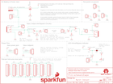

Contents
========

* [PRS13124 > Sparkfun](#prs13124--sparkfun)
	* [Schematic](#schematic)
	* [Interactive BOM](#interactive-bom)
	* [OOMP Parts](#oomp-parts)
	* [Images](#images)
	* [Tags](#tags)
  
![][im]
# PRS13124 > Sparkfun

- ID: PROJ-SPAR-13124-STAN-01
- Hex ID: PRS13124
- Name: Sparkfun
- Description: Sparkfun
- Long Link: [http://oom.lt/PROJ-SPAR-13124-STAN-01](http://oom.lt/PROJ-SPAR-13124-STAN-01)
- Long Link: [http://oom.lt/PRS13124](http://oom.lt/PRS13124)

## Schematic
  
![][schem]
## Interactive BOM

- Interactive BOM page: [ibom.html](https://htmlpreview.github.io/?https://github.com/oomlout/oomlout_OOMP_projects/blob/main/PROJ-SPAR-13124-STAN-01/kicad/bom/ibom.html)

## OOMP Parts
  

|OOMP Parts|
| :---: |
|C1,UNMATCHED-UNMATCHED-UNMATCHED-UNMATCHED-UNMATCHED,C1,C in,DUAL_FOOTPRINT_CAP,DUAL-CAP,Dual-footprint capacitor.,,,,|
|C2,UNMATCHED-UNMATCHED-UNMATCHED-UNMATCHED-UNMATCHED,C2,C out,DUAL_FOOTPRINT_CAP,DUAL-CAP,Dual-footprint capacitor.,,,,|
|D1,UNMATCHED-UNMATCHED-UNMATCHED-UNMATCHED-UNMATCHED,D1,RED,LED-RED0603,LED-0603,Assorted Red LEDs,DIO-00819,,RED,|
|FRAME1,UNMATCHED-UNMATCHED-UNMATCHED-UNMATCHED-UNMATCHED,FID1,FIDUCIAL1X2,FIDUCIAL1X2,FIDUCIAL-1X2,Fiducial Alignment Points,,,,|
|FRAME2,UNMATCHED-UNMATCHED-UNMATCHED-UNMATCHED-UNMATCHED,FID2,FIDUCIAL1X2,FIDUCIAL1X2,FIDUCIAL-1X2,Fiducial Alignment Points,,,,|
|JP1,UNMATCHED-UNMATCHED-UNMATCHED-UNMATCHED-UNMATCHED,FRAME1,FRAME-LETTER,FRAME-LETTER,CREATIVE_COMMONS,Schematic Frame,,,,|
|JP2,UNMATCHED-UNMATCHED-UNMATCHED-UNMATCHED-UNMATCHED,FRAME2,FRAME-LETTER,FRAME-LETTER,CREATIVE_COMMONS,Schematic Frame,,,,|
|JP3,UNMATCHED-UNMATCHED-UNMATCHED-UNMATCHED-UNMATCHED,JP1,1x9,M09NO_SILK,1X09_NO_SILK,Header 9,,,,|
|JP4,UNMATCHED-UNMATCHED-UNMATCHED-UNMATCHED-UNMATCHED,JP2,INPUT JACK,AUDIO-JACK4-.25-HORIZ-TRS,AUDIO-JACK-.25-INCH-HORIZ-PTH,1/4 TRS jack, horizontal,CONN-12339,COM-11144,,|
|JP5,UNMATCHED-UNMATCHED-UNMATCHED-UNMATCHED-UNMATCHED,JP3,9VBattery,M02PTH3,1X02_LONGPADS,Standard 2-pin 0.1 header. Use with,,,,|
|JP6,UNMATCHED-UNMATCHED-UNMATCHED-UNMATCHED-UNMATCHED,JP4,POWER_JACK_TIP_NEGATIVE,POWER_JACK_TIP_NEGATIVE,POWER-BARRELJACK-PTH-LOCK-FIXED,,CONN-08197,,,|
|JP7,UNMATCHED-UNMATCHED-UNMATCHED-UNMATCHED-UNMATCHED,JP5,1x9,M09NO_SILK,1X09_NO_SILK,Header 9,,,,|
|JP8,UNMATCHED-UNMATCHED-UNMATCHED-UNMATCHED-UNMATCHED,JP6,1x3,M031X03_NO_SILK,1X03_NO_SILK,Header 3,,,,|
|JP9,UNMATCHED-UNMATCHED-UNMATCHED-UNMATCHED-UNMATCHED,JP7,1x9,M09NO_SILK,1X09_NO_SILK,Header 9,,,,|
|JP10,UNMATCHED-UNMATCHED-UNMATCHED-UNMATCHED-UNMATCHED,JP8,1x9,M09NO_SILK,1X09_NO_SILK,Header 9,,,,|
|JP11,UNMATCHED-UNMATCHED-UNMATCHED-UNMATCHED-UNMATCHED,JP9,1x3,M031X03_NO_SILK,1X03_NO_SILK,Header 3,,,,|
|JP12,UNMATCHED-UNMATCHED-UNMATCHED-UNMATCHED-UNMATCHED,JP10,1x9,M09NO_SILK,1X09_NO_SILK,Header 9,,,,|
|JP14,UNMATCHED-UNMATCHED-UNMATCHED-UNMATCHED-UNMATCHED,JP11,1x9,M09NO_SILK,1X09_NO_SILK,Header 9,,,,|
|JP15,UNMATCHED-UNMATCHED-UNMATCHED-UNMATCHED-UNMATCHED,JP12,1x9,M09NO_SILK,1X09_NO_SILK,Header 9,,,,|
|JP16,UNMATCHED-UNMATCHED-UNMATCHED-UNMATCHED-UNMATCHED,JP14,PTH-LED,M02PTH3,1X02_LONGPADS,Standard 2-pin 0.1 header. Use with,,,,|
|JP17,UNMATCHED-UNMATCHED-UNMATCHED-UNMATCHED-UNMATCHED,JP15,1x2,M021X02_NO_SILK,1X02_NO_SILK,Standard 2-pin 0.1 header. Use with,,,,|
|JP19,UNMATCHED-UNMATCHED-UNMATCHED-UNMATCHED-UNMATCHED,JP16,1x2,M021X02_NO_SILK,1X02_NO_SILK,Standard 2-pin 0.1 header. Use with,,,,|
|JP20,UNMATCHED-UNMATCHED-UNMATCHED-UNMATCHED-UNMATCHED,JP17,OUTPUT JACK,AUDIO-JACK4-.25-HORIZ-TRS,AUDIO-JACK-.25-INCH-HORIZ-PTH,1/4 TRS jack, horizontal,CONN-12339,COM-11144,,|
|JP21,UNMATCHED-UNMATCHED-UNMATCHED-UNMATCHED-UNMATCHED,JP19,1x2,M021X02_NO_SILK,1X02_NO_SILK,Standard 2-pin 0.1 header. Use with,,,,|
|JP22,UNMATCHED-UNMATCHED-UNMATCHED-UNMATCHED-UNMATCHED,JP20,1x30,M30NO_SILK,1X30_NO_SILK,1x30 .1 header,,,,|
|JP23,UNMATCHED-UNMATCHED-UNMATCHED-UNMATCHED-UNMATCHED,JP21,1x3,M031X03_NO_SILK,1X03_NO_SILK,Header 3,,,,|
|JP24,UNMATCHED-UNMATCHED-UNMATCHED-UNMATCHED-UNMATCHED,JP22,1x3,M031X03_NO_SILK,1X03_NO_SILK,Header 3,,,,|
|JP25,UNMATCHED-UNMATCHED-UNMATCHED-UNMATCHED-UNMATCHED,JP23,1x3,M031X03_NO_SILK,1X03_NO_SILK,Header 3,,,,|
|JP26,UNMATCHED-UNMATCHED-UNMATCHED-UNMATCHED-UNMATCHED,JP24,1x30,M30NO_SILK,1X30_NO_SILK,1x30 .1 header,,,,|
|JP27,UNMATCHED-UNMATCHED-UNMATCHED-UNMATCHED-UNMATCHED,JP25,1x3,M031X03_NO_SILK,1X03_NO_SILK,Header 3,,,,|
|JP28,UNMATCHED-UNMATCHED-UNMATCHED-UNMATCHED-UNMATCHED,JP26,1x3,M031X03_NO_SILK,1X03_NO_SILK,Header 3,,,,|
|JP29,UNMATCHED-UNMATCHED-UNMATCHED-UNMATCHED-UNMATCHED,JP27,1x3,M031X03_NO_SILK,1X03_NO_SILK,Header 3,,,,|
|JP30,UNMATCHED-UNMATCHED-UNMATCHED-UNMATCHED-UNMATCHED,JP28,1x5,M05NO_SILK,1X05_NO_SILK,Header 5,,,,|
|JP31,UNMATCHED-UNMATCHED-UNMATCHED-UNMATCHED-UNMATCHED,JP29,1x5,M05NO_SILK,1X05_NO_SILK,Header 5,,,,|
|JP32,UNMATCHED-UNMATCHED-UNMATCHED-UNMATCHED-UNMATCHED,JP30,1x5,M05NO_SILK,1X05_NO_SILK,Header 5,,,,|
|JP33,UNMATCHED-UNMATCHED-UNMATCHED-UNMATCHED-UNMATCHED,JP31,1x5,M05NO_SILK,1X05_NO_SILK,Header 5,,,,|
|JP34,UNMATCHED-UNMATCHED-UNMATCHED-UNMATCHED-UNMATCHED,JP32,1x5,M05NO_SILK,1X05_NO_SILK,Header 5,,,,|
|JP35,UNMATCHED-UNMATCHED-UNMATCHED-UNMATCHED-UNMATCHED,JP33,1x5,M05NO_SILK,1X05_NO_SILK,Header 5,,,,|
|JP36,UNMATCHED-UNMATCHED-UNMATCHED-UNMATCHED-UNMATCHED,JP34,1x30,M30NO_SILK,1X30_NO_SILK,1x30 .1 header,,,,|
|JP37,UNMATCHED-UNMATCHED-UNMATCHED-UNMATCHED-UNMATCHED,JP35,1x30,M30NO_SILK,1X30_NO_SILK,1x30 .1 header,,,,|
|JP38,UNMATCHED-UNMATCHED-UNMATCHED-UNMATCHED-UNMATCHED,JP36,1x5,M05NO_SILK,1X05_NO_SILK,Header 5,,,,|
|JP39,UNMATCHED-UNMATCHED-UNMATCHED-UNMATCHED-UNMATCHED,JP37,1x5,M05NO_SILK,1X05_NO_SILK,Header 5,,,,|
|JP40,UNMATCHED-UNMATCHED-UNMATCHED-UNMATCHED-UNMATCHED,JP38,1x5,M05NO_SILK,1X05_NO_SILK,Header 5,,,,|
|JP41,UNMATCHED-UNMATCHED-UNMATCHED-UNMATCHED-UNMATCHED,JP39,1x5,M05NO_SILK,1X05_NO_SILK,Header 5,,,,|
|JP42,UNMATCHED-UNMATCHED-UNMATCHED-UNMATCHED-UNMATCHED,JP40,1x5,M05NO_SILK,1X05_NO_SILK,Header 5,,,,|
|JP43,UNMATCHED-UNMATCHED-UNMATCHED-UNMATCHED-UNMATCHED,JP41,1x5,M05NO_SILK,1X05_NO_SILK,Header 5,,,,|
|JP44,UNMATCHED-UNMATCHED-UNMATCHED-UNMATCHED-UNMATCHED,JP42,1x5,M05NO_SILK,1X05_NO_SILK,Header 5,,,,|
|JP45,UNMATCHED-UNMATCHED-UNMATCHED-UNMATCHED-UNMATCHED,JP43,1x5,M05NO_SILK,1X05_NO_SILK,Header 5,,,,|
|JP46,UNMATCHED-UNMATCHED-UNMATCHED-UNMATCHED-UNMATCHED,JP44,1x5,M05NO_SILK,1X05_NO_SILK,Header 5,,,,|
|JP47,UNMATCHED-UNMATCHED-UNMATCHED-UNMATCHED-UNMATCHED,JP45,1x5,M05NO_SILK,1X05_NO_SILK,Header 5,,,,|
|JP48,UNMATCHED-UNMATCHED-UNMATCHED-UNMATCHED-UNMATCHED,JP46,1x5,M05NO_SILK,1X05_NO_SILK,Header 5,,,,|
|JP49,UNMATCHED-UNMATCHED-UNMATCHED-UNMATCHED-UNMATCHED,JP47,1x5,M05NO_SILK,1X05_NO_SILK,Header 5,,,,|
|JP50,UNMATCHED-UNMATCHED-UNMATCHED-UNMATCHED-UNMATCHED,JP48,1x5,M05NO_SILK,1X05_NO_SILK,Header 5,,,,|
|JP51,UNMATCHED-UNMATCHED-UNMATCHED-UNMATCHED-UNMATCHED,JP49,1x5,M05NO_SILK,1X05_NO_SILK,Header 5,,,,|
|JP52,UNMATCHED-UNMATCHED-UNMATCHED-UNMATCHED-UNMATCHED,JP50,1x5,M05NO_SILK,1X05_NO_SILK,Header 5,,,,|
|JP53,UNMATCHED-UNMATCHED-UNMATCHED-UNMATCHED-UNMATCHED,JP51,1x5,M05NO_SILK,1X05_NO_SILK,Header 5,,,,|
|JP54,UNMATCHED-UNMATCHED-UNMATCHED-UNMATCHED-UNMATCHED,JP52,1x5,M05NO_SILK,1X05_NO_SILK,Header 5,,,,|
|JP55,UNMATCHED-UNMATCHED-UNMATCHED-UNMATCHED-UNMATCHED,JP53,1x5,M05NO_SILK,1X05_NO_SILK,Header 5,,,,|
|JP56,UNMATCHED-UNMATCHED-UNMATCHED-UNMATCHED-UNMATCHED,JP54,1x5,M05NO_SILK,1X05_NO_SILK,Header 5,,,,|
|JP57,UNMATCHED-UNMATCHED-UNMATCHED-UNMATCHED-UNMATCHED,JP55,1x5,M05NO_SILK,1X05_NO_SILK,Header 5,,,,|
|JP58,UNMATCHED-UNMATCHED-UNMATCHED-UNMATCHED-UNMATCHED,JP56,1x5,M05NO_SILK,1X05_NO_SILK,Header 5,,,,|
|JP59,UNMATCHED-UNMATCHED-UNMATCHED-UNMATCHED-UNMATCHED,JP57,1x5,M05NO_SILK,1X05_NO_SILK,Header 5,,,,|
|JP60,UNMATCHED-UNMATCHED-UNMATCHED-UNMATCHED-UNMATCHED,JP58,1x5,M05NO_SILK,1X05_NO_SILK,Header 5,,,,|
|JP61,UNMATCHED-UNMATCHED-UNMATCHED-UNMATCHED-UNMATCHED,JP59,1x5,M05NO_SILK,1X05_NO_SILK,Header 5,,,,|
|JP62,UNMATCHED-UNMATCHED-UNMATCHED-UNMATCHED-UNMATCHED,JP60,1x5,M05NO_SILK,1X05_NO_SILK,Header 5,,,,|
|JP63,UNMATCHED-UNMATCHED-UNMATCHED-UNMATCHED-UNMATCHED,JP61,1x5,M05NO_SILK,1X05_NO_SILK,Header 5,,,,|
|JP64,UNMATCHED-UNMATCHED-UNMATCHED-UNMATCHED-UNMATCHED,JP62,1x5,M05NO_SILK,1X05_NO_SILK,Header 5,,,,|
|JP65,UNMATCHED-UNMATCHED-UNMATCHED-UNMATCHED-UNMATCHED,JP63,1x5,M05NO_SILK,1X05_NO_SILK,Header 5,,,,|
|JP66,UNMATCHED-UNMATCHED-UNMATCHED-UNMATCHED-UNMATCHED,JP64,1x5,M05NO_SILK,1X05_NO_SILK,Header 5,,,,|
|JP67,UNMATCHED-UNMATCHED-UNMATCHED-UNMATCHED-UNMATCHED,JP65,1x5,M05NO_SILK,1X05_NO_SILK,Header 5,,,,|
|JP68,UNMATCHED-UNMATCHED-UNMATCHED-UNMATCHED-UNMATCHED,JP66,1x5,M05NO_SILK,1X05_NO_SILK,Header 5,,,,|
|JP69,UNMATCHED-UNMATCHED-UNMATCHED-UNMATCHED-UNMATCHED,JP67,1x5,M05NO_SILK,1X05_NO_SILK,Header 5,,,,|
|JP70,UNMATCHED-UNMATCHED-UNMATCHED-UNMATCHED-UNMATCHED,JP68,1x5,M05NO_SILK,1X05_NO_SILK,Header 5,,,,|
|JP71,UNMATCHED-UNMATCHED-UNMATCHED-UNMATCHED-UNMATCHED,JP69,1x5,M05NO_SILK,1X05_NO_SILK,Header 5,,,,|
|JP72,UNMATCHED-UNMATCHED-UNMATCHED-UNMATCHED-UNMATCHED,JP70,1x5,M05NO_SILK,1X05_NO_SILK,Header 5,,,,|
|JP73,UNMATCHED-UNMATCHED-UNMATCHED-UNMATCHED-UNMATCHED,JP71,1x5,M05NO_SILK,1X05_NO_SILK,Header 5,,,,|
|JP74,UNMATCHED-UNMATCHED-UNMATCHED-UNMATCHED-UNMATCHED,JP72,1x5,M05NO_SILK,1X05_NO_SILK,Header 5,,,,|
|JP75,UNMATCHED-UNMATCHED-UNMATCHED-UNMATCHED-UNMATCHED,JP73,1x5,M05NO_SILK,1X05_NO_SILK,Header 5,,,,|
|JP76,UNMATCHED-UNMATCHED-UNMATCHED-UNMATCHED-UNMATCHED,JP74,1x5,M05NO_SILK,1X05_NO_SILK,Header 5,,,,|
|JP77,UNMATCHED-UNMATCHED-UNMATCHED-UNMATCHED-UNMATCHED,JP75,1x5,M05NO_SILK,1X05_NO_SILK,Header 5,,,,|
|JP78,UNMATCHED-UNMATCHED-UNMATCHED-UNMATCHED-UNMATCHED,JP76,1x5,M05NO_SILK,1X05_NO_SILK,Header 5,,,,|
|JP79,UNMATCHED-UNMATCHED-UNMATCHED-UNMATCHED-UNMATCHED,JP77,1x5,M05NO_SILK,1X05_NO_SILK,Header 5,,,,|
|JP80,UNMATCHED-UNMATCHED-UNMATCHED-UNMATCHED-UNMATCHED,JP78,1x5,M05NO_SILK,1X05_NO_SILK,Header 5,,,,|
|JP81,UNMATCHED-UNMATCHED-UNMATCHED-UNMATCHED-UNMATCHED,JP79,1x5,M05NO_SILK,1X05_NO_SILK,Header 5,,,,|
|JP82,UNMATCHED-UNMATCHED-UNMATCHED-UNMATCHED-UNMATCHED,JP80,1x5,M05NO_SILK,1X05_NO_SILK,Header 5,,,,|
|JP83,UNMATCHED-UNMATCHED-UNMATCHED-UNMATCHED-UNMATCHED,JP81,1x5,M05NO_SILK,1X05_NO_SILK,Header 5,,,,|
|JP84,UNMATCHED-UNMATCHED-UNMATCHED-UNMATCHED-UNMATCHED,JP82,1x5,M05NO_SILK,1X05_NO_SILK,Header 5,,,,|
|JP85,UNMATCHED-UNMATCHED-UNMATCHED-UNMATCHED-UNMATCHED,JP83,1x5,M05NO_SILK,1X05_NO_SILK,Header 5,,,,|
|JP86,UNMATCHED-UNMATCHED-UNMATCHED-UNMATCHED-UNMATCHED,JP84,1x5,M05NO_SILK,1X05_NO_SILK,Header 5,,,,|
|JP87,UNMATCHED-UNMATCHED-UNMATCHED-UNMATCHED-UNMATCHED,JP85,1x5,M05NO_SILK,1X05_NO_SILK,Header 5,,,,|
|JP88,UNMATCHED-UNMATCHED-UNMATCHED-UNMATCHED-UNMATCHED,JP86,1x5,M05NO_SILK,1X05_NO_SILK,Header 5,,,,|
|JP89,UNMATCHED-UNMATCHED-UNMATCHED-UNMATCHED-UNMATCHED,JP87,1x5,M05NO_SILK,1X05_NO_SILK,Header 5,,,,|
|JP90,UNMATCHED-UNMATCHED-UNMATCHED-UNMATCHED-UNMATCHED,JP88,1x5,M05NO_SILK,1X05_NO_SILK,Header 5,,,,|
|JP91,UNMATCHED-UNMATCHED-UNMATCHED-UNMATCHED-UNMATCHED,JP89,v,M05NO_SILK,1X05_NO_SILK,Header 5,,,,|
|JP92,UNMATCHED-UNMATCHED-UNMATCHED-UNMATCHED-UNMATCHED,JP90,1x30,M30NO_SILK,1X30_NO_SILK,1x30 .1 header,,,,|
|JP93,UNMATCHED-UNMATCHED-UNMATCHED-UNMATCHED-UNMATCHED,JP91,1x3,M031X03_NO_SILK,1X03_NO_SILK,Header 3,,,,|
|JP94,UNMATCHED-UNMATCHED-UNMATCHED-UNMATCHED-UNMATCHED,JP92,1x3,M031X03_NO_SILK,1X03_NO_SILK,Header 3,,,,|
|JP95,UNMATCHED-UNMATCHED-UNMATCHED-UNMATCHED-UNMATCHED,JP93,1x3,M031X03_NO_SILK,1X03_NO_SILK,Header 3,,,,|
|JP96,UNMATCHED-UNMATCHED-UNMATCHED-UNMATCHED-UNMATCHED,JP94,1x30,M30NO_SILK,1X30_NO_SILK,1x30 .1 header,,,,|
|JP97,UNMATCHED-UNMATCHED-UNMATCHED-UNMATCHED-UNMATCHED,JP95,1x3,M031X03_NO_SILK,1X03_NO_SILK,Header 3,,,,|
|LOGO1,UNMATCHED-UNMATCHED-UNMATCHED-UNMATCHED-UNMATCHED,JP96,1x3,M031X03_NO_SILK,1X03_NO_SILK,Header 3,,,,|
|LOGO2,UNMATCHED-UNMATCHED-UNMATCHED-UNMATCHED-UNMATCHED,JP97,1x3,M031X03_NO_SILK,1X03_NO_SILK,Header 3,,,,|
|LOGO3,UNMATCHED-UNMATCHED-UNMATCHED-UNMATCHED-UNMATCHED,LOGO1,SFE_LOGO_NAME_FLAME.2_INCH,SFE_LOGO_NAME_FLAME.2_INCH,SFE_LOGO_NAME_FLAME_.2,SFE Logo, name and flame,,,,|
|Q1,UNMATCHED-UNMATCHED-UNMATCHED-UNMATCHED-UNMATCHED,LOGO2,OSHW-LOGOL,OSHW-LOGOL,OSHW-LOGO-L,Open Source Hardware Logo,,,,|
|R1,UNMATCHED-UNMATCHED-UNMATCHED-UNMATCHED-UNMATCHED,LOGO3,SFE_LOGO_FLAME.2_INCH,SFE_LOGO_FLAME.2_INCH,SFE_LOGO_FLAME_.2,SFE Logo, flame only,,,,|
|R2,UNMATCHED-UNMATCHED-UNMATCHED-UNMATCHED-UNMATCHED,Q1,2.5A/30V,MOSFET-PCHANNELDMG2307L,SOT23-3,Generic PMOSFET,TRANS-11308,,2.5A/30V,|
|R3,UNMATCHED-UNMATCHED-UNMATCHED-UNMATCHED-UNMATCHED,R1,1M,1MOHM-1/10W-1%(0603),0603-RES,RES-07868,RES-07868,,1M,|
|R4,UNMATCHED-UNMATCHED-UNMATCHED-UNMATCHED-UNMATCHED,R2,1M,1MOHM-1/10W-1%(0603),0603-RES,RES-07868,RES-07868,,1M,|
|R5,UNMATCHED-UNMATCHED-UNMATCHED-UNMATCHED-UNMATCHED,R3,1M,1MOHM-1/10W-1%(0603),0603-RES,RES-07868,RES-07868,,1M,|
|S1,UNMATCHED-UNMATCHED-UNMATCHED-UNMATCHED-UNMATCHED,R4,BRT,RESISTORAXIAL-0.3,AXIAL-0.3,Resistor,,,,|
|SJ1,UNMATCHED-UNMATCHED-UNMATCHED-UNMATCHED-UNMATCHED,R5,1K,1KOHM-1/10W-1%(0603),0603-RES,RES-07856,RES-07856,,1K,|
|STANDOFF1,UNMATCHED-UNMATCHED-UNMATCHED-UNMATCHED-UNMATCHED,S1,SWITCH-3PDT,SWITCH-3PDT,STOMP-SWITCH-3PDT,Three-pole, double-throw stomp switch.,SWCH-13197,,,|
|STANDOFF2,UNMATCHED-UNMATCHED-UNMATCHED-UNMATCHED-UNMATCHED,SJ1,disable LED,JUMPER-PAD-2-NC_BY_PASTEFULL-BOX-SILK,PAD-JUMPER-2-NC_BY_PASTE_YES_SILK_FULL_BOX,,,,,|
|STANDOFF3,UNMATCHED-UNMATCHED-UNMATCHED-UNMATCHED-UNMATCHED,STANDOFF1,STAND-OFF,STAND-OFF,STAND-OFF,#4 Stand Off,,,,|
|STANDOFF4,UNMATCHED-UNMATCHED-UNMATCHED-UNMATCHED-UNMATCHED,STANDOFF2,STAND-OFF,STAND-OFF,STAND-OFF,#4 Stand Off,,,,|
|TP1,UNMATCHED-UNMATCHED-UNMATCHED-UNMATCHED-UNMATCHED,STANDOFF3,STAND-OFF,STAND-OFF,STAND-OFF,#4 Stand Off,,,,|
|TP2,UNMATCHED-UNMATCHED-UNMATCHED-UNMATCHED-UNMATCHED,STANDOFF4,STAND-OFF,STAND-OFF,STAND-OFF,#4 Stand Off,,,,|
|TP3,UNMATCHED-UNMATCHED-UNMATCHED-UNMATCHED-UNMATCHED,TP1,Raw In,M01PTH_NO_SILK_YES_STOP,1X01_NO_SILK,Header 1,,,,|
|TP4,UNMATCHED-UNMATCHED-UNMATCHED-UNMATCHED-UNMATCHED,TP2,Raw Out,M01PTH_NO_SILK_YES_STOP,1X01_NO_SILK,Header 1,,,,|
|TP5,UNMATCHED-UNMATCHED-UNMATCHED-UNMATCHED-UNMATCHED,TP3,Out Ring,M01PTH_NO_SILK_YES_STOP,1X01_NO_SILK,Header 1,,,,|
|TP6,UNMATCHED-UNMATCHED-UNMATCHED-UNMATCHED-UNMATCHED,TP4,In Ring,M01PTH_NO_SILK_YES_STOP,1X01_NO_SILK,Header 1,,,,|
|TP7,UNMATCHED-UNMATCHED-UNMATCHED-UNMATCHED-UNMATCHED,TP5,FX Input,M01PTH_NO_SILK_YES_STOP,1X01_NO_SILK,Header 1,,,,|

## Images
  
  

|kicadPcb3d|kicadPcb3dFront|kicadPcb3dBack|eagleImage|eagleSchemImage|
| :---: | :---: | :---: | :---: | :---: |
||||||

## Tags

- hexID: PRS13124
- oompType: PROJ
- oompSize: SPAR
- oompColor: 13124
- oompDesc: STAN
- oompIndex: 01
- oompName: Proto Pedal
- sources: All source files from https://github.com/sparkfun/Proto_Pedal (source licence details in srcLicense.md)
- linkBuyPage: https://www.sparkfun.com/products/13124
- oompID: PROJ-SPAR-13124-STAN-01
- oompParts: C1,UNMATCHED-UNMATCHED-UNMATCHED-UNMATCHED-UNMATCHED
- oompParts: C2,UNMATCHED-UNMATCHED-UNMATCHED-UNMATCHED-UNMATCHED
- oompParts: D1,UNMATCHED-UNMATCHED-UNMATCHED-UNMATCHED-UNMATCHED
- oompParts: FRAME1,UNMATCHED-UNMATCHED-UNMATCHED-UNMATCHED-UNMATCHED
- oompParts: FRAME2,UNMATCHED-UNMATCHED-UNMATCHED-UNMATCHED-UNMATCHED
- oompParts: JP1,UNMATCHED-UNMATCHED-UNMATCHED-UNMATCHED-UNMATCHED
- oompParts: JP2,UNMATCHED-UNMATCHED-UNMATCHED-UNMATCHED-UNMATCHED
- oompParts: JP3,UNMATCHED-UNMATCHED-UNMATCHED-UNMATCHED-UNMATCHED
- oompParts: JP4,UNMATCHED-UNMATCHED-UNMATCHED-UNMATCHED-UNMATCHED
- oompParts: JP5,UNMATCHED-UNMATCHED-UNMATCHED-UNMATCHED-UNMATCHED
- oompParts: JP6,UNMATCHED-UNMATCHED-UNMATCHED-UNMATCHED-UNMATCHED
- oompParts: JP7,UNMATCHED-UNMATCHED-UNMATCHED-UNMATCHED-UNMATCHED
- oompParts: JP8,UNMATCHED-UNMATCHED-UNMATCHED-UNMATCHED-UNMATCHED
- oompParts: JP9,UNMATCHED-UNMATCHED-UNMATCHED-UNMATCHED-UNMATCHED
- oompParts: JP10,UNMATCHED-UNMATCHED-UNMATCHED-UNMATCHED-UNMATCHED
- oompParts: JP11,UNMATCHED-UNMATCHED-UNMATCHED-UNMATCHED-UNMATCHED
- oompParts: JP12,UNMATCHED-UNMATCHED-UNMATCHED-UNMATCHED-UNMATCHED
- oompParts: JP14,UNMATCHED-UNMATCHED-UNMATCHED-UNMATCHED-UNMATCHED
- oompParts: JP15,UNMATCHED-UNMATCHED-UNMATCHED-UNMATCHED-UNMATCHED
- oompParts: JP16,UNMATCHED-UNMATCHED-UNMATCHED-UNMATCHED-UNMATCHED
- oompParts: JP17,UNMATCHED-UNMATCHED-UNMATCHED-UNMATCHED-UNMATCHED
- oompParts: JP19,UNMATCHED-UNMATCHED-UNMATCHED-UNMATCHED-UNMATCHED
- oompParts: JP20,UNMATCHED-UNMATCHED-UNMATCHED-UNMATCHED-UNMATCHED
- oompParts: JP21,UNMATCHED-UNMATCHED-UNMATCHED-UNMATCHED-UNMATCHED
- oompParts: JP22,UNMATCHED-UNMATCHED-UNMATCHED-UNMATCHED-UNMATCHED
- oompParts: JP23,UNMATCHED-UNMATCHED-UNMATCHED-UNMATCHED-UNMATCHED
- oompParts: JP24,UNMATCHED-UNMATCHED-UNMATCHED-UNMATCHED-UNMATCHED
- oompParts: JP25,UNMATCHED-UNMATCHED-UNMATCHED-UNMATCHED-UNMATCHED
- oompParts: JP26,UNMATCHED-UNMATCHED-UNMATCHED-UNMATCHED-UNMATCHED
- oompParts: JP27,UNMATCHED-UNMATCHED-UNMATCHED-UNMATCHED-UNMATCHED
- oompParts: JP28,UNMATCHED-UNMATCHED-UNMATCHED-UNMATCHED-UNMATCHED
- oompParts: JP29,UNMATCHED-UNMATCHED-UNMATCHED-UNMATCHED-UNMATCHED
- oompParts: JP30,UNMATCHED-UNMATCHED-UNMATCHED-UNMATCHED-UNMATCHED
- oompParts: JP31,UNMATCHED-UNMATCHED-UNMATCHED-UNMATCHED-UNMATCHED
- oompParts: JP32,UNMATCHED-UNMATCHED-UNMATCHED-UNMATCHED-UNMATCHED
- oompParts: JP33,UNMATCHED-UNMATCHED-UNMATCHED-UNMATCHED-UNMATCHED
- oompParts: JP34,UNMATCHED-UNMATCHED-UNMATCHED-UNMATCHED-UNMATCHED
- oompParts: JP35,UNMATCHED-UNMATCHED-UNMATCHED-UNMATCHED-UNMATCHED
- oompParts: JP36,UNMATCHED-UNMATCHED-UNMATCHED-UNMATCHED-UNMATCHED
- oompParts: JP37,UNMATCHED-UNMATCHED-UNMATCHED-UNMATCHED-UNMATCHED
- oompParts: JP38,UNMATCHED-UNMATCHED-UNMATCHED-UNMATCHED-UNMATCHED
- oompParts: JP39,UNMATCHED-UNMATCHED-UNMATCHED-UNMATCHED-UNMATCHED
- oompParts: JP40,UNMATCHED-UNMATCHED-UNMATCHED-UNMATCHED-UNMATCHED
- oompParts: JP41,UNMATCHED-UNMATCHED-UNMATCHED-UNMATCHED-UNMATCHED
- oompParts: JP42,UNMATCHED-UNMATCHED-UNMATCHED-UNMATCHED-UNMATCHED
- oompParts: JP43,UNMATCHED-UNMATCHED-UNMATCHED-UNMATCHED-UNMATCHED
- oompParts: JP44,UNMATCHED-UNMATCHED-UNMATCHED-UNMATCHED-UNMATCHED
- oompParts: JP45,UNMATCHED-UNMATCHED-UNMATCHED-UNMATCHED-UNMATCHED
- oompParts: JP46,UNMATCHED-UNMATCHED-UNMATCHED-UNMATCHED-UNMATCHED
- oompParts: JP47,UNMATCHED-UNMATCHED-UNMATCHED-UNMATCHED-UNMATCHED
- oompParts: JP48,UNMATCHED-UNMATCHED-UNMATCHED-UNMATCHED-UNMATCHED
- oompParts: JP49,UNMATCHED-UNMATCHED-UNMATCHED-UNMATCHED-UNMATCHED
- oompParts: JP50,UNMATCHED-UNMATCHED-UNMATCHED-UNMATCHED-UNMATCHED
- oompParts: JP51,UNMATCHED-UNMATCHED-UNMATCHED-UNMATCHED-UNMATCHED
- oompParts: JP52,UNMATCHED-UNMATCHED-UNMATCHED-UNMATCHED-UNMATCHED
- oompParts: JP53,UNMATCHED-UNMATCHED-UNMATCHED-UNMATCHED-UNMATCHED
- oompParts: JP54,UNMATCHED-UNMATCHED-UNMATCHED-UNMATCHED-UNMATCHED
- oompParts: JP55,UNMATCHED-UNMATCHED-UNMATCHED-UNMATCHED-UNMATCHED
- oompParts: JP56,UNMATCHED-UNMATCHED-UNMATCHED-UNMATCHED-UNMATCHED
- oompParts: JP57,UNMATCHED-UNMATCHED-UNMATCHED-UNMATCHED-UNMATCHED
- oompParts: JP58,UNMATCHED-UNMATCHED-UNMATCHED-UNMATCHED-UNMATCHED
- oompParts: JP59,UNMATCHED-UNMATCHED-UNMATCHED-UNMATCHED-UNMATCHED
- oompParts: JP60,UNMATCHED-UNMATCHED-UNMATCHED-UNMATCHED-UNMATCHED
- oompParts: JP61,UNMATCHED-UNMATCHED-UNMATCHED-UNMATCHED-UNMATCHED
- oompParts: JP62,UNMATCHED-UNMATCHED-UNMATCHED-UNMATCHED-UNMATCHED
- oompParts: JP63,UNMATCHED-UNMATCHED-UNMATCHED-UNMATCHED-UNMATCHED
- oompParts: JP64,UNMATCHED-UNMATCHED-UNMATCHED-UNMATCHED-UNMATCHED
- oompParts: JP65,UNMATCHED-UNMATCHED-UNMATCHED-UNMATCHED-UNMATCHED
- oompParts: JP66,UNMATCHED-UNMATCHED-UNMATCHED-UNMATCHED-UNMATCHED
- oompParts: JP67,UNMATCHED-UNMATCHED-UNMATCHED-UNMATCHED-UNMATCHED
- oompParts: JP68,UNMATCHED-UNMATCHED-UNMATCHED-UNMATCHED-UNMATCHED
- oompParts: JP69,UNMATCHED-UNMATCHED-UNMATCHED-UNMATCHED-UNMATCHED
- oompParts: JP70,UNMATCHED-UNMATCHED-UNMATCHED-UNMATCHED-UNMATCHED
- oompParts: JP71,UNMATCHED-UNMATCHED-UNMATCHED-UNMATCHED-UNMATCHED
- oompParts: JP72,UNMATCHED-UNMATCHED-UNMATCHED-UNMATCHED-UNMATCHED
- oompParts: JP73,UNMATCHED-UNMATCHED-UNMATCHED-UNMATCHED-UNMATCHED
- oompParts: JP74,UNMATCHED-UNMATCHED-UNMATCHED-UNMATCHED-UNMATCHED
- oompParts: JP75,UNMATCHED-UNMATCHED-UNMATCHED-UNMATCHED-UNMATCHED
- oompParts: JP76,UNMATCHED-UNMATCHED-UNMATCHED-UNMATCHED-UNMATCHED
- oompParts: JP77,UNMATCHED-UNMATCHED-UNMATCHED-UNMATCHED-UNMATCHED
- oompParts: JP78,UNMATCHED-UNMATCHED-UNMATCHED-UNMATCHED-UNMATCHED
- oompParts: JP79,UNMATCHED-UNMATCHED-UNMATCHED-UNMATCHED-UNMATCHED
- oompParts: JP80,UNMATCHED-UNMATCHED-UNMATCHED-UNMATCHED-UNMATCHED
- oompParts: JP81,UNMATCHED-UNMATCHED-UNMATCHED-UNMATCHED-UNMATCHED
- oompParts: JP82,UNMATCHED-UNMATCHED-UNMATCHED-UNMATCHED-UNMATCHED
- oompParts: JP83,UNMATCHED-UNMATCHED-UNMATCHED-UNMATCHED-UNMATCHED
- oompParts: JP84,UNMATCHED-UNMATCHED-UNMATCHED-UNMATCHED-UNMATCHED
- oompParts: JP85,UNMATCHED-UNMATCHED-UNMATCHED-UNMATCHED-UNMATCHED
- oompParts: JP86,UNMATCHED-UNMATCHED-UNMATCHED-UNMATCHED-UNMATCHED
- oompParts: JP87,UNMATCHED-UNMATCHED-UNMATCHED-UNMATCHED-UNMATCHED
- oompParts: JP88,UNMATCHED-UNMATCHED-UNMATCHED-UNMATCHED-UNMATCHED
- oompParts: JP89,UNMATCHED-UNMATCHED-UNMATCHED-UNMATCHED-UNMATCHED
- oompParts: JP90,UNMATCHED-UNMATCHED-UNMATCHED-UNMATCHED-UNMATCHED
- oompParts: JP91,UNMATCHED-UNMATCHED-UNMATCHED-UNMATCHED-UNMATCHED
- oompParts: JP92,UNMATCHED-UNMATCHED-UNMATCHED-UNMATCHED-UNMATCHED
- oompParts: JP93,UNMATCHED-UNMATCHED-UNMATCHED-UNMATCHED-UNMATCHED
- oompParts: JP94,UNMATCHED-UNMATCHED-UNMATCHED-UNMATCHED-UNMATCHED
- oompParts: JP95,UNMATCHED-UNMATCHED-UNMATCHED-UNMATCHED-UNMATCHED
- oompParts: JP96,UNMATCHED-UNMATCHED-UNMATCHED-UNMATCHED-UNMATCHED
- oompParts: JP97,UNMATCHED-UNMATCHED-UNMATCHED-UNMATCHED-UNMATCHED
- oompParts: LOGO1,UNMATCHED-UNMATCHED-UNMATCHED-UNMATCHED-UNMATCHED
- oompParts: LOGO2,UNMATCHED-UNMATCHED-UNMATCHED-UNMATCHED-UNMATCHED
- oompParts: LOGO3,UNMATCHED-UNMATCHED-UNMATCHED-UNMATCHED-UNMATCHED
- oompParts: Q1,UNMATCHED-UNMATCHED-UNMATCHED-UNMATCHED-UNMATCHED
- oompParts: R1,UNMATCHED-UNMATCHED-UNMATCHED-UNMATCHED-UNMATCHED
- oompParts: R2,UNMATCHED-UNMATCHED-UNMATCHED-UNMATCHED-UNMATCHED
- oompParts: R3,UNMATCHED-UNMATCHED-UNMATCHED-UNMATCHED-UNMATCHED
- oompParts: R4,UNMATCHED-UNMATCHED-UNMATCHED-UNMATCHED-UNMATCHED
- oompParts: R5,UNMATCHED-UNMATCHED-UNMATCHED-UNMATCHED-UNMATCHED
- oompParts: S1,UNMATCHED-UNMATCHED-UNMATCHED-UNMATCHED-UNMATCHED
- oompParts: SJ1,UNMATCHED-UNMATCHED-UNMATCHED-UNMATCHED-UNMATCHED
- oompParts: STANDOFF1,UNMATCHED-UNMATCHED-UNMATCHED-UNMATCHED-UNMATCHED
- oompParts: STANDOFF2,UNMATCHED-UNMATCHED-UNMATCHED-UNMATCHED-UNMATCHED
- oompParts: STANDOFF3,UNMATCHED-UNMATCHED-UNMATCHED-UNMATCHED-UNMATCHED
- oompParts: STANDOFF4,UNMATCHED-UNMATCHED-UNMATCHED-UNMATCHED-UNMATCHED
- oompParts: TP1,UNMATCHED-UNMATCHED-UNMATCHED-UNMATCHED-UNMATCHED
- oompParts: TP2,UNMATCHED-UNMATCHED-UNMATCHED-UNMATCHED-UNMATCHED
- oompParts: TP3,UNMATCHED-UNMATCHED-UNMATCHED-UNMATCHED-UNMATCHED
- oompParts: TP4,UNMATCHED-UNMATCHED-UNMATCHED-UNMATCHED-UNMATCHED
- oompParts: TP5,UNMATCHED-UNMATCHED-UNMATCHED-UNMATCHED-UNMATCHED
- oompParts: TP6,UNMATCHED-UNMATCHED-UNMATCHED-UNMATCHED-UNMATCHED
- oompParts: TP7,UNMATCHED-UNMATCHED-UNMATCHED-UNMATCHED-UNMATCHED
- rawParts: C1,C in,DUAL_FOOTPRINT_CAP,DUAL-CAP,Dual-footprint capacitor.,,,,
- rawParts: C2,C out,DUAL_FOOTPRINT_CAP,DUAL-CAP,Dual-footprint capacitor.,,,,
- rawParts: D1,RED,LED-RED0603,LED-0603,Assorted Red LEDs,DIO-00819,,RED,
- rawParts: FID1,FIDUCIAL1X2,FIDUCIAL1X2,FIDUCIAL-1X2,Fiducial Alignment Points,,,,
- rawParts: FID2,FIDUCIAL1X2,FIDUCIAL1X2,FIDUCIAL-1X2,Fiducial Alignment Points,,,,
- rawParts: FRAME1,FRAME-LETTER,FRAME-LETTER,CREATIVE_COMMONS,Schematic Frame,,,,
- rawParts: FRAME2,FRAME-LETTER,FRAME-LETTER,CREATIVE_COMMONS,Schematic Frame,,,,
- rawParts: JP1,1x9,M09NO_SILK,1X09_NO_SILK,Header 9,,,,
- rawParts: JP2,INPUT JACK,AUDIO-JACK4-.25-HORIZ-TRS,AUDIO-JACK-.25-INCH-HORIZ-PTH,1/4 TRS jack, horizontal,CONN-12339,COM-11144,,
- rawParts: JP3,9VBattery,M02PTH3,1X02_LONGPADS,Standard 2-pin 0.1 header. Use with,,,,
- rawParts: JP4,POWER_JACK_TIP_NEGATIVE,POWER_JACK_TIP_NEGATIVE,POWER-BARRELJACK-PTH-LOCK-FIXED,,CONN-08197,,,
- rawParts: JP5,1x9,M09NO_SILK,1X09_NO_SILK,Header 9,,,,
- rawParts: JP6,1x3,M031X03_NO_SILK,1X03_NO_SILK,Header 3,,,,
- rawParts: JP7,1x9,M09NO_SILK,1X09_NO_SILK,Header 9,,,,
- rawParts: JP8,1x9,M09NO_SILK,1X09_NO_SILK,Header 9,,,,
- rawParts: JP9,1x3,M031X03_NO_SILK,1X03_NO_SILK,Header 3,,,,
- rawParts: JP10,1x9,M09NO_SILK,1X09_NO_SILK,Header 9,,,,
- rawParts: JP11,1x9,M09NO_SILK,1X09_NO_SILK,Header 9,,,,
- rawParts: JP12,1x9,M09NO_SILK,1X09_NO_SILK,Header 9,,,,
- rawParts: JP14,PTH-LED,M02PTH3,1X02_LONGPADS,Standard 2-pin 0.1 header. Use with,,,,
- rawParts: JP15,1x2,M021X02_NO_SILK,1X02_NO_SILK,Standard 2-pin 0.1 header. Use with,,,,
- rawParts: JP16,1x2,M021X02_NO_SILK,1X02_NO_SILK,Standard 2-pin 0.1 header. Use with,,,,
- rawParts: JP17,OUTPUT JACK,AUDIO-JACK4-.25-HORIZ-TRS,AUDIO-JACK-.25-INCH-HORIZ-PTH,1/4 TRS jack, horizontal,CONN-12339,COM-11144,,
- rawParts: JP19,1x2,M021X02_NO_SILK,1X02_NO_SILK,Standard 2-pin 0.1 header. Use with,,,,
- rawParts: JP20,1x30,M30NO_SILK,1X30_NO_SILK,1x30 .1 header,,,,
- rawParts: JP21,1x3,M031X03_NO_SILK,1X03_NO_SILK,Header 3,,,,
- rawParts: JP22,1x3,M031X03_NO_SILK,1X03_NO_SILK,Header 3,,,,
- rawParts: JP23,1x3,M031X03_NO_SILK,1X03_NO_SILK,Header 3,,,,
- rawParts: JP24,1x30,M30NO_SILK,1X30_NO_SILK,1x30 .1 header,,,,
- rawParts: JP25,1x3,M031X03_NO_SILK,1X03_NO_SILK,Header 3,,,,
- rawParts: JP26,1x3,M031X03_NO_SILK,1X03_NO_SILK,Header 3,,,,
- rawParts: JP27,1x3,M031X03_NO_SILK,1X03_NO_SILK,Header 3,,,,
- rawParts: JP28,1x5,M05NO_SILK,1X05_NO_SILK,Header 5,,,,
- rawParts: JP29,1x5,M05NO_SILK,1X05_NO_SILK,Header 5,,,,
- rawParts: JP30,1x5,M05NO_SILK,1X05_NO_SILK,Header 5,,,,
- rawParts: JP31,1x5,M05NO_SILK,1X05_NO_SILK,Header 5,,,,
- rawParts: JP32,1x5,M05NO_SILK,1X05_NO_SILK,Header 5,,,,
- rawParts: JP33,1x5,M05NO_SILK,1X05_NO_SILK,Header 5,,,,
- rawParts: JP34,1x30,M30NO_SILK,1X30_NO_SILK,1x30 .1 header,,,,
- rawParts: JP35,1x30,M30NO_SILK,1X30_NO_SILK,1x30 .1 header,,,,
- rawParts: JP36,1x5,M05NO_SILK,1X05_NO_SILK,Header 5,,,,
- rawParts: JP37,1x5,M05NO_SILK,1X05_NO_SILK,Header 5,,,,
- rawParts: JP38,1x5,M05NO_SILK,1X05_NO_SILK,Header 5,,,,
- rawParts: JP39,1x5,M05NO_SILK,1X05_NO_SILK,Header 5,,,,
- rawParts: JP40,1x5,M05NO_SILK,1X05_NO_SILK,Header 5,,,,
- rawParts: JP41,1x5,M05NO_SILK,1X05_NO_SILK,Header 5,,,,
- rawParts: JP42,1x5,M05NO_SILK,1X05_NO_SILK,Header 5,,,,
- rawParts: JP43,1x5,M05NO_SILK,1X05_NO_SILK,Header 5,,,,
- rawParts: JP44,1x5,M05NO_SILK,1X05_NO_SILK,Header 5,,,,
- rawParts: JP45,1x5,M05NO_SILK,1X05_NO_SILK,Header 5,,,,
- rawParts: JP46,1x5,M05NO_SILK,1X05_NO_SILK,Header 5,,,,
- rawParts: JP47,1x5,M05NO_SILK,1X05_NO_SILK,Header 5,,,,
- rawParts: JP48,1x5,M05NO_SILK,1X05_NO_SILK,Header 5,,,,
- rawParts: JP49,1x5,M05NO_SILK,1X05_NO_SILK,Header 5,,,,
- rawParts: JP50,1x5,M05NO_SILK,1X05_NO_SILK,Header 5,,,,
- rawParts: JP51,1x5,M05NO_SILK,1X05_NO_SILK,Header 5,,,,
- rawParts: JP52,1x5,M05NO_SILK,1X05_NO_SILK,Header 5,,,,
- rawParts: JP53,1x5,M05NO_SILK,1X05_NO_SILK,Header 5,,,,
- rawParts: JP54,1x5,M05NO_SILK,1X05_NO_SILK,Header 5,,,,
- rawParts: JP55,1x5,M05NO_SILK,1X05_NO_SILK,Header 5,,,,
- rawParts: JP56,1x5,M05NO_SILK,1X05_NO_SILK,Header 5,,,,
- rawParts: JP57,1x5,M05NO_SILK,1X05_NO_SILK,Header 5,,,,
- rawParts: JP58,1x5,M05NO_SILK,1X05_NO_SILK,Header 5,,,,
- rawParts: JP59,1x5,M05NO_SILK,1X05_NO_SILK,Header 5,,,,
- rawParts: JP60,1x5,M05NO_SILK,1X05_NO_SILK,Header 5,,,,
- rawParts: JP61,1x5,M05NO_SILK,1X05_NO_SILK,Header 5,,,,
- rawParts: JP62,1x5,M05NO_SILK,1X05_NO_SILK,Header 5,,,,
- rawParts: JP63,1x5,M05NO_SILK,1X05_NO_SILK,Header 5,,,,
- rawParts: JP64,1x5,M05NO_SILK,1X05_NO_SILK,Header 5,,,,
- rawParts: JP65,1x5,M05NO_SILK,1X05_NO_SILK,Header 5,,,,
- rawParts: JP66,1x5,M05NO_SILK,1X05_NO_SILK,Header 5,,,,
- rawParts: JP67,1x5,M05NO_SILK,1X05_NO_SILK,Header 5,,,,
- rawParts: JP68,1x5,M05NO_SILK,1X05_NO_SILK,Header 5,,,,
- rawParts: JP69,1x5,M05NO_SILK,1X05_NO_SILK,Header 5,,,,
- rawParts: JP70,1x5,M05NO_SILK,1X05_NO_SILK,Header 5,,,,
- rawParts: JP71,1x5,M05NO_SILK,1X05_NO_SILK,Header 5,,,,
- rawParts: JP72,1x5,M05NO_SILK,1X05_NO_SILK,Header 5,,,,
- rawParts: JP73,1x5,M05NO_SILK,1X05_NO_SILK,Header 5,,,,
- rawParts: JP74,1x5,M05NO_SILK,1X05_NO_SILK,Header 5,,,,
- rawParts: JP75,1x5,M05NO_SILK,1X05_NO_SILK,Header 5,,,,
- rawParts: JP76,1x5,M05NO_SILK,1X05_NO_SILK,Header 5,,,,
- rawParts: JP77,1x5,M05NO_SILK,1X05_NO_SILK,Header 5,,,,
- rawParts: JP78,1x5,M05NO_SILK,1X05_NO_SILK,Header 5,,,,
- rawParts: JP79,1x5,M05NO_SILK,1X05_NO_SILK,Header 5,,,,
- rawParts: JP80,1x5,M05NO_SILK,1X05_NO_SILK,Header 5,,,,
- rawParts: JP81,1x5,M05NO_SILK,1X05_NO_SILK,Header 5,,,,
- rawParts: JP82,1x5,M05NO_SILK,1X05_NO_SILK,Header 5,,,,
- rawParts: JP83,1x5,M05NO_SILK,1X05_NO_SILK,Header 5,,,,
- rawParts: JP84,1x5,M05NO_SILK,1X05_NO_SILK,Header 5,,,,
- rawParts: JP85,1x5,M05NO_SILK,1X05_NO_SILK,Header 5,,,,
- rawParts: JP86,1x5,M05NO_SILK,1X05_NO_SILK,Header 5,,,,
- rawParts: JP87,1x5,M05NO_SILK,1X05_NO_SILK,Header 5,,,,
- rawParts: JP88,1x5,M05NO_SILK,1X05_NO_SILK,Header 5,,,,
- rawParts: JP89,v,M05NO_SILK,1X05_NO_SILK,Header 5,,,,
- rawParts: JP90,1x30,M30NO_SILK,1X30_NO_SILK,1x30 .1 header,,,,
- rawParts: JP91,1x3,M031X03_NO_SILK,1X03_NO_SILK,Header 3,,,,
- rawParts: JP92,1x3,M031X03_NO_SILK,1X03_NO_SILK,Header 3,,,,
- rawParts: JP93,1x3,M031X03_NO_SILK,1X03_NO_SILK,Header 3,,,,
- rawParts: JP94,1x30,M30NO_SILK,1X30_NO_SILK,1x30 .1 header,,,,
- rawParts: JP95,1x3,M031X03_NO_SILK,1X03_NO_SILK,Header 3,,,,
- rawParts: JP96,1x3,M031X03_NO_SILK,1X03_NO_SILK,Header 3,,,,
- rawParts: JP97,1x3,M031X03_NO_SILK,1X03_NO_SILK,Header 3,,,,
- rawParts: LOGO1,SFE_LOGO_NAME_FLAME.2_INCH,SFE_LOGO_NAME_FLAME.2_INCH,SFE_LOGO_NAME_FLAME_.2,SFE Logo, name and flame,,,,
- rawParts: LOGO2,OSHW-LOGOL,OSHW-LOGOL,OSHW-LOGO-L,Open Source Hardware Logo,,,,
- rawParts: LOGO3,SFE_LOGO_FLAME.2_INCH,SFE_LOGO_FLAME.2_INCH,SFE_LOGO_FLAME_.2,SFE Logo, flame only,,,,
- rawParts: Q1,2.5A/30V,MOSFET-PCHANNELDMG2307L,SOT23-3,Generic PMOSFET,TRANS-11308,,2.5A/30V,
- rawParts: R1,1M,1MOHM-1/10W-1%(0603),0603-RES,RES-07868,RES-07868,,1M,
- rawParts: R2,1M,1MOHM-1/10W-1%(0603),0603-RES,RES-07868,RES-07868,,1M,
- rawParts: R3,1M,1MOHM-1/10W-1%(0603),0603-RES,RES-07868,RES-07868,,1M,
- rawParts: R4,BRT,RESISTORAXIAL-0.3,AXIAL-0.3,Resistor,,,,
- rawParts: R5,1K,1KOHM-1/10W-1%(0603),0603-RES,RES-07856,RES-07856,,1K,
- rawParts: S1,SWITCH-3PDT,SWITCH-3PDT,STOMP-SWITCH-3PDT,Three-pole, double-throw stomp switch.,SWCH-13197,,,
- rawParts: SJ1,disable LED,JUMPER-PAD-2-NC_BY_PASTEFULL-BOX-SILK,PAD-JUMPER-2-NC_BY_PASTE_YES_SILK_FULL_BOX,,,,,
- rawParts: STANDOFF1,STAND-OFF,STAND-OFF,STAND-OFF,#4 Stand Off,,,,
- rawParts: STANDOFF2,STAND-OFF,STAND-OFF,STAND-OFF,#4 Stand Off,,,,
- rawParts: STANDOFF3,STAND-OFF,STAND-OFF,STAND-OFF,#4 Stand Off,,,,
- rawParts: STANDOFF4,STAND-OFF,STAND-OFF,STAND-OFF,#4 Stand Off,,,,
- rawParts: TP1,Raw In,M01PTH_NO_SILK_YES_STOP,1X01_NO_SILK,Header 1,,,,
- rawParts: TP2,Raw Out,M01PTH_NO_SILK_YES_STOP,1X01_NO_SILK,Header 1,,,,
- rawParts: TP3,Out Ring,M01PTH_NO_SILK_YES_STOP,1X01_NO_SILK,Header 1,,,,
- rawParts: TP4,In Ring,M01PTH_NO_SILK_YES_STOP,1X01_NO_SILK,Header 1,,,,
- rawParts: TP5,FX Input,M01PTH_NO_SILK_YES_STOP,1X01_NO_SILK,Header 1,,,,
- rawParts: TP6,FX Output,M01PTH_NO_SILK_YES_STOP,1X01_NO_SILK,Header 1,,,,
- rawParts: TP7,Out Ring,M01PTH_LONGPAD,1X01_LONGPAD,Header 1,,,,

[im]: kicadPcb3d_450.png
[schem]: eagleSchemImage.png
