Contents
========

* [PRS13144 > Touch Potentiometer](#prs13144--touch-potentiometer)
	* [Schematic](#schematic)
	* [PCB](#pcb)
	* [Interactive BOM](#interactive-bom)
	* [OOMP Parts](#oomp-parts)
	* [Images](#images)
	* [Tags](#tags)
  
![][im]
# PRS13144 > Touch Potentiometer

- ID: PROJ-SPAR-13144-STAN-01
- Hex ID: PRS13144
- Name: Sparkfun
- Description: Sparkfun
- Long Link: [http://oom.lt/PROJ-SPAR-13144-STAN-01](http://oom.lt/PROJ-SPAR-13144-STAN-01)
- Short Link: [http://oom.lt/PRS13144](http://oom.lt/PRS13144)

## Schematic
  
[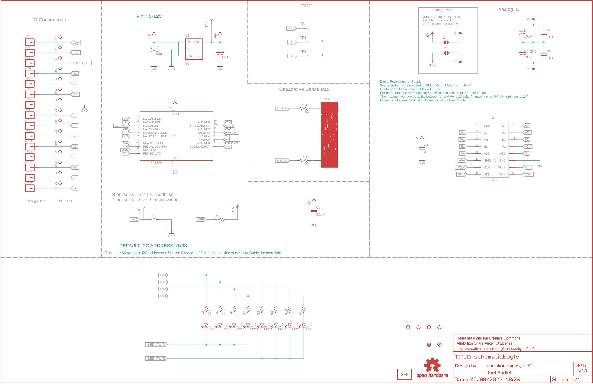](eagleSchemImage.png)
## PCB
  
[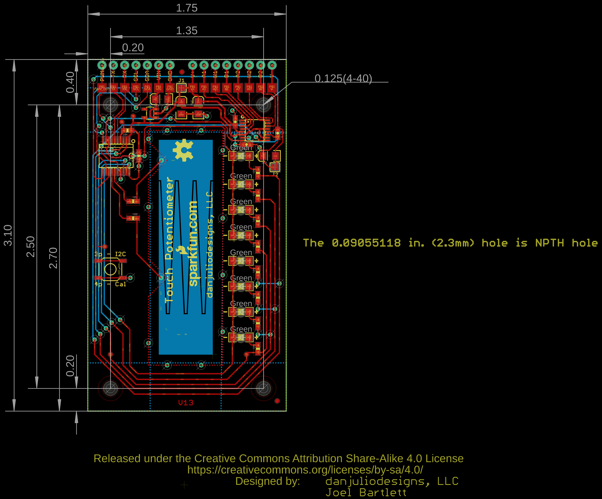](eagleImage.png)
## Interactive BOM

- Interactive BOM page: [ibom.html](https://htmlpreview.github.io/?https://github.com/oomlout/oomlout_OOMP_projects/blob/main/PROJ-SPAR-13144-STAN-01/kicad/bom/ibom.html)

## OOMP Parts
  

|OOMP ID|Name|Identifier|
| :---: | :---: | :---: |
|[CAPT-3216-X-UF10-V10](https://github.com/oomlout/oomlout_OOMP_parts/tree/main/CAPT-3216-X-UF10-V10/)|[SMD (3216) 10 uF Capacitor (Tantalum) 10v](https://github.com/oomlout/oomlout_OOMP_parts/tree/main/CAPT-3216-X-UF10-V10/)|[C1, C2, C5, C7](https://github.com/oomlout/oomlout_OOMP_parts/tree/main/CAPT-3216-X-UF10-V10/)|
|[CAPC-0603-X-NF100-V50](https://github.com/oomlout/oomlout_OOMP_parts/tree/main/CAPC-0603-X-NF100-V50/)|[SMD (0603) 100 nF Capacitor (Ceramic) 50v](https://github.com/oomlout/oomlout_OOMP_parts/tree/main/CAPC-0603-X-NF100-V50/)|[C3, C4, C6, C8](https://github.com/oomlout/oomlout_OOMP_parts/tree/main/CAPC-0603-X-NF100-V50/)|
|LEDS-1206-G-STAN-01||D1, D2, D3, D4, D5, D6, D7, D8|
|UNMATCHED-UNMATCHED-X-UNMATCHED-01||J1, J2, S1, TP1, TP2, TP3, TP4, TP5, TP6, TP7, TP8, TP9, TP10, TP11, TP12, TP13, TP14, TP15, TP16, TP17, TP18, TP19, TP20, TS1, U1, U2|
|HEAD-I01-X-PI01-01||JP1, JP2, JP3, JP4, JP5, JP6, JP7, JP8, JP9, JP10, JP11, JP12, JP13, JP14, JP15|
|[RESE-0603-X-O103-01](https://github.com/oomlout/oomlout_OOMP_parts/tree/main/RESE-0603-X-O103-01/)|[SMD (0603) 10k Ohm Resistor](https://github.com/oomlout/oomlout_OOMP_parts/tree/main/RESE-0603-X-O103-01/)|[R1](https://github.com/oomlout/oomlout_OOMP_parts/tree/main/RESE-0603-X-O103-01/)|
|[RESE-0603-X-O101-01](https://github.com/oomlout/oomlout_OOMP_parts/tree/main/RESE-0603-X-O101-01/)|[SMD (0603) 100 Ohm Resistor](https://github.com/oomlout/oomlout_OOMP_parts/tree/main/RESE-0603-X-O101-01/)|[R2, R3, R4, R5, R6, R7, R8, R9, R10, R11](https://github.com/oomlout/oomlout_OOMP_parts/tree/main/RESE-0603-X-O101-01/)|
|VREG-SO235-X-KMIC5205-01||U3|

## Images
  
  

|bominteractivefront|bominteractiveback|kicadPcb3d|kicadPcb3dFront|kicadPcb3dBack|eagleImage|eagleSchemImage|pcbdraw|pcbdrawback|
| :---: | :---: | :---: | :---: | :---: | :---: | :---: | :---: | :---: |
|[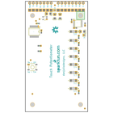](bomFront.png)|[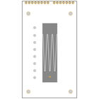](bomBack.png)|[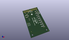](kicadPcb3d.png)|[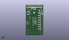](kicadPcb3dFront.png)|[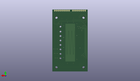](kicadPcb3dBack.png)|[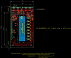](eagleImage.png)|[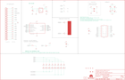](eagleSchemImage.png)|[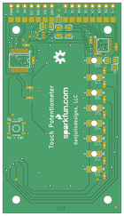](pcbdraw.png)|[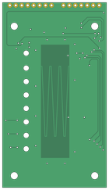](pcbdrawBack.png)|

## Tags

- hexID: PRS13144
- oompType: PROJ
- oompSize: SPAR
- oompColor: 13144
- oompDesc: STAN
- oompIndex: 01
- oompName: Touch Potentiometer
- sources: All source files from https://github.com/sparkfun/Touch_Potentiometer (source licence details in srcLicense.md)
- linkBuyPage: https://www.sparkfun.com/products/13144
- oompID: PROJ-SPAR-13144-STAN-01
- oompParts: C1,CAPT-3216-X-UF10-V10
- oompParts: C2,CAPT-3216-X-UF10-V10
- oompParts: C3,CAPC-0603-X-NF100-V50
- oompParts: C4,CAPC-0603-X-NF100-V50
- oompParts: C5,CAPT-3216-X-UF10-V10
- oompParts: C6,CAPC-0603-X-NF100-V50
- oompParts: C7,CAPT-3216-X-UF10-V10
- oompParts: C8,CAPC-0603-X-NF100-V50
- oompParts: D1,LEDS-1206-G-STAN-01
- oompParts: D2,LEDS-1206-G-STAN-01
- oompParts: D3,LEDS-1206-G-STAN-01
- oompParts: D4,LEDS-1206-G-STAN-01
- oompParts: D5,LEDS-1206-G-STAN-01
- oompParts: D6,LEDS-1206-G-STAN-01
- oompParts: D7,LEDS-1206-G-STAN-01
- oompParts: D8,LEDS-1206-G-STAN-01
- oompParts: J1,UNMATCHED-UNMATCHED-X-UNMATCHED-01
- oompParts: J2,UNMATCHED-UNMATCHED-X-UNMATCHED-01
- oompParts: JP1,HEAD-I01-X-PI01-01
- oompParts: JP2,HEAD-I01-X-PI01-01
- oompParts: JP3,HEAD-I01-X-PI01-01
- oompParts: JP4,HEAD-I01-X-PI01-01
- oompParts: JP5,HEAD-I01-X-PI01-01
- oompParts: JP6,HEAD-I01-X-PI01-01
- oompParts: JP7,HEAD-I01-X-PI01-01
- oompParts: JP8,HEAD-I01-X-PI01-01
- oompParts: JP9,HEAD-I01-X-PI01-01
- oompParts: JP10,HEAD-I01-X-PI01-01
- oompParts: JP11,HEAD-I01-X-PI01-01
- oompParts: JP12,HEAD-I01-X-PI01-01
- oompParts: JP13,HEAD-I01-X-PI01-01
- oompParts: JP14,HEAD-I01-X-PI01-01
- oompParts: JP15,HEAD-I01-X-PI01-01
- oompParts: R1,RESE-0603-X-O103-01
- oompParts: R2,RESE-0603-X-O101-01
- oompParts: R3,RESE-0603-X-O101-01
- oompParts: R4,RESE-0603-X-O101-01
- oompParts: R5,RESE-0603-X-O101-01
- oompParts: R6,RESE-0603-X-O101-01
- oompParts: R7,RESE-0603-X-O101-01
- oompParts: R8,RESE-0603-X-O101-01
- oompParts: R9,RESE-0603-X-O101-01
- oompParts: R10,RESE-0603-X-O101-01
- oompParts: R11,RESE-0603-X-O101-01
- oompParts: S1,UNMATCHED-UNMATCHED-X-UNMATCHED-01
- oompParts: TP1,UNMATCHED-UNMATCHED-X-UNMATCHED-01
- oompParts: TP2,UNMATCHED-UNMATCHED-X-UNMATCHED-01
- oompParts: TP3,UNMATCHED-UNMATCHED-X-UNMATCHED-01
- oompParts: TP4,UNMATCHED-UNMATCHED-X-UNMATCHED-01
- oompParts: TP5,UNMATCHED-UNMATCHED-X-UNMATCHED-01
- oompParts: TP6,UNMATCHED-UNMATCHED-X-UNMATCHED-01
- oompParts: TP7,UNMATCHED-UNMATCHED-X-UNMATCHED-01
- oompParts: TP8,UNMATCHED-UNMATCHED-X-UNMATCHED-01
- oompParts: TP9,UNMATCHED-UNMATCHED-X-UNMATCHED-01
- oompParts: TP10,UNMATCHED-UNMATCHED-X-UNMATCHED-01
- oompParts: TP11,UNMATCHED-UNMATCHED-X-UNMATCHED-01
- oompParts: TP12,UNMATCHED-UNMATCHED-X-UNMATCHED-01
- oompParts: TP13,UNMATCHED-UNMATCHED-X-UNMATCHED-01
- oompParts: TP14,UNMATCHED-UNMATCHED-X-UNMATCHED-01
- oompParts: TP15,UNMATCHED-UNMATCHED-X-UNMATCHED-01
- oompParts: TP16,UNMATCHED-UNMATCHED-X-UNMATCHED-01
- oompParts: TP17,UNMATCHED-UNMATCHED-X-UNMATCHED-01
- oompParts: TP18,UNMATCHED-UNMATCHED-X-UNMATCHED-01
- oompParts: TP19,UNMATCHED-UNMATCHED-X-UNMATCHED-01
- oompParts: TP20,UNMATCHED-UNMATCHED-X-UNMATCHED-01
- oompParts: TS1,UNMATCHED-UNMATCHED-X-UNMATCHED-01
- oompParts: U1,UNMATCHED-UNMATCHED-X-UNMATCHED-01
- oompParts: U2,UNMATCHED-UNMATCHED-X-UNMATCHED-01
- oompParts: U3,VREG-SO235-X-KMIC5205-01
- rawParts: C1,10uF,10UF-16V-10%(TANT),EIA3216,CAP-00811,CAP-00811,10uF,
- rawParts: C2,10uF,10UF-16V-10%(TANT),EIA3216,CAP-00811,CAP-00811,10uF,
- rawParts: C3,0.1uF,0.1UF-25V(+80/-20%)(0603),0603-CAP,CAP-00810,CAP-00810,0.1uF,
- rawParts: C4,0.1uF,0.1UF-25V(+80/-20%)(0603),0603-CAP,CAP-00810,CAP-00810,0.1uF,
- rawParts: C5,10uF,10UF-16V-10%(TANT),EIA3216,CAP-00811,CAP-00811,10uF,
- rawParts: C6,0.1uF,0.1UF-25V(+80/-20%)(0603),0603-CAP,CAP-00810,CAP-00810,0.1uF,
- rawParts: C7,10uF,10UF-16V-10%(TANT),EIA3216,CAP-00811,CAP-00811,10uF,
- rawParts: C8,0.1uF,0.1UF-25V(+80/-20%)(0603),0603-CAP,CAP-00810,CAP-00810,0.1uF,
- rawParts: D1,Green,LED-GREEN1206-BOTTOM,LED-1206-BOTTOM,Various green LEDs,DIO-11076,Green,
- rawParts: D2,Green,LED-GREEN1206-BOTTOM,LED-1206-BOTTOM,Various green LEDs,DIO-11076,Green,
- rawParts: D3,Green,LED-GREEN1206-BOTTOM,LED-1206-BOTTOM,Various green LEDs,DIO-11076,Green,
- rawParts: D4,Green,LED-GREEN1206-BOTTOM,LED-1206-BOTTOM,Various green LEDs,DIO-11076,Green,
- rawParts: D5,Green,LED-GREEN1206-BOTTOM,LED-1206-BOTTOM,Various green LEDs,DIO-11076,Green,
- rawParts: D6,Green,LED-GREEN1206-BOTTOM,LED-1206-BOTTOM,Various green LEDs,DIO-11076,Green,
- rawParts: D7,Green,LED-GREEN1206-BOTTOM,LED-1206-BOTTOM,Various green LEDs,DIO-11076,Green,
- rawParts: D8,Green,LED-GREEN1206-BOTTOM,LED-1206-BOTTOM,Various green LEDs,DIO-11076,Green,
- rawParts: FID1,FIDUCIAL1X2,FIDUCIAL1X2,FIDUCIAL-1X2,Fiducial Alignment Points,,,
- rawParts: FID2,FIDUCIAL1X2,FIDUCIAL1X2,FIDUCIAL-1X2,Fiducial Alignment Points,,,
- rawParts: FRAME3,FRAME-LEDGER,FRAME-LEDGER,CREATIVE_COMMONS,Schematic Frame,,,
- rawParts: J1,,SJCLOSED,SJ_2S,Solder jumper,,,
- rawParts: J2,,SJCLOSED,SJ_2S,Solder jumper,,,
- rawParts: JP1,,M01SMDNS,1X01NS,Header 1,,,
- rawParts: JP2,,M01SMDNS,1X01NS,Header 1,,,
- rawParts: JP3,,M01SMDNS,1X01NS,Header 1,,,
- rawParts: JP4,,M01SMDNS,1X01NS,Header 1,,,
- rawParts: JP5,,M01SMDNS,1X01NS,Header 1,,,
- rawParts: JP6,,M01SMDNS,1X01NS,Header 1,,,
- rawParts: JP7,,M01SMDNS,1X01NS,Header 1,,,
- rawParts: JP8,,M01SMDNS,1X01NS,Header 1,,,
- rawParts: JP9,,M01SMDNS,1X01NS,Header 1,,,
- rawParts: JP10,,M01SMDNS,1X01NS,Header 1,,,
- rawParts: JP11,,M01SMDNS,1X01NS,Header 1,,,
- rawParts: JP12,,M01SMDNS,1X01NS,Header 1,,,
- rawParts: JP13,,M01SMDNS,1X01NS,Header 1,,,
- rawParts: JP14,,M01SMDNS,1X01NS,Header 1,,,
- rawParts: JP15,,M01SMDNS,1X01NS,Header 1,,,
- rawParts: R1,10K,10KOHM-1/10W-1%(0603)0603,0603-RES,RES-00824,RES-00824,10K,
- rawParts: R2,100,100OHM-1/10W-1%(0603),0603-RES,RES-07863,RES-07863,100,
- rawParts: R3,100,100OHM-1/10W-1%(0603),0603-RES,RES-07863,RES-07863,100,
- rawParts: R4,100,100OHM-1/10W-1%(0603),0603-RES,RES-07863,RES-07863,100,
- rawParts: R5,100,100OHM-1/10W-1%(0603),0603-RES,RES-07863,RES-07863,100,
- rawParts: R6,100,100OHM-1/10W-1%(0603),0603-RES,RES-07863,RES-07863,100,
- rawParts: R7,100,100OHM-1/10W-1%(0603),0603-RES,RES-07863,RES-07863,100,
- rawParts: R8,100,100OHM-1/10W-1%(0603),0603-RES,RES-07863,RES-07863,100,
- rawParts: R9,100,100OHM-1/10W-1%(0603),0603-RES,RES-07863,RES-07863,100,
- rawParts: R10,100,100OHM-1/10W-1%(0603),0603-RES,RES-07863,RES-07863,100,
- rawParts: R11,100,100OHM-1/10W-1%(0603),0603-RES,RES-07863,RES-07863,100,
- rawParts: S1,,SWITCH-MOMENTARY-2SMD,TACTILE-SWITCH-SMD,Various NO switches- pushbuttons, reed, etc,SWCH-08247,,
- rawParts: STANDOFF1,STAND-OFFTIGHT,STAND-OFFTIGHT,STAND-OFF-TIGHT,#4 Stand Off,,,
- rawParts: STANDOFF2,STAND-OFFTIGHT,STAND-OFFTIGHT,STAND-OFF-TIGHT,#4 Stand Off,,,
- rawParts: STANDOFF3,STAND-OFFTIGHT,STAND-OFFTIGHT,STAND-OFF-TIGHT,#4 Stand Off,,,
- rawParts: STANDOFF4,STAND-OFFTIGHT,STAND-OFFTIGHT,STAND-OFF-TIGHT,#4 Stand Off,,,
- rawParts: TP1,,TEST-POINT3X4,PAD.03X.04,Bare copper test points for troubleshooting or ICT,,,
- rawParts: TP2,,TEST-POINT3X4,PAD.03X.04,Bare copper test points for troubleshooting or ICT,,,
- rawParts: TP3,,TEST-POINT3X4,PAD.03X.04,Bare copper test points for troubleshooting or ICT,,,
- rawParts: TP4,,TEST-POINT3X4,PAD.03X.04,Bare copper test points for troubleshooting or ICT,,,
- rawParts: TP5,,TEST-POINT3X4,PAD.03X.04,Bare copper test points for troubleshooting or ICT,,,
- rawParts: TP6,,SINGLE_PADSMD,2MM_SMD_PAD,,,,
- rawParts: TP7,,SINGLE_PADSMD,2MM_SMD_PAD,,,,
- rawParts: TP8,,SINGLE_PADSMD,2MM_SMD_PAD,,,,
- rawParts: TP9,,SINGLE_PADSMD,2MM_SMD_PAD,,,,
- rawParts: TP10,,SINGLE_PADSMD,2MM_SMD_PAD,,,,
- rawParts: TP11,,SINGLE_PADSMD,2MM_SMD_PAD,,,,
- rawParts: TP12,,SINGLE_PADSMD,2MM_SMD_PAD,,,,
- rawParts: TP13,,SINGLE_PADSMD,2MM_SMD_PAD,,,,
- rawParts: TP14,,SINGLE_PADSMD,2MM_SMD_PAD,,,,
- rawParts: TP15,,SINGLE_PADSMD,2MM_SMD_PAD,,,,
- rawParts: TP16,,SINGLE_PADSMD,2MM_SMD_PAD,,,,
- rawParts: TP17,,SINGLE_PADSMD,2MM_SMD_PAD,,,,
- rawParts: TP18,,SINGLE_PADSMD,2MM_SMD_PAD,,,,
- rawParts: TP19,,SINGLE_PADSMD,2MM_SMD_PAD,,,,
- rawParts: TP20,,SINGLE_PADSMD,2MM_SMD_PAD,,,,
- rawParts: TS1,,2CH_LINEAR_TOUCH,2CH_48MM_LINEAR_TOUCH,,,,
- rawParts: U$4,OSHW-LOGOM,OSHW-LOGOM,OSHW-LOGO-M,Open Source Hardware Logo This logo indicates the piece of hardware it is found on incorporates a OSHW license and/or adheres to the definition of open source hardware found here: http://freedomdefined.org/OSHW,,,
- rawParts: U$5,SFE_LOGO_NAME_WEB,SFE_LOGO_NAME_WEB,SFE-NEW-WEBLOGO,SparkFun.com board silk.,,,
- rawParts: U1,PIC16F1829,PIC16F1829,SSOP20,,IC-12357,,
- rawParts: U2,AD5262,AD5262,SSOP16,,IC-12358,,
- rawParts: U3,5V,V_REG_MIC52055V,SOT23-5,V_REG MIC5219,VREG-00823,5V,

[im]: kicadPcb3d_450.png
