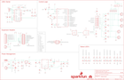

Contents
========

* [PRS13155 > SparkFun Stepoko](#prs13155--sparkfun-stepoko)
	* [Schematic](#schematic)
	* [PCB](#pcb)
	* [Interactive BOM](#interactive-bom)
	* [OOMP Parts](#oomp-parts)
	* [Images](#images)
	* [Tags](#tags)
  
![][im]
# PRS13155 > SparkFun Stepoko

- ID: PROJ-SPAR-13155-STAN-01
- Hex ID: PRS13155
- Name: Sparkfun
- Description: Sparkfun
- Long Link: [http://oom.lt/PROJ-SPAR-13155-STAN-01](http://oom.lt/PROJ-SPAR-13155-STAN-01)
- Short Link: [http://oom.lt/PRS13155](http://oom.lt/PRS13155)

## Schematic
  

## PCB
  

## Interactive BOM

- Interactive BOM page: [ibom.html](https://htmlpreview.github.io/?https://github.com/oomlout/oomlout_OOMP_projects/blob/main/PROJ-SPAR-13155-STAN-01/kicad/bom/ibom.html)

## OOMP Parts
  

|OOMP Parts|
| :---: |
|C1 C1,CAPC-UNMATCHED-X-NF220-01|
|C2 C2,CAPC-0603-X-UF1D-01|
|C3 C3,CAPC-0603-X-UF1D-01|
|C4 C4,CAPC-1206-X-UF1-01|
|C5 C5,CAPC-0603-X-UF1D-01|
|C6 C6,CAPC-UNMATCHED-X-NF220-01|
|C7 C7,CAPC-0603-X-UF1D-01|
|C8 C8,CAPC-UNMATCHED-X-NF220-01|
|C9 C9,CAPC-0603-X-NF10-01|
|C10 C10,CAPC-0603-X-UF1D-01|
|C11 C11,CAPC-0603-X-UF1D-01|
|C12 C12,CAPC-0603-X-NF1-01|
|C13 C13,CAPC-0603-X-NF1-01|
|C14 C14,CAPX-UNMATCHED-X-UF47-01|
|C15 C15,CAPC-0603-X-NF180-01|
|C16 C16,CAPC-UNMATCHED-X-NF220-01|
|C17 C17,CAPC-UNMATCHED-X-NF220-01|
|C18 C18,CAPC-UNMATCHED-X-NF220-01|
|C19 C19,CAPC-0603-X-UF1D-01|
|C20 C20,CAPC-0603-X-UF1D-01|
|C21 C21,CAPC-0603-X-NF1-01|
|C22 C22,CAPC-0603-X-NF1-01|
|C23 C23,CAPX-UNMATCHED-X-UF47-01|
|C24 C24,CAPC-0603-X-UF1D-01|
|C25 C25,CAPX-UNMATCHED-X-UF47-01|
|C26 C26,CAPX-UNMATCHED-X-UF47-01|
|C27 C27,CAPC-UNMATCHED-X-NF220-01|
|C28 C28,CAPC-UNMATCHED-X-NF220-01|
|C29 C29,CAPC-UNMATCHED-X-NF220-01|
|C30 C30,CAPC-0603-X-UF1D-01|
|C31 C31,CAPC-0603-X-UF1D-01|
|C32 C32,CAPC-0603-X-NF180-01|
|C33 C33,CAPC-0603-X-NF1-01|
|C34 C34,CAPC-0603-X-NF1-01|
|C35 C35,CAPX-UNMATCHED-X-UF47-01|
|C36 C36,CAPC-0603-X-NF180-01|
|C37 C37,CAPC-0603-X-UF1D-01|
|C38 C38,CAPX-UNMATCHED-X-UF47-01|
|C39 C39,CAPX-UNMATCHED-X-UF22-01|
|C40 C40,CAPX-UNMATCHED-X-UF47-01|
|C41 C41,CAPX-UNMATCHED-X-UF47-01|
|C42 C42,CAPC-1206-X-UF1-01|
|C43 C43,CAPC-0603-X-UF1D-01|
|C44 C44,CAPC-0603-X-UF1D-01|
|C45 C45,CAPC-0603-X-UF1D-01|
|C46 C46,CAPC-0603-X-UF1D-01|
|C47 C47,CAPC-0603-X-UF1D-01|
|C50 C50,CAPC-0603-X-UF1D-01|
|C51 C51,CAPC-0603-X-UF1D-01|
|C52 C52,CAPC-0603-X-UF1D-01|
|C53 C53,CAPC-0603-X-UF1D-01|
|C54 C54,CAPC-0603-X-UF1D-01|
|C55 C55,CAPC-0603-X-UF1D-01|
|C56 C56,CAPC-0603-X-UF1D-01|
|C57 C57,CAPC-0603-X-UF1D-01|
|C58 C58,CAPC-0603-X-UF1D-01|
|D1 D1,LEDS-1206-G-STAN-01|
|D2 D2,LEDS-1206-G-STAN-01|
|D3 D3,LEDS-1206-G-STAN-01|
|D4 D4,LEDS-1206-G-STAN-01|
|D5 D5,LEDS-1206-G-STAN-01|
|D6 D6,LEDS-1206-G-STAN-01|
|D7 D7,LEDS-1206-G-STAN-01|
|D8 D8,LEDS-1206-G-STAN-01|
|D9 D9,LEDS-1206-G-STAN-01|
|D10 D10,LEDS-1206-G-STAN-01|
|D11 D11,LEDS-1206-G-STAN-01|
|D12 D12,LEDS-1206-G-STAN-01|
|D13 D13,LEDS-1206-G-STAN-01|
|D14 D14,LEDS-1206-G-STAN-01|
|D15 D15,LEDS-1206-G-STAN-01|
|D16 D16,DIOD-UNMATCHED-X-UNMATCHED-01|
|D17 D17,DIOD-UNMATCHED-X-UNMATCHED-01|
|D18 D18,LEDS-1206-G-STAN-01|
|F1 F1,UNMATCHED-1206-X-UNMATCHED-01|
|J1 J1,UNMATCHED-UNMATCHED-X-UNMATCHED-01|
|[JP1 TERS-35D-L-PI02-01 3.5 mm 2 Pin Blue Screw Terminal](https://github.com/oomlout/oomlout_OOMP_parts/tree/main/TERS-35D-L-PI02-01/)|
|JP2 JP2,UNMATCHED-UNMATCHED-X-UNMATCHED-01|
|[JP3 TERS-35D-L-PI02-01 3.5 mm 2 Pin Blue Screw Terminal](https://github.com/oomlout/oomlout_OOMP_parts/tree/main/TERS-35D-L-PI02-01/)|
|[JP4 TERS-35D-L-PI02-01 3.5 mm 2 Pin Blue Screw Terminal](https://github.com/oomlout/oomlout_OOMP_parts/tree/main/TERS-35D-L-PI02-01/)|
|JP5 JP5,UNMATCHED-UNMATCHED-X-UNMATCHED-01|
|JP6 JP6,UNMATCHED-UNMATCHED-X-UNMATCHED-01|
|[JP8 TERS-35D-L-PI02-01 3.5 mm 2 Pin Blue Screw Terminal](https://github.com/oomlout/oomlout_OOMP_parts/tree/main/TERS-35D-L-PI02-01/)|
|[JP9 TERS-35D-L-PI02-01 3.5 mm 2 Pin Blue Screw Terminal](https://github.com/oomlout/oomlout_OOMP_parts/tree/main/TERS-35D-L-PI02-01/)|
|[JP15 TERS-35D-L-PI02-01 3.5 mm 2 Pin Blue Screw Terminal](https://github.com/oomlout/oomlout_OOMP_parts/tree/main/TERS-35D-L-PI02-01/)|
|[JP19 HEAD-I01-X-PI12-01 2.54 mm 12 Pin Header](https://github.com/oomlout/oomlout_OOMP_parts/tree/main/HEAD-I01-X-PI12-01/)|
|L1 L1,UNMATCHED-UNMATCHED-X-UNMATCHED-01|
|POT1 POT1,UNMATCHED-UNMATCHED-X-UNMATCHED-01|
|POT2 POT2,UNMATCHED-UNMATCHED-X-UNMATCHED-01|
|POT3 POT3,UNMATCHED-UNMATCHED-X-UNMATCHED-01|
|Q1 Q1,UNMATCHED-UNMATCHED-X-UNMATCHED-01|
|Q2 Q2,UNMATCHED-UNMATCHED-X-UNMATCHED-01|
|R1 R1,RESE-0603-X-UNMATCHED-01|
|R2 R2,RESE-UNMATCHED-X-UNMATCHED-01|
|R3 R3,RESE-UNMATCHED-X-UNMATCHED-01|
|[R4 RESE-0603-X-O393-01 SMD (0603) 39k Ohm Resistor](https://github.com/oomlout/oomlout_OOMP_parts/tree/main/RESE-0603-X-O393-01/)|
|[R5 RESE-0603-X-O393-01 SMD (0603) 39k Ohm Resistor](https://github.com/oomlout/oomlout_OOMP_parts/tree/main/RESE-0603-X-O393-01/)|
|[R6 RESE-0603-X-O103-01 SMD (0603) 10k Ohm Resistor](https://github.com/oomlout/oomlout_OOMP_parts/tree/main/RESE-0603-X-O103-01/)|
|R7 R7,RESE-0603-X-UNMATCHED-01|
|R8 R8,RESE-0603-X-UNMATCHED-01|
|R9 R9,RESE-UNMATCHED-X-O102-01|
|R10 R10,RESE-UNMATCHED-X-UNMATCHED-01|
|R11 R11,RESE-UNMATCHED-X-UNMATCHED-01|
|[R12 RESE-0603-X-O393-01 SMD (0603) 39k Ohm Resistor](https://github.com/oomlout/oomlout_OOMP_parts/tree/main/RESE-0603-X-O393-01/)|
|[R13 RESE-0603-X-O393-01 SMD (0603) 39k Ohm Resistor](https://github.com/oomlout/oomlout_OOMP_parts/tree/main/RESE-0603-X-O393-01/)|
|R14 R14,RESE-0603-X-UNMATCHED-01|
|R15 R15,RESE-0603-X-UNMATCHED-01|
|[R16 RESE-0603-X-O103-01 SMD (0603) 10k Ohm Resistor](https://github.com/oomlout/oomlout_OOMP_parts/tree/main/RESE-0603-X-O103-01/)|
|R17 R17,RESE-0603-X-UNMATCHED-01|
|R18 R18,RESE-UNMATCHED-X-O102-01|
|R19 R19,RESE-UNMATCHED-X-UNMATCHED-01|
|R20 R20,RESE-UNMATCHED-X-UNMATCHED-01|
|[R21 RESE-0603-X-O393-01 SMD (0603) 39k Ohm Resistor](https://github.com/oomlout/oomlout_OOMP_parts/tree/main/RESE-0603-X-O393-01/)|
|[R22 RESE-0603-X-O393-01 SMD (0603) 39k Ohm Resistor](https://github.com/oomlout/oomlout_OOMP_parts/tree/main/RESE-0603-X-O393-01/)|
|R23 R23,RESE-0603-X-UNMATCHED-01|
|R24 R24,RESE-0603-X-UNMATCHED-01|
|[R25 RESE-0603-X-O103-01 SMD (0603) 10k Ohm Resistor](https://github.com/oomlout/oomlout_OOMP_parts/tree/main/RESE-0603-X-O103-01/)|
|R26 R26,RESE-0603-X-UNMATCHED-01|
|[R27 RESE-0603-X-O103-01 SMD (0603) 10k Ohm Resistor](https://github.com/oomlout/oomlout_OOMP_parts/tree/main/RESE-0603-X-O103-01/)|
|[R28 RESE-0603-X-O103-01 SMD (0603) 10k Ohm Resistor](https://github.com/oomlout/oomlout_OOMP_parts/tree/main/RESE-0603-X-O103-01/)|
|[R29 RESE-0603-X-O103-01 SMD (0603) 10k Ohm Resistor](https://github.com/oomlout/oomlout_OOMP_parts/tree/main/RESE-0603-X-O103-01/)|
|R30 R30,RESE-UNMATCHED-X-O102-01|
|[R31 RESE-0603-X-O102-01 SMD (0603) 1k Ohm Resistor](https://github.com/oomlout/oomlout_OOMP_parts/tree/main/RESE-0603-X-O102-01/)|
|[R32 RESE-0603-X-O102-01 SMD (0603) 1k Ohm Resistor](https://github.com/oomlout/oomlout_OOMP_parts/tree/main/RESE-0603-X-O102-01/)|
|R33 R33,RESE-UNMATCHED-X-O102-01|
|R34 R34,RESE-UNMATCHED-X-O102-01|
|[R35 RESE-0603-X-O103-01 SMD (0603) 10k Ohm Resistor](https://github.com/oomlout/oomlout_OOMP_parts/tree/main/RESE-0603-X-O103-01/)|
|R36 R36,RESE-UNMATCHED-X-O102-01|
|[R37 RESE-0603-X-O103-01 SMD (0603) 10k Ohm Resistor](https://github.com/oomlout/oomlout_OOMP_parts/tree/main/RESE-0603-X-O103-01/)|
|[R38 RESE-0603-X-O103-01 SMD (0603) 10k Ohm Resistor](https://github.com/oomlout/oomlout_OOMP_parts/tree/main/RESE-0603-X-O103-01/)|
|[R39 RESE-0603-X-O102-01 SMD (0603) 1k Ohm Resistor](https://github.com/oomlout/oomlout_OOMP_parts/tree/main/RESE-0603-X-O102-01/)|
|[R40 RESE-0603-X-O102-01 SMD (0603) 1k Ohm Resistor](https://github.com/oomlout/oomlout_OOMP_parts/tree/main/RESE-0603-X-O102-01/)|
|[R41 RESE-0603-X-O102-01 SMD (0603) 1k Ohm Resistor](https://github.com/oomlout/oomlout_OOMP_parts/tree/main/RESE-0603-X-O102-01/)|
|[R42 RESE-0603-X-O102-01 SMD (0603) 1k Ohm Resistor](https://github.com/oomlout/oomlout_OOMP_parts/tree/main/RESE-0603-X-O102-01/)|
|[R43 RESE-0603-X-O102-01 SMD (0603) 1k Ohm Resistor](https://github.com/oomlout/oomlout_OOMP_parts/tree/main/RESE-0603-X-O102-01/)|
|[R44 RESE-0603-X-O102-01 SMD (0603) 1k Ohm Resistor](https://github.com/oomlout/oomlout_OOMP_parts/tree/main/RESE-0603-X-O102-01/)|
|[R45 RESE-0603-X-O102-01 SMD (0603) 1k Ohm Resistor](https://github.com/oomlout/oomlout_OOMP_parts/tree/main/RESE-0603-X-O102-01/)|
|[R46 RESE-0603-X-O102-01 SMD (0603) 1k Ohm Resistor](https://github.com/oomlout/oomlout_OOMP_parts/tree/main/RESE-0603-X-O102-01/)|
|[R47 RESE-0603-X-O102-01 SMD (0603) 1k Ohm Resistor](https://github.com/oomlout/oomlout_OOMP_parts/tree/main/RESE-0603-X-O102-01/)|
|R48 R48,RESE-UNMATCHED-X-O102-01|
|[R49 RESE-0603-X-O102-01 SMD (0603) 1k Ohm Resistor](https://github.com/oomlout/oomlout_OOMP_parts/tree/main/RESE-0603-X-O102-01/)|
|R50 R50,RESE-UNMATCHED-X-O102-01|
|[R51 RESE-0603-X-O103-01 SMD (0603) 10k Ohm Resistor](https://github.com/oomlout/oomlout_OOMP_parts/tree/main/RESE-0603-X-O103-01/)|
|[R52 RESE-0603-X-O103-01 SMD (0603) 10k Ohm Resistor](https://github.com/oomlout/oomlout_OOMP_parts/tree/main/RESE-0603-X-O103-01/)|
|R53 R53,RESE-0603-X-UNMATCHED-01|
|R54 R54,RESE-0603-X-UNMATCHED-01|
|R55 R55,RESE-0603-X-O3483-01|
|[R56 RESE-0603-X-O103-01 SMD (0603) 10k Ohm Resistor](https://github.com/oomlout/oomlout_OOMP_parts/tree/main/RESE-0603-X-O103-01/)|
|R57 R57,RESE-UNMATCHED-X-O102-01|
|R58 R58,RESE-UNMATCHED-X-O102-01|
|S1 S1,UNMATCHED-UNMATCHED-X-UNMATCHED-01|
|S2 S2,UNMATCHED-UNMATCHED-X-UNMATCHED-01|
|S3 S3,UNMATCHED-UNMATCHED-X-UNMATCHED-01|
|S4 S4,UNMATCHED-UNMATCHED-X-UNMATCHED-01|
|S5 S5,UNMATCHED-UNMATCHED-X-UNMATCHED-01|
|U1 U1,UNMATCHED-UNMATCHED-X-UNMATCHED-01|
|U2 U2,UNMATCHED-UNMATCHED-X-UNMATCHED-01|
|U3 U3,UNMATCHED-UNMATCHED-X-UNMATCHED-01|
|U4 U4,UNMATCHED-UNMATCHED-X-UNMATCHED-01|
|U5 U5,UNMATCHED-UNMATCHED-X-UNMATCHED-01|
|U6 U6,UNMATCHED-UNMATCHED-X-UNMATCHED-01|
|U7 U7,UNMATCHED-UNMATCHED-X-UNMATCHED-01|
|U8 U8,UNMATCHED-UNMATCHED-X-UNMATCHED-01|
|U9 U9,UNMATCHED-UNMATCHED-X-UNMATCHED-01|
|U10 U10,UNMATCHED-UNMATCHED-X-UNMATCHED-01|
|[VIN TERS-35D-L-PI02-01 3.5 mm 2 Pin Blue Screw Terminal](https://github.com/oomlout/oomlout_OOMP_parts/tree/main/TERS-35D-L-PI02-01/)|
|[X-A TERS-35D-L-PI02-01 3.5 mm 2 Pin Blue Screw Terminal](https://github.com/oomlout/oomlout_OOMP_parts/tree/main/TERS-35D-L-PI02-01/)|
|[X-B TERS-35D-L-PI02-01 3.5 mm 2 Pin Blue Screw Terminal](https://github.com/oomlout/oomlout_OOMP_parts/tree/main/TERS-35D-L-PI02-01/)|
|[Y-A TERS-35D-L-PI02-01 3.5 mm 2 Pin Blue Screw Terminal](https://github.com/oomlout/oomlout_OOMP_parts/tree/main/TERS-35D-L-PI02-01/)|
|[Y-B TERS-35D-L-PI02-01 3.5 mm 2 Pin Blue Screw Terminal](https://github.com/oomlout/oomlout_OOMP_parts/tree/main/TERS-35D-L-PI02-01/)|
|[Z-A TERS-35D-L-PI02-01 3.5 mm 2 Pin Blue Screw Terminal](https://github.com/oomlout/oomlout_OOMP_parts/tree/main/TERS-35D-L-PI02-01/)|
|[Z-B TERS-35D-L-PI02-01 3.5 mm 2 Pin Blue Screw Terminal](https://github.com/oomlout/oomlout_OOMP_parts/tree/main/TERS-35D-L-PI02-01/)|

## Images
  
  

|kicadPcb3d|kicadPcb3dFront|kicadPcb3dBack|eagleImage|eagleSchemImage|
| :---: | :---: | :---: | :---: | :---: |
||||||

## Tags

- hexID: PRS13155
- oompType: PROJ
- oompSize: SPAR
- oompColor: 13155
- oompDesc: STAN
- oompIndex: 01
- oompName: SparkFun Stepoko
- sources: All source files from https://github.com/sparkfun/SparkFun_Stepoko (source licence details in srcLicense.md)
- linkBuyPage: https://www.sparkfun.com/products/13155
- oompID: PROJ-SPAR-13155-STAN-01
- oompParts: C1,CAPC-UNMATCHED-X-NF220-01
- oompParts: C2,CAPC-0603-X-UF1D-01
- oompParts: C3,CAPC-0603-X-UF1D-01
- oompParts: C4,CAPC-1206-X-UF1-01
- oompParts: C5,CAPC-0603-X-UF1D-01
- oompParts: C6,CAPC-UNMATCHED-X-NF220-01
- oompParts: C7,CAPC-0603-X-UF1D-01
- oompParts: C8,CAPC-UNMATCHED-X-NF220-01
- oompParts: C9,CAPC-0603-X-NF10-01
- oompParts: C10,CAPC-0603-X-UF1D-01
- oompParts: C11,CAPC-0603-X-UF1D-01
- oompParts: C12,CAPC-0603-X-NF1-01
- oompParts: C13,CAPC-0603-X-NF1-01
- oompParts: C14,CAPX-UNMATCHED-X-UF47-01
- oompParts: C15,CAPC-0603-X-NF180-01
- oompParts: C16,CAPC-UNMATCHED-X-NF220-01
- oompParts: C17,CAPC-UNMATCHED-X-NF220-01
- oompParts: C18,CAPC-UNMATCHED-X-NF220-01
- oompParts: C19,CAPC-0603-X-UF1D-01
- oompParts: C20,CAPC-0603-X-UF1D-01
- oompParts: C21,CAPC-0603-X-NF1-01
- oompParts: C22,CAPC-0603-X-NF1-01
- oompParts: C23,CAPX-UNMATCHED-X-UF47-01
- oompParts: C24,CAPC-0603-X-UF1D-01
- oompParts: C25,CAPX-UNMATCHED-X-UF47-01
- oompParts: C26,CAPX-UNMATCHED-X-UF47-01
- oompParts: C27,CAPC-UNMATCHED-X-NF220-01
- oompParts: C28,CAPC-UNMATCHED-X-NF220-01
- oompParts: C29,CAPC-UNMATCHED-X-NF220-01
- oompParts: C30,CAPC-0603-X-UF1D-01
- oompParts: C31,CAPC-0603-X-UF1D-01
- oompParts: C32,CAPC-0603-X-NF180-01
- oompParts: C33,CAPC-0603-X-NF1-01
- oompParts: C34,CAPC-0603-X-NF1-01
- oompParts: C35,CAPX-UNMATCHED-X-UF47-01
- oompParts: C36,CAPC-0603-X-NF180-01
- oompParts: C37,CAPC-0603-X-UF1D-01
- oompParts: C38,CAPX-UNMATCHED-X-UF47-01
- oompParts: C39,CAPX-UNMATCHED-X-UF22-01
- oompParts: C40,CAPX-UNMATCHED-X-UF47-01
- oompParts: C41,CAPX-UNMATCHED-X-UF47-01
- oompParts: C42,CAPC-1206-X-UF1-01
- oompParts: C43,CAPC-0603-X-UF1D-01
- oompParts: C44,CAPC-0603-X-UF1D-01
- oompParts: C45,CAPC-0603-X-UF1D-01
- oompParts: C46,CAPC-0603-X-UF1D-01
- oompParts: C47,CAPC-0603-X-UF1D-01
- oompParts: C50,CAPC-0603-X-UF1D-01
- oompParts: C51,CAPC-0603-X-UF1D-01
- oompParts: C52,CAPC-0603-X-UF1D-01
- oompParts: C53,CAPC-0603-X-UF1D-01
- oompParts: C54,CAPC-0603-X-UF1D-01
- oompParts: C55,CAPC-0603-X-UF1D-01
- oompParts: C56,CAPC-0603-X-UF1D-01
- oompParts: C57,CAPC-0603-X-UF1D-01
- oompParts: C58,CAPC-0603-X-UF1D-01
- oompParts: D1,LEDS-1206-G-STAN-01
- oompParts: D2,LEDS-1206-G-STAN-01
- oompParts: D3,LEDS-1206-G-STAN-01
- oompParts: D4,LEDS-1206-G-STAN-01
- oompParts: D5,LEDS-1206-G-STAN-01
- oompParts: D6,LEDS-1206-G-STAN-01
- oompParts: D7,LEDS-1206-G-STAN-01
- oompParts: D8,LEDS-1206-G-STAN-01
- oompParts: D9,LEDS-1206-G-STAN-01
- oompParts: D10,LEDS-1206-G-STAN-01
- oompParts: D11,LEDS-1206-G-STAN-01
- oompParts: D12,LEDS-1206-G-STAN-01
- oompParts: D13,LEDS-1206-G-STAN-01
- oompParts: D14,LEDS-1206-G-STAN-01
- oompParts: D15,LEDS-1206-G-STAN-01
- oompParts: D16,DIOD-UNMATCHED-X-UNMATCHED-01
- oompParts: D17,DIOD-UNMATCHED-X-UNMATCHED-01
- oompParts: D18,LEDS-1206-G-STAN-01
- oompParts: F1,UNMATCHED-1206-X-UNMATCHED-01
- oompParts: J1,UNMATCHED-UNMATCHED-X-UNMATCHED-01
- oompParts: JP1,TERS-35D-L-PI02-01
- oompParts: JP2,UNMATCHED-UNMATCHED-X-UNMATCHED-01
- oompParts: JP3,TERS-35D-L-PI02-01
- oompParts: JP4,TERS-35D-L-PI02-01
- oompParts: JP5,UNMATCHED-UNMATCHED-X-UNMATCHED-01
- oompParts: JP6,UNMATCHED-UNMATCHED-X-UNMATCHED-01
- oompParts: JP8,TERS-35D-L-PI02-01
- oompParts: JP9,TERS-35D-L-PI02-01
- oompParts: JP15,TERS-35D-L-PI02-01
- oompParts: JP19,HEAD-I01-X-PI12-01
- oompParts: L1,UNMATCHED-UNMATCHED-X-UNMATCHED-01
- oompParts: POT1,UNMATCHED-UNMATCHED-X-UNMATCHED-01
- oompParts: POT2,UNMATCHED-UNMATCHED-X-UNMATCHED-01
- oompParts: POT3,UNMATCHED-UNMATCHED-X-UNMATCHED-01
- oompParts: Q1,UNMATCHED-UNMATCHED-X-UNMATCHED-01
- oompParts: Q2,UNMATCHED-UNMATCHED-X-UNMATCHED-01
- oompParts: R1,RESE-0603-X-UNMATCHED-01
- oompParts: R2,RESE-UNMATCHED-X-UNMATCHED-01
- oompParts: R3,RESE-UNMATCHED-X-UNMATCHED-01
- oompParts: R4,RESE-0603-X-O393-01
- oompParts: R5,RESE-0603-X-O393-01
- oompParts: R6,RESE-0603-X-O103-01
- oompParts: R7,RESE-0603-X-UNMATCHED-01
- oompParts: R8,RESE-0603-X-UNMATCHED-01
- oompParts: R9,RESE-UNMATCHED-X-O102-01
- oompParts: R10,RESE-UNMATCHED-X-UNMATCHED-01
- oompParts: R11,RESE-UNMATCHED-X-UNMATCHED-01
- oompParts: R12,RESE-0603-X-O393-01
- oompParts: R13,RESE-0603-X-O393-01
- oompParts: R14,RESE-0603-X-UNMATCHED-01
- oompParts: R15,RESE-0603-X-UNMATCHED-01
- oompParts: R16,RESE-0603-X-O103-01
- oompParts: R17,RESE-0603-X-UNMATCHED-01
- oompParts: R18,RESE-UNMATCHED-X-O102-01
- oompParts: R19,RESE-UNMATCHED-X-UNMATCHED-01
- oompParts: R20,RESE-UNMATCHED-X-UNMATCHED-01
- oompParts: R21,RESE-0603-X-O393-01
- oompParts: R22,RESE-0603-X-O393-01
- oompParts: R23,RESE-0603-X-UNMATCHED-01
- oompParts: R24,RESE-0603-X-UNMATCHED-01
- oompParts: R25,RESE-0603-X-O103-01
- oompParts: R26,RESE-0603-X-UNMATCHED-01
- oompParts: R27,RESE-0603-X-O103-01
- oompParts: R28,RESE-0603-X-O103-01
- oompParts: R29,RESE-0603-X-O103-01
- oompParts: R30,RESE-UNMATCHED-X-O102-01
- oompParts: R31,RESE-0603-X-O102-01
- oompParts: R32,RESE-0603-X-O102-01
- oompParts: R33,RESE-UNMATCHED-X-O102-01
- oompParts: R34,RESE-UNMATCHED-X-O102-01
- oompParts: R35,RESE-0603-X-O103-01
- oompParts: R36,RESE-UNMATCHED-X-O102-01
- oompParts: R37,RESE-0603-X-O103-01
- oompParts: R38,RESE-0603-X-O103-01
- oompParts: R39,RESE-0603-X-O102-01
- oompParts: R40,RESE-0603-X-O102-01
- oompParts: R41,RESE-0603-X-O102-01
- oompParts: R42,RESE-0603-X-O102-01
- oompParts: R43,RESE-0603-X-O102-01
- oompParts: R44,RESE-0603-X-O102-01
- oompParts: R45,RESE-0603-X-O102-01
- oompParts: R46,RESE-0603-X-O102-01
- oompParts: R47,RESE-0603-X-O102-01
- oompParts: R48,RESE-UNMATCHED-X-O102-01
- oompParts: R49,RESE-0603-X-O102-01
- oompParts: R50,RESE-UNMATCHED-X-O102-01
- oompParts: R51,RESE-0603-X-O103-01
- oompParts: R52,RESE-0603-X-O103-01
- oompParts: R53,RESE-0603-X-UNMATCHED-01
- oompParts: R54,RESE-0603-X-UNMATCHED-01
- oompParts: R55,RESE-0603-X-O3483-01
- oompParts: R56,RESE-0603-X-O103-01
- oompParts: R57,RESE-UNMATCHED-X-O102-01
- oompParts: R58,RESE-UNMATCHED-X-O102-01
- oompParts: S1,UNMATCHED-UNMATCHED-X-UNMATCHED-01
- oompParts: S2,UNMATCHED-UNMATCHED-X-UNMATCHED-01
- oompParts: S3,UNMATCHED-UNMATCHED-X-UNMATCHED-01
- oompParts: S4,UNMATCHED-UNMATCHED-X-UNMATCHED-01
- oompParts: S5,UNMATCHED-UNMATCHED-X-UNMATCHED-01
- oompParts: U1,UNMATCHED-UNMATCHED-X-UNMATCHED-01
- oompParts: U2,UNMATCHED-UNMATCHED-X-UNMATCHED-01
- oompParts: U3,UNMATCHED-UNMATCHED-X-UNMATCHED-01
- oompParts: U4,UNMATCHED-UNMATCHED-X-UNMATCHED-01
- oompParts: U5,UNMATCHED-UNMATCHED-X-UNMATCHED-01
- oompParts: U6,UNMATCHED-UNMATCHED-X-UNMATCHED-01
- oompParts: U7,UNMATCHED-UNMATCHED-X-UNMATCHED-01
- oompParts: U8,UNMATCHED-UNMATCHED-X-UNMATCHED-01
- oompParts: U9,UNMATCHED-UNMATCHED-X-UNMATCHED-01
- oompParts: U10,UNMATCHED-UNMATCHED-X-UNMATCHED-01
- oompParts: VIN,TERS-35D-L-PI02-01
- oompParts: X-A,TERS-35D-L-PI02-01
- oompParts: X-B,TERS-35D-L-PI02-01
- oompParts: Y-A,TERS-35D-L-PI02-01
- oompParts: Y-B,TERS-35D-L-PI02-01
- oompParts: Z-A,TERS-35D-L-PI02-01
- oompParts: Z-B,TERS-35D-L-PI02-01
- rawParts: C1,0.22uF,0.22UF50V-20%,+80%(0603),0603-CAP,CAP-09885,,CAP-09885,,0.22uF,,
- rawParts: C2,0.1uF,0.1UF-100V-10%(0603),0603-CAP,CAP-08390,,CAP-08390,,0.1uF,,
- rawParts: C3,0.1uF,0.1UF-25V(+80/-20%)(0603),0603-CAP,CAP-00810,,CAP-00810,,0.1uF,,
- rawParts: C4,1.0uF,1.0UF50V10%(1206),1206-CAP,CAP-09822,,,,,,
- rawParts: C5,0.1uF,0.1UF-25V(+80/-20%)(0603),0603-CAP,CAP-00810,,CAP-00810,,0.1uF,,
- rawParts: C6,0.22uF,0.22UF50V-20%,+80%(0603),0603-CAP,CAP-09885,,CAP-09885,,0.22uF,,
- rawParts: C7,0.1uF,0.1UF-25V(+80/-20%)(0603),0603-CAP,CAP-00810,,CAP-00810,,0.1uF,,
- rawParts: C8,0.22uF,0.22UF50V-20%,+80%(0603),0603-CAP,CAP-09885,,CAP-09885,,0.22uF,,
- rawParts: C9,10nF,10NF/10000PF-50V-10%(0603),0603-CAP,CAP-00867,,CAP-00867,,10nF,,
- rawParts: C10,0.1uF,0.1UF-25V(+80/-20%)(0603),0603-CAP,CAP-00810,,CAP-00810,,0.1uF,,
- rawParts: C11,0.1uF,0.1UF-25V(+80/-20%)(0603),0603-CAP,CAP-00810,,CAP-00810,,0.1uF,,
- rawParts: C12,1nF,1NF/1000PF-50V-10%(0603),0603-CAP,CAP-07886,,CAP-07886,,1nF,,
- rawParts: C13,1nF,1NF/1000PF-50V-10%(0603),0603-CAP,CAP-07886,,CAP-07886,,1nF,,
- rawParts: C14,47uF,47UF-50V-20%(ELECT),PANASONIC_D,CAP-10547,,CAP-10547,,,,
- rawParts: C15,0.18uF,0.18UF-10V(+-10%)(0603),0603,,,CAP-12380,,,,
- rawParts: C16,0.22uF,0.22UF50V-20%,+80%(0603),0603-CAP,CAP-09885,,CAP-09885,,0.22uF,,
- rawParts: C17,0.22uF,0.22UF50V-20%,+80%(0603),0603-CAP,CAP-09885,,CAP-09885,,0.22uF,,
- rawParts: C18,0.22uF,0.22UF50V-20%,+80%(0603),0603-CAP,CAP-09885,,CAP-09885,,0.22uF,,
- rawParts: C19,0.1uF,0.1UF-25V(+80/-20%)(0603),0603-CAP,CAP-00810,,CAP-00810,,0.1uF,,
- rawParts: C20,0.1uF,0.1UF-25V(+80/-20%)(0603),0603-CAP,CAP-00810,,CAP-00810,,0.1uF,,
- rawParts: C21,1nF,1NF/1000PF-50V-10%(0603),0603-CAP,CAP-07886,,CAP-07886,,1nF,,
- rawParts: C22,1nF,1NF/1000PF-50V-10%(0603),0603-CAP,CAP-07886,,CAP-07886,,1nF,,
- rawParts: C23,47uF,47UF-50V-20%(ELECT),PANASONIC_D,CAP-10547,,CAP-10547,,,,
- rawParts: C24,0.1uF,0.1UF-25V(+80/-20%)(0603),0603-CAP,CAP-00810,,CAP-00810,,0.1uF,,
- rawParts: C25,47uF,47UF-50V-20%(ELECT),PANASONIC_D,CAP-10547,,CAP-10547,,,,
- rawParts: C26,47uF,47UF-50V-20%(ELECT),PANASONIC_D,CAP-10547,,CAP-10547,,,,
- rawParts: C27,0.22uF,0.22UF50V-20%,+80%(0603),0603-CAP,CAP-09885,,CAP-09885,,0.22uF,,
- rawParts: C28,0.22uF,0.22UF50V-20%,+80%(0603),0603-CAP,CAP-09885,,CAP-09885,,0.22uF,,
- rawParts: C29,0.22uF,0.22UF50V-20%,+80%(0603),0603-CAP,CAP-09885,,CAP-09885,,0.22uF,,
- rawParts: C30,0.1uF,0.1UF-25V(+80/-20%)(0603),0603-CAP,CAP-00810,,CAP-00810,,0.1uF,,
- rawParts: C31,0.1uF,0.1UF-25V(+80/-20%)(0603),0603-CAP,CAP-00810,,CAP-00810,,0.1uF,,
- rawParts: C32,0.18uF,0.18UF-10V(+-10%)(0603),0603,,,CAP-12380,,,,
- rawParts: C33,1nF,1NF/1000PF-50V-10%(0603),0603-CAP,CAP-07886,,CAP-07886,,1nF,,
- rawParts: C34,1nF,1NF/1000PF-50V-10%(0603),0603-CAP,CAP-07886,,CAP-07886,,1nF,,
- rawParts: C35,47uF,47UF-50V-20%(ELECT),PANASONIC_D,CAP-10547,,CAP-10547,,,,
- rawParts: C36,0.18uF,0.18UF-10V(+-10%)(0603),0603,,,CAP-12380,,,,
- rawParts: C37,0.1uF,0.1UF-25V(+80/-20%)(0603),0603-CAP,CAP-00810,,CAP-00810,,0.1uF,,
- rawParts: C38,47uF,47UF-50V-20%(ELECT),PANASONIC_D,CAP-10547,,CAP-10547,,,,
- rawParts: C39,22uF,22UF-16V-20%-(1210),1210,CAP-10381,,CAP-10381,,22uF,,
- rawParts: C40,47uF,47UF-50V-20%(ELECT),PANASONIC_D,CAP-10547,,CAP-10547,,,,
- rawParts: C41,47uF,47UF-50V-20%(ELECT),PANASONIC_D,CAP-10547,,CAP-10547,,,,
- rawParts: C42,1.0uF,1.0UF50V10%(1206),1206-CAP,CAP-09822,,,,,,
- rawParts: C43,0.1uF,0.1UF-100V-10%(0603),0603-CAP,CAP-08390,,CAP-08390,,0.1uF,,
- rawParts: C44,0.1uF,0.1UF-25V(+80/-20%)(0603),0603-CAP,CAP-00810,,CAP-00810,,0.1uF,,
- rawParts: C45,0.1uF,0.1UF-100V-10%(0603),0603-CAP,CAP-08390,,CAP-08390,,0.1uF,,
- rawParts: C46,0.1uF,0.1UF-100V-10%(0603),0603-CAP,CAP-08390,,CAP-08390,,0.1uF,,
- rawParts: C47,0.1uF,0.1UF-25V(+80/-20%)(0603),0603-CAP,CAP-00810,,CAP-00810,,0.1uF,,
- rawParts: C50,0.1uF,0.1UF-25V(+80/-20%)(0603),0603-CAP,CAP-00810,,CAP-00810,,0.1uF,,
- rawParts: C51,0.1uF,0.1UF-25V(+80/-20%)(0603),0603-CAP,CAP-00810,,CAP-00810,,0.1uF,,
- rawParts: C52,0.1uF,0.1UF-25V(+80/-20%)(0603),0603-CAP,CAP-00810,,CAP-00810,,0.1uF,,
- rawParts: C53,0.1uF,0.1UF-25V(+80/-20%)(0603),0603-CAP,CAP-00810,,CAP-00810,,0.1uF,,
- rawParts: C54,0.1uF,0.1UF-25V(+80/-20%)(0603),0603-CAP,CAP-00810,,CAP-00810,,0.1uF,,
- rawParts: C55,0.1uF,0.1UF-25V(+80/-20%)(0603),0603-CAP,CAP-00810,,CAP-00810,,0.1uF,,
- rawParts: C56,0.1uF,0.1UF-25V(+80/-20%)(0603),0603-CAP,CAP-00810,,CAP-00810,,0.1uF,,
- rawParts: C57,0.1uF,0.1UF-25V(+80/-20%)(0603),0603-CAP,CAP-00810,,CAP-00810,,0.1uF,,
- rawParts: C58,0.1uF,0.1UF-25V(+80/-20%)(0603),0603-CAP,CAP-00810,,CAP-00810,,0.1uF,,
- rawParts: D1,RED,LED-REDLILYPAD,LED-1206,Assorted Red LEDs,,DIO-09912,,RED,,
- rawParts: D2,GREEN,LED-GREENLILYPAD,LED-1206,Various green LEDs,,DIO-09910,,GREEN,,
- rawParts: D3,RED,LED-REDLILYPAD,LED-1206,Assorted Red LEDs,,DIO-09912,,RED,,
- rawParts: D4,GREEN,LED-GREENLILYPAD,LED-1206,Various green LEDs,,DIO-09910,,GREEN,,
- rawParts: D5,RED,LED-REDLILYPAD,LED-1206,Assorted Red LEDs,,DIO-09912,,RED,,
- rawParts: D6,Yellow,LED-YELLOWLILYPAD,LED-1206,Yellow SMD LEDs,,DIO-09909,,Yellow,,
- rawParts: D7,RED,LED-REDLILYPAD,LED-1206,Assorted Red LEDs,,DIO-09912,,RED,,
- rawParts: D8,GREEN,LED-GREENLILYPAD,LED-1206,Various green LEDs,,DIO-09910,,GREEN,,
- rawParts: D9,RED,LED-REDLILYPAD,LED-1206,Assorted Red LEDs,,DIO-09912,,RED,,
- rawParts: D10,Yellow,LED-YELLOWLILYPAD,LED-1206,Yellow SMD LEDs,,DIO-09909,,Yellow,,
- rawParts: D11,BLUE,LED-BLUE1206,LED-1206,Blue LEDs for production use,,DIO-09911,,BLUE,,
- rawParts: D12,GREEN,LED-GREENLILYPAD,LED-1206,Various green LEDs,,DIO-09910,,GREEN,,
- rawParts: D13,RED,LED-REDLILYPAD,LED-1206,Assorted Red LEDs,,DIO-09912,,RED,,
- rawParts: D14,Yellow,LED-YELLOWLILYPAD,LED-1206,Yellow SMD LEDs,,DIO-09909,,Yellow,,
- rawParts: D15,GREEN,LED-GREENLILYPAD,LED-1206,Various green LEDs,,DIO-09910,,GREEN,,
- rawParts: D16,MBRA140,DIODE-SCHOTTKY-MBRA140,SMA-DIODE,Schottky diodes in SFEs production catalog,,DIO-08053,,MBRA140,,
- rawParts: D17,MBRA140,DIODE-SCHOTTKY-MBRA140,SMA-DIODE,Schottky diodes in SFEs production catalog,,DIO-08053,,MBRA140,,
- rawParts: D18,BLUE,LED-BLUE1206,LED-1206,Blue LEDs for production use,,DIO-09911,,BLUE,,
- rawParts: F1,PTCSMD,PTCSMD,PTC-1206,Resettable Fuse PTC,,RES-11150,,,,
- rawParts: FID1,FIDUCIAL1X2,FIDUCIAL1X2,FIDUCIAL-1X2,Fiducial Alignment Points,,,,,,
- rawParts: FID2,FIDUCIAL1X2,FIDUCIAL1X2,FIDUCIAL-1X2,Fiducial Alignment Points,,,,,,
- rawParts: FRAME1,FRAME-LEDGER,FRAME-LEDGER,CREATIVE_COMMONS,Schematic Frame,Casey Kuhns,,,,v02,
- rawParts: FRAME2,FRAME-LEDGER,FRAME-LEDGER,CREATIVE_COMMONS,Schematic Frame,Casey Kuhns,,,,v02,
- rawParts: J1,AVR ISP,AVR_SPI_PRG_6PTH,2X3,AVR ISP 6 Pin,,,,,,
- rawParts: JP1,3.5mm,M023.5MM_LOCK,SCREWTERMINAL-3.5MM-2_LOCK,Standard 2-pin 0.1 header. Use with,,CONN-08399,,,,
- rawParts: JP2,,M13X22X13,2X13,0.1 spaced headers,,,,,,
- rawParts: JP3,3.5mm,M023.5MM_LOCK,SCREWTERMINAL-3.5MM-2_LOCK,Standard 2-pin 0.1 header. Use with,,CONN-08399,,,,
- rawParts: JP4,3.5mm,M023.5MM_LOCK,SCREWTERMINAL-3.5MM-2_LOCK,Standard 2-pin 0.1 header. Use with,,CONN-08399,,,,
- rawParts: JP5,USB-B,USBPTH,USB-B-PTH,USB Connectors,,CONN-08278,,USB-B,,
- rawParts: JP6,POWER,POWER_JACKPTH_LOCK,POWER_JACK_PTH_LOCK,Power Jack,,CONN-08197,PRT-00119,,,
- rawParts: JP8,3.5mm,M023.5MM_LOCK,SCREWTERMINAL-3.5MM-2_LOCK,Standard 2-pin 0.1 header. Use with,,CONN-08399,,,,
- rawParts: JP9,3.5mm,M023.5MM_LOCK,SCREWTERMINAL-3.5MM-2_LOCK,Standard 2-pin 0.1 header. Use with,,CONN-08399,,,,
- rawParts: JP15,3.5mm,M023.5MM_LOCK,SCREWTERMINAL-3.5MM-2_LOCK,Standard 2-pin 0.1 header. Use with,,CONN-08399,,,,
- rawParts: JP19,,M12PTH,1X12,Header 12,,,,,,
- rawParts: L1,27uH,INDUCTORSDR13-7-270ML,INDUCTOR_SDR1307,Inductors,,NDUC-12529,,27uH,,
- rawParts: LOGO1,OSHW-LOGOM,OSHW-LOGOM,OSHW-LOGO-M,Open Source Hardware Logo,,,,,,
- rawParts: LOGO3,SFE_LOGO_NAME_FLAME.2_INCH,SFE_LOGO_NAME_FLAME.2_INCH,SFE_LOGO_NAME_FLAME_.2,SFE Logo, name and flame,,,,,,
- rawParts: POT1,10K_LINEAR_POT_SMD,10K_LINEAR_POT_SMD,TC33X,,,RES-12428,,,,
- rawParts: POT2,10K_LINEAR_POT_SMD,10K_LINEAR_POT_SMD,TC33X,,,RES-12428,,,,
- rawParts: POT3,10K_LINEAR_POT_SMD,10K_LINEAR_POT_SMD,TC33X,,,RES-12428,,,,
- rawParts: Q1,16MHZ,RESONATOR16MHZ,RESONATOR-SMD,Resonator,,XTAL-08900,,16MHZ,,
- rawParts: Q2,100A/100V,MOSFET-NCHANNELPSMN7R0,TO-263/D2PAK,Common NMOSFET Parts,,TRANS-12437,,100A/100V,,
- rawParts: R1,0,0OHM-1/10W-5%(0603),0603,RES-08609,,RES-08609,,0,,
- rawParts: R2,0.1,0.1OHM-1/2W-1%(1210),1210,,,RES-12374,,,,
- rawParts: R3,0.1,0.1OHM-1/2W-1%(1210),1210,,,RES-12374,,,,
- rawParts: R4,39K,39KOHM-1/10W-1%(0603),0603,,,RES-12377,,,,
- rawParts: R5,39K,39KOHM-1/10W-1%(0603),0603,,,RES-12377,,,,
- rawParts: R6,10K,10KOHM-1/10W-1%(0603)0603,0603-RES,RES-00824,,RES-00824,,10K,,
- rawParts: R7,5.6K,5.6KOHM-1/10W-1%(0603),0603,,,RES-12378,,,,
- rawParts: R8,5.6K,5.6KOHM-1/10W-1%(0603),0603,,,RES-12378,,,,
- rawParts: R9,1K,1KOHM1/10W1%(0603),0603-RES@1,RES-07856,,RES-07856,,1K,,
- rawParts: R10,0.1,0.1OHM-1/2W-1%(1210),1210,,,RES-12374,,,,
- rawParts: R11,0.1,0.1OHM-1/2W-1%(1210),1210,,,RES-12374,,,,
- rawParts: R12,39K,39KOHM-1/10W-1%(0603),0603,,,RES-12377,,,,
- rawParts: R13,39K,39KOHM-1/10W-1%(0603),0603,,,RES-12377,,,,
- rawParts: R14,5.6K,5.6KOHM-1/10W-1%(0603),0603,,,RES-12378,,,,
- rawParts: R15,5.6K,5.6KOHM-1/10W-1%(0603),0603,,,RES-12378,,,,
- rawParts: R16,10K,10KOHM-1/10W-1%(0603)0603,0603-RES,RES-00824,,RES-00824,,10K,,
- rawParts: R17,0,0OHM-1/10W-5%(0603),0603,RES-08609,,RES-08609,,0,,
- rawParts: R18,1K,1KOHM1/10W1%(0603),0603-RES@1,RES-07856,,RES-07856,,1K,,
- rawParts: R19,0.1,0.1OHM-1/2W-1%(1210),1210,,,RES-12374,,,,
- rawParts: R20,0.1,0.1OHM-1/2W-1%(1210),1210,,,RES-12374,,,,
- rawParts: R21,39K,39KOHM-1/10W-1%(0603),0603,,,RES-12377,,,,
- rawParts: R22,39K,39KOHM-1/10W-1%(0603),0603,,,RES-12377,,,,
- rawParts: R23,5.6K,5.6KOHM-1/10W-1%(0603),0603,,,RES-12378,,,,
- rawParts: R24,5.6K,5.6KOHM-1/10W-1%(0603),0603,,,RES-12378,,,,
- rawParts: R25,10K,10KOHM-1/10W-1%(0603)0603,0603-RES,RES-00824,,RES-00824,,10K,,
- rawParts: R26,0,0OHM-1/10W-5%(0603),0603,RES-08609,,RES-08609,,0,,
- rawParts: R27,10K,10KOHM-1/10W-1%(0603)0603,0603-RES,RES-00824,,RES-00824,,10K,,
- rawParts: R28,10K,10KOHM-1/10W-1%(0603)0603,0603-RES,RES-00824,,RES-00824,,10K,,
- rawParts: R29,10K,10KOHM-1/10W-1%(0603)0603,0603-RES,RES-00824,,RES-00824,,10K,,
- rawParts: R30,1K,1KOHM1/10W1%(0603),0603-RES@1,RES-07856,,RES-07856,,1K,,
- rawParts: R31,1K,1KOHM-1/10W-1%(0603),0603-RES,RES-07856,,RES-07856,,1K,,
- rawParts: R32,1K,1KOHM-1/10W-1%(0603),0603-RES,RES-07856,,RES-07856,,1K,,
- rawParts: R33,1K,1KOHM1/10W1%(0603),0603-RES@1,RES-07856,,RES-07856,,1K,,
- rawParts: R34,1K,1KOHM1/10W1%(0603),0603-RES@1,RES-07856,,RES-07856,,1K,,
- rawParts: R35,10K,10KOHM-1/10W-1%(0603)0603,0603-RES,RES-00824,,RES-00824,,10K,,
- rawParts: R36,1K,1KOHM1/10W1%(0603),0603-RES@1,RES-07856,,RES-07856,,1K,,
- rawParts: R37,10K,10KOHM-1/10W-1%(0603)0603,0603-RES,RES-00824,,RES-00824,,10K,,
- rawParts: R38,10K,10KOHM-1/10W-1%(0603)0603,0603-RES,RES-00824,,RES-00824,,10K,,
- rawParts: R39,1K,1KOHM-1/10W-1%(0603),0603-RES,RES-07856,,RES-07856,,1K,,
- rawParts: R40,1K,1KOHM-1/10W-1%(0603),0603-RES,RES-07856,,RES-07856,,1K,,
- rawParts: R41,1K,1KOHM-1/10W-1%(0603),0603-RES,RES-07856,,RES-07856,,1K,,
- rawParts: R42,1K,1KOHM-1/10W-1%(0603),0603-RES,RES-07856,,RES-07856,,1K,,
- rawParts: R43,1K,1KOHM-1/10W-1%(0603),0603-RES,RES-07856,,RES-07856,,1K,,
- rawParts: R44,1K,1KOHM-1/10W-1%(0603),0603-RES,RES-07856,,RES-07856,,1K,,
- rawParts: R45,1K,1KOHM-1/10W-1%(0603),0603-RES,RES-07856,,RES-07856,,1K,,
- rawParts: R46,1K,1KOHM-1/10W-1%(0603),0603-RES,RES-07856,,RES-07856,,1K,,
- rawParts: R47,1K,1KOHM-1/10W-1%(0603),0603-RES,RES-07856,,RES-07856,,1K,,
- rawParts: R48,1K,1KOHM1/10W1%(0603),0603-RES@1,RES-07856,,RES-07856,,1K,,
- rawParts: R49,1K,1KOHM-1/10W-1%(0603),0603-RES,RES-07856,,RES-07856,,1K,,
- rawParts: R50,1K,1KOHM1/10W1%(0603),0603-RES@1,RES-07856,,RES-07856,,1K,,
- rawParts: R51,10K,10KOHM-1/10W-1%(0603)0603,0603-RES,RES-00824,,RES-00824,,10K,,
- rawParts: R52,10K,10KOHM-1/10W-1%(0603)0603,0603-RES,RES-00824,,RES-00824,,10K,,
- rawParts: R53,9.76K,9.76KOHM-1/10W-1%(0603),0603,,,RES-12534,,,,
- rawParts: R54,50.0m,0.05OHM-1/5W-1%(0603),0603,,,RES-12535,,,,
- rawParts: R55,348K,348KOHM-1/10W-1%(0603),0603,,,RES-12533,,,,
- rawParts: R56,10K,10KOHM-1/10W-1%(0603)0603,0603-RES,RES-00824,,RES-00824,,10K,,
- rawParts: R57,1K,1KOHM1/10W1%(0603),0603-RES@1,RES-07856,,RES-07856,,1K,,
- rawParts: R58,1K,1KOHM1/10W1%(0603),0603-RES@1,RES-07856,,RES-07856,,1K,,
- rawParts: S1,2-POS-DIPCTS-THRU-HOLE,2-POS-DIPCTS-THRU-HOLE,209-2LPST,SMD dip switch 2 positions,,SWCH-12532,,,,
- rawParts: S2,2-POS-DIPCTS-THRU-HOLE,2-POS-DIPCTS-THRU-HOLE,209-2LPST,SMD dip switch 2 positions,,SWCH-12532,,,,
- rawParts: S3,2-POS-DIPCTS-THRU-HOLE,2-POS-DIPCTS-THRU-HOLE,209-2LPST,SMD dip switch 2 positions,,SWCH-12532,,,,
- rawParts: S4,Reset,SWITCH-MOMENTARY-2SMD,TACTILE-SWITCH-SMD,Various NO switches- pushbuttons, reed, etc,,SWCH-08247,,,,
- rawParts: S5,DPDT,SWITCH-DPDTAYZ0202,AYZ0202,DPDT Version of the COM-00597,,SWCH-08179,,DPDT,,
- rawParts: U1,ATMEGA328,ATMEGA328_SMT,TQFP32-08@1,32-Pin Atmega328 part,,IC-09069,,ATMEGA328P,,
- rawParts: U2,FT232RLSSOP,FT232RLSSOP,SSOP28DB,USB UART,,IC-00870,,,,
- rawParts: U3,74LVC1G04,INVERTER_SOT353-5,SOT353,Single inverter, SOT23-5,,IC-10843,,74LVC1G04,,
- rawParts: U4,LM25011,LM25011,HVSS0P-10,The LM25011 constant on-time step-down switching regulator,,IC-12528,,,,
- rawParts: U5,DRV8811,DRV8811,HTSSOP28,,,IC-12375,,,,
- rawParts: U6,74HC7014D,74HC7014D,SOIC-14,The 74HC7014 is a hex buffer with precision Schmitt-trigger inputs.,,IC-12527,,,,
- rawParts: U7,7432SE,7432SE,SOT353,Single 2-input OR gate,,IC-10842,,,,
- rawParts: U8,DRV8811,DRV8811,HTSSOP28,,,IC-12375,,,,
- rawParts: U9,DRV8811,DRV8811,HTSSOP28,,,IC-12375,,,,
- rawParts: U10,+12v,V_REG_78XX7812,TO-252,Voltage Regulator,,VREG-12370,,+12v,,
- rawParts: VIN,3.5mm,M023.5MM_LOCK,SCREWTERMINAL-3.5MM-2_LOCK,Standard 2-pin 0.1 header. Use with,,CONN-08399,,,,
- rawParts: X-A,3.5mm,M023.5MM_LOCK,SCREWTERMINAL-3.5MM-2_LOCK,Standard 2-pin 0.1 header. Use with,,CONN-08399,,,,
- rawParts: X-B,3.5mm,M023.5MM_LOCK,SCREWTERMINAL-3.5MM-2_LOCK,Standard 2-pin 0.1 header. Use with,,CONN-08399,,,,
- rawParts: Y-A,3.5mm,M023.5MM_LOCK,SCREWTERMINAL-3.5MM-2_LOCK,Standard 2-pin 0.1 header. Use with,,CONN-08399,,,,
- rawParts: Y-B,3.5mm,M023.5MM_LOCK,SCREWTERMINAL-3.5MM-2_LOCK,Standard 2-pin 0.1 header. Use with,,CONN-08399,,,,
- rawParts: Z-A,3.5mm,M023.5MM_LOCK,SCREWTERMINAL-3.5MM-2_LOCK,Standard 2-pin 0.1 header. Use with,,CONN-08399,,,,
- rawParts: Z-B,3.5mm,M023.5MM_LOCK,SCREWTERMINAL-3.5MM-2_LOCK,Standard 2-pin 0.1 header. Use with,,CONN-08399,,,,

[im]: kicadPcb3d_450.png
