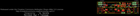
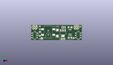
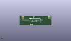
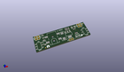

Contents
========

* [PROJ-SPAR-13157-STAN-01>Breadboard Power Supply Stick 3.3V-1.8V](#proj-spar-13157-stan-01breadboard-power-supply-stick-33v-18v)
	* [Images](#images)
	* [Interactive BOM](#interactive-bom)
	* [OOMP Parts](#oomp-parts)
	* [Tags](#tags)
  
![][im]
# PROJ-SPAR-13157-STAN-01>Breadboard Power Supply Stick 3.3V-1.8V

- ID: PROJ-SPAR-13157-STAN-01
- Hex ID: PRS13157
- Name: Breadboard Power Supply Stick 3.3V-1.8V
- Description: 

## Images
  
  

|eagleImage|kicadPcb3dFront|kicadPcb3dBack|kicadPcb3d|
| :---: | :---: | :---: | :---: |
|||||

## Interactive BOM

- Interactive BOM page: [ibom.html](kicad/bom/ibom.html)

## OOMP Parts
  

|OOMP Parts|
| :---: |
|CAPE-UNMATCHED-X-UNMATCHED-01, C1, 28.194000000000003, 7.619999999999999, 90,C1, 100uF, EIA7343, SparkFun, (1.11, 0.3), R90|
|CAPE-UNMATCHED-X-UNMATCHED-01, C2, 41.91, 13.97, 0,C2, 10uF, EIA3216, SparkFun, (1.65, 0.55), R0|
|CAPE-0603-X-NF100-01, C3, 41.91, 11.43, 180,C3, 0.1uF, 0603-CAP, SparkFun, (1.65, 0.45), R180|
|UNMATCHED-UNMATCHED-X-UNMATCHED-01, D1, 9.398, 6.858, 90,D1, 1N4001, SMA-DIODE-TYLERALT1, Testing, (0.37, 0.27), R90|
|UNMATCHED-UNMATCHED-X-UNMATCHED-01, F1, 9.398, 13.462, 90,F1, PTCSMD-W, PTC-1206-WIDE, SparkFun-PowerIC, (0.37, 0.53), R90|
|UNMATCHED-UNMATCHED-X-UNMATCHED-01, J1, 18.287999999999997, 5.715, 90,J1, POWER_JACKOVERPASTE_REDBOARD_0603, POWER_JACK_SMD_OVERPASTE_REDBOARD_0603, Testing, (0.72, 0.225), R90|
|UNMATCHED-UNMATCHED-X-UNMATCHED-01, JP1, 2.54, 15.239999999999998, 0,JP1, M01PTH, 1X01, SparkFun, (0.1, 0.6), R0|
|UNMATCHED-UNMATCHED-X-UNMATCHED-01, JP2, 5.08, 15.239999999999998, 0,JP2, M01PTH, 1X01, SparkFun, (0.2, 0.6), R0|
|UNMATCHED-UNMATCHED-X-UNMATCHED-01, JP3, 50.165, 15.239999999999998, 0,JP3, M01PTH, 1X01, SparkFun, (1.975, 0.6), R0|
|UNMATCHED-UNMATCHED-X-UNMATCHED-01, JP4, 47.625, 15.239999999999998, 0,JP4, M01PTH, 1X01, SparkFun, (1.875, 0.6), R0|
|UNMATCHED-UNMATCHED-X-UNMATCHED-01, JP5, 33.019999999999996, 1.27, 0,JP5, 1X02, SparkFun, (1.3, 0.05), R0|
|UNMATCHED-UNMATCHED-X-UNMATCHED-01, JP6, 2.54, 12.7, 0,JP6, M01PTH, 1X01, SparkFun, (0.1, 0.5), R0|
|UNMATCHED-UNMATCHED-X-UNMATCHED-01, JP7, 5.08, 12.7, 0,JP7, M01PTH, 1X01, SparkFun, (0.2, 0.5), R0|
|UNMATCHED-UNMATCHED-X-UNMATCHED-01, JP8, 50.165, 12.7, 0,JP8, M01PTH, 1X01, SparkFun, (1.975, 0.5), R0|
|UNMATCHED-UNMATCHED-X-UNMATCHED-01, JP9, 47.625, 12.7, 0,JP9, M01PTH, 1X01, SparkFun, (1.875, 0.5), R0|
|UNMATCHED-UNMATCHED-X-UNMATCHED-01, LED2, 41.91, 2.54, 180,LED2, Power, LED-1206, SparkFun-Nate, (1.65, 0.1), R180|
|RESE-0603-X-UNMATCHED-01, R1, 34.036, 13.208, 180,R1, 240, 0603-RES, SparkFun-Resistors, (1.34, 0.52), R180|
|RESE-0603-X-UNMATCHED-01, R2, 36.703, 13.97, 270,R2, 105, 0603-RES, SparkFun-Resistors, (1.445, 0.55), R270|
|RESE-0603-X-UNMATCHED-01, R3, 34.036, 14.858999999999998, 0,R3, 287, 0603-RES, SparkFun-Resistors, (1.34, 0.585), R0|
|RESE-0603-X-UNMATCHED-01, R4, 41.91, 6.35, 180,R4, 240, 0603-RES, SparkFun-Resistors, (1.65, 0.25), R180|
|UNMATCHED-UNMATCHED-X-UNMATCHED-01, S1, 3.8099999999999996, 5.08, 270,S1, On/Off, AYZ0202, SparkFun, (0.15, 0.2), R270|
|UNMATCHED-UNMATCHED-X-UNMATCHED-01, S2, 50.8, 5.08, 90,S2, Voltage, AYZ0202, SparkFun, (2, 0.2), R90|
|UNMATCHED-UNMATCHED-X-UNMATCHED-01, U1, 34.29, 7.619999999999999, 180,U1, V_REG_317SMD, SOT223, SparkFun, (1.35, 0.3), R180|

## Tags

- hexID: PRS13157
- oompType: PROJ
- oompSize: SPAR
- oompColor: 13157
- oompDesc: STAN
- oompIndex: 01
- oompName: Breadboard Power Supply Stick 3.3V-1.8V
- sources: All source files from https://github.com/sparkfun/Breadboard_Power_Supply_Stick_3.3V-1.8V (source licence details in srcLicense.md)
- linkBuyPage: https://www.sparkfun.com/products/13157
- oompPart: CAPE-UNMATCHED-X-UNMATCHED-01, C1, 28.194000000000003, 7.619999999999999, 90
- oompPart: CAPE-UNMATCHED-X-UNMATCHED-01, C2, 41.91, 13.97, 0
- oompPart: CAPE-0603-X-NF100-01, C3, 41.91, 11.43, 180
- oompPart: UNMATCHED-UNMATCHED-X-UNMATCHED-01, D1, 9.398, 6.858, 90
- oompPart: UNMATCHED-UNMATCHED-X-UNMATCHED-01, F1, 9.398, 13.462, 90
- oompPart: UNMATCHED-UNMATCHED-X-UNMATCHED-01, J1, 18.287999999999997, 5.715, 90
- oompPart: UNMATCHED-UNMATCHED-X-UNMATCHED-01, JP1, 2.54, 15.239999999999998, 0
- oompPart: UNMATCHED-UNMATCHED-X-UNMATCHED-01, JP2, 5.08, 15.239999999999998, 0
- oompPart: UNMATCHED-UNMATCHED-X-UNMATCHED-01, JP3, 50.165, 15.239999999999998, 0
- oompPart: UNMATCHED-UNMATCHED-X-UNMATCHED-01, JP4, 47.625, 15.239999999999998, 0
- oompPart: UNMATCHED-UNMATCHED-X-UNMATCHED-01, JP5, 33.019999999999996, 1.27, 0
- oompPart: UNMATCHED-UNMATCHED-X-UNMATCHED-01, JP6, 2.54, 12.7, 0
- oompPart: UNMATCHED-UNMATCHED-X-UNMATCHED-01, JP7, 5.08, 12.7, 0
- oompPart: UNMATCHED-UNMATCHED-X-UNMATCHED-01, JP8, 50.165, 12.7, 0
- oompPart: UNMATCHED-UNMATCHED-X-UNMATCHED-01, JP9, 47.625, 12.7, 0
- oompPart: UNMATCHED-UNMATCHED-X-UNMATCHED-01, LED2, 41.91, 2.54, 180
- oompPart: RESE-0603-X-UNMATCHED-01, R1, 34.036, 13.208, 180
- oompPart: RESE-0603-X-UNMATCHED-01, R2, 36.703, 13.97, 270
- oompPart: RESE-0603-X-UNMATCHED-01, R3, 34.036, 14.858999999999998, 0
- oompPart: RESE-0603-X-UNMATCHED-01, R4, 41.91, 6.35, 180
- oompPart: UNMATCHED-UNMATCHED-X-UNMATCHED-01, S1, 3.8099999999999996, 5.08, 270
- oompPart: UNMATCHED-UNMATCHED-X-UNMATCHED-01, S2, 50.8, 5.08, 90
- oompPart: SKIP-UNMATCHED-X-UNMATCHED-01, U$3, 8.889999999999999, 1.27, 0
- oompPart: SKIP-UNMATCHED-X-UNMATCHED-01, U$4, 53.08599999999999, 14.477999999999998, 0
- oompPart: UNMATCHED-UNMATCHED-X-UNMATCHED-01, U1, 34.29, 7.619999999999999, 180
- rawPart: C1, 100uF, EIA7343, SparkFun, (1.11, 0.3), R90
- rawPart: C2, 10uF, EIA3216, SparkFun, (1.65, 0.55), R0
- rawPart: C3, 0.1uF, 0603-CAP, SparkFun, (1.65, 0.45), R180
- rawPart: D1, 1N4001, SMA-DIODE-TYLERALT1, Testing, (0.37, 0.27), R90
- rawPart: F1, PTCSMD-W, PTC-1206-WIDE, SparkFun-PowerIC, (0.37, 0.53), R90
- rawPart: J1, POWER_JACKOVERPASTE_REDBOARD_0603, POWER_JACK_SMD_OVERPASTE_REDBOARD_0603, Testing, (0.72, 0.225), R90
- rawPart: JP1, M01PTH, 1X01, SparkFun, (0.1, 0.6), R0
- rawPart: JP2, M01PTH, 1X01, SparkFun, (0.2, 0.6), R0
- rawPart: JP3, M01PTH, 1X01, SparkFun, (1.975, 0.6), R0
- rawPart: JP4, M01PTH, 1X01, SparkFun, (1.875, 0.6), R0
- rawPart: JP5, 1X02, SparkFun, (1.3, 0.05), R0
- rawPart: JP6, M01PTH, 1X01, SparkFun, (0.1, 0.5), R0
- rawPart: JP7, M01PTH, 1X01, SparkFun, (0.2, 0.5), R0
- rawPart: JP8, M01PTH, 1X01, SparkFun, (1.975, 0.5), R0
- rawPart: JP9, M01PTH, 1X01, SparkFun, (1.875, 0.5), R0
- rawPart: LED2, Power, LED-1206, SparkFun-Nate, (1.65, 0.1), R180
- rawPart: R1, 240, 0603-RES, SparkFun-Resistors, (1.34, 0.52), R180
- rawPart: R2, 105, 0603-RES, SparkFun-Resistors, (1.445, 0.55), R270
- rawPart: R3, 287, 0603-RES, SparkFun-Resistors, (1.34, 0.585), R0
- rawPart: R4, 240, 0603-RES, SparkFun-Resistors, (1.65, 0.25), R180
- rawPart: S1, On/Off, AYZ0202, SparkFun, (0.15, 0.2), R270
- rawPart: S2, Voltage, AYZ0202, SparkFun, (2, 0.2), R90
- rawPart: U$3, FIDUCIAL1X2, FIDUCIAL-1X2, SparkFun, (0.35, 0.05), R0
- rawPart: U$4, FIDUCIAL1X2, FIDUCIAL-1X2, SparkFun, (2.09, 0.57), R0
- rawPart: U1, V_REG_317SMD, SOT223, SparkFun, (1.35, 0.3), R180

[im]: kicadPcb3d_450.png
