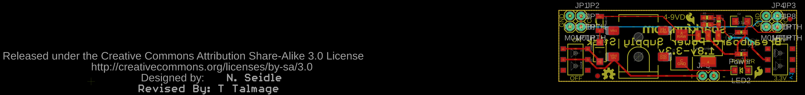
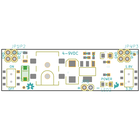
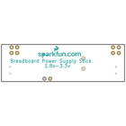
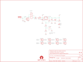
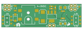

Contents
========

* [PRS13157 > Breadboard Power Supply Stick 3.3V-1.8V](#prs13157--breadboard-power-supply-stick-33v-18v)
	* [Schematic](#schematic)
	* [PCB](#pcb)
	* [Interactive BOM](#interactive-bom)
	* [OOMP Parts](#oomp-parts)
	* [Images](#images)
	* [Tags](#tags)
  
![][im]
# PRS13157 > Breadboard Power Supply Stick 3.3V-1.8V

- ID: PROJ-SPAR-13157-STAN-01
- Hex ID: PRS13157
- Name: Sparkfun
- Description: Sparkfun
- Long Link: [http://oom.lt/PROJ-SPAR-13157-STAN-01](http://oom.lt/PROJ-SPAR-13157-STAN-01)
- Short Link: [http://oom.lt/PRS13157](http://oom.lt/PRS13157)

## Schematic
  

## PCB
  

## Interactive BOM

- Interactive BOM page: [ibom.html](https://htmlpreview.github.io/?https://github.com/oomlout/oomlout_OOMP_projects/blob/main/PROJ-SPAR-13157-STAN-01/kicad/bom/ibom.html)

## OOMP Parts
  

|OOMP ID|Name|Identifier|
| :---: | :---: | :---: |
|CAPX-7343-X-UF100-01||C1|
|[CAPT-3216-X-UF10-V10](https://github.com/oomlout/oomlout_OOMP_parts/tree/main/CAPT-3216-X-UF10-V10/)|[SMD (3216) 10 uF Capacitor (Tantalum) 10v](https://github.com/oomlout/oomlout_OOMP_parts/tree/main/CAPT-3216-X-UF10-V10/)|[C2](https://github.com/oomlout/oomlout_OOMP_parts/tree/main/CAPT-3216-X-UF10-V10/)|
|[CAPC-0603-X-NF100-V50](https://github.com/oomlout/oomlout_OOMP_parts/tree/main/CAPC-0603-X-NF100-V50/)|[SMD (0603) 100 nF Capacitor (Ceramic) 50v](https://github.com/oomlout/oomlout_OOMP_parts/tree/main/CAPC-0603-X-NF100-V50/)|[C3](https://github.com/oomlout/oomlout_OOMP_parts/tree/main/CAPC-0603-X-NF100-V50/)|
|DIOD-UNMATCHED-X-UNMATCHED-01||D1|
|REFU-1206-X-UNMATCHED-01||F1|
|[DCJP-21D-X-STAN-01](https://github.com/oomlout/oomlout_OOMP_parts/tree/main/DCJP-21D-X-STAN-01/)|[2.1 mm DC Jack](https://github.com/oomlout/oomlout_OOMP_parts/tree/main/DCJP-21D-X-STAN-01/)|[J1](https://github.com/oomlout/oomlout_OOMP_parts/tree/main/DCJP-21D-X-STAN-01/)|
|HEAD-I01-X-PI01-01||JP1, JP2, JP3, JP4, JP6, JP7, JP8, JP9|
|[HEAD-I01-X-PI02-01](https://github.com/oomlout/oomlout_OOMP_parts/tree/main/HEAD-I01-X-PI02-01/)|[2.54 mm 2 Pin Header](https://github.com/oomlout/oomlout_OOMP_parts/tree/main/HEAD-I01-X-PI02-01/)|[JP5](https://github.com/oomlout/oomlout_OOMP_parts/tree/main/HEAD-I01-X-PI02-01/)|
|LEDS-1206-G-STAN-01||LED2|
|[RESE-0603-X-O241-01](https://github.com/oomlout/oomlout_OOMP_parts/tree/main/RESE-0603-X-O241-01/)|[SMD (0603) 240 Ohm Resistor](https://github.com/oomlout/oomlout_OOMP_parts/tree/main/RESE-0603-X-O241-01/)|[R1, R4](https://github.com/oomlout/oomlout_OOMP_parts/tree/main/RESE-0603-X-O241-01/)|
|[RESE-0603-X-O101-01](https://github.com/oomlout/oomlout_OOMP_parts/tree/main/RESE-0603-X-O101-01/)|[SMD (0603) 100 Ohm Resistor](https://github.com/oomlout/oomlout_OOMP_parts/tree/main/RESE-0603-X-O101-01/)|[R2](https://github.com/oomlout/oomlout_OOMP_parts/tree/main/RESE-0603-X-O101-01/)|
|RESE-0603-X-O281-01||R3|
|UNMATCHED-UNMATCHED-X-UNMATCHED-01||S1, S2, U1|

## Images
  
  

|bominteractivefront|bominteractiveback|kicadPcb3d|kicadPcb3dFront|kicadPcb3dBack|eagleImage|eagleSchemImage|pcbdraw|pcbdrawback|
| :---: | :---: | :---: | :---: | :---: | :---: | :---: | :---: | :---: |
||||||||||

## Tags

- hexID: PRS13157
- oompType: PROJ
- oompSize: SPAR
- oompColor: 13157
- oompDesc: STAN
- oompIndex: 01
- oompName: Breadboard Power Supply Stick 3.3V-1.8V
- sources: All source files from https://github.com/sparkfun/Breadboard_Power_Supply_Stick_3.3V-1.8V (source licence details in srcLicense.md)
- linkBuyPage: https://www.sparkfun.com/products/13157
- oompID: PROJ-SPAR-13157-STAN-01
- oompParts: C1,CAPX-7343-X-UF100-01
- oompParts: C2,CAPT-3216-X-UF10-V10
- oompParts: C3,CAPC-0603-X-NF100-V50
- oompParts: D1,DIOD-UNMATCHED-X-UNMATCHED-01
- oompParts: F1,REFU-1206-X-UNMATCHED-01
- oompParts: J1,DCJP-21D-X-STAN-01
- oompParts: JP1,HEAD-I01-X-PI01-01
- oompParts: JP2,HEAD-I01-X-PI01-01
- oompParts: JP3,HEAD-I01-X-PI01-01
- oompParts: JP4,HEAD-I01-X-PI01-01
- oompParts: JP5,HEAD-I01-X-PI02-01
- oompParts: JP6,HEAD-I01-X-PI01-01
- oompParts: JP7,HEAD-I01-X-PI01-01
- oompParts: JP8,HEAD-I01-X-PI01-01
- oompParts: JP9,HEAD-I01-X-PI01-01
- oompParts: LED2,LEDS-1206-G-STAN-01
- oompParts: R1,RESE-0603-X-O241-01
- oompParts: R2,RESE-0603-X-O101-01
- oompParts: R3,RESE-0603-X-O281-01
- oompParts: R4,RESE-0603-X-O241-01
- oompParts: S1,UNMATCHED-UNMATCHED-X-UNMATCHED-01
- oompParts: S2,UNMATCHED-UNMATCHED-X-UNMATCHED-01
- oompParts: U1,UNMATCHED-UNMATCHED-X-UNMATCHED-01
- rawParts: C1,100uF,CAP_POL7343,EIA7343,Capacitor Polarized,,,
- rawParts: C2,10uF,CAP_POL1206,EIA3216,Capacitor Polarized,,,
- rawParts: C3,0.1uF,CAP0603-CAP,0603-CAP,Capacitor,,,
- rawParts: D1,1N4001,DIODESMA-TYLERALT1,SMA-DIODE-TYLERALT1,Diode,,,
- rawParts: F1,PTCSMD-W,PTCSMD-W,PTC-1206-WIDE,Resettable Fuse PTC,,,
- rawParts: FRAME1,FRAME-LETTER,FRAME-LETTER,CREATIVE_COMMONS,Schematic Frame,,,
- rawParts: J1,POWER_JACKOVERPASTE_REDBOARD_0603,POWER_JACKOVERPASTE_REDBOARD_0603,POWER_JACK_SMD_OVERPASTE_REDBOARD_0603,Power Jack,,,
- rawParts: JP1,M01PTH,M01PTH,1X01,Header 1,,,
- rawParts: JP2,M01PTH,M01PTH,1X01,Header 1,,,
- rawParts: JP3,M01PTH,M01PTH,1X01,Header 1,,,
- rawParts: JP4,M01PTH,M01PTH,1X01,Header 1,,,
- rawParts: JP5,,M02PTH,1X02,Header 2,,,
- rawParts: JP6,M01PTH,M01PTH,1X01,Header 1,,,
- rawParts: JP7,M01PTH,M01PTH,1X01,Header 1,,,
- rawParts: JP8,M01PTH,M01PTH,1X01,Header 1,,,
- rawParts: JP9,M01PTH,M01PTH,1X01,Header 1,,,
- rawParts: LED2,Power,LED1206,LED-1206,,,,
- rawParts: LOGO1,OSHW-LOGOS,OSHW-LOGOS,OSHW-LOGO-S,Open Source Hardware Logo This logo indicates the piece of hardware it is found on incorporates a OSHW license and/or adheres to the definition of open source hardware found here: http://freedomdefined.org/OSHW,,,
- rawParts: R1,240,240OHM1/10W1%(0603),0603-RES,RES-07849,RES-07849,240,
- rawParts: R2,105,105OHM-1/10W-1%(0603),0603-RES,RES-10751,RES-10751,105,
- rawParts: R3,287,287OHM-1/10W-1%(0603),0603-RES,RES-10752,RES-10752,287,
- rawParts: R4,240,240OHM1/10W1%(0603),0603-RES,RES-07849,RES-07849,240,
- rawParts: S1,On/Off,AYZ0202,AYZ0202,SPDT Slide Switch,,,
- rawParts: S2,Voltage,SWITCH-SPSTSMD,AYZ0202,SPST Switch,,,
- rawParts: U$1,LOGO-SFESK,LOGO-SFESK,SFE-LOGO-FLAME,Spark Fun Electronics PCB Logo,,,
- rawParts: U$2,LOGO-SFENEW,LOGO-SFENEW,SFE-NEW-WEBLOGO,Spark Fun Electronics PCB Logo,,,
- rawParts: U$3,FIDUCIAL1X2,FIDUCIAL1X2,FIDUCIAL-1X2,Fiducial Alignment Points,,,
- rawParts: U$4,FIDUCIAL1X2,FIDUCIAL1X2,FIDUCIAL-1X2,Fiducial Alignment Points,,,
- rawParts: U1,V_REG_317SMD,V_REG_317SMD,SOT223,Voltage Regulator,,,

[im]: kicadPcb3d_450.png
