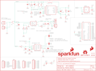

Contents
========

* [PRS13158 > Sparkfun](#prs13158--sparkfun)
	* [Images](#images)
	* [Tags](#tags)
  
![][im]
# PRS13158 > Sparkfun

- ID: PROJ-SPAR-13158-STAN-01
- Hex ID: PRS13158
- Name: Sparkfun
- Description: Sparkfun

## Images
  
  

|kicadPcb3d|kicadPcb3dFront|kicadPcb3dBack|eagleImage|eagleSchemImage|
| :---: | :---: | :---: | :---: | :---: |
||||||

## Tags

- hexID: PRS13158
- oompType: PROJ
- oompSize: SPAR
- oompColor: 13158
- oompDesc: STAN
- oompIndex: 01
- oompName: LiPower-Shield
- sources: All source files from https://github.com/sparkfun/LiPower-Shield (source licence details in srcLicense.md)
- linkBuyPage: https://www.sparkfun.com/products/13158
- oompID: PROJ-SPAR-13158-STAN-01
- oompParts: C1,UNMATCHED-UNMATCHED-UNMATCHED-UNMATCHED-UNMATCHED
- oompParts: C2,UNMATCHED-UNMATCHED-UNMATCHED-UNMATCHED-UNMATCHED
- oompParts: C3,UNMATCHED-UNMATCHED-UNMATCHED-UNMATCHED-UNMATCHED
- oompParts: C4,UNMATCHED-UNMATCHED-UNMATCHED-UNMATCHED-UNMATCHED
- oompParts: C5,UNMATCHED-UNMATCHED-UNMATCHED-UNMATCHED-UNMATCHED
- oompParts: C6,UNMATCHED-UNMATCHED-UNMATCHED-UNMATCHED-UNMATCHED
- oompParts: C7,UNMATCHED-UNMATCHED-UNMATCHED-UNMATCHED-UNMATCHED
- oompParts: C8,UNMATCHED-UNMATCHED-UNMATCHED-UNMATCHED-UNMATCHED
- oompParts: C9,UNMATCHED-UNMATCHED-UNMATCHED-UNMATCHED-UNMATCHED
- oompParts: D1,UNMATCHED-UNMATCHED-UNMATCHED-UNMATCHED-UNMATCHED
- oompParts: D2,UNMATCHED-UNMATCHED-UNMATCHED-UNMATCHED-UNMATCHED
- oompParts: FRAME1,UNMATCHED-UNMATCHED-UNMATCHED-UNMATCHED-UNMATCHED
- oompParts: JP1,UNMATCHED-UNMATCHED-UNMATCHED-UNMATCHED-UNMATCHED
- oompParts: JP2,UNMATCHED-UNMATCHED-UNMATCHED-UNMATCHED-UNMATCHED
- oompParts: JP3,UNMATCHED-UNMATCHED-UNMATCHED-UNMATCHED-UNMATCHED
- oompParts: JP4,UNMATCHED-UNMATCHED-UNMATCHED-UNMATCHED-UNMATCHED
- oompParts: JP7,UNMATCHED-UNMATCHED-UNMATCHED-UNMATCHED-UNMATCHED
- oompParts: JP8,UNMATCHED-UNMATCHED-UNMATCHED-UNMATCHED-UNMATCHED
- oompParts: JP9,UNMATCHED-UNMATCHED-UNMATCHED-UNMATCHED-UNMATCHED
- oompParts: JP10,UNMATCHED-UNMATCHED-UNMATCHED-UNMATCHED-UNMATCHED
- oompParts: JP11,UNMATCHED-UNMATCHED-UNMATCHED-UNMATCHED-UNMATCHED
- oompParts: JP13,UNMATCHED-UNMATCHED-UNMATCHED-UNMATCHED-UNMATCHED
- oompParts: L1,UNMATCHED-UNMATCHED-UNMATCHED-UNMATCHED-UNMATCHED
- oompParts: LOGO1,UNMATCHED-UNMATCHED-UNMATCHED-UNMATCHED-UNMATCHED
- oompParts: LOGO2,UNMATCHED-UNMATCHED-UNMATCHED-UNMATCHED-UNMATCHED
- oompParts: LOGO3,UNMATCHED-UNMATCHED-UNMATCHED-UNMATCHED-UNMATCHED
- oompParts: R1,UNMATCHED-UNMATCHED-UNMATCHED-UNMATCHED-UNMATCHED
- oompParts: R2,UNMATCHED-UNMATCHED-UNMATCHED-UNMATCHED-UNMATCHED
- oompParts: R3,UNMATCHED-UNMATCHED-UNMATCHED-UNMATCHED-UNMATCHED
- oompParts: R4,UNMATCHED-UNMATCHED-UNMATCHED-UNMATCHED-UNMATCHED
- oompParts: R5,UNMATCHED-UNMATCHED-UNMATCHED-UNMATCHED-UNMATCHED
- oompParts: R6,UNMATCHED-UNMATCHED-UNMATCHED-UNMATCHED-UNMATCHED
- oompParts: R7,UNMATCHED-UNMATCHED-UNMATCHED-UNMATCHED-UNMATCHED
- oompParts: R8,UNMATCHED-UNMATCHED-UNMATCHED-UNMATCHED-UNMATCHED
- oompParts: R9,UNMATCHED-UNMATCHED-UNMATCHED-UNMATCHED-UNMATCHED
- oompParts: R10,UNMATCHED-UNMATCHED-UNMATCHED-UNMATCHED-UNMATCHED
- oompParts: R11,UNMATCHED-UNMATCHED-UNMATCHED-UNMATCHED-UNMATCHED
- oompParts: R12,UNMATCHED-UNMATCHED-UNMATCHED-UNMATCHED-UNMATCHED
- oompParts: S2,UNMATCHED-UNMATCHED-UNMATCHED-UNMATCHED-UNMATCHED
- oompParts: SJ1,UNMATCHED-UNMATCHED-UNMATCHED-UNMATCHED-UNMATCHED
- oompParts: SJ2,UNMATCHED-UNMATCHED-UNMATCHED-UNMATCHED-UNMATCHED
- oompParts: SJ3,UNMATCHED-UNMATCHED-UNMATCHED-UNMATCHED-UNMATCHED
- oompParts: SJ4,UNMATCHED-UNMATCHED-UNMATCHED-UNMATCHED-UNMATCHED
- oompParts: TP1,UNMATCHED-UNMATCHED-UNMATCHED-UNMATCHED-UNMATCHED
- oompParts: TP2,UNMATCHED-UNMATCHED-UNMATCHED-UNMATCHED-UNMATCHED
- oompParts: U1,UNMATCHED-UNMATCHED-UNMATCHED-UNMATCHED-UNMATCHED
- oompParts: U2,UNMATCHED-UNMATCHED-UNMATCHED-UNMATCHED-UNMATCHED
- oompParts: U3,UNMATCHED-UNMATCHED-UNMATCHED-UNMATCHED-UNMATCHED
- oompParts: U4,UNMATCHED-UNMATCHED-UNMATCHED-UNMATCHED-UNMATCHED
- oompParts: VREG,UNMATCHED-UNMATCHED-UNMATCHED-UNMATCHED-UNMATCHED
- rawParts: C1,10nF,10NF/10000PF-50V-10%(0603),0603-CAP,CAP-00867,,CAP-00867,10nF,
- rawParts: C2,1uF,1.0UF-16V-10%(0603),0603-CAP,CAP-00868,,CAP-00868,1.0uF,
- rawParts: C3,22uF,22UF-6.3V-20%(0805),0805,CAP-08402,,CAP-08402,22uF,
- rawParts: C4,10uF,10UF-6.3V-20%(1206),1206,CAP-10057,,CAP-10057,10uF,
- rawParts: C5,0.1uF,0.1UF-25V(+80/-20%)(0603),0603-CAP,CAP-00810,,CAP-00810,0.1uF,
- rawParts: C6,0.1uF,0.1UF-25V(+80/-20%)(0603),0603-CAP,CAP-00810,,CAP-00810,0.1uF,
- rawParts: C7,10uF,10UF-16V-10%(TANT),EIA3216,CAP-00811,,CAP-00811,10uF,
- rawParts: C8,4.7uF,4.7UF-6.3V-10%(0603)0603,0603-CAP,CAP-08280,,CAP-08280,4.7uF,
- rawParts: C9,4.7uF,4.7UF-6.3V-10%(0603)0603,0603-CAP,CAP-08280,,CAP-08280,4.7uF,
- rawParts: D1,RED,LED-RED0603,LED-0603,Assorted Red LEDs,,DIO-00819,RED,
- rawParts: D2,RED,LED-RED0603,LED-0603,Assorted Red LEDs,,DIO-00819,RED,
- rawParts: FID1,FIDUCIAL1X2,FIDUCIAL1X2,FIDUCIAL-1X2,Fiducial Alignment Points,,,,
- rawParts: FID2,FIDUCIAL1X2,FIDUCIAL1X2,FIDUCIAL-1X2,Fiducial Alignment Points,,,,
- rawParts: FRAME1,FRAME-LETTER,FRAME-LETTER,CREATIVE_COMMONS,Schematic Frame,,,,
- rawParts: JP1,,M021X02_NO_SILK,1X02_NO_SILK,Header 2,,,,
- rawParts: JP2,,M06NO_SILK,1X06_NO_SILK,Header 6,,,,
- rawParts: JP3,,M08NO_SILK,1X08_NO_SILK,Header 8,,,,
- rawParts: JP4,M02PTH,M02PTH,1X02,Standard 2-pin 0.1 header. Use with,,,,
- rawParts: JP7,,M06NO_SILK,1X06_NO_SILK,Header 6,,,,
- rawParts: JP8,,M08NO_SILK,1X08_NO_SILK,Header 8,,,,
- rawParts: JP9,STAND-OFFTIGHT,STAND-OFFTIGHT,STAND-OFF-TIGHT,Stand Off,,,,
- rawParts: JP10,STAND-OFFTIGHT,STAND-OFFTIGHT,STAND-OFF-TIGHT,Stand Off,,,,
- rawParts: JP11,USBSMD,USBSMD,USB-MINIB,USB Connectors,,CONN-08193,,
- rawParts: JP13,,JST_2MM_MALE,JST-2-SMD,Mates to single-cell LiPo batteries.,,CONN-08352,,
- rawParts: L1,4.7uH, 1.2A,INDUCTORINDUCTOR_4.7UH,INDUCTOR_4.7UH,Inductors,,NDUC-10146,,
- rawParts: LOGO1,OSHW-LOGOS,OSHW-LOGOS,OSHW-LOGO-S,Open Source Hardware Logo This logo indicates the piece of hardware it is found on incorporates a OSHW license and/or adheres to the definition of open source hardware found here: http://freedomdefined.org/OSHW,,,,
- rawParts: LOGO2,SFE_LOGO_NAME_FLAME.2_INCH,SFE_LOGO_NAME_FLAME.2_INCH,SFE_LOGO_NAME_FLAME_.2,SFE Logo, name and flame,,,,
- rawParts: LOGO3,SFE_LOGO_FLAME.1_INCH,SFE_LOGO_FLAME.1_INCH,SFE_LOGO_FLAME_.1,SFE Logo, flame only,,,,
- rawParts: R1,1k,1KOHM1/10W1%(0603),0603-RES,RES-07856,,RES-07856,1K,
- rawParts: R2,4.7k,4.7KOHM1/10W1%(0603),0603-RES,RES-07857,,RES-07857,4.7K,
- rawParts: R3,330,330OHM1/10W1%(0603),0603-RES,RES-00818,,RES-00818,330,
- rawParts: R4,2M,2MOHMS-1/10W-1%(0603),0603-RES,RES-10054,,RES-10054,2.0M,
- rawParts: R5,10k,10KOHM1/10W1%(0603)0603,0603-RES,RES-00824,,RES-00824,10K,
- rawParts: R6,220k,220KOHM1/10W1%(0603),0603-RES,RES-08969,,RES-08969,220k,
- rawParts: R7,2.0M,2MOHMS-1/10W-1%(0603),0603-RES,RES-10054,,RES-10054,2.0M,
- rawParts: R8,10k,10KOHM1/10W1%(0603)0603,0603-RES,RES-00824,,RES-00824,10K,
- rawParts: R9,200k,200KOHM1/10W1%(0603)200K,0603-RES,RES-09385,,RES-09385,200k,
- rawParts: R10,DNP,RESISTORPTH-1/6W,1/6W-RES,Resistor,,,,
- rawParts: R11,10k,10KOHM1/10W1%(0603)0603,0603-RES,RES-00824,,RES-00824,10K,
- rawParts: R12,330,330OHM1/10W1%(0603),0603-RES,RES-00818,,RES-00818,330,
- rawParts: S2,,SWITCH-SPDT-SMD-A,SWITCH-SPST-SMD-A,SPDT Switch,,,,
- rawParts: SJ1,SOLDERJUMPERTRACE,SOLDERJUMPERTRACE,SJ_2S-TRACE,Solder Jumper,,,,
- rawParts: SJ2,PS,SOLDERJUMPERNO,SJ_2S-NO,Solder Jumper,,,,
- rawParts: SJ3,SDA,JUMPER-PAD-3-2OF3_NC_BY_TRACE,PAD-JUMPER-3-2OF3_NC_BY_TRACE_YES_SILK_FULL_BOX,,,,,
- rawParts: SJ4,SCL,JUMPER-PAD-3-2OF3_NC_BY_TRACE,PAD-JUMPER-3-2OF3_NC_BY_TRACE_YES_SILK_FULL_BOX,,,,,
- rawParts: TP1,TEST-POINT3X5,TEST-POINT3X5,PAD.03X.05,Bare copper test points for troubleshooting or ICT,,,,
- rawParts: TP2,TEST-POINT3X5,TEST-POINT3X5,PAD.03X.05,Bare copper test points for troubleshooting or ICT,,,,
- rawParts: U1,MAX17043G+U,MAX1704X,TDFN-8,MAX17043/MAX17044: Battery Fuel Guage (43 is 1cell, 44 is 2cell),IC-10399,,,
- rawParts: U2,TPS61200,TPS61200,QFN-10_PAD,DC to DC Booster,,IC-10035,,
- rawParts: U3,MCP73831,MCP73831,SOT23-5,Miniature single cell, fully integrated Li-Ion, Li-polymer charge management controller,,IC-09995,,
- rawParts: U4,ARDUINO_R3_SHIELD,ARDUINO_R3_SHIELD,UNO_R3_SHIELD,Shield form compatible with the Arduino Uno R3.,,,,
- rawParts: VREG,MIC5205-3.3V,MIC52053.3V,SOT23-5,MIC5205 150mA vreg,,VREG-00822,,

[im]: kicadPcb3d_450.png
