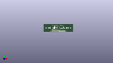
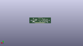
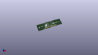

Contents
========

* [PROJ-SPAR-13162-STAN-01>ZX Gesture Sensor SMD](#proj-spar-13162-stan-01zx-gesture-sensor-smd)
	* [Images](#images)
	* [Interactive BOM](#interactive-bom)
	* [OOMP Parts](#oomp-parts)
	* [Tags](#tags)
  
![][im]
# PROJ-SPAR-13162-STAN-01>ZX Gesture Sensor SMD

- ID: PROJ-SPAR-13162-STAN-01
- Hex ID: PRS13162
- Name: ZX Gesture Sensor SMD
- Description: 

## Images
  
  

|eagleImage|kicadPcb3dFront|kicadPcb3dBack|kicadPcb3d|
| :---: | :---: | :---: | :---: |
|||||

## Interactive BOM

- Interactive BOM page: [ibom.html](kicad/bom/ibom.html)

## OOMP Parts
  

|OOMP Parts|
| :---: |
|<table><tr><td></td><td> C1</td><td>[CAPC-0603-X-NF100-V50 SMD (0603) 100 nF Capacitor (Ceramic) 50v](https://github.com/oomlout/oomlout_OOMP_parts/tree/main/CAPC-0603-X-NF100-V50/)</td><td>[C6N100](https://github.com/oomlout/oomlout_OOMP_parts/tree/main/CAPC-0603-X-NF100-V50/)</td></tr></table>|
|<table><tr><td></td><td> C3</td><td>[CAPC-0603-X-NF100-V50 SMD (0603) 100 nF Capacitor (Ceramic) 50v](https://github.com/oomlout/oomlout_OOMP_parts/tree/main/CAPC-0603-X-NF100-V50/)</td><td>[C6N100](https://github.com/oomlout/oomlout_OOMP_parts/tree/main/CAPC-0603-X-NF100-V50/)</td></tr></table>|
|CAPC-0603-X-UNMATCHED-01, C4, 9.2075, 5.08, M270,C4, 10nF, 0603-CAP, SparkFun-Capacitors, (0.3625, 0.2), MR270|
|<table><tr><td></td><td> C5</td><td>[CAPC-0603-X-NF100-V50 SMD (0603) 100 nF Capacitor (Ceramic) 50v](https://github.com/oomlout/oomlout_OOMP_parts/tree/main/CAPC-0603-X-NF100-V50/)</td><td>[C6N100](https://github.com/oomlout/oomlout_OOMP_parts/tree/main/CAPC-0603-X-NF100-V50/)</td></tr></table>|
|CAPC-0603-X-UNMATCHED-01, C6, 49.529999999999994, 12.382499999999999, M180,C6, 10nF, 0603-CAP, SparkFun-Capacitors, (1.95, 0.4875), MR180|
|CAPC-0603-X-UNMATCHED-01, C7, 27.622499999999995, 8.889999999999999, 270,C7, 4.7uF, 0603-CAP, SparkFun-Capacitors, (1.0875, 0.35), R270|
|<table><tr><td></td><td> C8</td><td>[CAPC-0603-X-NF100-V50 SMD (0603) 100 nF Capacitor (Ceramic) 50v](https://github.com/oomlout/oomlout_OOMP_parts/tree/main/CAPC-0603-X-NF100-V50/)</td><td>[C6N100](https://github.com/oomlout/oomlout_OOMP_parts/tree/main/CAPC-0603-X-NF100-V50/)</td></tr></table>|
|UNMATCHED-UNMATCHED-X-UNMATCHED-01, D1, 11.43, 8.254999999999999, 270,D1, SFH4641SHORT2, SFH4641-SHORT2, SparkFun-LED, (0.45, 0.325), R270|
|UNMATCHED-UNMATCHED-X-UNMATCHED-01, D2, 49.529999999999994, 8.254999999999999, 90,D2, SFH4641SHORT2, SFH4641-SHORT2, SparkFun-LED, (1.95, 0.325), R90|
|<table><tr><td></td><td> JP1</td><td>[HEAD-I01-X-PI06-01 2.54 mm 6 Pin Header](https://github.com/oomlout/oomlout_OOMP_parts/tree/main/HEAD-I01-X-PI06-01/)</td><td>[H06](https://github.com/oomlout/oomlout_OOMP_parts/tree/main/HEAD-I01-X-PI06-01/)</td></tr></table>|
|<table><tr><td></td><td> JP2</td><td>[HEAD-I01-X-PI05-01 2.54 mm 5 Pin Header](https://github.com/oomlout/oomlout_OOMP_parts/tree/main/HEAD-I01-X-PI05-01/)</td><td>[H05](https://github.com/oomlout/oomlout_OOMP_parts/tree/main/HEAD-I01-X-PI05-01/)</td></tr></table>|
|UNMATCHED-UNMATCHED-X-UNMATCHED-01, Q1, 17.30375, 12.382499999999999, M0,Q1, MMBT2222A, SOT23-3, SparkFun-DiscreteSemi, (0.68125, 0.4875), MR0|
|UNMATCHED-UNMATCHED-X-UNMATCHED-01, Q2, 15.875, 5.08, M0,Q2, MOSFET-NCHANNEL2N7002PW, SOT323, SparkFun-DiscreteSemi, (0.625, 0.2), MR0|
|<table><tr><td></td><td> R1</td><td>[RESE-0603-X-O104-01 SMD (0603) 100k Ohm Resistor](https://github.com/oomlout/oomlout_OOMP_parts/tree/main/RESE-0603-X-O104-01/)</td><td>[R6104](https://github.com/oomlout/oomlout_OOMP_parts/tree/main/RESE-0603-X-O104-01/)</td></tr></table>|
|<table><tr><td></td><td> R2</td><td>[RESE-0603-X-O104-01 SMD (0603) 100k Ohm Resistor](https://github.com/oomlout/oomlout_OOMP_parts/tree/main/RESE-0603-X-O104-01/)</td><td>[R6104](https://github.com/oomlout/oomlout_OOMP_parts/tree/main/RESE-0603-X-O104-01/)</td></tr></table>|
|ERROR, R3 1K 1%, 0, 0, 0,R3, 1K, 1%, 0603-RES, SparkFun-Resistors, (0.675, 0.35), MR90|
|RESE-0603-X-UNMATCHED-01, R4, 19.685, 8.889999999999999, M270,R4, 1K, 0603-RES, SparkFun-Resistors, (0.775, 0.35), MR270|
|<table><tr><td></td><td> R5</td><td>[RESE-0603-X-O104-01 SMD (0603) 100k Ohm Resistor](https://github.com/oomlout/oomlout_OOMP_parts/tree/main/RESE-0603-X-O104-01/)</td><td>[R6104](https://github.com/oomlout/oomlout_OOMP_parts/tree/main/RESE-0603-X-O104-01/)</td></tr></table>|
|RESE-0603-X-UNMATCHED-01, R6, 10.795, 11.43, M0,R6, 1, 0603-RES, SparkFun-Resistors, (0.425, 0.45), MR0|
|<table><tr><td></td><td> R7</td><td>[RESE-0603-X-O104-01 SMD (0603) 100k Ohm Resistor](https://github.com/oomlout/oomlout_OOMP_parts/tree/main/RESE-0603-X-O104-01/)</td><td>[R6104](https://github.com/oomlout/oomlout_OOMP_parts/tree/main/RESE-0603-X-O104-01/)</td></tr></table>|
|RESE-0603-X-UNMATCHED-01, R8, 45.402499999999996, 6.35, M270,R8, 1, 0603-RES, SparkFun-Resistors, (1.7875, 0.25), MR270|
|RESE-0603-X-UNMATCHED-01, R9, 42.2275, 12.065, M180,R9, 1K, 0603-RES, SparkFun-Resistors, (1.6625, 0.475), MR180|
|RESE-0603-X-UNMATCHED-01, R10, 46.99, 3.8099999999999996, M90,R10, 4.7K, 0603-RES, SparkFun-Resistors, (1.85, 0.15), MR90|
|RESE-0603-X-UNMATCHED-01, R11, 52.06999999999999, 3.8099999999999996, M90,R11, 4.7K, 0603-RES, SparkFun-Resistors, (2.05, 0.15), MR90|
|<table><tr><td></td><td> R12</td><td>[RESE-0603-X-O103-01 SMD (0603) 10k Ohm Resistor](https://github.com/oomlout/oomlout_OOMP_parts/tree/main/RESE-0603-X-O103-01/)</td><td>[R6103](https://github.com/oomlout/oomlout_OOMP_parts/tree/main/RESE-0603-X-O103-01/)</td></tr></table>|
|RESE-0603-X-UNMATCHED-01, R13, 22.224999999999998, 12.7, M180,R13, 1K, 0603-RES, SparkFun-Resistors, (0.875, 0.5), MR180|
|RESE-0603-X-UNMATCHED-01, R14, 49.529999999999994, 14.2875, M0,R14, 1K, 0603-RES, SparkFun-Resistors, (1.95, 0.5625), MR0|
|UNMATCHED-UNMATCHED-X-UNMATCHED-01, U1, 30.479999999999997, 8.254999999999999, M90,U1, PIC16F1823-14PINTSSOP, TSSOP14, SparkFun-DigitalIC, (1.2, 0.325), MR90|
|UNMATCHED-UNMATCHED-X-UNMATCHED-01, U2, 22.224999999999998, 8.889999999999999, M180,U2, MCP6021T-E/OT, SOT23-5, SparkFun-AnalogIC, (0.875, 0.35), MR180|
|UNMATCHED-UNMATCHED-X-UNMATCHED-01, U3, 10.795, 8.889999999999999, M90,U3, DMC2700UDM, SOT26, SparkFun-DiscreteSemi, (0.425, 0.35), MR90|
|UNMATCHED-UNMATCHED-X-UNMATCHED-01, U4, 49.529999999999994, 8.254999999999999, M270,U4, DMC2700UDM, SOT26, SparkFun-DiscreteSemi, (1.95, 0.325), MR270|
|UNMATCHED-UNMATCHED-X-UNMATCHED-01, U5, 30.479999999999997, 8.254999999999999, 180,U5, TSSP57038, TSOP572, SparkFun-Sensors, (1.2, 0.325), R180|

## Tags

- hexID: PRS13162
- oompType: PROJ
- oompSize: SPAR
- oompColor: 13162
- oompDesc: STAN
- oompIndex: 01
- oompName: ZX Gesture Sensor SMD
- sources: All source files from https://github.com/sparkfun/ZX_Gesture_Sensor_SMD (source licence details in srcLicense.md)
- linkBuyPage: https://www.sparkfun.com/products/13162
- oompID: PROJ-SPAR-13162-STAN-01
- oompPart: CAPC-0603-X-NF100-V50, C1, 13.334999999999999, 5.08, M90
- oompPart: CAPC-0603-X-NF100-V50, C3, 11.112499999999999, 5.08, M90
- oompPart: CAPC-0603-X-UNMATCHED-01, C4, 9.2075, 5.08, M270
- oompPart: CAPC-0603-X-NF100-V50, C5, 53.339999999999996, 7.9375, M270
- oompPart: CAPC-0603-X-UNMATCHED-01, C6, 49.529999999999994, 12.382499999999999, M180
- oompPart: CAPC-0603-X-UNMATCHED-01, C7, 27.622499999999995, 8.889999999999999, 270
- oompPart: CAPC-0603-X-NF100-V50, C8, 23.495, 5.08, M270
- oompPart: UNMATCHED-UNMATCHED-X-UNMATCHED-01, D1, 11.43, 8.254999999999999, 270
- oompPart: UNMATCHED-UNMATCHED-X-UNMATCHED-01, D2, 49.529999999999994, 8.254999999999999, 90
- oompPart: SKIP-UNMATCHED-X-UNMATCHED-01, FID1, 4.1274999999999995, 2.921, M0
- oompPart: SKIP-UNMATCHED-X-UNMATCHED-01, FID2, 56.13399999999999, 4.1274999999999995, M0
- oompPart: SKIP-UNMATCHED-X-UNMATCHED-01, FID3, 5.08, 14.604999999999999, 0
- oompPart: SKIP-UNMATCHED-X-UNMATCHED-01, FID4, 56.102250000000005, 14.319249999999998, 0
- oompPart: HEAD-I01-X-PI06-01, JP1, 18.415, 1.27, 0
- oompPart: HEAD-I01-X-PI05-01, JP2, 33.654999999999994, 1.27, 0
- oompPart: UNMATCHED-UNMATCHED-X-UNMATCHED-01, Q1, 17.30375, 12.382499999999999, M0
- oompPart: UNMATCHED-UNMATCHED-X-UNMATCHED-01, Q2, 15.875, 5.08, M0
- oompPart: RESE-0603-X-O104-01, R1, 30.479999999999997, 4.444999999999999, M0
- oompPart: RESE-0603-X-O104-01, R2, 19.367499999999996, 4.762499999999999, M0
- oompPart: ERROR, R3 1K 1%, 0, 0, 0
- oompPart: RESE-0603-X-UNMATCHED-01, R4, 19.685, 8.889999999999999, M270
- oompPart: RESE-0603-X-O104-01, R5, 14.604999999999999, 8.889999999999999, M90
- oompPart: RESE-0603-X-UNMATCHED-01, R6, 10.795, 11.43, M0
- oompPart: RESE-0603-X-O104-01, R7, 45.402499999999996, 9.8425, M90
- oompPart: RESE-0603-X-UNMATCHED-01, R8, 45.402499999999996, 6.35, M270
- oompPart: RESE-0603-X-UNMATCHED-01, R9, 42.2275, 12.065, M180
- oompPart: RESE-0603-X-UNMATCHED-01, R10, 46.99, 3.8099999999999996, M90
- oompPart: RESE-0603-X-UNMATCHED-01, R11, 52.06999999999999, 3.8099999999999996, M90
- oompPart: RESE-0603-X-O103-01, R12, 42.2275, 7.9375, M0
- oompPart: RESE-0603-X-UNMATCHED-01, R13, 22.224999999999998, 12.7, M180
- oompPart: RESE-0603-X-UNMATCHED-01, R14, 49.529999999999994, 14.2875, M0
- oompPart: SKIP-UNMATCHED-X-UNMATCHED-01, SJ1, 49.529999999999994, 4.444999999999999, M0
- oompPart: SKIP-UNMATCHED-X-UNMATCHED-01, SJ2, 41.9735, 9.8425, M90
- oompPart: SKIP-UNMATCHED-X-UNMATCHED-01, TP1, 25.0825, 15.557500000000001, M0
- oompPart: SKIP-UNMATCHED-X-UNMATCHED-01, TP2, 27.622499999999995, 15.557500000000001, M90
- oompPart: SKIP-UNMATCHED-X-UNMATCHED-01, TP3, 30.162499999999998, 15.557500000000001, M0
- oompPart: SKIP-UNMATCHED-X-UNMATCHED-01, TP4, 32.7025, 15.557500000000001, M0
- oompPart: SKIP-UNMATCHED-X-UNMATCHED-01, TP5, 35.2425, 15.557500000000001, M0
- oompPart: UNMATCHED-UNMATCHED-X-UNMATCHED-01, U1, 30.479999999999997, 8.254999999999999, M90
- oompPart: UNMATCHED-UNMATCHED-X-UNMATCHED-01, U2, 22.224999999999998, 8.889999999999999, M180
- oompPart: UNMATCHED-UNMATCHED-X-UNMATCHED-01, U3, 10.795, 8.889999999999999, M90
- oompPart: UNMATCHED-UNMATCHED-X-UNMATCHED-01, U4, 49.529999999999994, 8.254999999999999, M270
- oompPart: UNMATCHED-UNMATCHED-X-UNMATCHED-01, U5, 30.479999999999997, 8.254999999999999, 180
- rawPart: C1, 0.1uF, 0603-CAP, SparkFun-Capacitors, (0.525, 0.2), MR90
- rawPart: C3, 0.1uF, 0603-CAP, SparkFun-Capacitors, (0.4375, 0.2), MR90
- rawPart: C4, 10nF, 0603-CAP, SparkFun-Capacitors, (0.3625, 0.2), MR270
- rawPart: C5, 0.1uF, 0603-CAP, SparkFun-Capacitors, (2.1, 0.3125), MR270
- rawPart: C6, 10nF, 0603-CAP, SparkFun-Capacitors, (1.95, 0.4875), MR180
- rawPart: C7, 4.7uF, 0603-CAP, SparkFun-Capacitors, (1.0875, 0.35), R270
- rawPart: C8, 0.1uF, 0603-CAP, SparkFun-Capacitors, (0.925, 0.2), MR270
- rawPart: D1, SFH4641SHORT2, SFH4641-SHORT2, SparkFun-LED, (0.45, 0.325), R270
- rawPart: D2, SFH4641SHORT2, SFH4641-SHORT2, SparkFun-LED, (1.95, 0.325), R90
- rawPart: FID1, FIDUCIALUFIDUCIAL, MICRO-FIDUCIAL, SparkFun-Aesthetics, (0.1625, 0.115), MR0
- rawPart: FID2, FIDUCIALUFIDUCIAL, MICRO-FIDUCIAL, SparkFun-Aesthetics, (2.21, 0.1625), MR0
- rawPart: FID3, FIDUCIALUFIDUCIAL, MICRO-FIDUCIAL, SparkFun-Aesthetics, (0.2, 0.575), R0
- rawPart: FID4, FIDUCIALUFIDUCIAL, MICRO-FIDUCIAL, SparkFun-Aesthetics, (2.20875, 0.56375), R0
- rawPart: JP1, 1X06_NO_SILK, SparkFun-Connectors, (0.725, 0.05), R0
- rawPart: JP2, 1X05, SparkFun-Connectors, (1.325, 0.05), R0
- rawPart: Q1, MMBT2222A, SOT23-3, SparkFun-DiscreteSemi, (0.68125, 0.4875), MR0
- rawPart: Q2, MOSFET-NCHANNEL2N7002PW, SOT323, SparkFun-DiscreteSemi, (0.625, 0.2), MR0
- rawPart: R1, 100k, 0603-RES, SparkFun-Resistors, (1.2, 0.175), MR0
- rawPart: R2, 100k, 0603-RES, SparkFun-Resistors, (0.7625, 0.1875), MR0
- rawPart: R3, 1K, 1%, 0603-RES, SparkFun-Resistors, (0.675, 0.35), MR90
- rawPart: R4, 1K, 0603-RES, SparkFun-Resistors, (0.775, 0.35), MR270
- rawPart: R5, 100k, 0603-RES, SparkFun-Resistors, (0.575, 0.35), MR90
- rawPart: R6, 1, 0603-RES, SparkFun-Resistors, (0.425, 0.45), MR0
- rawPart: R7, 100k, 0603-RES, SparkFun-Resistors, (1.7875, 0.3875), MR90
- rawPart: R8, 1, 0603-RES, SparkFun-Resistors, (1.7875, 0.25), MR270
- rawPart: R9, 1K, 0603-RES, SparkFun-Resistors, (1.6625, 0.475), MR180
- rawPart: R10, 4.7K, 0603-RES, SparkFun-Resistors, (1.85, 0.15), MR90
- rawPart: R11, 4.7K, 0603-RES, SparkFun-Resistors, (2.05, 0.15), MR90
- rawPart: R12, 10K, 0603-RES, SparkFun-Resistors, (1.6625, 0.3125), MR0
- rawPart: R13, 1K, 0603-RES, SparkFun-Resistors, (0.875, 0.5), MR180
- rawPart: R14, 1K, 0603-RES, SparkFun-Resistors, (1.95, 0.5625), MR0
- rawPart: SJ1, JUMPER-PAD-3-NC_BY_PASTE, PAD-JUMPER-3-NC_BY_PASTE_YES_SILK_FULL_BOX, SparkFun-Passives, (1.95, 0.175), MR0
- rawPart: SJ2, JUMPER-PAD-2-NOYES_SILK, PAD-JUMPER-2-NO_YES_SILK, SparkFun-Passives, (1.6525, 0.3875), MR90
- rawPart: TP1, TEST-POINT3X4, PAD.03X.04, SparkFun-Passives, (0.9875, 0.6125), MR0
- rawPart: TP2, TEST-POINT3X4, PAD.03X.04, SparkFun-Passives, (1.0875, 0.6125), MR90
- rawPart: TP3, TEST-POINT3X4, PAD.03X.04, SparkFun-Passives, (1.1875, 0.6125), MR0
- rawPart: TP4, TEST-POINT3X4, PAD.03X.04, SparkFun-Passives, (1.2875, 0.6125), MR0
- rawPart: TP5, TEST-POINT3X4, PAD.03X.04, SparkFun-Passives, (1.3875, 0.6125), MR0
- rawPart: U1, PIC16F1823-14PINTSSOP, TSSOP14, SparkFun-DigitalIC, (1.2, 0.325), MR90
- rawPart: U2, MCP6021T-E/OT, SOT23-5, SparkFun-AnalogIC, (0.875, 0.35), MR180
- rawPart: U3, DMC2700UDM, SOT26, SparkFun-DiscreteSemi, (0.425, 0.35), MR90
- rawPart: U4, DMC2700UDM, SOT26, SparkFun-DiscreteSemi, (1.95, 0.325), MR270
- rawPart: U5, TSSP57038, TSOP572, SparkFun-Sensors, (1.2, 0.325), R180

[im]: kicadPcb3d_450.png
