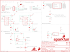

Contents
========

* [PRS13162 > Sparkfun](#prs13162--sparkfun)
	* [Schematic](#schematic)
	* [Interactive BOM](#interactive-bom)
	* [OOMP Parts](#oomp-parts)
	* [Images](#images)
	* [Tags](#tags)
  
![][im]
# PRS13162 > Sparkfun

- ID: PROJ-SPAR-13162-STAN-01
- Hex ID: PRS13162
- Name: Sparkfun
- Description: Sparkfun
- Long Link: [http://oom.lt/PROJ-SPAR-13162-STAN-01](http://oom.lt/PROJ-SPAR-13162-STAN-01)
- Long Link: [http://oom.lt/PRS13162](http://oom.lt/PRS13162)

## Schematic
  
![][schem]
## Interactive BOM

- Interactive BOM page: [ibom.html](https://htmlpreview.github.io/?https://github.com/oomlout/oomlout_OOMP_projects/blob/main/PROJ-SPAR-13162-STAN-01/kicad/bom/ibom.html)

## OOMP Parts
  

|OOMP Parts|
| :---: |
|C1,UNMATCHED-UNMATCHED-UNMATCHED-UNMATCHED-UNMATCHED,C1,0.1uF,0.1UF-25V(+80/-20%)(0603),0603-CAP,CAP-00810,CAP-00810,0.1uF,|
|C3,UNMATCHED-UNMATCHED-UNMATCHED-UNMATCHED-UNMATCHED,C3,0.1uF,0.1UF-25V(+80/-20%)(0603),0603-CAP,CAP-00810,CAP-00810,0.1uF,|
|C4,UNMATCHED-UNMATCHED-UNMATCHED-UNMATCHED-UNMATCHED,C4,10nF,10NF/10000PF-50V-10%(0603),0603-CAP,CAP-00867,CAP-00867,10nF,|
|C5,UNMATCHED-UNMATCHED-UNMATCHED-UNMATCHED-UNMATCHED,C5,0.1uF,0.1UF-25V(+80/-20%)(0603),0603-CAP,CAP-00810,CAP-00810,0.1uF,|
|C6,UNMATCHED-UNMATCHED-UNMATCHED-UNMATCHED-UNMATCHED,C6,10nF,10NF/10000PF-50V-10%(0603),0603-CAP,CAP-00867,CAP-00867,10nF,|
|C7,UNMATCHED-UNMATCHED-UNMATCHED-UNMATCHED-UNMATCHED,C7,4.7uF,4.7UF-6.3V-10%(0603)0603,0603-CAP,CAP-08280,CAP-08280,4.7uF,|
|C8,UNMATCHED-UNMATCHED-UNMATCHED-UNMATCHED-UNMATCHED,C8,0.1uF,0.1UF-25V(+80/-20%)(0603),0603-CAP,CAP-00810,CAP-00810,0.1uF,|
|D1,UNMATCHED-UNMATCHED-UNMATCHED-UNMATCHED-UNMATCHED,D1,SFH4641SHORT2,SFH4641SHORT2,SFH4641-SHORT2,,DIO-11994,,|
|D2,UNMATCHED-UNMATCHED-UNMATCHED-UNMATCHED-UNMATCHED,D2,SFH4641SHORT2,SFH4641SHORT2,SFH4641-SHORT2,,DIO-11994,,|
|FRAME1,UNMATCHED-UNMATCHED-UNMATCHED-UNMATCHED-UNMATCHED,FID1,FIDUCIALUFIDUCIAL,FIDUCIALUFIDUCIAL,MICRO-FIDUCIAL,Fiducial Alignment Points,,,|
|JP1,UNMATCHED-UNMATCHED-UNMATCHED-UNMATCHED-UNMATCHED,FID2,FIDUCIALUFIDUCIAL,FIDUCIALUFIDUCIAL,MICRO-FIDUCIAL,Fiducial Alignment Points,,,|
|JP2,UNMATCHED-UNMATCHED-UNMATCHED-UNMATCHED-UNMATCHED,FID3,FIDUCIALUFIDUCIAL,FIDUCIALUFIDUCIAL,MICRO-FIDUCIAL,Fiducial Alignment Points,,,|
|LOGO1,UNMATCHED-UNMATCHED-UNMATCHED-UNMATCHED-UNMATCHED,FID4,FIDUCIALUFIDUCIAL,FIDUCIALUFIDUCIAL,MICRO-FIDUCIAL,Fiducial Alignment Points,,,|
|LOGO2,UNMATCHED-UNMATCHED-UNMATCHED-UNMATCHED-UNMATCHED,FRAME1,FRAME-LETTER,FRAME-LETTER,CREATIVE_COMMONS,Schematic Frame,,,|
|Q1,UNMATCHED-UNMATCHED-UNMATCHED-UNMATCHED-UNMATCHED,JP1,,M06NO_SILK_FEMALE_PTH,1X06_NO_SILK,Header 6,CONN-08437,,|
|Q2,UNMATCHED-UNMATCHED-UNMATCHED-UNMATCHED-UNMATCHED,JP2,,M05PTH,1X05,Header 5,,,|
|R1,UNMATCHED-UNMATCHED-UNMATCHED-UNMATCHED-UNMATCHED,LOGO1,REVISION,REVISION,REVISION,,,,|
|R2,UNMATCHED-UNMATCHED-UNMATCHED-UNMATCHED-UNMATCHED,LOGO2,SFE_LOGO_FLAME.1_INCH,SFE_LOGO_FLAME.1_INCH,SFE_LOGO_FLAME_.1,SFE Logo, flame only,,,|
|R3,UNMATCHED-UNMATCHED-UNMATCHED-UNMATCHED-UNMATCHED,Q1,MMBT2222A,TRANSISTOR_NPNMMBT2222A,SOT23-3,Generic NPN BJT,TRANS-08049,MMBT2222A,|
|R4,UNMATCHED-UNMATCHED-UNMATCHED-UNMATCHED-UNMATCHED,Q2,MOSFET-NCHANNEL2N7002PW,MOSFET-NCHANNEL2N7002PW,SOT323,Common NMOSFET Parts,TRANS-11151,,|
|R5,UNMATCHED-UNMATCHED-UNMATCHED-UNMATCHED-UNMATCHED,R1,100k,100KOHM-1/10W-1%(0603),0603-RES,RES-07828,RES-07828,100k,|
|R6,UNMATCHED-UNMATCHED-UNMATCHED-UNMATCHED-UNMATCHED,R2,100k,100KOHM-1/10W-1%(0603),0603-RES,RES-07828,RES-07828,100k,|
|R7,UNMATCHED-UNMATCHED-UNMATCHED-UNMATCHED-UNMATCHED,R3,1K 1%,1KOHM-1/10W-1%(0603),0603-RES,RES-07856,RES-07856,1K,|
|R8,UNMATCHED-UNMATCHED-UNMATCHED-UNMATCHED-UNMATCHED,R4,1K,1KOHM-1/10W-1%(0603),0603-RES,RES-07856,RES-07856,1K,|
|R9,UNMATCHED-UNMATCHED-UNMATCHED-UNMATCHED-UNMATCHED,R5,100k,100KOHM-1/10W-1%(0603),0603-RES,RES-07828,RES-07828,100k,|
|R10,UNMATCHED-UNMATCHED-UNMATCHED-UNMATCHED-UNMATCHED,R6,1,1OHM1/10W1%(0603),0603-RES,RES-08269,RES-08269,1,|
|R11,UNMATCHED-UNMATCHED-UNMATCHED-UNMATCHED-UNMATCHED,R7,100k,100KOHM-1/10W-1%(0603),0603-RES,RES-07828,RES-07828,100k,|
|R12,UNMATCHED-UNMATCHED-UNMATCHED-UNMATCHED-UNMATCHED,R8,1,1OHM1/10W1%(0603),0603-RES,RES-08269,RES-08269,1,|
|R13,UNMATCHED-UNMATCHED-UNMATCHED-UNMATCHED-UNMATCHED,R9,1K,1KOHM-1/10W-1%(0603),0603-RES,RES-07856,RES-07856,1K,|
|R14,UNMATCHED-UNMATCHED-UNMATCHED-UNMATCHED-UNMATCHED,R10,4.7K,4.7KOHM-1/10W-1%(0603),0603-RES,RES-07857,RES-07857,4.7K,|
|SJ1,UNMATCHED-UNMATCHED-UNMATCHED-UNMATCHED-UNMATCHED,R11,4.7K,4.7KOHM-1/10W-1%(0603),0603-RES,RES-07857,RES-07857,4.7K,|
|SJ2,UNMATCHED-UNMATCHED-UNMATCHED-UNMATCHED-UNMATCHED,R12,10K,10KOHM-1/10W-1%(0603)0603,0603-RES,RES-00824,RES-00824,10K,|
|STANDOFF1,UNMATCHED-UNMATCHED-UNMATCHED-UNMATCHED-UNMATCHED,R13,1K,1KOHM-1/10W-1%(0603),0603-RES,RES-07856,RES-07856,1K,|
|STANDOFF2,UNMATCHED-UNMATCHED-UNMATCHED-UNMATCHED-UNMATCHED,R14,1K,1KOHM-1/10W-1%(0603),0603-RES,RES-07856,RES-07856,1K,|
|TP1,UNMATCHED-UNMATCHED-UNMATCHED-UNMATCHED-UNMATCHED,SJ1,JUMPER-PAD-3-NC_BY_PASTE,JUMPER-PAD-3-NC_BY_PASTE,PAD-JUMPER-3-NC_BY_PASTE_YES_SILK_FULL_BOX,,,,|
|TP2,UNMATCHED-UNMATCHED-UNMATCHED-UNMATCHED-UNMATCHED,SJ2,JUMPER-PAD-2-NOYES_SILK,JUMPER-PAD-2-NOYES_SILK,PAD-JUMPER-2-NO_YES_SILK,,,,|
|TP3,UNMATCHED-UNMATCHED-UNMATCHED-UNMATCHED-UNMATCHED,STANDOFF1,STAND-OFF,STAND-OFF,STAND-OFF,#4 Stand Off,,,|
|TP4,UNMATCHED-UNMATCHED-UNMATCHED-UNMATCHED-UNMATCHED,STANDOFF2,STAND-OFF,STAND-OFF,STAND-OFF,#4 Stand Off,,,|
|TP5,UNMATCHED-UNMATCHED-UNMATCHED-UNMATCHED-UNMATCHED,TP1,TEST-POINT3X4,TEST-POINT3X4,PAD.03X.04,Bare copper test points for troubleshooting or ICT,,,|
|U$5,UNMATCHED-UNMATCHED-UNMATCHED-UNMATCHED-UNMATCHED,TP2,TEST-POINT3X4,TEST-POINT3X4,PAD.03X.04,Bare copper test points for troubleshooting or ICT,,,|
|U$6,UNMATCHED-UNMATCHED-UNMATCHED-UNMATCHED-UNMATCHED,TP3,TEST-POINT3X4,TEST-POINT3X4,PAD.03X.04,Bare copper test points for troubleshooting or ICT,,,|
|U1,UNMATCHED-UNMATCHED-UNMATCHED-UNMATCHED-UNMATCHED,TP4,TEST-POINT3X4,TEST-POINT3X4,PAD.03X.04,Bare copper test points for troubleshooting or ICT,,,|
|U2,UNMATCHED-UNMATCHED-UNMATCHED-UNMATCHED-UNMATCHED,TP5,TEST-POINT3X4,TEST-POINT3X4,PAD.03X.04,Bare copper test points for troubleshooting or ICT,,,|
|U3,UNMATCHED-UNMATCHED-UNMATCHED-UNMATCHED-UNMATCHED,U$5,SFE_LOGO_NAME_FLAME.1_INCH,SFE_LOGO_NAME_FLAME.1_INCH,SFE_LOGO_NAME_FLAME_.1,SFE Logo, name and flame,,,|
|U4,UNMATCHED-UNMATCHED-UNMATCHED-UNMATCHED-UNMATCHED,U$6,GESTURESENSE_LOGOSTEXT,GESTURESENSE_LOGOSTEXT,GESTURESENSE_TEXT,,,,|
|U5,UNMATCHED-UNMATCHED-UNMATCHED-UNMATCHED-UNMATCHED,U1,PIC16F1823-14PINTSSOP,PIC16F1823-14PINTSSOP,TSSOP14,,IC-11992,,|

## Images
  
  

|kicadPcb3d|kicadPcb3dFront|kicadPcb3dBack|eagleImage|eagleSchemImage|
| :---: | :---: | :---: | :---: | :---: |
||||||

## Tags

- hexID: PRS13162
- oompType: PROJ
- oompSize: SPAR
- oompColor: 13162
- oompDesc: STAN
- oompIndex: 01
- oompName: ZX Gesture Sensor SMD
- sources: All source files from https://github.com/sparkfun/ZX_Gesture_Sensor_SMD (source licence details in srcLicense.md)
- linkBuyPage: https://www.sparkfun.com/products/13162
- oompID: PROJ-SPAR-13162-STAN-01
- oompParts: C1,UNMATCHED-UNMATCHED-UNMATCHED-UNMATCHED-UNMATCHED
- oompParts: C3,UNMATCHED-UNMATCHED-UNMATCHED-UNMATCHED-UNMATCHED
- oompParts: C4,UNMATCHED-UNMATCHED-UNMATCHED-UNMATCHED-UNMATCHED
- oompParts: C5,UNMATCHED-UNMATCHED-UNMATCHED-UNMATCHED-UNMATCHED
- oompParts: C6,UNMATCHED-UNMATCHED-UNMATCHED-UNMATCHED-UNMATCHED
- oompParts: C7,UNMATCHED-UNMATCHED-UNMATCHED-UNMATCHED-UNMATCHED
- oompParts: C8,UNMATCHED-UNMATCHED-UNMATCHED-UNMATCHED-UNMATCHED
- oompParts: D1,UNMATCHED-UNMATCHED-UNMATCHED-UNMATCHED-UNMATCHED
- oompParts: D2,UNMATCHED-UNMATCHED-UNMATCHED-UNMATCHED-UNMATCHED
- oompParts: FRAME1,UNMATCHED-UNMATCHED-UNMATCHED-UNMATCHED-UNMATCHED
- oompParts: JP1,UNMATCHED-UNMATCHED-UNMATCHED-UNMATCHED-UNMATCHED
- oompParts: JP2,UNMATCHED-UNMATCHED-UNMATCHED-UNMATCHED-UNMATCHED
- oompParts: LOGO1,UNMATCHED-UNMATCHED-UNMATCHED-UNMATCHED-UNMATCHED
- oompParts: LOGO2,UNMATCHED-UNMATCHED-UNMATCHED-UNMATCHED-UNMATCHED
- oompParts: Q1,UNMATCHED-UNMATCHED-UNMATCHED-UNMATCHED-UNMATCHED
- oompParts: Q2,UNMATCHED-UNMATCHED-UNMATCHED-UNMATCHED-UNMATCHED
- oompParts: R1,UNMATCHED-UNMATCHED-UNMATCHED-UNMATCHED-UNMATCHED
- oompParts: R2,UNMATCHED-UNMATCHED-UNMATCHED-UNMATCHED-UNMATCHED
- oompParts: R3,UNMATCHED-UNMATCHED-UNMATCHED-UNMATCHED-UNMATCHED
- oompParts: R4,UNMATCHED-UNMATCHED-UNMATCHED-UNMATCHED-UNMATCHED
- oompParts: R5,UNMATCHED-UNMATCHED-UNMATCHED-UNMATCHED-UNMATCHED
- oompParts: R6,UNMATCHED-UNMATCHED-UNMATCHED-UNMATCHED-UNMATCHED
- oompParts: R7,UNMATCHED-UNMATCHED-UNMATCHED-UNMATCHED-UNMATCHED
- oompParts: R8,UNMATCHED-UNMATCHED-UNMATCHED-UNMATCHED-UNMATCHED
- oompParts: R9,UNMATCHED-UNMATCHED-UNMATCHED-UNMATCHED-UNMATCHED
- oompParts: R10,UNMATCHED-UNMATCHED-UNMATCHED-UNMATCHED-UNMATCHED
- oompParts: R11,UNMATCHED-UNMATCHED-UNMATCHED-UNMATCHED-UNMATCHED
- oompParts: R12,UNMATCHED-UNMATCHED-UNMATCHED-UNMATCHED-UNMATCHED
- oompParts: R13,UNMATCHED-UNMATCHED-UNMATCHED-UNMATCHED-UNMATCHED
- oompParts: R14,UNMATCHED-UNMATCHED-UNMATCHED-UNMATCHED-UNMATCHED
- oompParts: SJ1,UNMATCHED-UNMATCHED-UNMATCHED-UNMATCHED-UNMATCHED
- oompParts: SJ2,UNMATCHED-UNMATCHED-UNMATCHED-UNMATCHED-UNMATCHED
- oompParts: STANDOFF1,UNMATCHED-UNMATCHED-UNMATCHED-UNMATCHED-UNMATCHED
- oompParts: STANDOFF2,UNMATCHED-UNMATCHED-UNMATCHED-UNMATCHED-UNMATCHED
- oompParts: TP1,UNMATCHED-UNMATCHED-UNMATCHED-UNMATCHED-UNMATCHED
- oompParts: TP2,UNMATCHED-UNMATCHED-UNMATCHED-UNMATCHED-UNMATCHED
- oompParts: TP3,UNMATCHED-UNMATCHED-UNMATCHED-UNMATCHED-UNMATCHED
- oompParts: TP4,UNMATCHED-UNMATCHED-UNMATCHED-UNMATCHED-UNMATCHED
- oompParts: TP5,UNMATCHED-UNMATCHED-UNMATCHED-UNMATCHED-UNMATCHED
- oompParts: U$5,UNMATCHED-UNMATCHED-UNMATCHED-UNMATCHED-UNMATCHED
- oompParts: U$6,UNMATCHED-UNMATCHED-UNMATCHED-UNMATCHED-UNMATCHED
- oompParts: U1,UNMATCHED-UNMATCHED-UNMATCHED-UNMATCHED-UNMATCHED
- oompParts: U2,UNMATCHED-UNMATCHED-UNMATCHED-UNMATCHED-UNMATCHED
- oompParts: U3,UNMATCHED-UNMATCHED-UNMATCHED-UNMATCHED-UNMATCHED
- oompParts: U4,UNMATCHED-UNMATCHED-UNMATCHED-UNMATCHED-UNMATCHED
- oompParts: U5,UNMATCHED-UNMATCHED-UNMATCHED-UNMATCHED-UNMATCHED
- rawParts: C1,0.1uF,0.1UF-25V(+80/-20%)(0603),0603-CAP,CAP-00810,CAP-00810,0.1uF,
- rawParts: C3,0.1uF,0.1UF-25V(+80/-20%)(0603),0603-CAP,CAP-00810,CAP-00810,0.1uF,
- rawParts: C4,10nF,10NF/10000PF-50V-10%(0603),0603-CAP,CAP-00867,CAP-00867,10nF,
- rawParts: C5,0.1uF,0.1UF-25V(+80/-20%)(0603),0603-CAP,CAP-00810,CAP-00810,0.1uF,
- rawParts: C6,10nF,10NF/10000PF-50V-10%(0603),0603-CAP,CAP-00867,CAP-00867,10nF,
- rawParts: C7,4.7uF,4.7UF-6.3V-10%(0603)0603,0603-CAP,CAP-08280,CAP-08280,4.7uF,
- rawParts: C8,0.1uF,0.1UF-25V(+80/-20%)(0603),0603-CAP,CAP-00810,CAP-00810,0.1uF,
- rawParts: D1,SFH4641SHORT2,SFH4641SHORT2,SFH4641-SHORT2,,DIO-11994,,
- rawParts: D2,SFH4641SHORT2,SFH4641SHORT2,SFH4641-SHORT2,,DIO-11994,,
- rawParts: FID1,FIDUCIALUFIDUCIAL,FIDUCIALUFIDUCIAL,MICRO-FIDUCIAL,Fiducial Alignment Points,,,
- rawParts: FID2,FIDUCIALUFIDUCIAL,FIDUCIALUFIDUCIAL,MICRO-FIDUCIAL,Fiducial Alignment Points,,,
- rawParts: FID3,FIDUCIALUFIDUCIAL,FIDUCIALUFIDUCIAL,MICRO-FIDUCIAL,Fiducial Alignment Points,,,
- rawParts: FID4,FIDUCIALUFIDUCIAL,FIDUCIALUFIDUCIAL,MICRO-FIDUCIAL,Fiducial Alignment Points,,,
- rawParts: FRAME1,FRAME-LETTER,FRAME-LETTER,CREATIVE_COMMONS,Schematic Frame,,,
- rawParts: JP1,,M06NO_SILK_FEMALE_PTH,1X06_NO_SILK,Header 6,CONN-08437,,
- rawParts: JP2,,M05PTH,1X05,Header 5,,,
- rawParts: LOGO1,REVISION,REVISION,REVISION,,,,
- rawParts: LOGO2,SFE_LOGO_FLAME.1_INCH,SFE_LOGO_FLAME.1_INCH,SFE_LOGO_FLAME_.1,SFE Logo, flame only,,,
- rawParts: Q1,MMBT2222A,TRANSISTOR_NPNMMBT2222A,SOT23-3,Generic NPN BJT,TRANS-08049,MMBT2222A,
- rawParts: Q2,MOSFET-NCHANNEL2N7002PW,MOSFET-NCHANNEL2N7002PW,SOT323,Common NMOSFET Parts,TRANS-11151,,
- rawParts: R1,100k,100KOHM-1/10W-1%(0603),0603-RES,RES-07828,RES-07828,100k,
- rawParts: R2,100k,100KOHM-1/10W-1%(0603),0603-RES,RES-07828,RES-07828,100k,
- rawParts: R3,1K 1%,1KOHM-1/10W-1%(0603),0603-RES,RES-07856,RES-07856,1K,
- rawParts: R4,1K,1KOHM-1/10W-1%(0603),0603-RES,RES-07856,RES-07856,1K,
- rawParts: R5,100k,100KOHM-1/10W-1%(0603),0603-RES,RES-07828,RES-07828,100k,
- rawParts: R6,1,1OHM1/10W1%(0603),0603-RES,RES-08269,RES-08269,1,
- rawParts: R7,100k,100KOHM-1/10W-1%(0603),0603-RES,RES-07828,RES-07828,100k,
- rawParts: R8,1,1OHM1/10W1%(0603),0603-RES,RES-08269,RES-08269,1,
- rawParts: R9,1K,1KOHM-1/10W-1%(0603),0603-RES,RES-07856,RES-07856,1K,
- rawParts: R10,4.7K,4.7KOHM-1/10W-1%(0603),0603-RES,RES-07857,RES-07857,4.7K,
- rawParts: R11,4.7K,4.7KOHM-1/10W-1%(0603),0603-RES,RES-07857,RES-07857,4.7K,
- rawParts: R12,10K,10KOHM-1/10W-1%(0603)0603,0603-RES,RES-00824,RES-00824,10K,
- rawParts: R13,1K,1KOHM-1/10W-1%(0603),0603-RES,RES-07856,RES-07856,1K,
- rawParts: R14,1K,1KOHM-1/10W-1%(0603),0603-RES,RES-07856,RES-07856,1K,
- rawParts: SJ1,JUMPER-PAD-3-NC_BY_PASTE,JUMPER-PAD-3-NC_BY_PASTE,PAD-JUMPER-3-NC_BY_PASTE_YES_SILK_FULL_BOX,,,,
- rawParts: SJ2,JUMPER-PAD-2-NOYES_SILK,JUMPER-PAD-2-NOYES_SILK,PAD-JUMPER-2-NO_YES_SILK,,,,
- rawParts: STANDOFF1,STAND-OFF,STAND-OFF,STAND-OFF,#4 Stand Off,,,
- rawParts: STANDOFF2,STAND-OFF,STAND-OFF,STAND-OFF,#4 Stand Off,,,
- rawParts: TP1,TEST-POINT3X4,TEST-POINT3X4,PAD.03X.04,Bare copper test points for troubleshooting or ICT,,,
- rawParts: TP2,TEST-POINT3X4,TEST-POINT3X4,PAD.03X.04,Bare copper test points for troubleshooting or ICT,,,
- rawParts: TP3,TEST-POINT3X4,TEST-POINT3X4,PAD.03X.04,Bare copper test points for troubleshooting or ICT,,,
- rawParts: TP4,TEST-POINT3X4,TEST-POINT3X4,PAD.03X.04,Bare copper test points for troubleshooting or ICT,,,
- rawParts: TP5,TEST-POINT3X4,TEST-POINT3X4,PAD.03X.04,Bare copper test points for troubleshooting or ICT,,,
- rawParts: U$5,SFE_LOGO_NAME_FLAME.1_INCH,SFE_LOGO_NAME_FLAME.1_INCH,SFE_LOGO_NAME_FLAME_.1,SFE Logo, name and flame,,,
- rawParts: U$6,GESTURESENSE_LOGOSTEXT,GESTURESENSE_LOGOSTEXT,GESTURESENSE_TEXT,,,,
- rawParts: U1,PIC16F1823-14PINTSSOP,PIC16F1823-14PINTSSOP,TSSOP14,,IC-11992,,
- rawParts: U2,MCP6021T-E/OT,MCP6021T-E/OT,SOT23-5,Rail-to-rail input/output op-amp with 10 MHz bandwidth.,IC-12504,,
- rawParts: U3,DMC2700UDM,DMC2700UDM,SOT26,,TRANS-11993,,
- rawParts: U4,DMC2700UDM,DMC2700UDM,SOT26,,TRANS-11993,,
- rawParts: U5,TSSP57038,TSSP57038,TSOP572,,PROD-13609,,

[im]: kicadPcb3d_450.png
[schem]: eagleSchemImage.png
