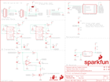

Contents
========

* [PRS13162 > ZX Gesture Sensor SMD](#prs13162--zx-gesture-sensor-smd)
	* [Schematic](#schematic)
	* [PCB](#pcb)
	* [Interactive BOM](#interactive-bom)
	* [OOMP Parts](#oomp-parts)
	* [Images](#images)
	* [Tags](#tags)
  
![][im]
# PRS13162 > ZX Gesture Sensor SMD

- ID: PROJ-SPAR-13162-STAN-01
- Hex ID: PRS13162
- Name: Sparkfun
- Description: Sparkfun
- Long Link: [http://oom.lt/PROJ-SPAR-13162-STAN-01](http://oom.lt/PROJ-SPAR-13162-STAN-01)
- Short Link: [http://oom.lt/PRS13162](http://oom.lt/PRS13162)

## Schematic
  

## PCB
  

## Interactive BOM

- Interactive BOM page: [ibom.html](https://htmlpreview.github.io/?https://github.com/oomlout/oomlout_OOMP_projects/blob/main/PROJ-SPAR-13162-STAN-01/kicad/bom/ibom.html)

## OOMP Parts
  

|OOMP Parts|
| :---: |
|[CAPC-0603-X-NF100-V50  SMD (0603) 100 nF Capacitor (Ceramic) 50v  C1, C3, C5, C8](https://github.com/oomlout/oomlout_OOMP_parts/tree/main/CAPC-0603-X-NF100-V50/)|
|[CAPC-0603-X-NF10-V50  SMD (0603) 10 nF Capacitor (Ceramic) 50v  C4, C6](https://github.com/oomlout/oomlout_OOMP_parts/tree/main/CAPC-0603-X-NF10-V50/)|
|[CAPC-0603-X-UF47D-V10  SMD (0603) 4.7 uF Capacitor (Ceramic) 10v  C7](https://github.com/oomlout/oomlout_OOMP_parts/tree/main/CAPC-0603-X-UF47D-V10/)|
|DIOD-UNMATCHED-X-UNMATCHED-01 D1, D2|
|[HEAD-I01-X-PI06-01  2.54 mm 6 Pin Header  JP1](https://github.com/oomlout/oomlout_OOMP_parts/tree/main/HEAD-I01-X-PI06-01/)|
|[HEAD-I01-X-PI05-01  2.54 mm 5 Pin Header  JP2](https://github.com/oomlout/oomlout_OOMP_parts/tree/main/HEAD-I01-X-PI05-01/)|
|UNMATCHED-SO23-X-UNMATCHED-01 Q1|
|UNMATCHED-UNMATCHED-X-UNMATCHED-01 Q2, U1, U3, U4, U5|
|RESE-0603-X-O1003-01 R1, R2, R5, R7|
|RESE-0603-X-UNMATCHED-01 R3|
|[RESE-0603-X-O102-01  SMD (0603) 1k Ohm Resistor  R4, R9, R13, R14](https://github.com/oomlout/oomlout_OOMP_parts/tree/main/RESE-0603-X-O102-01/)|
|RESE-0603-X-O10-01 R6, R8|
|[RESE-0603-X-O472-01  SMD (0603) 4.7k Ohm Resistor  R10, R11](https://github.com/oomlout/oomlout_OOMP_parts/tree/main/RESE-0603-X-O472-01/)|
|[RESE-0603-X-O103-01  SMD (0603) 10k Ohm Resistor  R12](https://github.com/oomlout/oomlout_OOMP_parts/tree/main/RESE-0603-X-O103-01/)|
|UNMATCHED-SO235-X-UNMATCHED-01 U2|

## Images
  
  

|bominteractivefront|bominteractiveback|kicadPcb3d|kicadPcb3dFront|kicadPcb3dBack|eagleImage|eagleSchemImage|pcbdraw|pcbdrawback|
| :---: | :---: | :---: | :---: | :---: | :---: | :---: | :---: | :---: |
||||||||||

## Tags

- hexID: PRS13162
- oompType: PROJ
- oompSize: SPAR
- oompColor: 13162
- oompDesc: STAN
- oompIndex: 01
- oompName: ZX Gesture Sensor SMD
- sources: All source files from https://github.com/sparkfun/ZX_Gesture_Sensor_SMD (source licence details in srcLicense.md)
- linkBuyPage: https://www.sparkfun.com/products/13162
- oompID: PROJ-SPAR-13162-STAN-01
- oompParts: C1,CAPC-0603-X-NF100-V50
- oompParts: C3,CAPC-0603-X-NF100-V50
- oompParts: C4,CAPC-0603-X-NF10-V50
- oompParts: C5,CAPC-0603-X-NF100-V50
- oompParts: C6,CAPC-0603-X-NF10-V50
- oompParts: C7,CAPC-0603-X-UF47D-V10
- oompParts: C8,CAPC-0603-X-NF100-V50
- oompParts: D1,DIOD-UNMATCHED-X-UNMATCHED-01
- oompParts: D2,DIOD-UNMATCHED-X-UNMATCHED-01
- oompParts: JP1,HEAD-I01-X-PI06-01
- oompParts: JP2,HEAD-I01-X-PI05-01
- oompParts: Q1,UNMATCHED-SO23-X-UNMATCHED-01
- oompParts: Q2,UNMATCHED-UNMATCHED-X-UNMATCHED-01
- oompParts: R1,RESE-0603-X-O1003-01
- oompParts: R2,RESE-0603-X-O1003-01
- oompParts: R3,RESE-0603-X-UNMATCHED-01
- oompParts: R4,RESE-0603-X-O102-01
- oompParts: R5,RESE-0603-X-O1003-01
- oompParts: R6,RESE-0603-X-O10-01
- oompParts: R7,RESE-0603-X-O1003-01
- oompParts: R8,RESE-0603-X-O10-01
- oompParts: R9,RESE-0603-X-O102-01
- oompParts: R10,RESE-0603-X-O472-01
- oompParts: R11,RESE-0603-X-O472-01
- oompParts: R12,RESE-0603-X-O103-01
- oompParts: R13,RESE-0603-X-O102-01
- oompParts: R14,RESE-0603-X-O102-01
- oompParts: U1,UNMATCHED-UNMATCHED-X-UNMATCHED-01
- oompParts: U2,UNMATCHED-SO235-X-UNMATCHED-01
- oompParts: U3,UNMATCHED-UNMATCHED-X-UNMATCHED-01
- oompParts: U4,UNMATCHED-UNMATCHED-X-UNMATCHED-01
- oompParts: U5,UNMATCHED-UNMATCHED-X-UNMATCHED-01
- rawParts: C1,0.1uF,0.1UF-25V(+80/-20%)(0603),0603-CAP,CAP-00810,CAP-00810,0.1uF,
- rawParts: C3,0.1uF,0.1UF-25V(+80/-20%)(0603),0603-CAP,CAP-00810,CAP-00810,0.1uF,
- rawParts: C4,10nF,10NF/10000PF-50V-10%(0603),0603-CAP,CAP-00867,CAP-00867,10nF,
- rawParts: C5,0.1uF,0.1UF-25V(+80/-20%)(0603),0603-CAP,CAP-00810,CAP-00810,0.1uF,
- rawParts: C6,10nF,10NF/10000PF-50V-10%(0603),0603-CAP,CAP-00867,CAP-00867,10nF,
- rawParts: C7,4.7uF,4.7UF-6.3V-10%(0603)0603,0603-CAP,CAP-08280,CAP-08280,4.7uF,
- rawParts: C8,0.1uF,0.1UF-25V(+80/-20%)(0603),0603-CAP,CAP-00810,CAP-00810,0.1uF,
- rawParts: D1,SFH4641SHORT2,SFH4641SHORT2,SFH4641-SHORT2,,DIO-11994,,
- rawParts: D2,SFH4641SHORT2,SFH4641SHORT2,SFH4641-SHORT2,,DIO-11994,,
- rawParts: FID1,FIDUCIALUFIDUCIAL,FIDUCIALUFIDUCIAL,MICRO-FIDUCIAL,Fiducial Alignment Points,,,
- rawParts: FID2,FIDUCIALUFIDUCIAL,FIDUCIALUFIDUCIAL,MICRO-FIDUCIAL,Fiducial Alignment Points,,,
- rawParts: FID3,FIDUCIALUFIDUCIAL,FIDUCIALUFIDUCIAL,MICRO-FIDUCIAL,Fiducial Alignment Points,,,
- rawParts: FID4,FIDUCIALUFIDUCIAL,FIDUCIALUFIDUCIAL,MICRO-FIDUCIAL,Fiducial Alignment Points,,,
- rawParts: FRAME1,FRAME-LETTER,FRAME-LETTER,CREATIVE_COMMONS,Schematic Frame,,,
- rawParts: JP1,,M06NO_SILK_FEMALE_PTH,1X06_NO_SILK,Header 6,CONN-08437,,
- rawParts: JP2,,M05PTH,1X05,Header 5,,,
- rawParts: LOGO1,REVISION,REVISION,REVISION,,,,
- rawParts: LOGO2,SFE_LOGO_FLAME.1_INCH,SFE_LOGO_FLAME.1_INCH,SFE_LOGO_FLAME_.1,SFE Logo, flame only,,,
- rawParts: Q1,MMBT2222A,TRANSISTOR_NPNMMBT2222A,SOT23-3,Generic NPN BJT,TRANS-08049,MMBT2222A,
- rawParts: Q2,MOSFET-NCHANNEL2N7002PW,MOSFET-NCHANNEL2N7002PW,SOT323,Common NMOSFET Parts,TRANS-11151,,
- rawParts: R1,100k,100KOHM-1/10W-1%(0603),0603-RES,RES-07828,RES-07828,100k,
- rawParts: R2,100k,100KOHM-1/10W-1%(0603),0603-RES,RES-07828,RES-07828,100k,
- rawParts: R3,1K 1%,1KOHM-1/10W-1%(0603),0603-RES,RES-07856,RES-07856,1K,
- rawParts: R4,1K,1KOHM-1/10W-1%(0603),0603-RES,RES-07856,RES-07856,1K,
- rawParts: R5,100k,100KOHM-1/10W-1%(0603),0603-RES,RES-07828,RES-07828,100k,
- rawParts: R6,1,1OHM1/10W1%(0603),0603-RES,RES-08269,RES-08269,1,
- rawParts: R7,100k,100KOHM-1/10W-1%(0603),0603-RES,RES-07828,RES-07828,100k,
- rawParts: R8,1,1OHM1/10W1%(0603),0603-RES,RES-08269,RES-08269,1,
- rawParts: R9,1K,1KOHM-1/10W-1%(0603),0603-RES,RES-07856,RES-07856,1K,
- rawParts: R10,4.7K,4.7KOHM-1/10W-1%(0603),0603-RES,RES-07857,RES-07857,4.7K,
- rawParts: R11,4.7K,4.7KOHM-1/10W-1%(0603),0603-RES,RES-07857,RES-07857,4.7K,
- rawParts: R12,10K,10KOHM-1/10W-1%(0603)0603,0603-RES,RES-00824,RES-00824,10K,
- rawParts: R13,1K,1KOHM-1/10W-1%(0603),0603-RES,RES-07856,RES-07856,1K,
- rawParts: R14,1K,1KOHM-1/10W-1%(0603),0603-RES,RES-07856,RES-07856,1K,
- rawParts: SJ1,JUMPER-PAD-3-NC_BY_PASTE,JUMPER-PAD-3-NC_BY_PASTE,PAD-JUMPER-3-NC_BY_PASTE_YES_SILK_FULL_BOX,,,,
- rawParts: SJ2,JUMPER-PAD-2-NOYES_SILK,JUMPER-PAD-2-NOYES_SILK,PAD-JUMPER-2-NO_YES_SILK,,,,
- rawParts: STANDOFF1,STAND-OFF,STAND-OFF,STAND-OFF,#4 Stand Off,,,
- rawParts: STANDOFF2,STAND-OFF,STAND-OFF,STAND-OFF,#4 Stand Off,,,
- rawParts: TP1,TEST-POINT3X4,TEST-POINT3X4,PAD.03X.04,Bare copper test points for troubleshooting or ICT,,,
- rawParts: TP2,TEST-POINT3X4,TEST-POINT3X4,PAD.03X.04,Bare copper test points for troubleshooting or ICT,,,
- rawParts: TP3,TEST-POINT3X4,TEST-POINT3X4,PAD.03X.04,Bare copper test points for troubleshooting or ICT,,,
- rawParts: TP4,TEST-POINT3X4,TEST-POINT3X4,PAD.03X.04,Bare copper test points for troubleshooting or ICT,,,
- rawParts: TP5,TEST-POINT3X4,TEST-POINT3X4,PAD.03X.04,Bare copper test points for troubleshooting or ICT,,,
- rawParts: U$5,SFE_LOGO_NAME_FLAME.1_INCH,SFE_LOGO_NAME_FLAME.1_INCH,SFE_LOGO_NAME_FLAME_.1,SFE Logo, name and flame,,,
- rawParts: U$6,GESTURESENSE_LOGOSTEXT,GESTURESENSE_LOGOSTEXT,GESTURESENSE_TEXT,,,,
- rawParts: U1,PIC16F1823-14PINTSSOP,PIC16F1823-14PINTSSOP,TSSOP14,,IC-11992,,
- rawParts: U2,MCP6021T-E/OT,MCP6021T-E/OT,SOT23-5,Rail-to-rail input/output op-amp with 10 MHz bandwidth.,IC-12504,,
- rawParts: U3,DMC2700UDM,DMC2700UDM,SOT26,,TRANS-11993,,
- rawParts: U4,DMC2700UDM,DMC2700UDM,SOT26,,TRANS-11993,,
- rawParts: U5,TSSP57038,TSSP57038,TSOP572,,PROD-13609,,

[im]: kicadPcb3d_450.png
