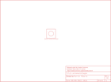

Contents
========

* [PRS13169 > Sparkfun](#prs13169--sparkfun)
	* [Schematic](#schematic)
	* [Interactive BOM](#interactive-bom)
	* [OOMP Parts](#oomp-parts)
	* [Images](#images)
	* [Tags](#tags)
  
![][im]
# PRS13169 > Sparkfun

- ID: PROJ-SPAR-13169-STAN-01
- Hex ID: PRS13169
- Name: Sparkfun
- Description: Sparkfun
- Long Link: [http://oom.lt/PROJ-SPAR-13169-STAN-01](http://oom.lt/PROJ-SPAR-13169-STAN-01)
- Short Link: [http://oom.lt/PRS13169](http://oom.lt/PRS13169)

## Schematic
  

## Interactive BOM

- Interactive BOM page: [ibom.html](https://htmlpreview.github.io/?https://github.com/oomlout/oomlout_OOMP_projects/blob/main/PROJ-SPAR-13169-STAN-01/kicad/bom/ibom.html)

## OOMP Parts
  

|OOMP Parts|
| :---: |
|U$1,UNMATCHED-UNMATCHED-X-UNMATCHED-01,FRAME1,FRAME-LETTER,FRAME-LETTER,CREATIVE_COMMONS,Schematic Frame,,|

## Images
  
  

|kicadPcb3d|kicadPcb3dFront|kicadPcb3dBack|eagleImage|eagleSchemImage|
| :---: | :---: | :---: | :---: | :---: |
||||||

## Tags

- hexID: PRS13169
- oompType: PROJ
- oompSize: SPAR
- oompColor: 13169
- oompDesc: STAN
- oompIndex: 01
- oompName: Blackberry Trackballer Breakout
- sources: All source files from https://github.com/sparkfun/Blackberry_Trackballer_Breakout (source licence details in srcLicense.md)
- linkBuyPage: https://www.sparkfun.com/products/13169
- oompID: PROJ-SPAR-13169-STAN-01
- oompParts: U$1,UNMATCHED-UNMATCHED-X-UNMATCHED-01
- rawParts: FRAME1,FRAME-LETTER,FRAME-LETTER,CREATIVE_COMMONS,Schematic Frame,,
- rawParts: U$1,BLACKBERRY_TRACKBALLER,BLACKBERRY_TRACKBALLER,BLACKBERRY_TRACKBALLER,,PCB-12486,

[im]: kicadPcb3d_450.png
