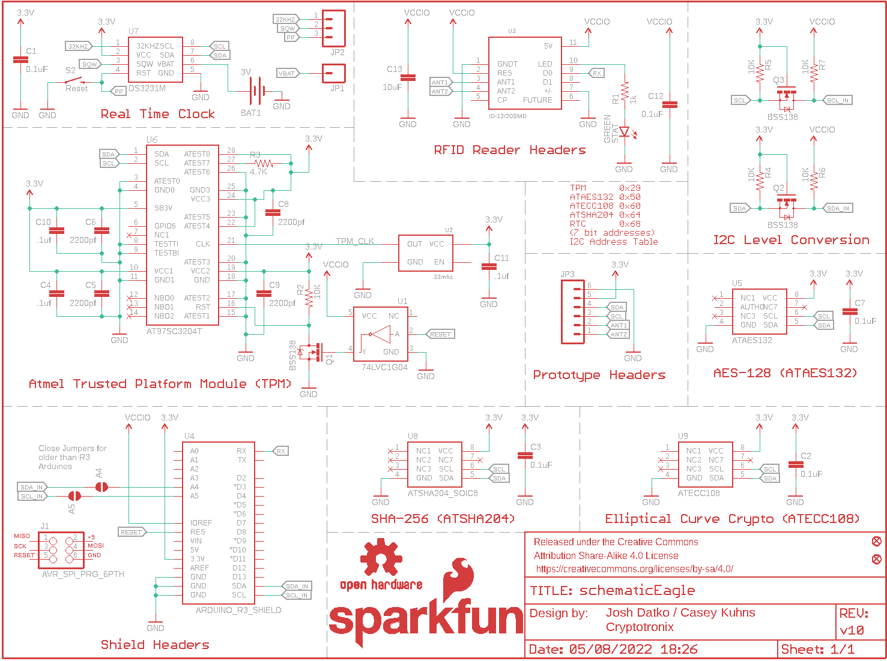
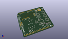
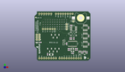
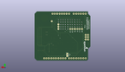
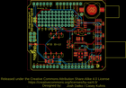
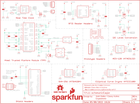

Contents
========

* [PRS13183 > Sparkfun](#prs13183--sparkfun)
	* [Schematic](#schematic)
	* [Interactive BOM](#interactive-bom)
	* [OOMP Parts](#oomp-parts)
	* [Images](#images)
	* [Tags](#tags)
  
![][im]
# PRS13183 > Sparkfun

- ID: PROJ-SPAR-13183-STAN-01
- Hex ID: PRS13183
- Name: Sparkfun
- Description: Sparkfun
- Long Link: [http://oom.lt/PROJ-SPAR-13183-STAN-01](http://oom.lt/PROJ-SPAR-13183-STAN-01)
- Short Link: [http://oom.lt/PRS13183](http://oom.lt/PRS13183)

## Schematic
  

## Interactive BOM

- Interactive BOM page: [ibom.html](https://htmlpreview.github.io/?https://github.com/oomlout/oomlout_OOMP_projects/blob/main/PROJ-SPAR-13183-STAN-01/kicad/bom/ibom.html)

## OOMP Parts
  

|OOMP Parts|
| :---: |
|BAT1,UNMATCHED-UNMATCHED-X-UNMATCHED-01,A4,,JUMPER-PAD-2-NOYES_SILK,PAD-JUMPER-2-NO_YES_SILK,,,,,,|
|C1,CAPC-0603-X-NF100-V50,A5,,JUMPER-PAD-2-NOYES_SILK,PAD-JUMPER-2-NO_YES_SILK,,,,,,|
|C2,CAPC-0603-X-NF100-V50,BAT1,3V,BATTERY12MM,BATTCON_12MM,Battery Holders,,BATT-08044,,,|
|C3,CAPC-0603-X-NF100-V50,C1,0.1uF,0.1UF-25V(+80/-20%)(0603),0603-CAP,CAP-00810,,CAP-00810,0.1uF,,|
|C4,CAPC-0603-X-UNMATCHED-01,C2,0.1uF,0.1UF-25V(+80/-20%)(0603),0603-CAP,CAP-00810,,CAP-00810,0.1uF,,|
|C5,CAPC-0603-X-UNMATCHED-01,C3,0.1uF,0.1UF-25V(+80/-20%)(0603),0603-CAP,CAP-00810,,CAP-00810,0.1uF,,|
|C6,CAPC-0603-X-UNMATCHED-01,C4,.1uf,0.1UF-25V(+80/-20%)(0603),0603-CAP,CAP-00810,,CAP-00810,0.1uF,,|
|C7,CAPC-0603-X-NF100-V50,C5,2200pf,2.2NF/2200PF-50V-10%(0603),0603-CAP,CAP-07877,,CAP-07877,2.2nF,,|
|C8,CAPC-0603-X-UNMATCHED-01,C6,2200pf,2.2NF/2200PF-50V-10%(0603),0603-CAP,CAP-07877,,CAP-07877,2.2nF,,|
|C9,CAPC-0603-X-UNMATCHED-01,C7,0.1uF,0.1UF-25V(+80/-20%)(0603),0603-CAP,CAP-00810,,CAP-00810,0.1uF,,|
|C10,CAPC-0603-X-UNMATCHED-01,C8,2200pf,2.2NF/2200PF-50V-10%(0603),0603-CAP,CAP-07877,,CAP-07877,2.2nF,,|
|C11,CAPC-0603-X-UNMATCHED-01,C9,2200pf,2.2NF/2200PF-50V-10%(0603),0603-CAP,CAP-07877,,CAP-07877,2.2nF,,|
|C12,CAPC-0603-X-NF100-V50,C10,.1uf,0.1UF-25V(+80/-20%)(0603),0603-CAP,CAP-00810,,CAP-00810,0.1uF,,|
|C13,CAPX-UNMATCHED-X-UF10-01,C11,.1uf,0.1UF-25V(+80/-20%)(0603),0603-CAP,CAP-00810,,CAP-00810,0.1uF,,|
|FRAME2,UNMATCHED-UNMATCHED-X-UNMATCHED-01,C12,0.1uF,0.1UF-25V(+80/-20%)(0603),0603-CAP,CAP-00810,,CAP-00810,0.1uF,,|
|J1,UNMATCHED-UNMATCHED-X-UNMATCHED-01,C13,10uF,10UF50V20%(1210),1210,CAP-09824,,CAP-09824,10uF,,|
|JP1,HEAD-I01-X-PI01-01,FID1,FIDUCIAL1X2,FIDUCIAL1X2,FIDUCIAL-1X2,Fiducial Alignment Points,,,,,|
|JP2,HEAD-I01-X-PI03-01,FID2,FIDUCIAL1X2,FIDUCIAL1X2,FIDUCIAL-1X2,Fiducial Alignment Points,,,,,|
|JP3,HEAD-I01-X-PI06-01,FRAME2,,FRAME-LETTER,CREATIVE_COMMONS,Schematic Frame,Josh Datko / Casey Kuhns,,,v10,|
|Q1,UNMATCHED-SO23-X-KBSS138-01,J1,AVR_SPI_PRG_6PTH,AVR_SPI_PRG_6PTH,2X3,AVR ISP 6 Pin,,,,,|
|Q2,UNMATCHED-SO23-X-KBSS138-01,JP1,M01PTH,M01PTH,1X01,Header 1,,,,,|
|Q3,UNMATCHED-SO23-X-KBSS138-01,JP2,,M03PTH,1X03,Header 3,,,,,|
|R1,RESE-0603-X-O102-01,JP3,,M06NO_SILK_FEMALE_PTH,1X06_NO_SILK,Header 6,,CONN-08437,,,|
|R2,RESE-0603-X-O103-01,LOGO2,OSHW-LOGOS,OSHW-LOGOS,OSHW-LOGO-S,Open Source Hardware Logo This logo indicates the piece of hardware it is found on incorporates a OSHW license and/or adheres to the definition of open source hardware found here: http://freedomdefined.org/OSHW,,,,,|
|R3,RESE-0603-X-O472-01,LOGO3,SFE_LOGO_NAME_FLAME.1_INCH,SFE_LOGO_NAME_FLAME.1_INCH,SFE_LOGO_NAME_FLAME_.1,SFE Logo, name and flame,,,,,|
|R4,RESE-0603-X-O103-01,Q1,BSS138,MOSFET-NCHANNELBSS138,SOT23-3,Common NMOSFET Parts,,TRANS-00830,200mA/50V,,|
|R5,RESE-0603-X-O103-01,Q2,BSS138,MOSFET-NCHANNELBSS138,SOT23-3,Common NMOSFET Parts,,TRANS-00830,200mA/50V,,|
|R6,RESE-0603-X-O103-01,Q3,BSS138,MOSFET-NCHANNELBSS138,SOT23-3,Common NMOSFET Parts,,TRANS-00830,200mA/50V,,|
|R7,RESE-0603-X-O103-01,R1,1k,1K-1%,0603-RES,1k-ohm SMT,,RES-07856,1k,,|
|S2,UNMATCHED-UNMATCHED-X-UNMATCHED-01,R2,10K,10KOHM-1/10W-1%(0603)0603,0603-RES,RES-00824,,RES-00824,10K,,|
|STAT,LEDS-0603-G-STAN-01,R3,4.7K,4.7KOHM1/10W1%(0603),0603,RES-07857,,RES-07857,,,|
|U1,UNMATCHED-UNMATCHED-X-UNMATCHED-01,R4,10K,10KOHM-1/10W-1%(0603)0603,0603-RES,RES-00824,,RES-00824,10K,,|
|U2,UNMATCHED-UNMATCHED-X-UNMATCHED-01,R5,10K,10KOHM-1/10W-1%(0603)0603,0603-RES,RES-00824,,RES-00824,10K,,|
|U3,UNMATCHED-UNMATCHED-X-UNMATCHED-01,R6,10K,10KOHM-1/10W-1%(0603)0603,0603-RES,RES-00824,,RES-00824,10K,,|
|U4,UNMATCHED-UNMATCHED-X-UNMATCHED-01,R7,10K,10KOHM-1/10W-1%(0603)0603,0603-RES,RES-00824,,RES-00824,10K,,|
|U5,UNMATCHED-UNMATCHED-X-UNMATCHED-01,S2,Reset,SWITCH-MOMENTARY-2SMD,TACTILE-SWITCH-SMD,Various NO switches- pushbuttons, reed, etc,,SWCH-08247,,,|
|U6,UNMATCHED-UNMATCHED-X-UNMATCHED-01,STAT,GREEN,LED-GREEN0603,LED-0603,Various green LEDs,,DIO-00821,GREEN,,|
|U7,UNMATCHED-UNMATCHED-X-UNMATCHED-01,U1,74LVC1G04,INVERTER_SOT353-5,SOT353,Single inverter, SOT23-5,,10843,74LVC1G04,,|
|U8,UNMATCHED-UNMATCHED-X-UNMATCHED-01,U2,33mhz,33MHZ-OSCILLATOR,CRYSTAL-OSC-SMD-5X3.2,Generic 5x3.2 Oscillator,,XTAL-11986,,,|
|U9,UNMATCHED-UNMATCHED-X-UNMATCHED-01,U3,ID-12/20SMD,ID-12/20SMD,ID-12_SMD,RFID reader for ID2, ID12, and ID20 Package,,,,,|

## Images
  
  

|kicadPcb3d|kicadPcb3dFront|kicadPcb3dBack|eagleImage|eagleSchemImage|
| :---: | :---: | :---: | :---: | :---: |
||||||

## Tags

- hexID: PRS13183
- oompType: PROJ
- oompSize: SPAR
- oompColor: 13183
- oompDesc: STAN
- oompIndex: 01
- oompName: CryptoShield
- sources: All source files from https://github.com/sparkfun/CryptoShield (source licence details in srcLicense.md)
- linkBuyPage: https://www.sparkfun.com/products/13183
- oompID: PROJ-SPAR-13183-STAN-01
- oompParts: BAT1,UNMATCHED-UNMATCHED-X-UNMATCHED-01
- oompParts: C1,CAPC-0603-X-NF100-V50
- oompParts: C2,CAPC-0603-X-NF100-V50
- oompParts: C3,CAPC-0603-X-NF100-V50
- oompParts: C4,CAPC-0603-X-UNMATCHED-01
- oompParts: C5,CAPC-0603-X-UNMATCHED-01
- oompParts: C6,CAPC-0603-X-UNMATCHED-01
- oompParts: C7,CAPC-0603-X-NF100-V50
- oompParts: C8,CAPC-0603-X-UNMATCHED-01
- oompParts: C9,CAPC-0603-X-UNMATCHED-01
- oompParts: C10,CAPC-0603-X-UNMATCHED-01
- oompParts: C11,CAPC-0603-X-UNMATCHED-01
- oompParts: C12,CAPC-0603-X-NF100-V50
- oompParts: C13,CAPX-UNMATCHED-X-UF10-01
- oompParts: FRAME2,UNMATCHED-UNMATCHED-X-UNMATCHED-01
- oompParts: J1,UNMATCHED-UNMATCHED-X-UNMATCHED-01
- oompParts: JP1,HEAD-I01-X-PI01-01
- oompParts: JP2,HEAD-I01-X-PI03-01
- oompParts: JP3,HEAD-I01-X-PI06-01
- oompParts: Q1,UNMATCHED-SO23-X-KBSS138-01
- oompParts: Q2,UNMATCHED-SO23-X-KBSS138-01
- oompParts: Q3,UNMATCHED-SO23-X-KBSS138-01
- oompParts: R1,RESE-0603-X-O102-01
- oompParts: R2,RESE-0603-X-O103-01
- oompParts: R3,RESE-0603-X-O472-01
- oompParts: R4,RESE-0603-X-O103-01
- oompParts: R5,RESE-0603-X-O103-01
- oompParts: R6,RESE-0603-X-O103-01
- oompParts: R7,RESE-0603-X-O103-01
- oompParts: S2,UNMATCHED-UNMATCHED-X-UNMATCHED-01
- oompParts: STAT,LEDS-0603-G-STAN-01
- oompParts: U1,UNMATCHED-UNMATCHED-X-UNMATCHED-01
- oompParts: U2,UNMATCHED-UNMATCHED-X-UNMATCHED-01
- oompParts: U3,UNMATCHED-UNMATCHED-X-UNMATCHED-01
- oompParts: U4,UNMATCHED-UNMATCHED-X-UNMATCHED-01
- oompParts: U5,UNMATCHED-UNMATCHED-X-UNMATCHED-01
- oompParts: U6,UNMATCHED-UNMATCHED-X-UNMATCHED-01
- oompParts: U7,UNMATCHED-UNMATCHED-X-UNMATCHED-01
- oompParts: U8,UNMATCHED-UNMATCHED-X-UNMATCHED-01
- oompParts: U9,UNMATCHED-UNMATCHED-X-UNMATCHED-01
- rawParts: A4,,JUMPER-PAD-2-NOYES_SILK,PAD-JUMPER-2-NO_YES_SILK,,,,,,
- rawParts: A5,,JUMPER-PAD-2-NOYES_SILK,PAD-JUMPER-2-NO_YES_SILK,,,,,,
- rawParts: BAT1,3V,BATTERY12MM,BATTCON_12MM,Battery Holders,,BATT-08044,,,
- rawParts: C1,0.1uF,0.1UF-25V(+80/-20%)(0603),0603-CAP,CAP-00810,,CAP-00810,0.1uF,,
- rawParts: C2,0.1uF,0.1UF-25V(+80/-20%)(0603),0603-CAP,CAP-00810,,CAP-00810,0.1uF,,
- rawParts: C3,0.1uF,0.1UF-25V(+80/-20%)(0603),0603-CAP,CAP-00810,,CAP-00810,0.1uF,,
- rawParts: C4,.1uf,0.1UF-25V(+80/-20%)(0603),0603-CAP,CAP-00810,,CAP-00810,0.1uF,,
- rawParts: C5,2200pf,2.2NF/2200PF-50V-10%(0603),0603-CAP,CAP-07877,,CAP-07877,2.2nF,,
- rawParts: C6,2200pf,2.2NF/2200PF-50V-10%(0603),0603-CAP,CAP-07877,,CAP-07877,2.2nF,,
- rawParts: C7,0.1uF,0.1UF-25V(+80/-20%)(0603),0603-CAP,CAP-00810,,CAP-00810,0.1uF,,
- rawParts: C8,2200pf,2.2NF/2200PF-50V-10%(0603),0603-CAP,CAP-07877,,CAP-07877,2.2nF,,
- rawParts: C9,2200pf,2.2NF/2200PF-50V-10%(0603),0603-CAP,CAP-07877,,CAP-07877,2.2nF,,
- rawParts: C10,.1uf,0.1UF-25V(+80/-20%)(0603),0603-CAP,CAP-00810,,CAP-00810,0.1uF,,
- rawParts: C11,.1uf,0.1UF-25V(+80/-20%)(0603),0603-CAP,CAP-00810,,CAP-00810,0.1uF,,
- rawParts: C12,0.1uF,0.1UF-25V(+80/-20%)(0603),0603-CAP,CAP-00810,,CAP-00810,0.1uF,,
- rawParts: C13,10uF,10UF50V20%(1210),1210,CAP-09824,,CAP-09824,10uF,,
- rawParts: FID1,FIDUCIAL1X2,FIDUCIAL1X2,FIDUCIAL-1X2,Fiducial Alignment Points,,,,,
- rawParts: FID2,FIDUCIAL1X2,FIDUCIAL1X2,FIDUCIAL-1X2,Fiducial Alignment Points,,,,,
- rawParts: FRAME2,,FRAME-LETTER,CREATIVE_COMMONS,Schematic Frame,Josh Datko / Casey Kuhns,,,v10,
- rawParts: J1,AVR_SPI_PRG_6PTH,AVR_SPI_PRG_6PTH,2X3,AVR ISP 6 Pin,,,,,
- rawParts: JP1,M01PTH,M01PTH,1X01,Header 1,,,,,
- rawParts: JP2,,M03PTH,1X03,Header 3,,,,,
- rawParts: JP3,,M06NO_SILK_FEMALE_PTH,1X06_NO_SILK,Header 6,,CONN-08437,,,
- rawParts: LOGO2,OSHW-LOGOS,OSHW-LOGOS,OSHW-LOGO-S,Open Source Hardware Logo This logo indicates the piece of hardware it is found on incorporates a OSHW license and/or adheres to the definition of open source hardware found here: http://freedomdefined.org/OSHW,,,,,
- rawParts: LOGO3,SFE_LOGO_NAME_FLAME.1_INCH,SFE_LOGO_NAME_FLAME.1_INCH,SFE_LOGO_NAME_FLAME_.1,SFE Logo, name and flame,,,,,
- rawParts: Q1,BSS138,MOSFET-NCHANNELBSS138,SOT23-3,Common NMOSFET Parts,,TRANS-00830,200mA/50V,,
- rawParts: Q2,BSS138,MOSFET-NCHANNELBSS138,SOT23-3,Common NMOSFET Parts,,TRANS-00830,200mA/50V,,
- rawParts: Q3,BSS138,MOSFET-NCHANNELBSS138,SOT23-3,Common NMOSFET Parts,,TRANS-00830,200mA/50V,,
- rawParts: R1,1k,1K-1%,0603-RES,1k-ohm SMT,,RES-07856,1k,,
- rawParts: R2,10K,10KOHM-1/10W-1%(0603)0603,0603-RES,RES-00824,,RES-00824,10K,,
- rawParts: R3,4.7K,4.7KOHM1/10W1%(0603),0603,RES-07857,,RES-07857,,,
- rawParts: R4,10K,10KOHM-1/10W-1%(0603)0603,0603-RES,RES-00824,,RES-00824,10K,,
- rawParts: R5,10K,10KOHM-1/10W-1%(0603)0603,0603-RES,RES-00824,,RES-00824,10K,,
- rawParts: R6,10K,10KOHM-1/10W-1%(0603)0603,0603-RES,RES-00824,,RES-00824,10K,,
- rawParts: R7,10K,10KOHM-1/10W-1%(0603)0603,0603-RES,RES-00824,,RES-00824,10K,,
- rawParts: S2,Reset,SWITCH-MOMENTARY-2SMD,TACTILE-SWITCH-SMD,Various NO switches- pushbuttons, reed, etc,,SWCH-08247,,,
- rawParts: STAT,GREEN,LED-GREEN0603,LED-0603,Various green LEDs,,DIO-00821,GREEN,,
- rawParts: U1,74LVC1G04,INVERTER_SOT353-5,SOT353,Single inverter, SOT23-5,,10843,74LVC1G04,,
- rawParts: U2,33mhz,33MHZ-OSCILLATOR,CRYSTAL-OSC-SMD-5X3.2,Generic 5x3.2 Oscillator,,XTAL-11986,,,
- rawParts: U3,ID-12/20SMD,ID-12/20SMD,ID-12_SMD,RFID reader for ID2, ID12, and ID20 Package,,,,,
- rawParts: U4,ARDUINO_R3_SHIELD,ARDUINO_R3_SHIELD,UNO_R3_SHIELD,Shield form compatible with the Arduino Uno R3.,,,,,
- rawParts: U5,ATAES132,ATAES132,SOIC8,32Kb Serial EEPROM.,,IC-11983,,,
- rawParts: U6,AT97SC3204T,AT97SC3204T,TSSOP28,Atmel TPM 1.2,,IC-11984,,,
- rawParts: U7,DS3231M,DS3231M,SOIC8,DS3231M Real Time Clock.  Accuracy +/-5ppm.  Battery Backup.  2.3V to 5.5V.,,IC-11985,,,
- rawParts: U8,ATSHA204_SOIC8,ATSHA204_SOIC8,SOIC8,ATSHA204,,IC-11981,,,
- rawParts: U9,ATECC108,ATECC108,SOIC8,ATECC108: Provides ECDSA with NIST curves P256, B283, and K283.  Also, a RNG, 8.5Kb EEPROM.  2.0V - 5.5V.,,IC-11982,,,

[im]: kicadPcb3d_450.png
