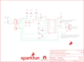

Contents
========

* [PRS13230 > Sparkfun](#prs13230--sparkfun)
	* [Schematic](#schematic)
	* [Interactive BOM](#interactive-bom)
	* [OOMP Parts](#oomp-parts)
	* [Images](#images)
	* [Tags](#tags)
  
![][im]
# PRS13230 > Sparkfun

- ID: PROJ-SPAR-13230-STAN-01
- Hex ID: PRS13230
- Name: Sparkfun
- Description: Sparkfun
- Long Link: [http://oom.lt/PROJ-SPAR-13230-STAN-01](http://oom.lt/PROJ-SPAR-13230-STAN-01)
- Short Link: [http://oom.lt/PRS13230](http://oom.lt/PRS13230)

## Schematic
  

## Interactive BOM

- Interactive BOM page: [ibom.html](https://htmlpreview.github.io/?https://github.com/oomlout/oomlout_OOMP_projects/blob/main/PROJ-SPAR-13230-STAN-01/kicad/bom/ibom.html)

## OOMP Parts
  

|OOMP Parts|
| :---: |
|C1,CAPC-0603-X-NF100-V50,C1,0.1uF,0.1UF-25V-5%(0603),0603-CAP,CAP-08604,CAP-08604,0.1uF,|
|C2,CAPC-0603-X-NF100-V50,C2,0.1uF,0.1UF-25V-5%(0603),0603-CAP,CAP-08604,CAP-08604,0.1uF,|
|C3,CAPC-0603-X-NF100-V50,C3,0.1uF,0.1UF-25V-5%(0603),0603-CAP,CAP-08604,CAP-08604,0.1uF,|
|C4,CAPC-0603-X-NF100-V50,C4,0.1uF,0.1UF-25V-5%(0603),0603-CAP,CAP-08604,CAP-08604,0.1uF,|
|C5,CAPC-0603-X-NF100-V50,C5,0.1uF,0.1UF-25V-5%(0603),0603-CAP,CAP-08604,CAP-08604,0.1uF,|
|C6,CAPX-UNMATCHED-X-UF10-01,C6,10uF,10UF50V20%(1210),1210,CAP-09824,CAP-09824,10uF,|
|C7,CAPX-UNMATCHED-X-UF10-01,C7,10uF,10UF50V20%(1210),1210,CAP-09824,CAP-09824,10uF,|
|J1,UNMATCHED-UNMATCHED-X-UNMATCHED-01,FID1,FIDUCIAL1X2,FIDUCIAL1X2,FIDUCIAL-1X2,Fiducial Alignment Points,,,|
|JP2,HEAD-I01-X-PI02-01,FID2,FIDUCIAL1X2,FIDUCIAL1X2,FIDUCIAL-1X2,Fiducial Alignment Points,,,|
|JP4,HEAD-I01-X-PI05-01,FRAME1,FRAME-LETTER,FRAME-LETTER,CREATIVE_COMMONS,Schematic Frame,,,|
|L1,UNMATCHED-0805-X-UNMATCHED-01,J1,,M05PTH,1X05,Header 5,,,|
|Q1,UNMATCHED-SO23-X-UNMATCHED-01,JP2,,M02PTH,1X02,Standard 2-pin 0.1 header. Use with,,,|
|R1,RESE-0603-X-O203-01,JP4,,M05PTH,1X05,Header 5,,,|
|R2,RESE-0603-X-UNMATCHED-01,L1,3.3uH,INDUCTOR0805-IND,0805,Inductors,NDUC-13076,,|
|R3,RESE-0603-X-O101-01,LOGO1,SFE_LOGO_NAME_FLAME.1_INCH,SFE_LOGO_NAME_FLAME.1_INCH,SFE_LOGO_NAME_FLAME_.1,SFE Logo, name and flame,,,|
|R4,RESE-0603-X-O101-01,LOGO3,SFE_LOGO_FLAME.1_INCH,SFE_LOGO_FLAME.1_INCH,SFE_LOGO_FLAME_.1,SFE Logo, flame only,,,|
|R5,RESE-0603-X-O103-01,Q1,MMBT4403,TRANSISTOR_PNPMMBT4403,SOT23-3,Generic PNP BJT,TRANS-09245,MMBT4403,|
|U$1,UNMATCHED-UNMATCHED-X-UNMATCHED-01,R1,20k,20KOHM1/10W1%(0603),0603-RES,RES-09383,RES-09383,20k,|
|U1,UNMATCHED-UNMATCHED-X-UNMATCHED-01,R2,8.2K,8.2KOHM-1/10W-5%(0603),0603-RES,RES-10646,RES-10646,,|

## Images
  
  

|kicadPcb3d|kicadPcb3dFront|kicadPcb3dBack|eagleImage|eagleSchemImage|
| :---: | :---: | :---: | :---: | :---: |
||||||

## Tags

- hexID: PRS13230
- oompType: PROJ
- oompSize: SPAR
- oompColor: 13230
- oompDesc: STAN
- oompIndex: 01
- oompName: HX711-Load-Cell-Amplifier
- sources: All source files from https://github.com/sparkfun/HX711-Load-Cell-Amplifier (source licence details in srcLicense.md)
- linkBuyPage: https://www.sparkfun.com/products/13230
- oompID: PROJ-SPAR-13230-STAN-01
- oompParts: C1,CAPC-0603-X-NF100-V50
- oompParts: C2,CAPC-0603-X-NF100-V50
- oompParts: C3,CAPC-0603-X-NF100-V50
- oompParts: C4,CAPC-0603-X-NF100-V50
- oompParts: C5,CAPC-0603-X-NF100-V50
- oompParts: C6,CAPX-UNMATCHED-X-UF10-01
- oompParts: C7,CAPX-UNMATCHED-X-UF10-01
- oompParts: J1,UNMATCHED-UNMATCHED-X-UNMATCHED-01
- oompParts: JP2,HEAD-I01-X-PI02-01
- oompParts: JP4,HEAD-I01-X-PI05-01
- oompParts: L1,UNMATCHED-0805-X-UNMATCHED-01
- oompParts: Q1,UNMATCHED-SO23-X-UNMATCHED-01
- oompParts: R1,RESE-0603-X-O203-01
- oompParts: R2,RESE-0603-X-UNMATCHED-01
- oompParts: R3,RESE-0603-X-O101-01
- oompParts: R4,RESE-0603-X-O101-01
- oompParts: R5,RESE-0603-X-O103-01
- oompParts: U$1,UNMATCHED-UNMATCHED-X-UNMATCHED-01
- oompParts: U1,UNMATCHED-UNMATCHED-X-UNMATCHED-01
- rawParts: C1,0.1uF,0.1UF-25V-5%(0603),0603-CAP,CAP-08604,CAP-08604,0.1uF,
- rawParts: C2,0.1uF,0.1UF-25V-5%(0603),0603-CAP,CAP-08604,CAP-08604,0.1uF,
- rawParts: C3,0.1uF,0.1UF-25V-5%(0603),0603-CAP,CAP-08604,CAP-08604,0.1uF,
- rawParts: C4,0.1uF,0.1UF-25V-5%(0603),0603-CAP,CAP-08604,CAP-08604,0.1uF,
- rawParts: C5,0.1uF,0.1UF-25V-5%(0603),0603-CAP,CAP-08604,CAP-08604,0.1uF,
- rawParts: C6,10uF,10UF50V20%(1210),1210,CAP-09824,CAP-09824,10uF,
- rawParts: C7,10uF,10UF50V20%(1210),1210,CAP-09824,CAP-09824,10uF,
- rawParts: FID1,FIDUCIAL1X2,FIDUCIAL1X2,FIDUCIAL-1X2,Fiducial Alignment Points,,,
- rawParts: FID2,FIDUCIAL1X2,FIDUCIAL1X2,FIDUCIAL-1X2,Fiducial Alignment Points,,,
- rawParts: FRAME1,FRAME-LETTER,FRAME-LETTER,CREATIVE_COMMONS,Schematic Frame,,,
- rawParts: J1,,M05PTH,1X05,Header 5,,,
- rawParts: JP2,,M02PTH,1X02,Standard 2-pin 0.1 header. Use with,,,
- rawParts: JP4,,M05PTH,1X05,Header 5,,,
- rawParts: L1,3.3uH,INDUCTOR0805-IND,0805,Inductors,NDUC-13076,,
- rawParts: LOGO1,SFE_LOGO_NAME_FLAME.1_INCH,SFE_LOGO_NAME_FLAME.1_INCH,SFE_LOGO_NAME_FLAME_.1,SFE Logo, name and flame,,,
- rawParts: LOGO3,SFE_LOGO_FLAME.1_INCH,SFE_LOGO_FLAME.1_INCH,SFE_LOGO_FLAME_.1,SFE Logo, flame only,,,
- rawParts: Q1,MMBT4403,TRANSISTOR_PNPMMBT4403,SOT23-3,Generic PNP BJT,TRANS-09245,MMBT4403,
- rawParts: R1,20k,20KOHM1/10W1%(0603),0603-RES,RES-09383,RES-09383,20k,
- rawParts: R2,8.2K,8.2KOHM-1/10W-5%(0603),0603-RES,RES-10646,RES-10646,,
- rawParts: R3,100,100OHM-1/10W-1%(0603),0603-RES,RES-07863,RES-07863,100,
- rawParts: R4,100,100OHM-1/10W-1%(0603),0603-RES,RES-07863,RES-07863,100,
- rawParts: R5,10K,10KOHM-1/10W-1%(0603)0603,0603-RES,RES-00824,RES-00824,10K,
- rawParts: SJ2,,JUMPER-PAD-2-NC_BY_TRACE,PAD-JUMPER-2-NC_BY_TRACE_YES_SILK,,,,
- rawParts: STANDOFF1,STAND-OFF,STAND-OFF,STAND-OFF,#4 Stand Off,,,
- rawParts: STANDOFF2,STAND-OFF,STAND-OFF,STAND-OFF,#4 Stand Off,,,
- rawParts: STANDOFF3,STAND-OFF,STAND-OFF,STAND-OFF,#4 Stand Off,,,
- rawParts: STANDOFF4,STAND-OFF,STAND-OFF,STAND-OFF,#4 Stand Off,,,
- rawParts: U$1,REVISION,REVISION,REVISION,,,,
- rawParts: U1,HX711,HX711HX711,SO16,,IC-12445,HX711,
- rawParts: U7,OSHW-LOGOS,OSHW-LOGOS,OSHW-LOGO-S,Open Source Hardware Logo,,,

[im]: kicadPcb3d_450.png
