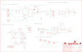

Contents
========

* [PRS13261 > OpenScale](#prs13261--openscale)
	* [Schematic](#schematic)
	* [PCB](#pcb)
	* [Interactive BOM](#interactive-bom)
	* [OOMP Parts](#oomp-parts)
	* [Images](#images)
	* [Tags](#tags)
  
![][im]
# PRS13261 > OpenScale

- ID: PROJ-SPAR-13261-STAN-01
- Hex ID: PRS13261
- Name: Sparkfun
- Description: Sparkfun
- Long Link: [http://oom.lt/PROJ-SPAR-13261-STAN-01](http://oom.lt/PROJ-SPAR-13261-STAN-01)
- Short Link: [http://oom.lt/PRS13261](http://oom.lt/PRS13261)

## Schematic
  

## PCB
  

## Interactive BOM

- Interactive BOM page: [ibom.html](https://htmlpreview.github.io/?https://github.com/oomlout/oomlout_OOMP_projects/blob/main/PROJ-SPAR-13261-STAN-01/kicad/bom/ibom.html)

## OOMP Parts
  

|OOMP ID|Name|Identifier|
| :---: | :---: | :---: |
|[CAPC-0603-X-NF100-V50](https://github.com/oomlout/oomlout_OOMP_parts/tree/main/CAPC-0603-X-NF100-V50/)|[SMD (0603) 100 nF Capacitor (Ceramic) 50v](https://github.com/oomlout/oomlout_OOMP_parts/tree/main/CAPC-0603-X-NF100-V50/)|[C1, C3, C6, C7, C8, C10, C11, C14, C16](https://github.com/oomlout/oomlout_OOMP_parts/tree/main/CAPC-0603-X-NF100-V50/)|
|CAPC-0603-X-PF47-01||C2, C5|
|CAPC-0603-X-UNMATCHED-01||C4, C12, C13|
|CAPT-3216-X-UF10-01||C9|
|LEDS-1206-Y-STAN-01||D1|
|LEDS-1206-G-STAN-01||D2|
|LEDS-1206-L-STAN-01||D3|
|REFU-1206-X-UNMATCHED-01||F1|
|HEAD-I01-X-PI01-01||J1|
|[HEAD-I01-X-PI03-01](https://github.com/oomlout/oomlout_OOMP_parts/tree/main/HEAD-I01-X-PI03-01/)|[2.54 mm 3 Pin Header](https://github.com/oomlout/oomlout_OOMP_parts/tree/main/HEAD-I01-X-PI03-01/)|[J2, J3, J4, J5, JP1](https://github.com/oomlout/oomlout_OOMP_parts/tree/main/HEAD-I01-X-PI03-01/)|
|[HEAD-I01-X-PI02-01](https://github.com/oomlout/oomlout_OOMP_parts/tree/main/HEAD-I01-X-PI02-01/)|[2.54 mm 2 Pin Header](https://github.com/oomlout/oomlout_OOMP_parts/tree/main/HEAD-I01-X-PI02-01/)|[JP2](https://github.com/oomlout/oomlout_OOMP_parts/tree/main/HEAD-I01-X-PI02-01/)|
|[HEAD-I01-X-PI05-01](https://github.com/oomlout/oomlout_OOMP_parts/tree/main/HEAD-I01-X-PI05-01/)|[2.54 mm 5 Pin Header](https://github.com/oomlout/oomlout_OOMP_parts/tree/main/HEAD-I01-X-PI05-01/)|[JP3](https://github.com/oomlout/oomlout_OOMP_parts/tree/main/HEAD-I01-X-PI05-01/)|
|[TERS-35D-L-PI03-01](https://github.com/oomlout/oomlout_OOMP_parts/tree/main/TERS-35D-L-PI03-01/)|[3.5 mm 3 Pin Blue Screw Terminal](https://github.com/oomlout/oomlout_OOMP_parts/tree/main/TERS-35D-L-PI03-01/)|[JP4](https://github.com/oomlout/oomlout_OOMP_parts/tree/main/TERS-35D-L-PI03-01/)|
|UNMATCHED-UNMATCHED-X-UNMATCHED-01||JP5, JP7, Q4, S2, U1, U3, U4, U6, Y2|
|HEAD-I01-X-UNMATCHED-01||JP9|
|TERS-35D-L-UNMATCHED-01||JP11|
|UNMATCHED-0805-X-UNMATCHED-01||L1|
|UNMATCHED-SO23-X-UNMATCHED-01||Q1, Q2, Q3|
|RESE-0603-X-O270-01||R1, R6|
|[RESE-0603-X-O103-01](https://github.com/oomlout/oomlout_OOMP_parts/tree/main/RESE-0603-X-O103-01/)|[SMD (0603) 10k Ohm Resistor](https://github.com/oomlout/oomlout_OOMP_parts/tree/main/RESE-0603-X-O103-01/)|[R2, R7, R10, R18](https://github.com/oomlout/oomlout_OOMP_parts/tree/main/RESE-0603-X-O103-01/)|
|[RESE-0603-X-O101-01](https://github.com/oomlout/oomlout_OOMP_parts/tree/main/RESE-0603-X-O101-01/)|[SMD (0603) 100 Ohm Resistor](https://github.com/oomlout/oomlout_OOMP_parts/tree/main/RESE-0603-X-O101-01/)|[R3, R4](https://github.com/oomlout/oomlout_OOMP_parts/tree/main/RESE-0603-X-O101-01/)|
|[RESE-0603-X-O102-01](https://github.com/oomlout/oomlout_OOMP_parts/tree/main/RESE-0603-X-O102-01/)|[SMD (0603) 1k Ohm Resistor](https://github.com/oomlout/oomlout_OOMP_parts/tree/main/RESE-0603-X-O102-01/)|[R5, R11, R12, R13, R15](https://github.com/oomlout/oomlout_OOMP_parts/tree/main/RESE-0603-X-O102-01/)|
|[RESE-0603-X-O472-01](https://github.com/oomlout/oomlout_OOMP_parts/tree/main/RESE-0603-X-O472-01/)|[SMD (0603) 4.7k Ohm Resistor](https://github.com/oomlout/oomlout_OOMP_parts/tree/main/RESE-0603-X-O472-01/)|[R8, R9, R14](https://github.com/oomlout/oomlout_OOMP_parts/tree/main/RESE-0603-X-O472-01/)|
|[RESE-0603-X-O203-01](https://github.com/oomlout/oomlout_OOMP_parts/tree/main/RESE-0603-X-O203-01/)|[SMD (0603) 20k Ohm Resistor](https://github.com/oomlout/oomlout_OOMP_parts/tree/main/RESE-0603-X-O203-01/)|[R16](https://github.com/oomlout/oomlout_OOMP_parts/tree/main/RESE-0603-X-O203-01/)|
|RESE-0603-X-UNMATCHED-01||R17|

## Images
  
  

|bominteractivefront|bominteractiveback|kicadPcb3d|kicadPcb3dFront|kicadPcb3dBack|eagleImage|eagleSchemImage|pcbdraw|pcbdrawback|
| :---: | :---: | :---: | :---: | :---: | :---: | :---: | :---: | :---: |
||||||||||

## Tags

- hexID: PRS13261
- oompType: PROJ
- oompSize: SPAR
- oompColor: 13261
- oompDesc: STAN
- oompIndex: 01
- oompName: OpenScale
- sources: All source files from https://github.com/sparkfun/OpenScale (source licence details in srcLicense.md)
- linkBuyPage: https://www.sparkfun.com/products/13261
- oompID: PROJ-SPAR-13261-STAN-01
- oompParts: C1,CAPC-0603-X-NF100-V50
- oompParts: C2,CAPC-0603-X-PF47-01
- oompParts: C3,CAPC-0603-X-NF100-V50
- oompParts: C4,CAPC-0603-X-UNMATCHED-01
- oompParts: C5,CAPC-0603-X-PF47-01
- oompParts: C6,CAPC-0603-X-NF100-V50
- oompParts: C7,CAPC-0603-X-NF100-V50
- oompParts: C8,CAPC-0603-X-NF100-V50
- oompParts: C9,CAPT-3216-X-UF10-01
- oompParts: C10,CAPC-0603-X-NF100-V50
- oompParts: C11,CAPC-0603-X-NF100-V50
- oompParts: C12,CAPC-0603-X-UNMATCHED-01
- oompParts: C13,CAPC-0603-X-UNMATCHED-01
- oompParts: C14,CAPC-0603-X-NF100-V50
- oompParts: C16,CAPC-0603-X-NF100-V50
- oompParts: D1,LEDS-1206-Y-STAN-01
- oompParts: D2,LEDS-1206-G-STAN-01
- oompParts: D3,LEDS-1206-L-STAN-01
- oompParts: F1,REFU-1206-X-UNMATCHED-01
- oompParts: J1,HEAD-I01-X-PI01-01
- oompParts: J2,HEAD-I01-X-PI03-01
- oompParts: J3,HEAD-I01-X-PI03-01
- oompParts: J4,HEAD-I01-X-PI03-01
- oompParts: J5,HEAD-I01-X-PI03-01
- oompParts: JP1,HEAD-I01-X-PI03-01
- oompParts: JP2,HEAD-I01-X-PI02-01
- oompParts: JP3,HEAD-I01-X-PI05-01
- oompParts: JP4,TERS-35D-L-PI03-01
- oompParts: JP5,UNMATCHED-UNMATCHED-X-UNMATCHED-01
- oompParts: JP7,UNMATCHED-UNMATCHED-X-UNMATCHED-01
- oompParts: JP9,HEAD-I01-X-UNMATCHED-01
- oompParts: JP11,TERS-35D-L-UNMATCHED-01
- oompParts: L1,UNMATCHED-0805-X-UNMATCHED-01
- oompParts: Q1,UNMATCHED-SO23-X-UNMATCHED-01
- oompParts: Q2,UNMATCHED-SO23-X-UNMATCHED-01
- oompParts: Q3,UNMATCHED-SO23-X-UNMATCHED-01
- oompParts: Q4,UNMATCHED-UNMATCHED-X-UNMATCHED-01
- oompParts: R1,RESE-0603-X-O270-01
- oompParts: R2,RESE-0603-X-O103-01
- oompParts: R3,RESE-0603-X-O101-01
- oompParts: R4,RESE-0603-X-O101-01
- oompParts: R5,RESE-0603-X-O102-01
- oompParts: R6,RESE-0603-X-O270-01
- oompParts: R7,RESE-0603-X-O103-01
- oompParts: R8,RESE-0603-X-O472-01
- oompParts: R9,RESE-0603-X-O472-01
- oompParts: R10,RESE-0603-X-O103-01
- oompParts: R11,RESE-0603-X-O102-01
- oompParts: R12,RESE-0603-X-O102-01
- oompParts: R13,RESE-0603-X-O102-01
- oompParts: R14,RESE-0603-X-O472-01
- oompParts: R15,RESE-0603-X-O102-01
- oompParts: R16,RESE-0603-X-O203-01
- oompParts: R17,RESE-0603-X-UNMATCHED-01
- oompParts: R18,RESE-0603-X-O103-01
- oompParts: S2,UNMATCHED-UNMATCHED-X-UNMATCHED-01
- oompParts: U1,UNMATCHED-UNMATCHED-X-UNMATCHED-01
- oompParts: U3,UNMATCHED-UNMATCHED-X-UNMATCHED-01
- oompParts: U4,UNMATCHED-UNMATCHED-X-UNMATCHED-01
- oompParts: U6,UNMATCHED-UNMATCHED-X-UNMATCHED-01
- oompParts: Y2,UNMATCHED-UNMATCHED-X-UNMATCHED-01
- rawParts: C1,0.1uF,0.1UF-25V(+80/-20%)(0603),0603-CAP,CAP-00810,,CAP-00810,0.1uF,,
- rawParts: C2,47pF,47PF-50V-5%(0603),0603-CAP,CAP-08913,,CAP-08913,47pF,,
- rawParts: C3,0.1uF,0.1UF-25V(+80/-20%)(0603),0603-CAP,CAP-00810,,CAP-00810,0.1uF,,
- rawParts: C4,1.0uF,1.0UF-16V-10%(0603),0603-CAP,CAP-00868,,CAP-00868,1.0uF,,
- rawParts: C5,47pF,47PF-50V-5%(0603),0603-CAP,CAP-08913,,CAP-08913,47pF,,
- rawParts: C6,0.1uF,0.1UF-25V(+80/-20%)(0603),0603-CAP,CAP-00810,,CAP-00810,0.1uF,,
- rawParts: C7,0.1uF,0.1UF-25V(+80/-20%)(0603),0603-CAP,CAP-00810,,CAP-00810,0.1uF,,
- rawParts: C8,0.1uF,0.1UF-25V(+80/-20%)(0603),0603-CAP,CAP-00810,,CAP-00810,0.1uF,,
- rawParts: C9,10uF,10UF-16V-10%(TANT),EIA3216,CAP-00811,,CAP-00811,10uF,,
- rawParts: C10,0.1uF,0.1UF-25V(+80/-20%)(0603),0603-CAP,CAP-00810,,CAP-00810,0.1uF,,
- rawParts: C11,0.1uF,0.1UF-25V(+80/-20%)(0603),0603-CAP,CAP-00810,,CAP-00810,0.1uF,,
- rawParts: C12,1.0uF,1.0UF-16V-10%(0603),0603-CAP,CAP-00868,,CAP-00868,1.0uF,,
- rawParts: C13,1.0uF,1.0UF-16V-10%(0603),0603-CAP,CAP-00868,,CAP-00868,1.0uF,,
- rawParts: C14,0.1uF,0.1UF-25V(+80/-20%)(0603),0603-CAP,CAP-00810,,CAP-00810,0.1uF,,
- rawParts: C16,0.1uF,0.1UF-25V(+80/-20%)(0603),0603-CAP,CAP-00810,,CAP-00810,0.1uF,,
- rawParts: D1,Yellow,LED-YELLOWLILYPAD,LED-1206,Yellow SMD LEDs,,DIO-09909,Yellow,,
- rawParts: D2,GREEN,LED-GREEN1206,LED-1206,Various green LEDs,,DIO-00862,GREEN,,
- rawParts: D3,BLUE,LED-BLUE1206,LED-1206,Blue LEDs for production use,,DIO-09911,BLUE,,
- rawParts: F1,PTCSMD,PTCSMD,PTC-1206,Resettable Fuse PTC,,RES-11150,,,
- rawParts: FID1,FIDUCIALUFIDUCIAL,FIDUCIALUFIDUCIAL,MICRO-FIDUCIAL,Fiducial Alignment Points,,,,,
- rawParts: FID2,FIDUCIALUFIDUCIAL,FIDUCIALUFIDUCIAL,MICRO-FIDUCIAL,Fiducial Alignment Points,,,,,
- rawParts: FRAME1,FRAME-LEDGER,FRAME-LEDGER,CREATIVE_COMMONS,Schematic Frame,N. Seidle,,,v02,
- rawParts: J1,3.3V,M01PTH,1X01,Header 1,,,,,
- rawParts: J2,UL,M03PTH,1X03,Header 3,,,,,
- rawParts: J3,UR,M03PTH,1X03,Header 3,,,,,
- rawParts: J4,LL,M03PTH,1X03,Header 3,,,,,
- rawParts: J5,LR,M03PTH,1X03,Header 3,,,,,
- rawParts: JP1,Temp,M031X03_NO_SILK,1X03_NO_SILK,Header 3,,,,,
- rawParts: JP2,Fixed Gain 32,M02PTH,1X02,Standard 2-pin 0.1 header. Use with,,,,,
- rawParts: JP3,Load,M05NO_SILK,1X05_NO_SILK,Header 5,,,,,
- rawParts: JP4,Screw,M03SCREW_LOCK,SCREWTERMINAL-3.5MM-3_LOCK.007S,Header 3,,CONN-08288,,,
- rawParts: JP5,AVR_PRG,AVR_SPI_PRG_6PTH,2X3,AVR ISP 6 Pin,,,,,
- rawParts: JP6,JUMPER-PAD-3-2OF3_NC_BY_PASTE,JUMPER-PAD-3-2OF3_NC_BY_PASTE,PAD-JUMPER-3-2OF3_NC_BY_PASTE_YES_SILK_FULL_BOX,,,,,,
- rawParts: JP7,USBSMD,USBSMD,USB-MINIB,USB Connectors,,CONN-08193,,,
- rawParts: JP9,FTDI_BASIC,FTDI_BASICPTH,FTDI_BASIC,FTDI Basic header with labels,,,,,
- rawParts: JP11,Screw Terminals,M05SCREW,SCREWTERMINAL-3.5MM-5,Header 5,,Combine 8288+8399,,,
- rawParts: L1,3.3uH,INDUCTOR0805-IND,0805,Inductors,,NDUC-13076,,,
- rawParts: LOGO2,OSHW-LOGOS,OSHW-LOGOS,OSHW-LOGO-S,Open Source Hardware Logo,,,,,
- rawParts: LOGO3,SFE_LOGO_FLAME.1_INCH,SFE_LOGO_FLAME.1_INCH,SFE_LOGO_FLAME_.1,SFE Logo, flame only,,,,,
- rawParts: LOGO4,SFE_LOGO_NAME_FLAME.1_INCH,SFE_LOGO_NAME_FLAME.1_INCH,SFE_LOGO_NAME_FLAME_.1,SFE Logo, name and flame,,,,,
- rawParts: Q1,200mA/50V,MOSFET-NCHANNELBSS138,SOT23-3,Common NMOSFET Parts,,TRANS-00830,200mA/50V,,
- rawParts: Q2,200mA/50V,MOSFET-NCHANNELBSS138,SOT23-3,Common NMOSFET Parts,,TRANS-00830,200mA/50V,,
- rawParts: Q3,MMBT4403,TRANSISTOR_PNPMMBT4403,SOT23-3,Generic PNP BJT,,TRANS-09245,MMBT4403,,
- rawParts: Q4,MOSFET-NCHANNEL2N7002PW,MOSFET-NCHANNEL2N7002PW,SOT323,Common NMOSFET Parts,,TRANS-11151,,,
- rawParts: R1,27,27OHM1/10W1%(0603),0603,RES-09334,,RES-09334,27,,
- rawParts: R2,10K,10KOHM-1/10W-1%(0603)0603,0603-RES,RES-00824,,RES-00824,10K,,
- rawParts: R3,100,100OHM-1/10W-1%(0603),0603-RES,RES-07863,,RES-07863,100,,
- rawParts: R4,100,100OHM-1/10W-1%(0603),0603-RES,RES-07863,,RES-07863,100,,
- rawParts: R5,1K,1KOHM-1/10W-1%(0603),0603-RES,RES-07856,,RES-07856,1K,,
- rawParts: R6,27,27OHM1/10W1%(0603),0603,RES-09334,,RES-09334,27,,
- rawParts: R7,10K,10KOHM-1/10W-1%(0603)0603,0603-RES,RES-00824,,RES-00824,10K,,
- rawParts: R8,4.7K,4.7KOHM-1/10W-1%(0603),0603-RES,RES-07857,,RES-07857,4.7K,,
- rawParts: R9,4.7K,4.7KOHM-1/10W-1%(0603),0603-RES,RES-07857,,RES-07857,4.7K,,
- rawParts: R10,10K,10KOHM-1/10W-1%(0603)0603,0603-RES,RES-00824,,RES-00824,10K,,
- rawParts: R11,1K,1KOHM-1/10W-1%(0603),0603-RES,RES-07856,,RES-07856,1K,,
- rawParts: R12,1K,1KOHM-1/10W-1%(0603),0603-RES,RES-07856,,RES-07856,1K,,
- rawParts: R13,1K,1KOHM-1/10W-1%(0603),0603-RES,RES-07856,,RES-07856,1K,,
- rawParts: R14,4.7K,4.7KOHM-1/10W-1%(0603),0603-RES,RES-07857,,RES-07857,4.7K,,
- rawParts: R15,1K,1KOHM-1/10W-1%(0603),0603-RES,RES-07856,,RES-07856,1K,,
- rawParts: R16,20k,20KOHM1/10W1%(0603),0603-RES,RES-09383,,RES-09383,20k,,
- rawParts: R17,8.2K,8.2KOHM-1/10W-5%(0603),0603-RES,RES-10646,,RES-10646,,,
- rawParts: R18,10K,10KOHM-1/10W-1%(0603)0603,0603-RES,RES-00824,,RES-00824,10K,,
- rawParts: S2,Reset,SWITCH-MOMENTARY-2SMD,TACTILE-SWITCH-SMD,Various NO switches- pushbuttons, reed, etc,,SWCH-08247,,,
- rawParts: SJ2,JUMPER-PAD-2-NC_BY_PASTE,JUMPER-PAD-2-NC_BY_PASTE,PAD-JUMPER-2-NC_BY_PASTE_YES_SILK,,,,,,
- rawParts: STANDOFF1,STAND-OFF,STAND-OFF,STAND-OFF,#4 Stand Off,,,,,
- rawParts: STANDOFF2,STAND-OFF,STAND-OFF,STAND-OFF,#4 Stand Off,,,,,
- rawParts: STANDOFF3,STAND-OFF,STAND-OFF,STAND-OFF,#4 Stand Off,,,,,
- rawParts: STANDOFF4,STAND-OFF,STAND-OFF,STAND-OFF,#4 Stand Off,,,,,
- rawParts: U1,HX711,HX711HX711,SO16,,,IC-12445,HX711,,
- rawParts: U3,TMP102,TMP102,SOT563,I2C degC temp sensor,,IC-09303,TMP102,,
- rawParts: U4,ATMEGA328P_TQFP,ATMEGA328P_TQFP,TQFP32-08,,,IC-09069,ATMEGA328P_TQFP,,
- rawParts: U6,FT231XS,FT231XS,SSOP20_L,FTDI FT231X Full Speed USB to Full-handshake UART,,IC-11524,FT231XS,,
- rawParts: Y2,16MHZ,RESONATOR16MHZ,RESONATOR-SMD,Resonator,,XTAL-08900,16MHZ,,

[im]: kicadPcb3d_450.png
