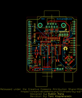
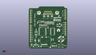
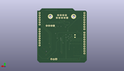
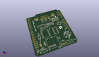

Contents
========

* [PROJ-SPAR-13262-STAN-01>CAN-Bus Shield](#proj-spar-13262-stan-01can-bus-shield)
	* [Images](#images)
	* [Interactive BOM](#interactive-bom)
	* [Tags](#tags)
  
![][im]
# PROJ-SPAR-13262-STAN-01>CAN-Bus Shield

- ID: PROJ-SPAR-13262-STAN-01
- Hex ID: PRS13262
- Name: CAN-Bus Shield
- Description: 

## Images
  
  

|eagleImage|kicadPcb3dFront|kicadPcb3dBack|kicadPcb3d|
| :---: | :---: | :---: | :---: |
|||||

## Interactive BOM

- Interactive BOM page: [ibom.html](kicad/bom/ibom.html)

## Tags

- hexID: PRS13262
- oompType: PROJ
- oompSize: SPAR
- oompColor: 13262
- oompDesc: STAN
- oompIndex: 01
- oompName: CAN-Bus Shield
- sources: All source files from https://github.com/sparkfun/CAN-Bus_Shield (source licence details in srcLicense.md)
- linkBuyPage: https://www.sparkfun.com/products/13262
- oompID: PROJ-SPAR-13262-STAN-01
- oompParts: C1,UNMATCHED-UNMATCHED-UNMATCHED-UNMATCHED-UNMATCHED
- oompParts: C2,UNMATCHED-UNMATCHED-UNMATCHED-UNMATCHED-UNMATCHED
- oompParts: C3,UNMATCHED-UNMATCHED-UNMATCHED-UNMATCHED-UNMATCHED
- oompParts: C4,UNMATCHED-UNMATCHED-UNMATCHED-UNMATCHED-UNMATCHED
- oompParts: C5,UNMATCHED-UNMATCHED-UNMATCHED-UNMATCHED-UNMATCHED
- oompParts: C6,UNMATCHED-UNMATCHED-UNMATCHED-UNMATCHED-UNMATCHED
- oompParts: C7,UNMATCHED-UNMATCHED-UNMATCHED-UNMATCHED-UNMATCHED
- oompParts: C8,UNMATCHED-UNMATCHED-UNMATCHED-UNMATCHED-UNMATCHED
- oompParts: C9,UNMATCHED-UNMATCHED-UNMATCHED-UNMATCHED-UNMATCHED
- oompParts: D1,UNMATCHED-UNMATCHED-UNMATCHED-UNMATCHED-UNMATCHED
- oompParts: D2,UNMATCHED-UNMATCHED-UNMATCHED-UNMATCHED-UNMATCHED
- oompParts: D3,UNMATCHED-UNMATCHED-UNMATCHED-UNMATCHED-UNMATCHED
- oompParts: D4,UNMATCHED-UNMATCHED-UNMATCHED-UNMATCHED-UNMATCHED
- oompParts: D5,UNMATCHED-UNMATCHED-UNMATCHED-UNMATCHED-UNMATCHED
- oompParts: F1,UNMATCHED-UNMATCHED-UNMATCHED-UNMATCHED-UNMATCHED
- oompParts: FRAME1,UNMATCHED-UNMATCHED-UNMATCHED-UNMATCHED-UNMATCHED
- oompParts: FRAME2,UNMATCHED-UNMATCHED-UNMATCHED-UNMATCHED-UNMATCHED
- oompParts: JP1,UNMATCHED-UNMATCHED-UNMATCHED-UNMATCHED-UNMATCHED
- oompParts: JP4,UNMATCHED-UNMATCHED-UNMATCHED-UNMATCHED-UNMATCHED
- oompParts: JP5,UNMATCHED-UNMATCHED-UNMATCHED-UNMATCHED-UNMATCHED
- oompParts: LOGO1,UNMATCHED-UNMATCHED-UNMATCHED-UNMATCHED-UNMATCHED
- oompParts: Q1,UNMATCHED-UNMATCHED-UNMATCHED-UNMATCHED-UNMATCHED
- oompParts: R1,UNMATCHED-UNMATCHED-UNMATCHED-UNMATCHED-UNMATCHED
- oompParts: R2,UNMATCHED-UNMATCHED-UNMATCHED-UNMATCHED-UNMATCHED
- oompParts: R3,UNMATCHED-UNMATCHED-UNMATCHED-UNMATCHED-UNMATCHED
- oompParts: R10,UNMATCHED-UNMATCHED-UNMATCHED-UNMATCHED-UNMATCHED
- oompParts: R12,UNMATCHED-UNMATCHED-UNMATCHED-UNMATCHED-UNMATCHED
- oompParts: R13,UNMATCHED-UNMATCHED-UNMATCHED-UNMATCHED-UNMATCHED
- oompParts: S2,UNMATCHED-UNMATCHED-UNMATCHED-UNMATCHED-UNMATCHED
- oompParts: SJ1,UNMATCHED-UNMATCHED-UNMATCHED-UNMATCHED-UNMATCHED
- oompParts: SJ2,UNMATCHED-UNMATCHED-UNMATCHED-UNMATCHED-UNMATCHED
- oompParts: SJ3,UNMATCHED-UNMATCHED-UNMATCHED-UNMATCHED-UNMATCHED
- oompParts: SJ4,UNMATCHED-UNMATCHED-UNMATCHED-UNMATCHED-UNMATCHED
- oompParts: SJ5,UNMATCHED-UNMATCHED-UNMATCHED-UNMATCHED-UNMATCHED
- oompParts: SJ6,UNMATCHED-UNMATCHED-UNMATCHED-UNMATCHED-UNMATCHED
- oompParts: TP1,UNMATCHED-UNMATCHED-UNMATCHED-UNMATCHED-UNMATCHED
- oompParts: TP2,UNMATCHED-UNMATCHED-UNMATCHED-UNMATCHED-UNMATCHED
- oompParts: U$1,UNMATCHED-UNMATCHED-UNMATCHED-UNMATCHED-UNMATCHED
- oompParts: U1,UNMATCHED-UNMATCHED-UNMATCHED-UNMATCHED-UNMATCHED
- oompParts: U2,UNMATCHED-UNMATCHED-UNMATCHED-UNMATCHED-UNMATCHED
- oompParts: U3,UNMATCHED-UNMATCHED-UNMATCHED-UNMATCHED-UNMATCHED
- oompParts: U4,UNMATCHED-UNMATCHED-UNMATCHED-UNMATCHED-UNMATCHED
- oompParts: U5,UNMATCHED-UNMATCHED-UNMATCHED-UNMATCHED-UNMATCHED
- oompParts: U6,UNMATCHED-UNMATCHED-UNMATCHED-UNMATCHED-UNMATCHED
- oompParts: U7,UNMATCHED-UNMATCHED-UNMATCHED-UNMATCHED-UNMATCHED
- oompParts: X1,UNMATCHED-UNMATCHED-UNMATCHED-UNMATCHED-UNMATCHED
- rawParts: C1,0.1uF,0.1UF-25V(+80/-20%)(0603),0603-CAP,CAP-00810,,CAP-00810,0.1uF,,
- rawParts: C2,560pF,560PF-50V-5%(0603),0603-CAP,CAP-08749,,CAP-08749,560pF,,
- rawParts: C3,560pF,560PF-50V-5%(0603),0603-CAP,CAP-08749,,CAP-08749,560pF,,
- rawParts: C4,4.7uF,4.7UF-6.3V-10%(0603)0603,0603-CAP,CAP-08280,,CAP-08280,4.7uF,,
- rawParts: C5,22pF,22PF-50V-5%(0603),0603-CAP,CAP-07876,,CAP-07876,22pF,,
- rawParts: C6,0.1uF,0.1UF-25V(+80/-20%)(0603),0603-CAP,CAP-00810,,CAP-00810,0.1uF,,
- rawParts: C7,22pF,22PF-50V-5%(0603),0603-CAP,CAP-07876,,CAP-07876,22pF,,
- rawParts: C8,0.1uF,0.1UF-25V(+80/-20%)(0603),0603-CAP,CAP-00810,,CAP-00810,0.1uF,,
- rawParts: C9,1.0uF,1.0UF-16V-10%(0603),0603-CAP,CAP-00868,,CAP-00868,1.0uF,,
- rawParts: D1,MBRA140,MBRA140,SMA-DIODE,40V, 1A Schottky rectifier,,DIO-08053,,,
- rawParts: D2,GREEN,LED-GREEN0603,LED-0603,Various green LEDs,,DIO-00821,GREEN,,
- rawParts: D3,GREEN,LED-GREEN0603,LED-0603,Various green LEDs,,DIO-00821,GREEN,,
- rawParts: D4,RED,LED-RED0603,LED-0603,Assorted Red LEDs,,DIO-00819,RED,,
- rawParts: D5,PESD1CAN,PESD1CAN,SOT23-3,PESD1CAN is used to protect two automotive CAN bus lines from ESD.,,DIO-12501,,,
- rawParts: F1,,PTCTHERMISTOR1206,PTC-1206,Resettable Fuse PTC,,RES-08585,,,
- rawParts: FRAME1,FRAME-LETTER,FRAME-LETTER,CREATIVE_COMMONS,Schematic Frame,,,,,
- rawParts: FRAME2,FRAME-LETTERNO_PACKAGE,FRAME-LETTERNO_PACKAGE,DUMMY,Schematic Frame,Sukkin Pang and Ryan Owens,,,v13,
- rawParts: JP1,DNP,M03POLAR_LOCK,MOLEX-1X3_LOCK,Header 3,,,,,
- rawParts: JP2,FIDUCIAL1X2,FIDUCIAL1X2,FIDUCIAL-1X2,Fiducial Alignment Points,,,,,
- rawParts: JP3,FIDUCIAL1X2,FIDUCIAL1X2,FIDUCIAL-1X2,Fiducial Alignment Points,,,,,
- rawParts: JP4,SFE_LOGO_NAME_FLAME.1_INCH,SFE_LOGO_NAME_FLAME.1_INCH,SFE_LOGO_NAME_FLAME_.1,SFE Logo, name and flame,,,,,
- rawParts: JP5,DNP,M04PTH,1X04,Header 4,,,,,
- rawParts: LOGO1,OSHW-LOGOM,OSHW-LOGOM,OSHW-LOGO-M,Open Source Hardware Logo,,,,,
- rawParts: Q1,16MHz,CRYSTAL5X3,CRYSTAL-SMD-5X3,Various standard crystals. Proven footprints.,,XTAL-08218,,,
- rawParts: R1,1K,1KOHM-1/10W-1%(0603),0603-RES,RES-07856,,RES-07856,1K,,
- rawParts: R2,1K,1KOHM-1/10W-1%(0603),0603-RES,RES-07856,,RES-07856,1K,,
- rawParts: R3,1K,1KOHM-1/10W-1%(0603),0603-RES,RES-07856,,RES-07856,1K,,
- rawParts: R10,100,100OHM-1/10W-1%(0603),0603-RES,RES-07863,,RES-07863,100,,
- rawParts: R12,100,100OHM-1/10W-1%(0603),0603-RES,RES-07863,,RES-07863,100,,
- rawParts: R13,4.7K,4.7KOHM-1/10W-1%(0603),0603-RES,RES-07857,,RES-07857,4.7K,,
- rawParts: S2,RESET,SWITCH-MOMENTARY-2SMD,TACTILE-SWITCH-SMD,Various NO switches- pushbuttons, reed, etc,,SWCH-08247,,,
- rawParts: SJ1,JUMPER-PAD-3-2OF3_NC_BY_TRACE_SMALL,JUMPER-PAD-3-2OF3_NC_BY_TRACE_SMALL,PAD-JUMPER-3-2OF3_NC_BY_TRACE_YES_SILK_FULL_BOX,,,,,,
- rawParts: SJ2,JUMPER-PAD-3-2OF3_NC_BY_TRACE_SMALL,JUMPER-PAD-3-2OF3_NC_BY_TRACE_SMALL,PAD-JUMPER-3-2OF3_NC_BY_TRACE_YES_SILK_FULL_BOX,,,,,,
- rawParts: SJ3,JUMPER-PAD-2-NC_BY_TRACE,JUMPER-PAD-2-NC_BY_TRACE,PAD-JUMPER-2-NC_BY_TRACE_YES_SILK,,,,,,
- rawParts: SJ4,JUMPER-PAD-3-2OF3_NC_BY_TRACE_SMALL,JUMPER-PAD-3-2OF3_NC_BY_TRACE_SMALL,PAD-JUMPER-3-2OF3_NC_BY_TRACE_YES_SILK_FULL_BOX,,,,,,
- rawParts: SJ5,JUMPER-PAD-3-2OF3_NC_BY_TRACE_SMALL,JUMPER-PAD-3-2OF3_NC_BY_TRACE_SMALL,PAD-JUMPER-3-2OF3_NC_BY_TRACE_YES_SILK_FULL_BOX,,,,,,
- rawParts: SJ6,JUMPER-PAD-3-2OF3_NC_BY_TRACE_SMALL,JUMPER-PAD-3-2OF3_NC_BY_TRACE_SMALL,PAD-JUMPER-3-2OF3_NC_BY_TRACE_YES_SILK_FULL_BOX,,,,,,
- rawParts: TP1,TEST-POINT3X5,TEST-POINT3X5,PAD.03X.05,Bare copper test points for troubleshooting or ICT,,,,,
- rawParts: TP2,TEST-POINT3X5,TEST-POINT3X5,PAD.03X.05,Bare copper test points for troubleshooting or ICT,,,,,
- rawParts: U$1,REVISION,REVISION,REVISION,,,,,,
- rawParts: U1,USD-SOCKET,USD-SOCKET,MICROSD_1:1,microSD Socket,,CONN-07820,,,
- rawParts: U2,ARDUINO_R3_SHIELD,ARDUINO_R3_SHIELD,UNO_R3_SHIELD,Shield form compatible with the Arduino Uno R3.,,,,,
- rawParts: U3,JST_VERTICAL,JST_VERTICAL,JST-6-SMD-VERT-1.0MM,,,CONN-08249,,,
- rawParts: U4,MCP2515,MCP2510SO,SO-18W,CAN controller with SPI interface to any MCU.,,IC-09906,,,
- rawParts: U5,MCP2551,MCP2551,SO08,CAN transceiver,,IC-09907,,,
- rawParts: U6,HEX_CONVERTER,HEX_CONVERTER,SO016,74HC4050 Hex Buffer Level Shifter SMD SO016,,IC-09604,,,
- rawParts: U7,,JOYSTICK_MINI,JOYSTICK_MINI,Small 5-way tactile joystick, COM-10063,,SWCH-09905,,,
- rawParts: X1,DB9 Plug,DB9MALE,DB9_MALE,DB9 Connector,,CONN-09904,,,

[im]: kicadPcb3d_450.png
