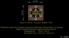
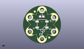
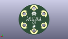
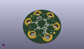

Contents
========

* [PROJ-SPAR-13264-STAN-01>LilyPixel](#proj-spar-13264-stan-01lilypixel)
	* [Images](#images)
	* [Interactive BOM](#interactive-bom)
	* [OOMP Parts](#oomp-parts)
	* [Tags](#tags)
  
![][im]
# PROJ-SPAR-13264-STAN-01>LilyPixel

- ID: PROJ-SPAR-13264-STAN-01
- Hex ID: PRS13264
- Name: LilyPixel
- Description: 

## Images
  
  

|eagleImage|kicadPcb3dFront|kicadPcb3dBack|kicadPcb3d|
| :---: | :---: | :---: | :---: |
|||||

## Interactive BOM

- Interactive BOM page: [ibom.html](kicad/bom/ibom.html)

## OOMP Parts
  

|OOMP Parts|
| :---: |
|<table><tr><td></td><td> C2</td><td>[CAPC-0603-X-NF100-V50 SMD (0603) 100 nF Capacitor (Ceramic) 50v](https://github.com/oomlout/oomlout_OOMP_parts/tree/main/CAPC-0603-X-NF100-V50/)</td><td>[C6N100](https://github.com/oomlout/oomlout_OOMP_parts/tree/main/CAPC-0603-X-NF100-V50/)</td></tr></table>|
|UNMATCHED-UNMATCHED-X-UNMATCHED-01, D1, 0.0, 0.0, 0,D1, WS2812B, WS2812B, SparkFun-LED, (0, 0), R0|
|UNMATCHED-UNMATCHED-X-UNMATCHED-01, JP1, -6.35, 3.8099999999999996, 235,JP1, SEWTAP6, PETAL-SMALL-2SIDE, LilyPad-Wearables, (-0.25, 0.15), R235|
|UNMATCHED-UNMATCHED-X-UNMATCHED-01, JP2, 6.35, -3.8099999999999996, 56,JP2, SEWTAP6, PETAL-SMALL-2SIDE, LilyPad-Wearables, (0.25, -0.15), R56|
|UNMATCHED-UNMATCHED-X-UNMATCHED-01, JP3, 0.0, -7.619999999999999, 0,JP3, SEWTAP6, PETAL-SMALL-2SIDE, LilyPad-Wearables, (0, -0.3), R0|
|UNMATCHED-UNMATCHED-X-UNMATCHED-01, JP4, 0.0, 7.619999999999999, 180,JP4, SEWTAP6, PETAL-SMALL-2SIDE, LilyPad-Wearables, (0, 0.3), R180|
|UNMATCHED-UNMATCHED-X-UNMATCHED-01, JP5, 6.35, 3.8099999999999996, S123,JP5, SEWTAP6, PETAL-SMALL-2SIDE, LilyPad-Wearables, (0.25, 0.15), SR123|
|UNMATCHED-UNMATCHED-X-UNMATCHED-01, JP6, -6.35, -3.8099999999999996, 303,JP6, SEWTAP6, PETAL-SMALL-2SIDE, LilyPad-Wearables, (-0.25, -0.15), R303|

## Tags

- hexID: PRS13264
- oompType: PROJ
- oompSize: SPAR
- oompColor: 13264
- oompDesc: STAN
- oompIndex: 01
- oompName: LilyPixel
- sources: All source files from https://github.com/sparkfun/LilyPixel (source licence details in srcLicense.md)
- linkBuyPage: https://www.sparkfun.com/products/13264
- oompID: PROJ-SPAR-13264-STAN-01
- oompPart: CAPC-0603-X-NF100-V50, C2, -0.127, 4.191, 0
- oompPart: UNMATCHED-UNMATCHED-X-UNMATCHED-01, D1, 0.0, 0.0, 0
- oompPart: SKIP-UNMATCHED-X-UNMATCHED-01, FID1, -3.8099999999999996, 6.858, 0
- oompPart: SKIP-UNMATCHED-X-UNMATCHED-01, FID2, 3.8099999999999996, -6.858, 0
- oompPart: UNMATCHED-UNMATCHED-X-UNMATCHED-01, JP1, -6.35, 3.8099999999999996, 235
- oompPart: UNMATCHED-UNMATCHED-X-UNMATCHED-01, JP2, 6.35, -3.8099999999999996, 56
- oompPart: UNMATCHED-UNMATCHED-X-UNMATCHED-01, JP3, 0.0, -7.619999999999999, 0
- oompPart: UNMATCHED-UNMATCHED-X-UNMATCHED-01, JP4, 0.0, 7.619999999999999, 180
- oompPart: UNMATCHED-UNMATCHED-X-UNMATCHED-01, JP5, 6.35, 3.8099999999999996, S123
- oompPart: UNMATCHED-UNMATCHED-X-UNMATCHED-01, JP6, -6.35, -3.8099999999999996, 303
- rawPart: C2, 0.1uF, 0603-CAP, SparkFun-Capacitors, (-0.005, 0.165), R0
- rawPart: D1, WS2812B, WS2812B, SparkFun-LED, (0, 0), R0
- rawPart: FID1, FIDUCIAL1X2, FIDUCIAL-1X2, SparkFun-Aesthetics, (-0.15, 0.27), R0
- rawPart: FID2, FIDUCIAL1X2, FIDUCIAL-1X2, SparkFun-Aesthetics, (0.15, -0.27), R0
- rawPart: JP1, SEWTAP6, PETAL-SMALL-2SIDE, LilyPad-Wearables, (-0.25, 0.15), R235
- rawPart: JP2, SEWTAP6, PETAL-SMALL-2SIDE, LilyPad-Wearables, (0.25, -0.15), R56
- rawPart: JP3, SEWTAP6, PETAL-SMALL-2SIDE, LilyPad-Wearables, (0, -0.3), R0
- rawPart: JP4, SEWTAP6, PETAL-SMALL-2SIDE, LilyPad-Wearables, (0, 0.3), R180
- rawPart: JP5, SEWTAP6, PETAL-SMALL-2SIDE, LilyPad-Wearables, (0.25, 0.15), SR123
- rawPart: JP6, SEWTAP6, PETAL-SMALL-2SIDE, LilyPad-Wearables, (-0.25, -0.15), R303

[im]: kicadPcb3d_450.png
