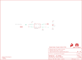

Contents
========

* [PRS13264 > LilyPixel](#prs13264--lilypixel)
	* [Schematic](#schematic)
	* [PCB](#pcb)
	* [Interactive BOM](#interactive-bom)
	* [OOMP Parts](#oomp-parts)
	* [Images](#images)
	* [Tags](#tags)
  
![][im]
# PRS13264 > LilyPixel

- ID: PROJ-SPAR-13264-STAN-01
- Hex ID: PRS13264
- Name: Sparkfun
- Description: Sparkfun
- Long Link: [http://oom.lt/PROJ-SPAR-13264-STAN-01](http://oom.lt/PROJ-SPAR-13264-STAN-01)
- Short Link: [http://oom.lt/PRS13264](http://oom.lt/PRS13264)

## Schematic
  

## PCB
  

## Interactive BOM

- Interactive BOM page: [ibom.html](https://htmlpreview.github.io/?https://github.com/oomlout/oomlout_OOMP_projects/blob/main/PROJ-SPAR-13264-STAN-01/kicad/bom/ibom.html)

## OOMP Parts
  

|OOMP ID|Name|Identifier|
| :---: | :---: | :---: |
|[CAPC-0603-X-NF100-V50](https://github.com/oomlout/oomlout_OOMP_parts/tree/main/CAPC-0603-X-NF100-V50/)|[SMD (0603) 100 nF Capacitor (Ceramic) 50v](https://github.com/oomlout/oomlout_OOMP_parts/tree/main/CAPC-0603-X-NF100-V50/)|[C2](https://github.com/oomlout/oomlout_OOMP_parts/tree/main/CAPC-0603-X-NF100-V50/)|
|DIOD-UNMATCHED-X-K2812-01||D1|

## Images
  
  

|bominteractivefront|bominteractiveback|kicadPcb3d|kicadPcb3dFront|kicadPcb3dBack|kicadSchem|eagleImage|eagleSchemImage|pcbdraw|pcbdrawback|
| :---: | :---: | :---: | :---: | :---: | :---: | :---: | :---: | :---: | :---: |
|||||||||||

## Tags

- hexID: PRS13264
- oompType: PROJ
- oompSize: SPAR
- oompColor: 13264
- oompDesc: STAN
- oompIndex: 01
- oompName: LilyPixel
- sources: All source files from https://github.com/sparkfun/LilyPixel (source licence details in srcLicense.md)
- linkBuyPage: https://www.sparkfun.com/products/13264
- oompID: PROJ-SPAR-13264-STAN-01
- oompParts: C2,CAPC-0603-X-NF100-V50
- oompParts: D1,DIOD-UNMATCHED-X-K2812-01
- rawParts: C2,0.1uF,0.1UF-25V(+80/-20%)(0603),0603-CAP,CAP-00810,CAP-00810,0.1uF,
- rawParts: D1,WS2812B,WS2812B,WS2812B,WS2812B - Intelligent control LED integrated light source,,,
- rawParts: FID1,FIDUCIAL1X2,FIDUCIAL1X2,FIDUCIAL-1X2,Fiducial Alignment Points,,,
- rawParts: FID2,FIDUCIAL1X2,FIDUCIAL1X2,FIDUCIAL-1X2,Fiducial Alignment Points,,,
- rawParts: FRAME1,FRAME-LETTER,FRAME-LETTER,CREATIVE_COMMONS,Schematic Frame,,,
- rawParts: JP1,SEWTAP6,SEWTAP6,PETAL-SMALL-2SIDE,,,,
- rawParts: JP2,SEWTAP6,SEWTAP6,PETAL-SMALL-2SIDE,,,,
- rawParts: JP3,SEWTAP6,SEWTAP6,PETAL-SMALL-2SIDE,,,,
- rawParts: JP4,SEWTAP6,SEWTAP6,PETAL-SMALL-2SIDE,,,,
- rawParts: JP5,SEWTAP6,SEWTAP6,PETAL-SMALL-2SIDE,,,,
- rawParts: JP6,SEWTAP6,SEWTAP6,PETAL-SMALL-2SIDE,,,,
- rawParts: LOGO1,OSHW-LOGOS,OSHW-LOGOS,OSHW-LOGO-S,Open Source Hardware Logo This logo indicates the piece of hardware it is found on incorporates a OSHW license and/or adheres to the definition of open source hardware found here: http://freedomdefined.org/OSHW,,,
- rawParts: LOGO2,SFE_LOGO_FLAME.1_INCH,SFE_LOGO_FLAME.1_INCH,SFE_LOGO_FLAME_.1,SFE Logo, flame only,,,
- rawParts: U$1,LOGO-LPLP,LOGO-LPLP,LOGO-LILYPAD,,,,
- rawParts: U$8,LOGO-LPL,LOGO-LPL,LOGO-L,,,,

[im]: kicadPcb3d_450.png
