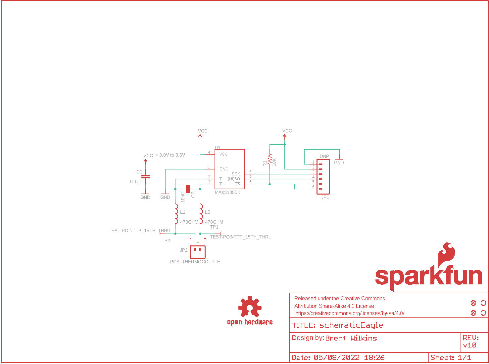
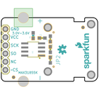
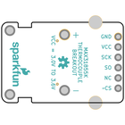
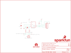

Contents
========

* [PRS13266 > MAX31855K Thermocouple Breakout](#prs13266--max31855k-thermocouple-breakout)
	* [Schematic](#schematic)
	* [PCB](#pcb)
	* [Interactive BOM](#interactive-bom)
	* [OOMP Parts](#oomp-parts)
	* [Images](#images)
	* [Tags](#tags)
  
![][im]
# PRS13266 > MAX31855K Thermocouple Breakout

- ID: PROJ-SPAR-13266-STAN-01
- Hex ID: PRS13266
- Name: Sparkfun
- Description: Sparkfun
- Long Link: [http://oom.lt/PROJ-SPAR-13266-STAN-01](http://oom.lt/PROJ-SPAR-13266-STAN-01)
- Short Link: [http://oom.lt/PRS13266](http://oom.lt/PRS13266)

## Schematic
  

## PCB
  

## Interactive BOM

- Interactive BOM page: [ibom.html](https://htmlpreview.github.io/?https://github.com/oomlout/oomlout_OOMP_projects/blob/main/PROJ-SPAR-13266-STAN-01/kicad/bom/ibom.html)

## OOMP Parts
  

|OOMP Parts|
| :---: |
|[CAPC-0603-X-NF100-V50  SMD (0603) 100 nF Capacitor (Ceramic) 50v  C1](https://github.com/oomlout/oomlout_OOMP_parts/tree/main/CAPC-0603-X-NF100-V50/)|
|[CAPC-0603-X-NF10-V50  SMD (0603) 10 nF Capacitor (Ceramic) 50v  C2](https://github.com/oomlout/oomlout_OOMP_parts/tree/main/CAPC-0603-X-NF10-V50/)|
|UNMATCHED-UNMATCHED-X-UNMATCHED-01 FRAME1, JP2, U1|
|UNMATCHED-0603-X-UNMATCHED-01 L1, L2|
|[RESE-0603-X-O103-01  SMD (0603) 10k Ohm Resistor  R1](https://github.com/oomlout/oomlout_OOMP_parts/tree/main/RESE-0603-X-O103-01/)|

## Images
  
  

|bominteractivefront|bominteractiveback|kicadPcb3d|kicadPcb3dFront|kicadPcb3dBack|eagleImage|eagleSchemImage|
| :---: | :---: | :---: | :---: | :---: | :---: | :---: |
||||||||

## Tags

- hexID: PRS13266
- oompType: PROJ
- oompSize: SPAR
- oompColor: 13266
- oompDesc: STAN
- oompIndex: 01
- oompName: MAX31855K Thermocouple Breakout
- sources: All source files from https://github.com/sparkfun/MAX31855K_Thermocouple_Breakout (source licence details in srcLicense.md)
- linkBuyPage: https://www.sparkfun.com/products/13266
- oompID: PROJ-SPAR-13266-STAN-01
- oompParts: C1,CAPC-0603-X-NF100-V50
- oompParts: C2,CAPC-0603-X-NF10-V50
- oompParts: FRAME1,UNMATCHED-UNMATCHED-X-UNMATCHED-01
- oompParts: JP2,UNMATCHED-UNMATCHED-X-UNMATCHED-01
- oompParts: L1,UNMATCHED-0603-X-UNMATCHED-01
- oompParts: L2,UNMATCHED-0603-X-UNMATCHED-01
- oompParts: R1,RESE-0603-X-O103-01
- oompParts: U1,UNMATCHED-UNMATCHED-X-UNMATCHED-01
- rawParts: C1,0.1uF,0.1UF-25V(+80/-20%)(0603),0603-CAP,CAP-00810,,CAP-00810,0.1uF,,
- rawParts: C2,10nF,10NF/10000PF-50V-10%(0603),0603-CAP,CAP-00867,,CAP-00867,10nF,,
- rawParts: FID1,FIDUCIAL1X2,FIDUCIAL1X2,FIDUCIAL-1X2,Fiducial Alignment Points,,,,,
- rawParts: FID2,FIDUCIAL1X2,FIDUCIAL1X2,FIDUCIAL-1X2,Fiducial Alignment Points,,,,,
- rawParts: FRAME1,>VERSION,FRAME-LETTER,CREATIVE_COMMONS,Schematic Frame,Brent Wilkins,,,v01,
- rawParts: JP1,DNP,M06SILK_FEMALE_PTH,1X06,Header 6,,CONN-08437,,,
- rawParts: JP2,PCB_THERMOCOUPLE,PCB_THERMOCOUPLE,PCC-SMP,Circuit Board Thermocouple Connectors,,,,,
- rawParts: L1,470OHM,INDUCTOR0603,0603,Inductors,,NDUC-12579,,,
- rawParts: L2,470OHM,INDUCTOR0603,0603,Inductors,,NDUC-12579,,,
- rawParts: LOGO1,OSHW-LOGOS,OSHW-LOGOS,OSHW-LOGO-S,Open Source Hardware Logo,,,,,
- rawParts: LOGO2,SFE_LOGO_NAME_FLAME.1_INCH,SFE_LOGO_NAME_FLAME.1_INCH,SFE_LOGO_NAME_FLAME_.1,SFE Logo, name and flame,,,,,
- rawParts: LOGO3,SFE_LOGO_NAME_FLAME.1_INCH,SFE_LOGO_NAME_FLAME.1_INCH,SFE_LOGO_NAME_FLAME_.1,SFE Logo, name and flame,,,,,
- rawParts: LOGO4,OSHW-LOGOS,OSHW-LOGOS,OSHW-LOGO-S,Open Source Hardware Logo,,,,,
- rawParts: R1,10K,10KOHM-1/10W-1%(0603)0603,0603-RES,RES-00824,,RES-00824,10K,,
- rawParts: STANDOFF1,STAND-OFF,STAND-OFF,STAND-OFF,#4 Stand Off,,,,,
- rawParts: STANDOFF4,STAND-OFF,STAND-OFF,STAND-OFF,#4 Stand Off,,,,,
- rawParts: TP1,TEST-POINTTP_15TH_THRU,TEST-POINTTP_15TH_THRU,TP_15TH,Bare copper test points for troubleshooting or ICT,,,,,
- rawParts: TP2,TEST-POINTTP_15TH_THRU,TEST-POINTTP_15TH_THRU,TP_15TH,Bare copper test points for troubleshooting or ICT,,,,,
- rawParts: U1,MAX31855K,MAX31855K,SOIC8,Cold-Junction-Compensated K-Thermocoupleto-Digital,,IC-12578,,,

[im]: kicadPcb3d_450.png
