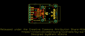
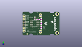
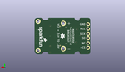
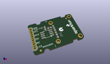

Contents
========

* [PROJ-SPAR-13266-STAN-01>MAX31855K Thermocouple Breakout](#proj-spar-13266-stan-01max31855k-thermocouple-breakout)
	* [Images](#images)
	* [Interactive BOM](#interactive-bom)
	* [OOMP Parts](#oomp-parts)
	* [Tags](#tags)
  
![][im]
# PROJ-SPAR-13266-STAN-01>MAX31855K Thermocouple Breakout

- ID: PROJ-SPAR-13266-STAN-01
- Hex ID: PRS13266
- Name: MAX31855K Thermocouple Breakout
- Description: 

## Images
  
  

|eagleImage|kicadPcb3dFront|kicadPcb3dBack|kicadPcb3d|
| :---: | :---: | :---: | :---: |
|||||

## Interactive BOM

- Interactive BOM page: [ibom.html](kicad/bom/ibom.html)

## OOMP Parts
  

|OOMP Parts|
| :---: |
|<table><tr><td></td><td> C1</td><td>[CAPC-0603-X-NF100-V50 SMD (0603) 100 nF Capacitor (Ceramic) 50v](https://github.com/oomlout/oomlout_OOMP_parts/tree/main/CAPC-0603-X-NF100-V50/)</td><td>[C6N100](https://github.com/oomlout/oomlout_OOMP_parts/tree/main/CAPC-0603-X-NF100-V50/)</td></tr></table>|
|CAPC-0603-X-UNMATCHED-01, C2, 15.239999999999998, 9.906, 270,C2, 10nF, 0603-CAP, SparkFun-Capacitors, (0.6, 0.39), R270|
|<table><tr><td></td><td> JP1</td><td>[HEAD-I01-X-PI06-01 2.54 mm 6 Pin Header](https://github.com/oomlout/oomlout_OOMP_parts/tree/main/HEAD-I01-X-PI06-01/)</td><td>[H06](https://github.com/oomlout/oomlout_OOMP_parts/tree/main/HEAD-I01-X-PI06-01/)</td></tr></table>|
|UNMATCHED-UNMATCHED-X-UNMATCHED-01, JP2, 14.477999999999998, 9.906, 90,JP2, PCB_THERMOCOUPLE, PCC-SMP, Testing, (0.57, 0.39), R90|
|UNMATCHED-0603-X-UNMATCHED-01, L1, 15.239999999999998, 6.604, 270,L1, 470OHM, 0603, SparkFun-Passives, (0.6, 0.26), R270|
|UNMATCHED-0603-X-UNMATCHED-01, L2, 15.239999999999998, 13.208, 90,L2, 470OHM, 0603, SparkFun-Passives, (0.6, 0.52), R90|
|<table><tr><td></td><td> R1</td><td>[RESE-0603-X-O103-01 SMD (0603) 10k Ohm Resistor](https://github.com/oomlout/oomlout_OOMP_parts/tree/main/RESE-0603-X-O103-01/)</td><td>[R6103](https://github.com/oomlout/oomlout_OOMP_parts/tree/main/RESE-0603-X-O103-01/)</td></tr></table>|
|UNMATCHED-UNMATCHED-X-UNMATCHED-01, U1, 9.906, 9.906, 90,U1, MAX31855K, SOIC8, SparkFun-AnalogIC, (0.39, 0.39), R90|

## Tags

- hexID: PRS13266
- oompType: PROJ
- oompSize: SPAR
- oompColor: 13266
- oompDesc: STAN
- oompIndex: 01
- oompName: MAX31855K Thermocouple Breakout
- sources: All source files from https://github.com/sparkfun/MAX31855K_Thermocouple_Breakout (source licence details in srcLicense.md)
- linkBuyPage: https://www.sparkfun.com/products/13266
- oompID: PROJ-SPAR-13266-STAN-01
- oompPart: CAPC-0603-X-NF100-V50, C1, 12.7, 13.462, 0
- oompPart: CAPC-0603-X-UNMATCHED-01, C2, 15.239999999999998, 9.906, 270
- oompPart: SKIP-UNMATCHED-X-UNMATCHED-01, FID1, 25.4, 16.764, 0
- oompPart: SKIP-UNMATCHED-X-UNMATCHED-01, FID2, 3.8099999999999996, 1.27, 0
- oompPart: HEAD-I01-X-PI06-01, JP1, 1.27, 16.256, 270
- oompPart: UNMATCHED-UNMATCHED-X-UNMATCHED-01, JP2, 14.477999999999998, 9.906, 90
- oompPart: UNMATCHED-0603-X-UNMATCHED-01, L1, 15.239999999999998, 6.604, 270
- oompPart: UNMATCHED-0603-X-UNMATCHED-01, L2, 15.239999999999998, 13.208, 90
- oompPart: RESE-0603-X-O103-01, R1, 9.906, 14.224, 90
- oompPart: SKIP-UNMATCHED-X-UNMATCHED-01, TP1, 16.256, 15.239999999999998, 0
- oompPart: SKIP-UNMATCHED-X-UNMATCHED-01, TP2, 16.256, 4.571999999999999, 0
- oompPart: UNMATCHED-UNMATCHED-X-UNMATCHED-01, U1, 9.906, 9.906, 90
- rawPart: C1, 0.1uF, 0603-CAP, SparkFun-Capacitors, (0.5, 0.53), R0
- rawPart: C2, 10nF, 0603-CAP, SparkFun-Capacitors, (0.6, 0.39), R270
- rawPart: FID1, FIDUCIAL1X2, FIDUCIAL-1X2, SparkFun-Aesthetics, (1, 0.66), R0
- rawPart: FID2, FIDUCIAL1X2, FIDUCIAL-1X2, SparkFun-Aesthetics, (0.15, 0.05), R0
- rawPart: JP1, DNP, 1X06, SparkFun-Connectors, (0.05, 0.64), R270
- rawPart: JP2, PCB_THERMOCOUPLE, PCC-SMP, Testing, (0.57, 0.39), R90
- rawPart: L1, 470OHM, 0603, SparkFun-Passives, (0.6, 0.26), R270
- rawPart: L2, 470OHM, 0603, SparkFun-Passives, (0.6, 0.52), R90
- rawPart: R1, 10K, 0603-RES, SparkFun-Resistors, (0.39, 0.56), R90
- rawPart: TP1, TEST-POINTTP_15TH_THRU, TP_15TH, SparkFun-Passives, (0.64, 0.6), R0
- rawPart: TP2, TEST-POINTTP_15TH_THRU, TP_15TH, SparkFun-Passives, (0.64, 0.18), R0
- rawPart: U1, MAX31855K, SOIC8, SparkFun-AnalogIC, (0.39, 0.39), R90

[im]: kicadPcb3d_450.png
