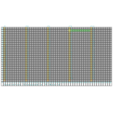
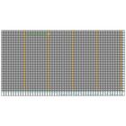

Contents
========

* [PRS13268 > Snappable P-Board](#prs13268--snappable-p-board)
	* [Schematic](#schematic)
	* [Interactive BOM](#interactive-bom)
	* [OOMP Parts](#oomp-parts)
	* [Images](#images)
	* [Tags](#tags)
  
![][im]
# PRS13268 > Snappable P-Board

- ID: PROJ-SPAR-13268-STAN-01
- Hex ID: PRS13268
- Name: Sparkfun
- Description: Sparkfun
- Long Link: [http://oom.lt/PROJ-SPAR-13268-STAN-01](http://oom.lt/PROJ-SPAR-13268-STAN-01)
- Short Link: [http://oom.lt/PRS13268](http://oom.lt/PRS13268)

## Schematic
  

## Interactive BOM

- Interactive BOM page: [ibom.html](https://htmlpreview.github.io/?https://github.com/oomlout/oomlout_OOMP_projects/blob/main/PROJ-SPAR-13268-STAN-01/kicad/bom/ibom.html)

## OOMP Parts
  

|OOMP ID|Name|Identifier|
| :---: | :---: | :---: |
|[HEAD-I01-X-PI10-01](https://github.com/oomlout/oomlout_OOMP_parts/tree/main/HEAD-I01-X-PI10-01/)|[2.54 mm 10 Pin Header](https://github.com/oomlout/oomlout_OOMP_parts/tree/main/HEAD-I01-X-PI10-01/)|[JP62, JP107, JP14, JP44, JP57, JP43, JP26, JP3, JP13, JP35, JP116, JP60, JP87, JP16, JP109, JP1, JP77, JP59, JP11, JP53, JP105, JP9, JP24, JP54, JP23, JP90, JP38, JP79, JP117, JP21, JP55, JP20, JP118, JP119, JP92, JP19, JP83, JP89, JP32, JP31, JP7, JP121, JP72, JP122, JP84, JP37, JP106, JP74, JP41, JP2, JP47, JP97, JP42, JP10, JP103, JP110, JP45, JP85, JP33, JP36, JP17, JP125, JP46, JP98, JP4, JP28, JP18, JP66, JP111, JP69, JP113, JP50, JP75, JP73, JP80, JP82, JP56, JP29, JP70, JP67, JP81, JP52, JP6, JP49, JP99, JP5, JP39, JP27, JP30, JP25, JP95, JP115, JP68, JP76, JP96, JP65, JP8, JP12, JP34, JP100, JP101, JP51, JP108, JP114, JP88, JP58, JP86, JP123, JP112, JP78, JP71, JP104, JP124, JP102, JP40, JP15, JP94, JP93, JP22, JP61, JP63, JP64, JP91, JP48, JP120](https://github.com/oomlout/oomlout_OOMP_parts/tree/main/HEAD-I01-X-PI10-01/)|

## Images
  
  

|bominteractivefront|bominteractiveback|kicadPcb3d|kicadPcb3dFront|kicadPcb3dBack|pcbdraw|pcbdrawback|
| :---: | :---: | :---: | :---: | :---: | :---: | :---: |
||||||||

## Tags

- hexID: PRS13268
- oompType: PROJ
- oompSize: SPAR
- oompColor: 13268
- oompDesc: STAN
- oompIndex: 01
- oompName: Snappable P-Board
- sources: All source files from https://github.com/sparkfun/Snappable_P-Board (source licence details in srcLicense.md)
- linkBuyPage: https://www.sparkfun.com/products/13268
- oompID: PROJ-SPAR-13268-STAN-01
- oompParts: JP62,HEAD-I01-X-PI10-01
- oompParts: JP107,HEAD-I01-X-PI10-01
- oompParts: JP14,HEAD-I01-X-PI10-01
- oompParts: JP44,HEAD-I01-X-PI10-01
- oompParts: JP57,HEAD-I01-X-PI10-01
- oompParts: JP43,HEAD-I01-X-PI10-01
- oompParts: JP26,HEAD-I01-X-PI10-01
- oompParts: JP3,HEAD-I01-X-PI10-01
- oompParts: JP13,HEAD-I01-X-PI10-01
- oompParts: JP35,HEAD-I01-X-PI10-01
- oompParts: JP116,HEAD-I01-X-PI10-01
- oompParts: JP60,HEAD-I01-X-PI10-01
- oompParts: JP87,HEAD-I01-X-PI10-01
- oompParts: JP16,HEAD-I01-X-PI10-01
- oompParts: JP109,HEAD-I01-X-PI10-01
- oompParts: JP1,HEAD-I01-X-PI10-01
- oompParts: JP77,HEAD-I01-X-PI10-01
- oompParts: JP59,HEAD-I01-X-PI10-01
- oompParts: JP11,HEAD-I01-X-PI10-01
- oompParts: JP53,HEAD-I01-X-PI10-01
- oompParts: JP105,HEAD-I01-X-PI10-01
- oompParts: JP9,HEAD-I01-X-PI10-01
- oompParts: JP24,HEAD-I01-X-PI10-01
- oompParts: JP54,HEAD-I01-X-PI10-01
- oompParts: JP23,HEAD-I01-X-PI10-01
- oompParts: JP90,HEAD-I01-X-PI10-01
- oompParts: JP38,HEAD-I01-X-PI10-01
- oompParts: JP79,HEAD-I01-X-PI10-01
- oompParts: JP117,HEAD-I01-X-PI10-01
- oompParts: JP21,HEAD-I01-X-PI10-01
- oompParts: JP55,HEAD-I01-X-PI10-01
- oompParts: JP20,HEAD-I01-X-PI10-01
- oompParts: JP118,HEAD-I01-X-PI10-01
- oompParts: JP119,HEAD-I01-X-PI10-01
- oompParts: JP92,HEAD-I01-X-PI10-01
- oompParts: JP19,HEAD-I01-X-PI10-01
- oompParts: JP83,HEAD-I01-X-PI10-01
- oompParts: JP89,HEAD-I01-X-PI10-01
- oompParts: JP32,HEAD-I01-X-PI10-01
- oompParts: JP31,HEAD-I01-X-PI10-01
- oompParts: JP7,HEAD-I01-X-PI10-01
- oompParts: JP121,HEAD-I01-X-PI10-01
- oompParts: JP72,HEAD-I01-X-PI10-01
- oompParts: JP122,HEAD-I01-X-PI10-01
- oompParts: JP84,HEAD-I01-X-PI10-01
- oompParts: JP37,HEAD-I01-X-PI10-01
- oompParts: JP106,HEAD-I01-X-PI10-01
- oompParts: JP74,HEAD-I01-X-PI10-01
- oompParts: JP41,HEAD-I01-X-PI10-01
- oompParts: JP2,HEAD-I01-X-PI10-01
- oompParts: JP47,HEAD-I01-X-PI10-01
- oompParts: JP97,HEAD-I01-X-PI10-01
- oompParts: JP42,HEAD-I01-X-PI10-01
- oompParts: JP10,HEAD-I01-X-PI10-01
- oompParts: JP103,HEAD-I01-X-PI10-01
- oompParts: JP110,HEAD-I01-X-PI10-01
- oompParts: JP45,HEAD-I01-X-PI10-01
- oompParts: JP85,HEAD-I01-X-PI10-01
- oompParts: JP33,HEAD-I01-X-PI10-01
- oompParts: JP36,HEAD-I01-X-PI10-01
- oompParts: JP17,HEAD-I01-X-PI10-01
- oompParts: JP125,HEAD-I01-X-PI10-01
- oompParts: JP46,HEAD-I01-X-PI10-01
- oompParts: JP98,HEAD-I01-X-PI10-01
- oompParts: JP4,HEAD-I01-X-PI10-01
- oompParts: JP28,HEAD-I01-X-PI10-01
- oompParts: JP18,HEAD-I01-X-PI10-01
- oompParts: JP66,HEAD-I01-X-PI10-01
- oompParts: JP111,HEAD-I01-X-PI10-01
- oompParts: JP69,HEAD-I01-X-PI10-01
- oompParts: JP113,HEAD-I01-X-PI10-01
- oompParts: JP50,HEAD-I01-X-PI10-01
- oompParts: JP75,HEAD-I01-X-PI10-01
- oompParts: JP73,HEAD-I01-X-PI10-01
- oompParts: JP80,HEAD-I01-X-PI10-01
- oompParts: JP82,HEAD-I01-X-PI10-01
- oompParts: JP56,HEAD-I01-X-PI10-01
- oompParts: JP29,HEAD-I01-X-PI10-01
- oompParts: JP70,HEAD-I01-X-PI10-01
- oompParts: JP67,HEAD-I01-X-PI10-01
- oompParts: JP81,HEAD-I01-X-PI10-01
- oompParts: JP52,HEAD-I01-X-PI10-01
- oompParts: JP6,HEAD-I01-X-PI10-01
- oompParts: JP49,HEAD-I01-X-PI10-01
- oompParts: JP99,HEAD-I01-X-PI10-01
- oompParts: JP5,HEAD-I01-X-PI10-01
- oompParts: JP39,HEAD-I01-X-PI10-01
- oompParts: JP27,HEAD-I01-X-PI10-01
- oompParts: JP30,HEAD-I01-X-PI10-01
- oompParts: JP25,HEAD-I01-X-PI10-01
- oompParts: JP95,HEAD-I01-X-PI10-01
- oompParts: JP115,HEAD-I01-X-PI10-01
- oompParts: JP68,HEAD-I01-X-PI10-01
- oompParts: JP76,HEAD-I01-X-PI10-01
- oompParts: JP96,HEAD-I01-X-PI10-01
- oompParts: JP65,HEAD-I01-X-PI10-01
- oompParts: JP8,HEAD-I01-X-PI10-01
- oompParts: JP12,HEAD-I01-X-PI10-01
- oompParts: JP34,HEAD-I01-X-PI10-01
- oompParts: JP100,HEAD-I01-X-PI10-01
- oompParts: JP101,HEAD-I01-X-PI10-01
- oompParts: JP51,HEAD-I01-X-PI10-01
- oompParts: JP108,HEAD-I01-X-PI10-01
- oompParts: JP114,HEAD-I01-X-PI10-01
- oompParts: JP88,HEAD-I01-X-PI10-01
- oompParts: JP58,HEAD-I01-X-PI10-01
- oompParts: JP86,HEAD-I01-X-PI10-01
- oompParts: JP123,HEAD-I01-X-PI10-01
- oompParts: JP112,HEAD-I01-X-PI10-01
- oompParts: JP78,HEAD-I01-X-PI10-01
- oompParts: JP71,HEAD-I01-X-PI10-01
- oompParts: JP104,HEAD-I01-X-PI10-01
- oompParts: JP124,HEAD-I01-X-PI10-01
- oompParts: JP102,HEAD-I01-X-PI10-01
- oompParts: JP40,HEAD-I01-X-PI10-01
- oompParts: JP15,HEAD-I01-X-PI10-01
- oompParts: JP94,HEAD-I01-X-PI10-01
- oompParts: JP93,HEAD-I01-X-PI10-01
- oompParts: JP22,HEAD-I01-X-PI10-01
- oompParts: JP61,HEAD-I01-X-PI10-01
- oompParts: JP63,HEAD-I01-X-PI10-01
- oompParts: JP64,HEAD-I01-X-PI10-01
- oompParts: JP91,HEAD-I01-X-PI10-01
- oompParts: JP48,HEAD-I01-X-PI10-01
- oompParts: JP120,HEAD-I01-X-PI10-01
- rawParts: JP62,,1X10_NO_SILK,1X10_NO_SILK,,,,
- rawParts: JP107,,1X10_NO_SILK,1X10_NO_SILK,,,,
- rawParts: JP14,,1X10_NO_SILK,1X10_NO_SILK,,,,
- rawParts: JP44,,1X10_NO_SILK,1X10_NO_SILK,,,,
- rawParts: JP57,,1X10_NO_SILK,1X10_NO_SILK,,,,
- rawParts: JP43,,1X10_NO_SILK,1X10_NO_SILK,,,,
- rawParts: JP26,,1X10_NO_SILK,1X10_NO_SILK,,,,
- rawParts: JP3,,1X10_NO_SILK,1X10_NO_SILK,,,,
- rawParts: JP13,,1X10_NO_SILK,1X10_NO_SILK,,,,
- rawParts: JP35,,1X10_NO_SILK,1X10_NO_SILK,,,,
- rawParts: JP116,,1X10_NO_SILK,1X10_NO_SILK,,,,
- rawParts: JP60,,1X10_NO_SILK,1X10_NO_SILK,,,,
- rawParts: JP87,,1X10_NO_SILK,1X10_NO_SILK,,,,
- rawParts: JP16,,1X10_NO_SILK,1X10_NO_SILK,,,,
- rawParts: JP109,,1X10_NO_SILK,1X10_NO_SILK,,,,
- rawParts: JP1,,1X10_NO_SILK,1X10_NO_SILK,,,,
- rawParts: JP77,,1X10_NO_SILK,1X10_NO_SILK,,,,
- rawParts: JP59,,1X10_NO_SILK,1X10_NO_SILK,,,,
- rawParts: JP11,,1X10_NO_SILK,1X10_NO_SILK,,,,
- rawParts: JP53,,1X10_NO_SILK,1X10_NO_SILK,,,,
- rawParts: JP105,,1X10_NO_SILK,1X10_NO_SILK,,,,
- rawParts: JP9,,1X10_NO_SILK,1X10_NO_SILK,,,,
- rawParts: JP24,,1X10_NO_SILK,1X10_NO_SILK,,,,
- rawParts: JP54,,1X10_NO_SILK,1X10_NO_SILK,,,,
- rawParts: JP23,,1X10_NO_SILK,1X10_NO_SILK,,,,
- rawParts: JP90,,1X10_NO_SILK,1X10_NO_SILK,,,,
- rawParts: JP38,,1X10_NO_SILK,1X10_NO_SILK,,,,
- rawParts: JP79,,1X10_NO_SILK,1X10_NO_SILK,,,,
- rawParts: JP117,,1X10_NO_SILK,1X10_NO_SILK,,,,
- rawParts: JP21,,1X10_NO_SILK,1X10_NO_SILK,,,,
- rawParts: JP55,,1X10_NO_SILK,1X10_NO_SILK,,,,
- rawParts: JP20,,1X10_NO_SILK,1X10_NO_SILK,,,,
- rawParts: JP118,,1X10_NO_SILK,1X10_NO_SILK,,,,
- rawParts: JP119,,1X10_NO_SILK,1X10_NO_SILK,,,,
- rawParts: JP92,,1X10_NO_SILK,1X10_NO_SILK,,,,
- rawParts: JP19,,1X10_NO_SILK,1X10_NO_SILK,,,,
- rawParts: JP83,,1X10_NO_SILK,1X10_NO_SILK,,,,
- rawParts: JP89,,1X10_NO_SILK,1X10_NO_SILK,,,,
- rawParts: JP32,,1X10_NO_SILK,1X10_NO_SILK,,,,
- rawParts: JP31,,1X10_NO_SILK,1X10_NO_SILK,,,,
- rawParts: JP7,,1X10_NO_SILK,1X10_NO_SILK,,,,
- rawParts: JP121,,1X10_NO_SILK,1X10_NO_SILK,,,,
- rawParts: JP72,,1X10_NO_SILK,1X10_NO_SILK,,,,
- rawParts: JP122,,1X10_NO_SILK,1X10_NO_SILK,,,,
- rawParts: JP84,,1X10_NO_SILK,1X10_NO_SILK,,,,
- rawParts: JP37,,1X10_NO_SILK,1X10_NO_SILK,,,,
- rawParts: JP106,,1X10_NO_SILK,1X10_NO_SILK,,,,
- rawParts: JP74,,1X10_NO_SILK,1X10_NO_SILK,,,,
- rawParts: JP41,,1X10_NO_SILK,1X10_NO_SILK,,,,
- rawParts: JP2,,1X10_NO_SILK,1X10_NO_SILK,,,,
- rawParts: JP47,,1X10_NO_SILK,1X10_NO_SILK,,,,
- rawParts: JP97,,1X10_NO_SILK,1X10_NO_SILK,,,,
- rawParts: JP42,,1X10_NO_SILK,1X10_NO_SILK,,,,
- rawParts: JP10,,1X10_NO_SILK,1X10_NO_SILK,,,,
- rawParts: JP103,,1X10_NO_SILK,1X10_NO_SILK,,,,
- rawParts: JP110,,1X10_NO_SILK,1X10_NO_SILK,,,,
- rawParts: JP45,,1X10_NO_SILK,1X10_NO_SILK,,,,
- rawParts: JP85,,1X10_NO_SILK,1X10_NO_SILK,,,,
- rawParts: JP33,,1X10_NO_SILK,1X10_NO_SILK,,,,
- rawParts: JP36,,1X10_NO_SILK,1X10_NO_SILK,,,,
- rawParts: JP17,,1X10_NO_SILK,1X10_NO_SILK,,,,
- rawParts: JP125,,1X10_NO_SILK,1X10_NO_SILK,,,,
- rawParts: JP46,,1X10_NO_SILK,1X10_NO_SILK,,,,
- rawParts: JP98,,1X10_NO_SILK,1X10_NO_SILK,,,,
- rawParts: JP4,,1X10_NO_SILK,1X10_NO_SILK,,,,
- rawParts: JP28,,1X10_NO_SILK,1X10_NO_SILK,,,,
- rawParts: JP18,,1X10_NO_SILK,1X10_NO_SILK,,,,
- rawParts: JP66,,1X10_NO_SILK,1X10_NO_SILK,,,,
- rawParts: JP111,,1X10_NO_SILK,1X10_NO_SILK,,,,
- rawParts: JP69,,1X10_NO_SILK,1X10_NO_SILK,,,,
- rawParts: JP113,,1X10_NO_SILK,1X10_NO_SILK,,,,
- rawParts: JP50,,1X10_NO_SILK,1X10_NO_SILK,,,,
- rawParts: JP75,,1X10_NO_SILK,1X10_NO_SILK,,,,
- rawParts: JP73,,1X10_NO_SILK,1X10_NO_SILK,,,,
- rawParts: JP80,,1X10_NO_SILK,1X10_NO_SILK,,,,
- rawParts: JP82,,1X10_NO_SILK,1X10_NO_SILK,,,,
- rawParts: JP56,,1X10_NO_SILK,1X10_NO_SILK,,,,
- rawParts: JP29,,1X10_NO_SILK,1X10_NO_SILK,,,,
- rawParts: JP70,,1X10_NO_SILK,1X10_NO_SILK,,,,
- rawParts: JP67,,1X10_NO_SILK,1X10_NO_SILK,,,,
- rawParts: JP81,,1X10_NO_SILK,1X10_NO_SILK,,,,
- rawParts: JP52,,1X10_NO_SILK,1X10_NO_SILK,,,,
- rawParts: JP6,,1X10_NO_SILK,1X10_NO_SILK,,,,
- rawParts: JP49,,1X10_NO_SILK,1X10_NO_SILK,,,,
- rawParts: JP99,,1X10_NO_SILK,1X10_NO_SILK,,,,
- rawParts: JP5,,1X10_NO_SILK,1X10_NO_SILK,,,,
- rawParts: JP39,,1X10_NO_SILK,1X10_NO_SILK,,,,
- rawParts: JP27,,1X10_NO_SILK,1X10_NO_SILK,,,,
- rawParts: JP30,,1X10_NO_SILK,1X10_NO_SILK,,,,
- rawParts: JP25,,1X10_NO_SILK,1X10_NO_SILK,,,,
- rawParts: JP95,,1X10_NO_SILK,1X10_NO_SILK,,,,
- rawParts: JP115,,1X10_NO_SILK,1X10_NO_SILK,,,,
- rawParts: JP68,,1X10_NO_SILK,1X10_NO_SILK,,,,
- rawParts: JP76,,1X10_NO_SILK,1X10_NO_SILK,,,,
- rawParts: JP96,,1X10_NO_SILK,1X10_NO_SILK,,,,
- rawParts: JP65,,1X10_NO_SILK,1X10_NO_SILK,,,,
- rawParts: JP8,,1X10_NO_SILK,1X10_NO_SILK,,,,
- rawParts: JP12,,1X10_NO_SILK,1X10_NO_SILK,,,,
- rawParts: JP34,,1X10_NO_SILK,1X10_NO_SILK,,,,
- rawParts: JP100,,1X10_NO_SILK,1X10_NO_SILK,,,,
- rawParts: JP101,,1X10_NO_SILK,1X10_NO_SILK,,,,
- rawParts: JP51,,1X10_NO_SILK,1X10_NO_SILK,,,,
- rawParts: JP108,,1X10_NO_SILK,1X10_NO_SILK,,,,
- rawParts: JP114,,1X10_NO_SILK,1X10_NO_SILK,,,,
- rawParts: JP88,,1X10_NO_SILK,1X10_NO_SILK,,,,
- rawParts: JP58,,1X10_NO_SILK,1X10_NO_SILK,,,,
- rawParts: JP86,,1X10_NO_SILK,1X10_NO_SILK,,,,
- rawParts: JP123,,1X10_NO_SILK,1X10_NO_SILK,,,,
- rawParts: JP112,,1X10_NO_SILK,1X10_NO_SILK,,,,
- rawParts: JP78,,1X10_NO_SILK,1X10_NO_SILK,,,,
- rawParts: JP71,,1X10_NO_SILK,1X10_NO_SILK,,,,
- rawParts: JP104,,1X10_NO_SILK,1X10_NO_SILK,,,,
- rawParts: JP124,,1X10_NO_SILK,1X10_NO_SILK,,,,
- rawParts: JP102,,1X10_NO_SILK,1X10_NO_SILK,,,,
- rawParts: JP40,,1X10_NO_SILK,1X10_NO_SILK,,,,
- rawParts: JP15,,1X10_NO_SILK,1X10_NO_SILK,,,,
- rawParts: JP94,,1X10_NO_SILK,1X10_NO_SILK,,,,
- rawParts: JP93,,1X10_NO_SILK,1X10_NO_SILK,,,,
- rawParts: JP22,,1X10_NO_SILK,1X10_NO_SILK,,,,
- rawParts: JP61,,1X10_NO_SILK,1X10_NO_SILK,,,,
- rawParts: JP63,,1X10_NO_SILK,1X10_NO_SILK,,,,
- rawParts: JP64,,1X10_NO_SILK,1X10_NO_SILK,,,,
- rawParts: JP91,,1X10_NO_SILK,1X10_NO_SILK,,,,
- rawParts: JP48,,1X10_NO_SILK,1X10_NO_SILK,,,,
- rawParts: JP120,,1X10_NO_SILK,1X10_NO_SILK,,,,
- rawParts: LOGO1,SFE_LOGO_FLAME0.05_INCH,SFE_LOGO_FLAME_.05,SFE_LOGO_FLAME_.05,,,,
- rawParts: LOGO2,SFE_LOGO_FLAME0.05_INCH,SFE_LOGO_FLAME_.05,SFE_LOGO_FLAME_.05,,,,
- rawParts: FRAME1,FRAME-LEDGER,CREATIVE_COMMONS,CREATIVE_COMMONS,,,,

[im]: kicadPcb3d_450.png
