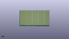
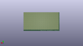
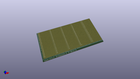

Contents
========

* [PROJ-SPAR-13268-STAN-01>Snappable P-Board](#proj-spar-13268-stan-01snappable-p-board)
	* [Images](#images)
	* [Interactive BOM](#interactive-bom)
	* [Tags](#tags)
  
![][im]
# PROJ-SPAR-13268-STAN-01>Snappable P-Board

- ID: PROJ-SPAR-13268-STAN-01
- Hex ID: PRS13268
- Name: Snappable P-Board
- Description: 

## Images
  
  

|kicadPcb3dFront|kicadPcb3dBack|kicadPcb3d|
| :---: | :---: | :---: |
||||

## Interactive BOM

- Interactive BOM page: [ibom.html](kicad/bom/ibom.html)

## Tags

- hexID: PRS13268
- oompType: PROJ
- oompSize: SPAR
- oompColor: 13268
- oompDesc: STAN
- oompIndex: 01
- oompName: Snappable P-Board
- sources: All source files from https://github.com/sparkfun/Snappable_P-Board (source licence details in srcLicense.md)
- linkBuyPage: https://www.sparkfun.com/products/13268
- oompID: PROJ-SPAR-13268-STAN-01

[im]: kicadPcb3d_450.png
