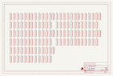
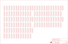

Contents
========

* [PRS13268 > Snappable P-Board](#prs13268--snappable-p-board)
	* [Schematic](#schematic)
	* [Interactive BOM](#interactive-bom)
	* [OOMP Parts](#oomp-parts)
	* [Images](#images)
	* [Tags](#tags)
  
![][im]
# PRS13268 > Snappable P-Board

- ID: PROJ-SPAR-13268-STAN-01
- Hex ID: PRS13268
- Name: Sparkfun
- Description: Sparkfun
- Long Link: [http://oom.lt/PROJ-SPAR-13268-STAN-01](http://oom.lt/PROJ-SPAR-13268-STAN-01)
- Short Link: [http://oom.lt/PRS13268](http://oom.lt/PRS13268)

## Schematic
  

## Interactive BOM

- Interactive BOM page: [ibom.html](https://htmlpreview.github.io/?https://github.com/oomlout/oomlout_OOMP_projects/blob/main/PROJ-SPAR-13268-STAN-01/kicad/bom/ibom.html)

## OOMP Parts
  

|OOMP ID|Name|Identifier|
| :---: | :---: | :---: |
|[HEAD-I01-X-PI10-01](https://github.com/oomlout/oomlout_OOMP_parts/tree/main/HEAD-I01-X-PI10-01/)|[2.54 mm 10 Pin Header](https://github.com/oomlout/oomlout_OOMP_parts/tree/main/HEAD-I01-X-PI10-01/)|[JP1, JP2, JP3, JP4, JP5, JP6, JP7, JP8, JP9, JP10, JP11, JP12, JP13, JP14, JP15, JP16, JP17, JP18, JP19, JP20, JP21, JP22, JP23, JP24, JP25, JP26, JP27, JP28, JP29, JP30, JP31, JP32, JP33, JP34, JP35, JP36, JP37, JP38, JP39, JP40, JP41, JP42, JP43, JP44, JP45, JP46, JP47, JP48, JP49, JP50, JP51, JP52, JP53, JP54, JP55, JP56, JP57, JP58, JP59, JP60, JP61, JP62, JP63, JP64, JP65, JP66, JP67, JP68, JP69, JP70, JP71, JP72, JP73, JP74, JP75, JP76, JP77, JP78, JP79, JP80, JP81, JP82, JP83, JP84, JP85, JP86, JP87, JP88, JP89, JP90, JP91, JP92, JP93, JP94, JP95, JP96, JP97, JP98, JP99, JP100, JP101, JP102, JP103, JP104, JP105, JP106, JP107, JP108, JP109, JP110, JP111, JP112, JP113, JP114, JP115, JP116, JP117, JP118, JP119, JP120, JP121, JP122, JP123, JP124, JP125](https://github.com/oomlout/oomlout_OOMP_parts/tree/main/HEAD-I01-X-PI10-01/)|

## Images
  
  

|bominteractivefront|bominteractiveback|kicadPcb3d|kicadPcb3dFront|kicadPcb3dBack|kicadSchem|eagleSchemImage|pcbdraw|pcbdrawback|
| :---: | :---: | :---: | :---: | :---: | :---: | :---: | :---: | :---: |
||||||||||

## Tags

- hexID: PRS13268
- oompType: PROJ
- oompSize: SPAR
- oompColor: 13268
- oompDesc: STAN
- oompIndex: 01
- oompName: Snappable P-Board
- sources: All source files from https://github.com/sparkfun/Snappable_P-Board (source licence details in srcLicense.md)
- linkBuyPage: https://www.sparkfun.com/products/13268
- oompID: PROJ-SPAR-13268-STAN-01
- oompParts: JP1,HEAD-I01-X-PI10-01
- oompParts: JP2,HEAD-I01-X-PI10-01
- oompParts: JP3,HEAD-I01-X-PI10-01
- oompParts: JP4,HEAD-I01-X-PI10-01
- oompParts: JP5,HEAD-I01-X-PI10-01
- oompParts: JP6,HEAD-I01-X-PI10-01
- oompParts: JP7,HEAD-I01-X-PI10-01
- oompParts: JP8,HEAD-I01-X-PI10-01
- oompParts: JP9,HEAD-I01-X-PI10-01
- oompParts: JP10,HEAD-I01-X-PI10-01
- oompParts: JP11,HEAD-I01-X-PI10-01
- oompParts: JP12,HEAD-I01-X-PI10-01
- oompParts: JP13,HEAD-I01-X-PI10-01
- oompParts: JP14,HEAD-I01-X-PI10-01
- oompParts: JP15,HEAD-I01-X-PI10-01
- oompParts: JP16,HEAD-I01-X-PI10-01
- oompParts: JP17,HEAD-I01-X-PI10-01
- oompParts: JP18,HEAD-I01-X-PI10-01
- oompParts: JP19,HEAD-I01-X-PI10-01
- oompParts: JP20,HEAD-I01-X-PI10-01
- oompParts: JP21,HEAD-I01-X-PI10-01
- oompParts: JP22,HEAD-I01-X-PI10-01
- oompParts: JP23,HEAD-I01-X-PI10-01
- oompParts: JP24,HEAD-I01-X-PI10-01
- oompParts: JP25,HEAD-I01-X-PI10-01
- oompParts: JP26,HEAD-I01-X-PI10-01
- oompParts: JP27,HEAD-I01-X-PI10-01
- oompParts: JP28,HEAD-I01-X-PI10-01
- oompParts: JP29,HEAD-I01-X-PI10-01
- oompParts: JP30,HEAD-I01-X-PI10-01
- oompParts: JP31,HEAD-I01-X-PI10-01
- oompParts: JP32,HEAD-I01-X-PI10-01
- oompParts: JP33,HEAD-I01-X-PI10-01
- oompParts: JP34,HEAD-I01-X-PI10-01
- oompParts: JP35,HEAD-I01-X-PI10-01
- oompParts: JP36,HEAD-I01-X-PI10-01
- oompParts: JP37,HEAD-I01-X-PI10-01
- oompParts: JP38,HEAD-I01-X-PI10-01
- oompParts: JP39,HEAD-I01-X-PI10-01
- oompParts: JP40,HEAD-I01-X-PI10-01
- oompParts: JP41,HEAD-I01-X-PI10-01
- oompParts: JP42,HEAD-I01-X-PI10-01
- oompParts: JP43,HEAD-I01-X-PI10-01
- oompParts: JP44,HEAD-I01-X-PI10-01
- oompParts: JP45,HEAD-I01-X-PI10-01
- oompParts: JP46,HEAD-I01-X-PI10-01
- oompParts: JP47,HEAD-I01-X-PI10-01
- oompParts: JP48,HEAD-I01-X-PI10-01
- oompParts: JP49,HEAD-I01-X-PI10-01
- oompParts: JP50,HEAD-I01-X-PI10-01
- oompParts: JP51,HEAD-I01-X-PI10-01
- oompParts: JP52,HEAD-I01-X-PI10-01
- oompParts: JP53,HEAD-I01-X-PI10-01
- oompParts: JP54,HEAD-I01-X-PI10-01
- oompParts: JP55,HEAD-I01-X-PI10-01
- oompParts: JP56,HEAD-I01-X-PI10-01
- oompParts: JP57,HEAD-I01-X-PI10-01
- oompParts: JP58,HEAD-I01-X-PI10-01
- oompParts: JP59,HEAD-I01-X-PI10-01
- oompParts: JP60,HEAD-I01-X-PI10-01
- oompParts: JP61,HEAD-I01-X-PI10-01
- oompParts: JP62,HEAD-I01-X-PI10-01
- oompParts: JP63,HEAD-I01-X-PI10-01
- oompParts: JP64,HEAD-I01-X-PI10-01
- oompParts: JP65,HEAD-I01-X-PI10-01
- oompParts: JP66,HEAD-I01-X-PI10-01
- oompParts: JP67,HEAD-I01-X-PI10-01
- oompParts: JP68,HEAD-I01-X-PI10-01
- oompParts: JP69,HEAD-I01-X-PI10-01
- oompParts: JP70,HEAD-I01-X-PI10-01
- oompParts: JP71,HEAD-I01-X-PI10-01
- oompParts: JP72,HEAD-I01-X-PI10-01
- oompParts: JP73,HEAD-I01-X-PI10-01
- oompParts: JP74,HEAD-I01-X-PI10-01
- oompParts: JP75,HEAD-I01-X-PI10-01
- oompParts: JP76,HEAD-I01-X-PI10-01
- oompParts: JP77,HEAD-I01-X-PI10-01
- oompParts: JP78,HEAD-I01-X-PI10-01
- oompParts: JP79,HEAD-I01-X-PI10-01
- oompParts: JP80,HEAD-I01-X-PI10-01
- oompParts: JP81,HEAD-I01-X-PI10-01
- oompParts: JP82,HEAD-I01-X-PI10-01
- oompParts: JP83,HEAD-I01-X-PI10-01
- oompParts: JP84,HEAD-I01-X-PI10-01
- oompParts: JP85,HEAD-I01-X-PI10-01
- oompParts: JP86,HEAD-I01-X-PI10-01
- oompParts: JP87,HEAD-I01-X-PI10-01
- oompParts: JP88,HEAD-I01-X-PI10-01
- oompParts: JP89,HEAD-I01-X-PI10-01
- oompParts: JP90,HEAD-I01-X-PI10-01
- oompParts: JP91,HEAD-I01-X-PI10-01
- oompParts: JP92,HEAD-I01-X-PI10-01
- oompParts: JP93,HEAD-I01-X-PI10-01
- oompParts: JP94,HEAD-I01-X-PI10-01
- oompParts: JP95,HEAD-I01-X-PI10-01
- oompParts: JP96,HEAD-I01-X-PI10-01
- oompParts: JP97,HEAD-I01-X-PI10-01
- oompParts: JP98,HEAD-I01-X-PI10-01
- oompParts: JP99,HEAD-I01-X-PI10-01
- oompParts: JP100,HEAD-I01-X-PI10-01
- oompParts: JP101,HEAD-I01-X-PI10-01
- oompParts: JP102,HEAD-I01-X-PI10-01
- oompParts: JP103,HEAD-I01-X-PI10-01
- oompParts: JP104,HEAD-I01-X-PI10-01
- oompParts: JP105,HEAD-I01-X-PI10-01
- oompParts: JP106,HEAD-I01-X-PI10-01
- oompParts: JP107,HEAD-I01-X-PI10-01
- oompParts: JP108,HEAD-I01-X-PI10-01
- oompParts: JP109,HEAD-I01-X-PI10-01
- oompParts: JP110,HEAD-I01-X-PI10-01
- oompParts: JP111,HEAD-I01-X-PI10-01
- oompParts: JP112,HEAD-I01-X-PI10-01
- oompParts: JP113,HEAD-I01-X-PI10-01
- oompParts: JP114,HEAD-I01-X-PI10-01
- oompParts: JP115,HEAD-I01-X-PI10-01
- oompParts: JP116,HEAD-I01-X-PI10-01
- oompParts: JP117,HEAD-I01-X-PI10-01
- oompParts: JP118,HEAD-I01-X-PI10-01
- oompParts: JP119,HEAD-I01-X-PI10-01
- oompParts: JP120,HEAD-I01-X-PI10-01
- oompParts: JP121,HEAD-I01-X-PI10-01
- oompParts: JP122,HEAD-I01-X-PI10-01
- oompParts: JP123,HEAD-I01-X-PI10-01
- oompParts: JP124,HEAD-I01-X-PI10-01
- oompParts: JP125,HEAD-I01-X-PI10-01
- rawParts: FRAME1,FRAME-LEDGER,FRAME-LEDGER,CREATIVE_COMMONS,Schematic Frame,,
- rawParts: JP1,,M10NO_SILK_PTH_FEMALE,1X10_NO_SILK,Header 10,CONN-11563,
- rawParts: JP2,,M10NO_SILK_PTH_FEMALE,1X10_NO_SILK,Header 10,CONN-11563,
- rawParts: JP3,,M10NO_SILK_PTH_FEMALE,1X10_NO_SILK,Header 10,CONN-11563,
- rawParts: JP4,,M10NO_SILK_PTH_FEMALE,1X10_NO_SILK,Header 10,CONN-11563,
- rawParts: JP5,,M10NO_SILK_PTH_FEMALE,1X10_NO_SILK,Header 10,CONN-11563,
- rawParts: JP6,,M10NO_SILK_PTH_FEMALE,1X10_NO_SILK,Header 10,CONN-11563,
- rawParts: JP7,,M10NO_SILK_PTH_FEMALE,1X10_NO_SILK,Header 10,CONN-11563,
- rawParts: JP8,,M10NO_SILK_PTH_FEMALE,1X10_NO_SILK,Header 10,CONN-11563,
- rawParts: JP9,,M10NO_SILK_PTH_FEMALE,1X10_NO_SILK,Header 10,CONN-11563,
- rawParts: JP10,,M10NO_SILK_PTH_FEMALE,1X10_NO_SILK,Header 10,CONN-11563,
- rawParts: JP11,,M10NO_SILK_PTH_FEMALE,1X10_NO_SILK,Header 10,CONN-11563,
- rawParts: JP12,,M10NO_SILK_PTH_FEMALE,1X10_NO_SILK,Header 10,CONN-11563,
- rawParts: JP13,,M10NO_SILK_PTH_FEMALE,1X10_NO_SILK,Header 10,CONN-11563,
- rawParts: JP14,,M10NO_SILK_PTH_FEMALE,1X10_NO_SILK,Header 10,CONN-11563,
- rawParts: JP15,,M10NO_SILK_PTH_FEMALE,1X10_NO_SILK,Header 10,CONN-11563,
- rawParts: JP16,,M10NO_SILK_PTH_FEMALE,1X10_NO_SILK,Header 10,CONN-11563,
- rawParts: JP17,,M10NO_SILK_PTH_FEMALE,1X10_NO_SILK,Header 10,CONN-11563,
- rawParts: JP18,,M10NO_SILK_PTH_FEMALE,1X10_NO_SILK,Header 10,CONN-11563,
- rawParts: JP19,,M10NO_SILK_PTH_FEMALE,1X10_NO_SILK,Header 10,CONN-11563,
- rawParts: JP20,,M10NO_SILK_PTH_FEMALE,1X10_NO_SILK,Header 10,CONN-11563,
- rawParts: JP21,,M10NO_SILK_PTH_FEMALE,1X10_NO_SILK,Header 10,CONN-11563,
- rawParts: JP22,,M10NO_SILK_PTH_FEMALE,1X10_NO_SILK,Header 10,CONN-11563,
- rawParts: JP23,,M10NO_SILK_PTH_FEMALE,1X10_NO_SILK,Header 10,CONN-11563,
- rawParts: JP24,,M10NO_SILK_PTH_FEMALE,1X10_NO_SILK,Header 10,CONN-11563,
- rawParts: JP25,,M10NO_SILK_PTH_FEMALE,1X10_NO_SILK,Header 10,CONN-11563,
- rawParts: JP26,,M10NO_SILK_PTH_FEMALE,1X10_NO_SILK,Header 10,CONN-11563,
- rawParts: JP27,,M10NO_SILK_PTH_FEMALE,1X10_NO_SILK,Header 10,CONN-11563,
- rawParts: JP28,,M10NO_SILK_PTH_FEMALE,1X10_NO_SILK,Header 10,CONN-11563,
- rawParts: JP29,,M10NO_SILK_PTH_FEMALE,1X10_NO_SILK,Header 10,CONN-11563,
- rawParts: JP30,,M10NO_SILK_PTH_FEMALE,1X10_NO_SILK,Header 10,CONN-11563,
- rawParts: JP31,,M10NO_SILK_PTH_FEMALE,1X10_NO_SILK,Header 10,CONN-11563,
- rawParts: JP32,,M10NO_SILK_PTH_FEMALE,1X10_NO_SILK,Header 10,CONN-11563,
- rawParts: JP33,,M10NO_SILK_PTH_FEMALE,1X10_NO_SILK,Header 10,CONN-11563,
- rawParts: JP34,,M10NO_SILK_PTH_FEMALE,1X10_NO_SILK,Header 10,CONN-11563,
- rawParts: JP35,,M10NO_SILK_PTH_FEMALE,1X10_NO_SILK,Header 10,CONN-11563,
- rawParts: JP36,,M10NO_SILK_PTH_FEMALE,1X10_NO_SILK,Header 10,CONN-11563,
- rawParts: JP37,,M10NO_SILK_PTH_FEMALE,1X10_NO_SILK,Header 10,CONN-11563,
- rawParts: JP38,,M10NO_SILK_PTH_FEMALE,1X10_NO_SILK,Header 10,CONN-11563,
- rawParts: JP39,,M10NO_SILK_PTH_FEMALE,1X10_NO_SILK,Header 10,CONN-11563,
- rawParts: JP40,,M10NO_SILK_PTH_FEMALE,1X10_NO_SILK,Header 10,CONN-11563,
- rawParts: JP41,,M10NO_SILK_PTH_FEMALE,1X10_NO_SILK,Header 10,CONN-11563,
- rawParts: JP42,,M10NO_SILK_PTH_FEMALE,1X10_NO_SILK,Header 10,CONN-11563,
- rawParts: JP43,,M10NO_SILK_PTH_FEMALE,1X10_NO_SILK,Header 10,CONN-11563,
- rawParts: JP44,,M10NO_SILK_PTH_FEMALE,1X10_NO_SILK,Header 10,CONN-11563,
- rawParts: JP45,,M10NO_SILK_PTH_FEMALE,1X10_NO_SILK,Header 10,CONN-11563,
- rawParts: JP46,,M10NO_SILK_PTH_FEMALE,1X10_NO_SILK,Header 10,CONN-11563,
- rawParts: JP47,,M10NO_SILK_PTH_FEMALE,1X10_NO_SILK,Header 10,CONN-11563,
- rawParts: JP48,,M10NO_SILK_PTH_FEMALE,1X10_NO_SILK,Header 10,CONN-11563,
- rawParts: JP49,,M10NO_SILK_PTH_FEMALE,1X10_NO_SILK,Header 10,CONN-11563,
- rawParts: JP50,,M10NO_SILK_PTH_FEMALE,1X10_NO_SILK,Header 10,CONN-11563,
- rawParts: JP51,,M10NO_SILK_PTH_FEMALE,1X10_NO_SILK,Header 10,CONN-11563,
- rawParts: JP52,,M10NO_SILK_PTH_FEMALE,1X10_NO_SILK,Header 10,CONN-11563,
- rawParts: JP53,,M10NO_SILK_PTH_FEMALE,1X10_NO_SILK,Header 10,CONN-11563,
- rawParts: JP54,,M10NO_SILK_PTH_FEMALE,1X10_NO_SILK,Header 10,CONN-11563,
- rawParts: JP55,,M10NO_SILK_PTH_FEMALE,1X10_NO_SILK,Header 10,CONN-11563,
- rawParts: JP56,,M10NO_SILK_PTH_FEMALE,1X10_NO_SILK,Header 10,CONN-11563,
- rawParts: JP57,,M10NO_SILK_PTH_FEMALE,1X10_NO_SILK,Header 10,CONN-11563,
- rawParts: JP58,,M10NO_SILK_PTH_FEMALE,1X10_NO_SILK,Header 10,CONN-11563,
- rawParts: JP59,,M10NO_SILK_PTH_FEMALE,1X10_NO_SILK,Header 10,CONN-11563,
- rawParts: JP60,,M10NO_SILK_PTH_FEMALE,1X10_NO_SILK,Header 10,CONN-11563,
- rawParts: JP61,,M10NO_SILK_PTH_FEMALE,1X10_NO_SILK,Header 10,CONN-11563,
- rawParts: JP62,,M10NO_SILK_PTH_FEMALE,1X10_NO_SILK,Header 10,CONN-11563,
- rawParts: JP63,,M10NO_SILK_PTH_FEMALE,1X10_NO_SILK,Header 10,CONN-11563,
- rawParts: JP64,,M10NO_SILK_PTH_FEMALE,1X10_NO_SILK,Header 10,CONN-11563,
- rawParts: JP65,,M10NO_SILK_PTH_FEMALE,1X10_NO_SILK,Header 10,CONN-11563,
- rawParts: JP66,,M10NO_SILK_PTH_FEMALE,1X10_NO_SILK,Header 10,CONN-11563,
- rawParts: JP67,,M10NO_SILK_PTH_FEMALE,1X10_NO_SILK,Header 10,CONN-11563,
- rawParts: JP68,,M10NO_SILK_PTH_FEMALE,1X10_NO_SILK,Header 10,CONN-11563,
- rawParts: JP69,,M10NO_SILK_PTH_FEMALE,1X10_NO_SILK,Header 10,CONN-11563,
- rawParts: JP70,,M10NO_SILK_PTH_FEMALE,1X10_NO_SILK,Header 10,CONN-11563,
- rawParts: JP71,,M10NO_SILK_PTH_FEMALE,1X10_NO_SILK,Header 10,CONN-11563,
- rawParts: JP72,,M10NO_SILK_PTH_FEMALE,1X10_NO_SILK,Header 10,CONN-11563,
- rawParts: JP73,,M10NO_SILK_PTH_FEMALE,1X10_NO_SILK,Header 10,CONN-11563,
- rawParts: JP74,,M10NO_SILK_PTH_FEMALE,1X10_NO_SILK,Header 10,CONN-11563,
- rawParts: JP75,,M10NO_SILK_PTH_FEMALE,1X10_NO_SILK,Header 10,CONN-11563,
- rawParts: JP76,,M10NO_SILK_PTH_FEMALE,1X10_NO_SILK,Header 10,CONN-11563,
- rawParts: JP77,,M10NO_SILK_PTH_FEMALE,1X10_NO_SILK,Header 10,CONN-11563,
- rawParts: JP78,,M10NO_SILK_PTH_FEMALE,1X10_NO_SILK,Header 10,CONN-11563,
- rawParts: JP79,,M10NO_SILK_PTH_FEMALE,1X10_NO_SILK,Header 10,CONN-11563,
- rawParts: JP80,,M10NO_SILK_PTH_FEMALE,1X10_NO_SILK,Header 10,CONN-11563,
- rawParts: JP81,,M10NO_SILK_PTH_FEMALE,1X10_NO_SILK,Header 10,CONN-11563,
- rawParts: JP82,,M10NO_SILK_PTH_FEMALE,1X10_NO_SILK,Header 10,CONN-11563,
- rawParts: JP83,,M10NO_SILK_PTH_FEMALE,1X10_NO_SILK,Header 10,CONN-11563,
- rawParts: JP84,,M10NO_SILK_PTH_FEMALE,1X10_NO_SILK,Header 10,CONN-11563,
- rawParts: JP85,,M10NO_SILK_PTH_FEMALE,1X10_NO_SILK,Header 10,CONN-11563,
- rawParts: JP86,,M10NO_SILK_PTH_FEMALE,1X10_NO_SILK,Header 10,CONN-11563,
- rawParts: JP87,,M10NO_SILK_PTH_FEMALE,1X10_NO_SILK,Header 10,CONN-11563,
- rawParts: JP88,,M10NO_SILK_PTH_FEMALE,1X10_NO_SILK,Header 10,CONN-11563,
- rawParts: JP89,,M10NO_SILK_PTH_FEMALE,1X10_NO_SILK,Header 10,CONN-11563,
- rawParts: JP90,,M10NO_SILK_PTH_FEMALE,1X10_NO_SILK,Header 10,CONN-11563,
- rawParts: JP91,,M10NO_SILK_PTH_FEMALE,1X10_NO_SILK,Header 10,CONN-11563,
- rawParts: JP92,,M10NO_SILK_PTH_FEMALE,1X10_NO_SILK,Header 10,CONN-11563,
- rawParts: JP93,,M10NO_SILK_PTH_FEMALE,1X10_NO_SILK,Header 10,CONN-11563,
- rawParts: JP94,,M10NO_SILK_PTH_FEMALE,1X10_NO_SILK,Header 10,CONN-11563,
- rawParts: JP95,,M10NO_SILK_PTH_FEMALE,1X10_NO_SILK,Header 10,CONN-11563,
- rawParts: JP96,,M10NO_SILK_PTH_FEMALE,1X10_NO_SILK,Header 10,CONN-11563,
- rawParts: JP97,,M10NO_SILK_PTH_FEMALE,1X10_NO_SILK,Header 10,CONN-11563,
- rawParts: JP98,,M10NO_SILK_PTH_FEMALE,1X10_NO_SILK,Header 10,CONN-11563,
- rawParts: JP99,,M10NO_SILK_PTH_FEMALE,1X10_NO_SILK,Header 10,CONN-11563,
- rawParts: JP100,,M10NO_SILK_PTH_FEMALE,1X10_NO_SILK,Header 10,CONN-11563,
- rawParts: JP101,,M10NO_SILK_PTH_FEMALE,1X10_NO_SILK,Header 10,CONN-11563,
- rawParts: JP102,,M10NO_SILK_PTH_FEMALE,1X10_NO_SILK,Header 10,CONN-11563,
- rawParts: JP103,,M10NO_SILK_PTH_FEMALE,1X10_NO_SILK,Header 10,CONN-11563,
- rawParts: JP104,,M10NO_SILK_PTH_FEMALE,1X10_NO_SILK,Header 10,CONN-11563,
- rawParts: JP105,,M10NO_SILK_PTH_FEMALE,1X10_NO_SILK,Header 10,CONN-11563,
- rawParts: JP106,,M10NO_SILK_PTH_FEMALE,1X10_NO_SILK,Header 10,CONN-11563,
- rawParts: JP107,,M10NO_SILK_PTH_FEMALE,1X10_NO_SILK,Header 10,CONN-11563,
- rawParts: JP108,,M10NO_SILK_PTH_FEMALE,1X10_NO_SILK,Header 10,CONN-11563,
- rawParts: JP109,,M10NO_SILK_PTH_FEMALE,1X10_NO_SILK,Header 10,CONN-11563,
- rawParts: JP110,,M10NO_SILK_PTH_FEMALE,1X10_NO_SILK,Header 10,CONN-11563,
- rawParts: JP111,,M10NO_SILK_PTH_FEMALE,1X10_NO_SILK,Header 10,CONN-11563,
- rawParts: JP112,,M10NO_SILK_PTH_FEMALE,1X10_NO_SILK,Header 10,CONN-11563,
- rawParts: JP113,,M10NO_SILK_PTH_FEMALE,1X10_NO_SILK,Header 10,CONN-11563,
- rawParts: JP114,,M10NO_SILK_PTH_FEMALE,1X10_NO_SILK,Header 10,CONN-11563,
- rawParts: JP115,,M10NO_SILK_PTH_FEMALE,1X10_NO_SILK,Header 10,CONN-11563,
- rawParts: JP116,,M10NO_SILK_PTH_FEMALE,1X10_NO_SILK,Header 10,CONN-11563,
- rawParts: JP117,,M10NO_SILK_PTH_FEMALE,1X10_NO_SILK,Header 10,CONN-11563,
- rawParts: JP118,,M10NO_SILK_PTH_FEMALE,1X10_NO_SILK,Header 10,CONN-11563,
- rawParts: JP119,,M10NO_SILK_PTH_FEMALE,1X10_NO_SILK,Header 10,CONN-11563,
- rawParts: JP120,,M10NO_SILK_PTH_FEMALE,1X10_NO_SILK,Header 10,CONN-11563,
- rawParts: JP121,,M10NO_SILK_PTH_FEMALE,1X10_NO_SILK,Header 10,CONN-11563,
- rawParts: JP122,,M10NO_SILK_PTH_FEMALE,1X10_NO_SILK,Header 10,CONN-11563,
- rawParts: JP123,,M10NO_SILK_PTH_FEMALE,1X10_NO_SILK,Header 10,CONN-11563,
- rawParts: JP124,,M10NO_SILK_PTH_FEMALE,1X10_NO_SILK,Header 10,CONN-11563,
- rawParts: JP125,,M10NO_SILK_PTH_FEMALE,1X10_NO_SILK,Header 10,CONN-11563,
- rawParts: LOGO1,SFE_LOGO_FLAME0.05_INCH,SFE_LOGO_FLAME0.05_INCH,SFE_LOGO_FLAME_.05,SFE Logo, flame only,,
- rawParts: LOGO2,SFE_LOGO_FLAME0.05_INCH,SFE_LOGO_FLAME0.05_INCH,SFE_LOGO_FLAME_.05,SFE Logo, flame only,,

[im]: kicadPcb3d_450.png
