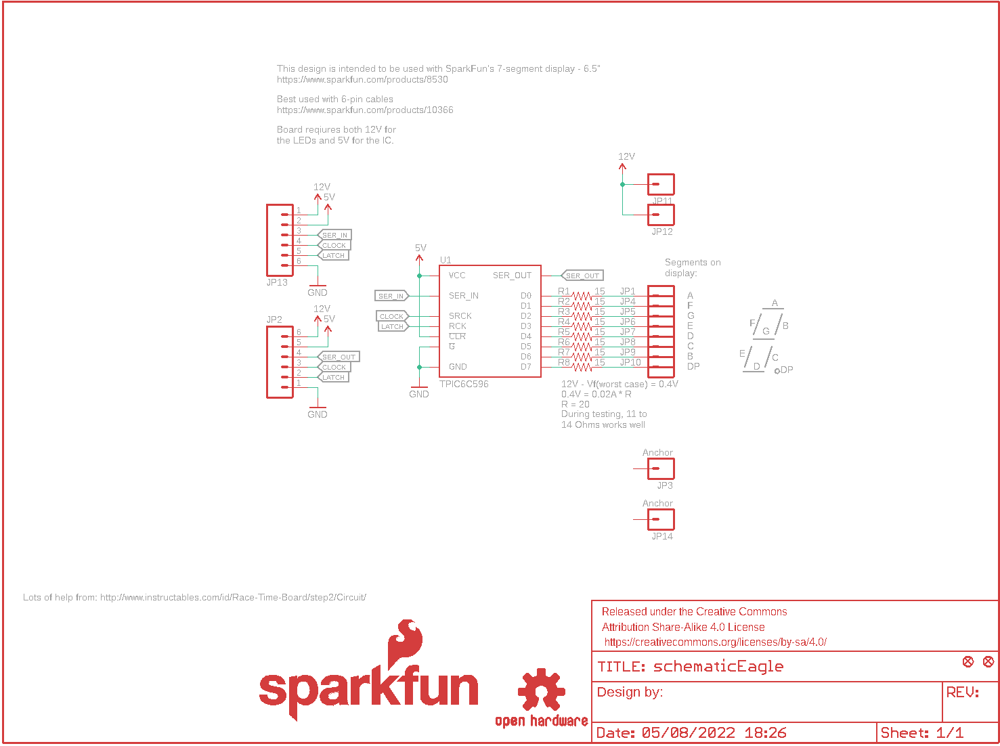
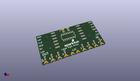
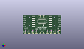
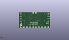
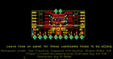

Contents
========

* [PRS13279 > Sparkfun](#prs13279--sparkfun)
	* [Schematic](#schematic)
	* [Interactive BOM](#interactive-bom)
	* [OOMP Parts](#oomp-parts)
	* [Images](#images)
	* [Tags](#tags)
  
![][im]
# PRS13279 > Sparkfun

- ID: PROJ-SPAR-13279-STAN-01
- Hex ID: PRS13279
- Name: Sparkfun
- Description: Sparkfun
- Long Link: [http://oom.lt/PROJ-SPAR-13279-STAN-01](http://oom.lt/PROJ-SPAR-13279-STAN-01)
- Short Link: [http://oom.lt/PRS13279](http://oom.lt/PRS13279)

## Schematic
  

## Interactive BOM

- Interactive BOM page: [ibom.html](https://htmlpreview.github.io/?https://github.com/oomlout/oomlout_OOMP_projects/blob/main/PROJ-SPAR-13279-STAN-01/kicad/bom/ibom.html)

## OOMP Parts
  

|OOMP Parts|
| :---: |
|FRAME1,UNMATCHED-UNMATCHED-UNMATCHED-UNMATCHED-UNMATCHED,FID1,FIDUCIAL1X2,FIDUCIAL1X2,FIDUCIAL-1X2,Fiducial Alignment Points,,,,,|
|JP1,UNMATCHED-UNMATCHED-UNMATCHED-UNMATCHED-UNMATCHED,FID2,FIDUCIAL1X2,FIDUCIAL1X2,FIDUCIAL-1X2,Fiducial Alignment Points,,,,,|
|JP2,UNMATCHED-UNMATCHED-UNMATCHED-UNMATCHED-UNMATCHED,FRAME1,,FRAME-LETTER,CREATIVE_COMMONS,Schematic Frame,N. Seidle,,,v10,|
|JP3,UNMATCHED-UNMATCHED-UNMATCHED-UNMATCHED-UNMATCHED,JP1,,M01PTH_LONGPAD,1X01_LONGPAD,Header 1,,,,,|
|JP4,UNMATCHED-UNMATCHED-UNMATCHED-UNMATCHED-UNMATCHED,JP2,,M06SMD,1X06-SMD,Header 6,,CONN-08971,RA 6Pin SMD,,|
|JP5,UNMATCHED-UNMATCHED-UNMATCHED-UNMATCHED-UNMATCHED,JP3,Anchor,M01PTH_LONGPAD,1X01_LONGPAD,Header 1,,,,,|
|JP6,UNMATCHED-UNMATCHED-UNMATCHED-UNMATCHED-UNMATCHED,JP4,,M01PTH_LONGPAD,1X01_LONGPAD,Header 1,,,,,|
|JP7,UNMATCHED-UNMATCHED-UNMATCHED-UNMATCHED-UNMATCHED,JP5,,M01PTH_LONGPAD,1X01_LONGPAD,Header 1,,,,,|
|JP8,UNMATCHED-UNMATCHED-UNMATCHED-UNMATCHED-UNMATCHED,JP6,,M01PTH_LONGPAD,1X01_LONGPAD,Header 1,,,,,|
|JP9,UNMATCHED-UNMATCHED-UNMATCHED-UNMATCHED-UNMATCHED,JP7,,M01PTH_LONGPAD,1X01_LONGPAD,Header 1,,,,,|
|JP10,UNMATCHED-UNMATCHED-UNMATCHED-UNMATCHED-UNMATCHED,JP8,,M01PTH_LONGPAD,1X01_LONGPAD,Header 1,,,,,|
|JP11,UNMATCHED-UNMATCHED-UNMATCHED-UNMATCHED-UNMATCHED,JP9,,M01PTH_LONGPAD,1X01_LONGPAD,Header 1,,,,,|
|JP12,UNMATCHED-UNMATCHED-UNMATCHED-UNMATCHED-UNMATCHED,JP10,,M01PTH_LONGPAD,1X01_LONGPAD,Header 1,,,,,|
|JP13,UNMATCHED-UNMATCHED-UNMATCHED-UNMATCHED-UNMATCHED,JP11,,M01PTH_LONGPAD,1X01_LONGPAD,Header 1,,,,,|
|JP14,UNMATCHED-UNMATCHED-UNMATCHED-UNMATCHED-UNMATCHED,JP12,,M01PTH_LONGPAD,1X01_LONGPAD,Header 1,,,,,|
|LOGO1,UNMATCHED-UNMATCHED-UNMATCHED-UNMATCHED-UNMATCHED,JP13,,M06SMD,1X06-SMD,Header 6,,CONN-08971,RA 6Pin SMD,,|
|LOGO2,UNMATCHED-UNMATCHED-UNMATCHED-UNMATCHED-UNMATCHED,JP14,Anchor,M01PTH_LONGPAD,1X01_LONGPAD,Header 1,,,,,|
|R1,UNMATCHED-UNMATCHED-UNMATCHED-UNMATCHED-UNMATCHED,LOGO1,SFE_LOGO_NAME_FLAME.1_INCH,SFE_LOGO_NAME_FLAME.1_INCH,SFE_LOGO_NAME_FLAME_.1,SFE Logo, name and flame,,,,,|
|R2,UNMATCHED-UNMATCHED-UNMATCHED-UNMATCHED-UNMATCHED,LOGO2,OSHW-LOGOS,OSHW-LOGOS,OSHW-LOGO-S,Open Source Hardware Logo,,,,,|
|R3,UNMATCHED-UNMATCHED-UNMATCHED-UNMATCHED-UNMATCHED,R1,15,15OHM-1/10W-1%(0603)0603,0603-RES,,,RES-12570,15,,|
|R4,UNMATCHED-UNMATCHED-UNMATCHED-UNMATCHED-UNMATCHED,R2,15,15OHM-1/10W-1%(0603)0603,0603-RES,,,RES-12570,15,,|
|R5,UNMATCHED-UNMATCHED-UNMATCHED-UNMATCHED-UNMATCHED,R3,15,15OHM-1/10W-1%(0603)0603,0603-RES,,,RES-12570,15,,|
|R6,UNMATCHED-UNMATCHED-UNMATCHED-UNMATCHED-UNMATCHED,R4,15,15OHM-1/10W-1%(0603)0603,0603-RES,,,RES-12570,15,,|
|R7,UNMATCHED-UNMATCHED-UNMATCHED-UNMATCHED-UNMATCHED,R5,15,15OHM-1/10W-1%(0603)0603,0603-RES,,,RES-12570,15,,|
|R8,UNMATCHED-UNMATCHED-UNMATCHED-UNMATCHED-UNMATCHED,R6,15,15OHM-1/10W-1%(0603)0603,0603-RES,,,RES-12570,15,,|
|U1,UNMATCHED-UNMATCHED-UNMATCHED-UNMATCHED-UNMATCHED,R7,15,15OHM-1/10W-1%(0603)0603,0603-RES,,,RES-12570,15,,|

## Images
  
  

|kicadPcb3d|kicadPcb3dFront|kicadPcb3dBack|eagleImage|eagleSchemImage|
| :---: | :---: | :---: | :---: | :---: |
||||||

## Tags

- hexID: PRS13279
- oompType: PROJ
- oompSize: SPAR
- oompColor: 13279
- oompDesc: STAN
- oompIndex: 01
- oompName: Large Digit Driver
- sources: All source files from https://github.com/sparkfun/Large_Digit_Driver (source licence details in srcLicense.md)
- linkBuyPage: https://www.sparkfun.com/products/13279
- oompID: PROJ-SPAR-13279-STAN-01
- oompParts: FRAME1,UNMATCHED-UNMATCHED-UNMATCHED-UNMATCHED-UNMATCHED
- oompParts: JP1,UNMATCHED-UNMATCHED-UNMATCHED-UNMATCHED-UNMATCHED
- oompParts: JP2,UNMATCHED-UNMATCHED-UNMATCHED-UNMATCHED-UNMATCHED
- oompParts: JP3,UNMATCHED-UNMATCHED-UNMATCHED-UNMATCHED-UNMATCHED
- oompParts: JP4,UNMATCHED-UNMATCHED-UNMATCHED-UNMATCHED-UNMATCHED
- oompParts: JP5,UNMATCHED-UNMATCHED-UNMATCHED-UNMATCHED-UNMATCHED
- oompParts: JP6,UNMATCHED-UNMATCHED-UNMATCHED-UNMATCHED-UNMATCHED
- oompParts: JP7,UNMATCHED-UNMATCHED-UNMATCHED-UNMATCHED-UNMATCHED
- oompParts: JP8,UNMATCHED-UNMATCHED-UNMATCHED-UNMATCHED-UNMATCHED
- oompParts: JP9,UNMATCHED-UNMATCHED-UNMATCHED-UNMATCHED-UNMATCHED
- oompParts: JP10,UNMATCHED-UNMATCHED-UNMATCHED-UNMATCHED-UNMATCHED
- oompParts: JP11,UNMATCHED-UNMATCHED-UNMATCHED-UNMATCHED-UNMATCHED
- oompParts: JP12,UNMATCHED-UNMATCHED-UNMATCHED-UNMATCHED-UNMATCHED
- oompParts: JP13,UNMATCHED-UNMATCHED-UNMATCHED-UNMATCHED-UNMATCHED
- oompParts: JP14,UNMATCHED-UNMATCHED-UNMATCHED-UNMATCHED-UNMATCHED
- oompParts: LOGO1,UNMATCHED-UNMATCHED-UNMATCHED-UNMATCHED-UNMATCHED
- oompParts: LOGO2,UNMATCHED-UNMATCHED-UNMATCHED-UNMATCHED-UNMATCHED
- oompParts: R1,UNMATCHED-UNMATCHED-UNMATCHED-UNMATCHED-UNMATCHED
- oompParts: R2,UNMATCHED-UNMATCHED-UNMATCHED-UNMATCHED-UNMATCHED
- oompParts: R3,UNMATCHED-UNMATCHED-UNMATCHED-UNMATCHED-UNMATCHED
- oompParts: R4,UNMATCHED-UNMATCHED-UNMATCHED-UNMATCHED-UNMATCHED
- oompParts: R5,UNMATCHED-UNMATCHED-UNMATCHED-UNMATCHED-UNMATCHED
- oompParts: R6,UNMATCHED-UNMATCHED-UNMATCHED-UNMATCHED-UNMATCHED
- oompParts: R7,UNMATCHED-UNMATCHED-UNMATCHED-UNMATCHED-UNMATCHED
- oompParts: R8,UNMATCHED-UNMATCHED-UNMATCHED-UNMATCHED-UNMATCHED
- oompParts: U1,UNMATCHED-UNMATCHED-UNMATCHED-UNMATCHED-UNMATCHED
- rawParts: FID1,FIDUCIAL1X2,FIDUCIAL1X2,FIDUCIAL-1X2,Fiducial Alignment Points,,,,,
- rawParts: FID2,FIDUCIAL1X2,FIDUCIAL1X2,FIDUCIAL-1X2,Fiducial Alignment Points,,,,,
- rawParts: FRAME1,,FRAME-LETTER,CREATIVE_COMMONS,Schematic Frame,N. Seidle,,,v10,
- rawParts: JP1,,M01PTH_LONGPAD,1X01_LONGPAD,Header 1,,,,,
- rawParts: JP2,,M06SMD,1X06-SMD,Header 6,,CONN-08971,RA 6Pin SMD,,
- rawParts: JP3,Anchor,M01PTH_LONGPAD,1X01_LONGPAD,Header 1,,,,,
- rawParts: JP4,,M01PTH_LONGPAD,1X01_LONGPAD,Header 1,,,,,
- rawParts: JP5,,M01PTH_LONGPAD,1X01_LONGPAD,Header 1,,,,,
- rawParts: JP6,,M01PTH_LONGPAD,1X01_LONGPAD,Header 1,,,,,
- rawParts: JP7,,M01PTH_LONGPAD,1X01_LONGPAD,Header 1,,,,,
- rawParts: JP8,,M01PTH_LONGPAD,1X01_LONGPAD,Header 1,,,,,
- rawParts: JP9,,M01PTH_LONGPAD,1X01_LONGPAD,Header 1,,,,,
- rawParts: JP10,,M01PTH_LONGPAD,1X01_LONGPAD,Header 1,,,,,
- rawParts: JP11,,M01PTH_LONGPAD,1X01_LONGPAD,Header 1,,,,,
- rawParts: JP12,,M01PTH_LONGPAD,1X01_LONGPAD,Header 1,,,,,
- rawParts: JP13,,M06SMD,1X06-SMD,Header 6,,CONN-08971,RA 6Pin SMD,,
- rawParts: JP14,Anchor,M01PTH_LONGPAD,1X01_LONGPAD,Header 1,,,,,
- rawParts: LOGO1,SFE_LOGO_NAME_FLAME.1_INCH,SFE_LOGO_NAME_FLAME.1_INCH,SFE_LOGO_NAME_FLAME_.1,SFE Logo, name and flame,,,,,
- rawParts: LOGO2,OSHW-LOGOS,OSHW-LOGOS,OSHW-LOGO-S,Open Source Hardware Logo,,,,,
- rawParts: R1,15,15OHM-1/10W-1%(0603)0603,0603-RES,,,RES-12570,15,,
- rawParts: R2,15,15OHM-1/10W-1%(0603)0603,0603-RES,,,RES-12570,15,,
- rawParts: R3,15,15OHM-1/10W-1%(0603)0603,0603-RES,,,RES-12570,15,,
- rawParts: R4,15,15OHM-1/10W-1%(0603)0603,0603-RES,,,RES-12570,15,,
- rawParts: R5,15,15OHM-1/10W-1%(0603)0603,0603-RES,,,RES-12570,15,,
- rawParts: R6,15,15OHM-1/10W-1%(0603)0603,0603-RES,,,RES-12570,15,,
- rawParts: R7,15,15OHM-1/10W-1%(0603)0603,0603-RES,,,RES-12570,15,,
- rawParts: R8,15,15OHM-1/10W-1%(0603)0603,0603-RES,,,RES-12570,15,,
- rawParts: U1,TPIC6C596,TPIC6C596SOIC,SO016,SMD version of the popular sink driver. This version can sink up to 100mA per channel,,IC-12522,TPIC6C596,,

[im]: kicadPcb3d_450.png
