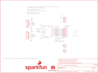

Contents
========

* [PRS13279 > Large Digit Driver](#prs13279--large-digit-driver)
	* [Schematic](#schematic)
	* [PCB](#pcb)
	* [Interactive BOM](#interactive-bom)
	* [OOMP Parts](#oomp-parts)
	* [Images](#images)
	* [Tags](#tags)
  
![][im]
# PRS13279 > Large Digit Driver

- ID: PROJ-SPAR-13279-STAN-01
- Hex ID: PRS13279
- Name: Sparkfun
- Description: Sparkfun
- Long Link: [http://oom.lt/PROJ-SPAR-13279-STAN-01](http://oom.lt/PROJ-SPAR-13279-STAN-01)
- Short Link: [http://oom.lt/PRS13279](http://oom.lt/PRS13279)

## Schematic
  

## PCB
  

## Interactive BOM

- Interactive BOM page: [ibom.html](https://htmlpreview.github.io/?https://github.com/oomlout/oomlout_OOMP_projects/blob/main/PROJ-SPAR-13279-STAN-01/kicad/bom/ibom.html)

## OOMP Parts
  

|OOMP Parts|
| :---: |
|UNMATCHED-UNMATCHED-X-UNMATCHED-01 FRAME1, U1|
|HEAD-I01-X-PI01-01 JP1, JP3, JP4, JP5, JP6, JP7, JP8, JP9, JP10, JP11, JP12, JP14|
|[HEAD-I01-X-PI06-01  2.54 mm 6 Pin Header  JP2, JP13](https://github.com/oomlout/oomlout_OOMP_parts/tree/main/HEAD-I01-X-PI06-01/)|
|[RESE-0603-X-O150-01  SMD (0603) 15 Ohm Resistor  R1, R2, R3, R4, R5, R6, R7, R8](https://github.com/oomlout/oomlout_OOMP_parts/tree/main/RESE-0603-X-O150-01/)|

## Images
  
  

|kicadPcb3d|kicadPcb3dFront|kicadPcb3dBack|eagleImage|eagleSchemImage|
| :---: | :---: | :---: | :---: | :---: |
||||||

## Tags

- hexID: PRS13279
- oompType: PROJ
- oompSize: SPAR
- oompColor: 13279
- oompDesc: STAN
- oompIndex: 01
- oompName: Large Digit Driver
- sources: All source files from https://github.com/sparkfun/Large_Digit_Driver (source licence details in srcLicense.md)
- linkBuyPage: https://www.sparkfun.com/products/13279
- oompID: PROJ-SPAR-13279-STAN-01
- oompParts: FRAME1,UNMATCHED-UNMATCHED-X-UNMATCHED-01
- oompParts: JP1,HEAD-I01-X-PI01-01
- oompParts: JP2,HEAD-I01-X-PI06-01
- oompParts: JP3,HEAD-I01-X-PI01-01
- oompParts: JP4,HEAD-I01-X-PI01-01
- oompParts: JP5,HEAD-I01-X-PI01-01
- oompParts: JP6,HEAD-I01-X-PI01-01
- oompParts: JP7,HEAD-I01-X-PI01-01
- oompParts: JP8,HEAD-I01-X-PI01-01
- oompParts: JP9,HEAD-I01-X-PI01-01
- oompParts: JP10,HEAD-I01-X-PI01-01
- oompParts: JP11,HEAD-I01-X-PI01-01
- oompParts: JP12,HEAD-I01-X-PI01-01
- oompParts: JP13,HEAD-I01-X-PI06-01
- oompParts: JP14,HEAD-I01-X-PI01-01
- oompParts: R1,RESE-0603-X-O150-01
- oompParts: R2,RESE-0603-X-O150-01
- oompParts: R3,RESE-0603-X-O150-01
- oompParts: R4,RESE-0603-X-O150-01
- oompParts: R5,RESE-0603-X-O150-01
- oompParts: R6,RESE-0603-X-O150-01
- oompParts: R7,RESE-0603-X-O150-01
- oompParts: R8,RESE-0603-X-O150-01
- oompParts: U1,UNMATCHED-UNMATCHED-X-UNMATCHED-01
- rawParts: FID1,FIDUCIAL1X2,FIDUCIAL1X2,FIDUCIAL-1X2,Fiducial Alignment Points,,,,,
- rawParts: FID2,FIDUCIAL1X2,FIDUCIAL1X2,FIDUCIAL-1X2,Fiducial Alignment Points,,,,,
- rawParts: FRAME1,,FRAME-LETTER,CREATIVE_COMMONS,Schematic Frame,N. Seidle,,,v10,
- rawParts: JP1,,M01PTH_LONGPAD,1X01_LONGPAD,Header 1,,,,,
- rawParts: JP2,,M06SMD,1X06-SMD,Header 6,,CONN-08971,RA 6Pin SMD,,
- rawParts: JP3,Anchor,M01PTH_LONGPAD,1X01_LONGPAD,Header 1,,,,,
- rawParts: JP4,,M01PTH_LONGPAD,1X01_LONGPAD,Header 1,,,,,
- rawParts: JP5,,M01PTH_LONGPAD,1X01_LONGPAD,Header 1,,,,,
- rawParts: JP6,,M01PTH_LONGPAD,1X01_LONGPAD,Header 1,,,,,
- rawParts: JP7,,M01PTH_LONGPAD,1X01_LONGPAD,Header 1,,,,,
- rawParts: JP8,,M01PTH_LONGPAD,1X01_LONGPAD,Header 1,,,,,
- rawParts: JP9,,M01PTH_LONGPAD,1X01_LONGPAD,Header 1,,,,,
- rawParts: JP10,,M01PTH_LONGPAD,1X01_LONGPAD,Header 1,,,,,
- rawParts: JP11,,M01PTH_LONGPAD,1X01_LONGPAD,Header 1,,,,,
- rawParts: JP12,,M01PTH_LONGPAD,1X01_LONGPAD,Header 1,,,,,
- rawParts: JP13,,M06SMD,1X06-SMD,Header 6,,CONN-08971,RA 6Pin SMD,,
- rawParts: JP14,Anchor,M01PTH_LONGPAD,1X01_LONGPAD,Header 1,,,,,
- rawParts: LOGO1,SFE_LOGO_NAME_FLAME.1_INCH,SFE_LOGO_NAME_FLAME.1_INCH,SFE_LOGO_NAME_FLAME_.1,SFE Logo, name and flame,,,,,
- rawParts: LOGO2,OSHW-LOGOS,OSHW-LOGOS,OSHW-LOGO-S,Open Source Hardware Logo,,,,,
- rawParts: R1,15,15OHM-1/10W-1%(0603)0603,0603-RES,,,RES-12570,15,,
- rawParts: R2,15,15OHM-1/10W-1%(0603)0603,0603-RES,,,RES-12570,15,,
- rawParts: R3,15,15OHM-1/10W-1%(0603)0603,0603-RES,,,RES-12570,15,,
- rawParts: R4,15,15OHM-1/10W-1%(0603)0603,0603-RES,,,RES-12570,15,,
- rawParts: R5,15,15OHM-1/10W-1%(0603)0603,0603-RES,,,RES-12570,15,,
- rawParts: R6,15,15OHM-1/10W-1%(0603)0603,0603-RES,,,RES-12570,15,,
- rawParts: R7,15,15OHM-1/10W-1%(0603)0603,0603-RES,,,RES-12570,15,,
- rawParts: R8,15,15OHM-1/10W-1%(0603)0603,0603-RES,,,RES-12570,15,,
- rawParts: U1,TPIC6C596,TPIC6C596SOIC,SO016,SMD version of the popular sink driver. This version can sink up to 100mA per channel,,IC-12522,TPIC6C596,,

[im]: kicadPcb3d_450.png
