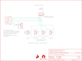

Contents
========

* [PRS13281 > Load Sensor Combinator](#prs13281--load-sensor-combinator)
	* [Schematic](#schematic)
	* [PCB](#pcb)
	* [Interactive BOM](#interactive-bom)
	* [OOMP Parts](#oomp-parts)
	* [Images](#images)
	* [Tags](#tags)
  
![][im]
# PRS13281 > Load Sensor Combinator

- ID: PROJ-SPAR-13281-STAN-01
- Hex ID: PRS13281
- Name: Sparkfun
- Description: Sparkfun
- Long Link: [http://oom.lt/PROJ-SPAR-13281-STAN-01](http://oom.lt/PROJ-SPAR-13281-STAN-01)
- Short Link: [http://oom.lt/PRS13281](http://oom.lt/PRS13281)

## Schematic
  

## PCB
  

## Interactive BOM

- Interactive BOM page: [ibom.html](https://htmlpreview.github.io/?https://github.com/oomlout/oomlout_OOMP_projects/blob/main/PROJ-SPAR-13281-STAN-01/kicad/bom/ibom.html)

## OOMP Parts
  

|OOMP Parts|
| :---: |
|UNMATCHED-UNMATCHED-X-UNMATCHED-01 FRAME1, JP6|
|[HEAD-I01-X-PI03-01  2.54 mm 3 Pin Header  JP1, JP2, JP3, JP4, JP7](https://github.com/oomlout/oomlout_OOMP_parts/tree/main/HEAD-I01-X-PI03-01/)|
|[HEAD-I01-X-PI05-01  2.54 mm 5 Pin Header  JP5](https://github.com/oomlout/oomlout_OOMP_parts/tree/main/HEAD-I01-X-PI05-01/)|

## Images
  
  

|bominteractivefront|bominteractiveback|kicadPcb3d|kicadPcb3dFront|kicadPcb3dBack|eagleImage|eagleSchemImage|pcbdraw|pcbdrawback|
| :---: | :---: | :---: | :---: | :---: | :---: | :---: | :---: | :---: |
||||||||||

## Tags

- hexID: PRS13281
- oompType: PROJ
- oompSize: SPAR
- oompColor: 13281
- oompDesc: STAN
- oompIndex: 01
- oompName: Load Sensor Combinator
- sources: All source files from https://github.com/sparkfun/Load_Sensor_Combinator (source licence details in srcLicense.md)
- linkBuyPage: https://www.sparkfun.com/products/13281
- oompID: PROJ-SPAR-13281-STAN-01
- oompParts: FRAME1,UNMATCHED-UNMATCHED-X-UNMATCHED-01
- oompParts: JP1,HEAD-I01-X-PI03-01
- oompParts: JP2,HEAD-I01-X-PI03-01
- oompParts: JP3,HEAD-I01-X-PI03-01
- oompParts: JP4,HEAD-I01-X-PI03-01
- oompParts: JP5,HEAD-I01-X-PI05-01
- oompParts: JP6,UNMATCHED-UNMATCHED-X-UNMATCHED-01
- oompParts: JP7,HEAD-I01-X-PI03-01
- rawParts: FRAME1,,FRAME-LETTER,CREATIVE_COMMONS,Schematic Frame,N. Seidle,,,v02,
- rawParts: JP1,UL,M03PTH,1X03,Header 3,,,,,
- rawParts: JP2,UR,M03PTH,1X03,Header 3,,,,,
- rawParts: JP3,LL,M03PTH,1X03,Header 3,,,,,
- rawParts: JP4,LR,M03PTH,1X03,Header 3,,,,,
- rawParts: JP5,,M05PTH,1X05,Header 5,,,,,
- rawParts: JP6,RJ45,RJ45-8PTH,RJ45-8,RJ45 Jack,,CONN-08506,RJ45,,
- rawParts: JP7,,M03PTH,1X03,Header 3,,,,,
- rawParts: LOGO3,SFE_LOGO_FLAME.1_INCH,SFE_LOGO_FLAME.1_INCH,SFE_LOGO_FLAME_.1,SFE Logo, flame only,,,,,
- rawParts: STANDOFF1,STAND-OFF,STAND-OFF,STAND-OFF,#4 Stand Off,,,,,
- rawParts: STANDOFF2,STAND-OFF,STAND-OFF,STAND-OFF,#4 Stand Off,,,,,
- rawParts: STANDOFF3,STAND-OFF,STAND-OFF,STAND-OFF,#4 Stand Off,,,,,
- rawParts: STANDOFF4,STAND-OFF,STAND-OFF,STAND-OFF,#4 Stand Off,,,,,
- rawParts: U$7,OSHW-LOGOS,OSHW-LOGOS,OSHW-LOGO-S,Open Source Hardware Logo,,,,,

[im]: kicadPcb3d_450.png
