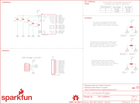

Contents
========

* [PRS13284 > Sparkfun](#prs13284--sparkfun)
	* [Schematic](#schematic)
	* [Interactive BOM](#interactive-bom)
	* [OOMP Parts](#oomp-parts)
	* [Images](#images)
	* [Tags](#tags)
  
![][im]
# PRS13284 > Sparkfun

- ID: PROJ-SPAR-13284-STAN-01
- Hex ID: PRS13284
- Name: Sparkfun
- Description: Sparkfun
- Long Link: [http://oom.lt/PROJ-SPAR-13284-STAN-01](http://oom.lt/PROJ-SPAR-13284-STAN-01)
- Short Link: [http://oom.lt/PRS13284](http://oom.lt/PRS13284)

## Schematic
  

## Interactive BOM

- Interactive BOM page: [ibom.html](https://htmlpreview.github.io/?https://github.com/oomlout/oomlout_OOMP_projects/blob/main/PROJ-SPAR-13284-STAN-01/kicad/bom/ibom.html)

## OOMP Parts
  

|OOMP Parts|
| :---: |
|C1,CAPC-0603-X-NF100-V50,C1,0.1uF,0.1UF-25V(+80/-20%)(0603),0603-CAP,CAP-00810,,CAP-00810,0.1uF,,|
|C2,CAPC-0603-X-NF100-V50,C2,0.1uF,0.1UF-25V(+80/-20%)(0603),0603-CAP,CAP-00810,,CAP-00810,0.1uF,,|
|C3,CAPC-0603-X-NF100-V50,C3,0.1uF,0.1UF-25V(+80/-20%)(0603),0603-CAP,CAP-00810,,CAP-00810,0.1uF,,|
|C4,CAPC-0603-X-UF10-01,C4,10uF,10UF-6.3V-20%(0603),0603-CAP,CAP-11015,,CAP-11015,10uF,,|
|C5,CAPC-0603-X-UNMATCHED-01,C5,10nF,10NF/10000PF-50V-10%(0603),0603-CAP,CAP-00867,,CAP-00867,10nF,,|
|FRAME1,UNMATCHED-UNMATCHED-X-UNMATCHED-01,FID1,FIDUCIAL1X2,FIDUCIAL1X2,FIDUCIAL-1X2,Fiducial Alignment Points,,,,,|
|JP1,HEAD-I01-X-PI04-01,FID2,FIDUCIAL1X2,FIDUCIAL1X2,FIDUCIAL-1X2,Fiducial Alignment Points,,,,,|
|JP2,HEAD-I01-X-PI09-01,FRAME1,,FRAME-LETTER,CREATIVE_COMMONS,Schematic Frame,Jim Lindblom,,,v10,|
|R1,RESE-0603-X-O103-01,JP1,,I2C_STANDARD_NO_SILK,1X04_NO_SILK,SparkFun has standardized on a pinout for all I2C based sensor breakouts.,,,,,|
|R2,RESE-0603-X-O103-01,JP2,M09NO_SILK,M09NO_SILK,1X09_NO_SILK,Header 9,,,,,|
|R3,RESE-0603-X-O103-01,LOGO1,SFE_LOGO_NAME.1_INCH,SFE_LOGO_NAME.1_INCH,SFE_LOGO_NAME_.1,SFE Logo, name only,,,,,|
|R4,RESE-0603-X-O103-01,LOGO2,SFE_LOGO_FLAME.2_INCH,SFE_LOGO_FLAME.2_INCH,SFE_LOGO_FLAME_.2,SFE Logo, flame only,,,,,|
|R5,RESE-0603-X-O103-01,LOGO3,OSHW-LOGOS,OSHW-LOGOS,OSHW-LOGO-S,Open Source Hardware Logo This logo indicates the piece of hardware it is found on incorporates a OSHW license and/or adheres to the definition of open source hardware found here: http://freedomdefined.org/OSHW,,,,,|
|R6,RESE-0603-X-O103-01,R1,10K,10KOHM-1/10W-1%(0603)0603,0603-RES,RES-00824,,RES-00824,10K,,|
|U1,UNMATCHED-UNMATCHED-X-UNMATCHED-01,R2,10K,10KOHM-1/10W-1%(0603)0603,0603-RES,RES-00824,,RES-00824,10K,,|

## Images
  
  

|kicadPcb3d|kicadPcb3dFront|kicadPcb3dBack|eagleImage|eagleSchemImage|
| :---: | :---: | :---: | :---: | :---: |
||||||

## Tags

- hexID: PRS13284
- oompType: PROJ
- oompSize: SPAR
- oompColor: 13284
- oompDesc: STAN
- oompIndex: 01
- oompName: LSM9DS1 Breakout
- sources: All source files from https://github.com/sparkfun/LSM9DS1_Breakout (source licence details in srcLicense.md)
- linkBuyPage: https://www.sparkfun.com/products/13284
- oompID: PROJ-SPAR-13284-STAN-01
- oompParts: C1,CAPC-0603-X-NF100-V50
- oompParts: C2,CAPC-0603-X-NF100-V50
- oompParts: C3,CAPC-0603-X-NF100-V50
- oompParts: C4,CAPC-0603-X-UF10-01
- oompParts: C5,CAPC-0603-X-UNMATCHED-01
- oompParts: FRAME1,UNMATCHED-UNMATCHED-X-UNMATCHED-01
- oompParts: JP1,HEAD-I01-X-PI04-01
- oompParts: JP2,HEAD-I01-X-PI09-01
- oompParts: R1,RESE-0603-X-O103-01
- oompParts: R2,RESE-0603-X-O103-01
- oompParts: R3,RESE-0603-X-O103-01
- oompParts: R4,RESE-0603-X-O103-01
- oompParts: R5,RESE-0603-X-O103-01
- oompParts: R6,RESE-0603-X-O103-01
- oompParts: U1,UNMATCHED-UNMATCHED-X-UNMATCHED-01
- rawParts: C1,0.1uF,0.1UF-25V(+80/-20%)(0603),0603-CAP,CAP-00810,,CAP-00810,0.1uF,,
- rawParts: C2,0.1uF,0.1UF-25V(+80/-20%)(0603),0603-CAP,CAP-00810,,CAP-00810,0.1uF,,
- rawParts: C3,0.1uF,0.1UF-25V(+80/-20%)(0603),0603-CAP,CAP-00810,,CAP-00810,0.1uF,,
- rawParts: C4,10uF,10UF-6.3V-20%(0603),0603-CAP,CAP-11015,,CAP-11015,10uF,,
- rawParts: C5,10nF,10NF/10000PF-50V-10%(0603),0603-CAP,CAP-00867,,CAP-00867,10nF,,
- rawParts: FID1,FIDUCIAL1X2,FIDUCIAL1X2,FIDUCIAL-1X2,Fiducial Alignment Points,,,,,
- rawParts: FID2,FIDUCIAL1X2,FIDUCIAL1X2,FIDUCIAL-1X2,Fiducial Alignment Points,,,,,
- rawParts: FRAME1,,FRAME-LETTER,CREATIVE_COMMONS,Schematic Frame,Jim Lindblom,,,v10,
- rawParts: JP1,,I2C_STANDARD_NO_SILK,1X04_NO_SILK,SparkFun has standardized on a pinout for all I2C based sensor breakouts.,,,,,
- rawParts: JP2,M09NO_SILK,M09NO_SILK,1X09_NO_SILK,Header 9,,,,,
- rawParts: LOGO1,SFE_LOGO_NAME.1_INCH,SFE_LOGO_NAME.1_INCH,SFE_LOGO_NAME_.1,SFE Logo, name only,,,,,
- rawParts: LOGO2,SFE_LOGO_FLAME.2_INCH,SFE_LOGO_FLAME.2_INCH,SFE_LOGO_FLAME_.2,SFE Logo, flame only,,,,,
- rawParts: LOGO3,OSHW-LOGOS,OSHW-LOGOS,OSHW-LOGO-S,Open Source Hardware Logo This logo indicates the piece of hardware it is found on incorporates a OSHW license and/or adheres to the definition of open source hardware found here: http://freedomdefined.org/OSHW,,,,,
- rawParts: R1,10K,10KOHM-1/10W-1%(0603)0603,0603-RES,RES-00824,,RES-00824,10K,,
- rawParts: R2,10K,10KOHM-1/10W-1%(0603)0603,0603-RES,RES-00824,,RES-00824,10K,,
- rawParts: R3,10K,10KOHM-1/10W-1%(0603)0603,0603-RES,RES-00824,,RES-00824,10K,,
- rawParts: R4,10K,10KOHM-1/10W-1%(0603)0603,0603-RES,RES-00824,,RES-00824,10K,,
- rawParts: R5,10K,10KOHM-1/10W-1%(0603)0603,0603-RES,RES-00824,,RES-00824,10K,,
- rawParts: R6,10K,10KOHM-1/10W-1%(0603)0603,0603-RES,RES-00824,,RES-00824,10K,,
- rawParts: SJ1,,JUMPER-PAD-3-NC_BY_TRACE,PAD-JUMPER-3-3OF3_NC_BY_TRACE_YES_SILK_FULL_BOX,,,,,,
- rawParts: SJ2,,JUMPER-PAD-3-NC_BY_TRACE,PAD-JUMPER-3-3OF3_NC_BY_TRACE_YES_SILK_FULL_BOX,,,,,,
- rawParts: SJ3,,JUMPER-PAD-3-NC_BY_TRACE,PAD-JUMPER-3-3OF3_NC_BY_TRACE_YES_SILK_FULL_BOX,,,,,,
- rawParts: STANDOFF1,STAND-OFF,STAND-OFF,STAND-OFF,#4 Stand Off,,,,,
- rawParts: STANDOFF2,STAND-OFF,STAND-OFF,STAND-OFF,#4 Stand Off,,,,,
- rawParts: STANDOFF3,STAND-OFF,STAND-OFF,STAND-OFF,#4 Stand Off,,,,,
- rawParts: STANDOFF4,STAND-OFF,STAND-OFF,STAND-OFF,#4 Stand Off,,,,,
- rawParts: U1,LSM9DS1,LSM9DS1,LGA24-8X4,LSM9DS1 3D accelerometer, gyroscope & magnetometer,,IC-12536,,,

[im]: kicadPcb3d_450.png
