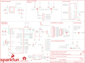

Contents
========

* [PRS13287 > Sparkfun](#prs13287--sparkfun)
	* [Schematic](#schematic)
	* [Interactive BOM](#interactive-bom)
	* [OOMP Parts](#oomp-parts)
	* [Images](#images)
	* [Tags](#tags)
  
![][im]
# PRS13287 > Sparkfun

- ID: PROJ-SPAR-13287-STAN-01
- Hex ID: PRS13287
- Name: Sparkfun
- Description: Sparkfun
- Long Link: [http://oom.lt/PROJ-SPAR-13287-STAN-01](http://oom.lt/PROJ-SPAR-13287-STAN-01)
- Short Link: [http://oom.lt/PRS13287](http://oom.lt/PRS13287)

## Schematic
  

## Interactive BOM

- Interactive BOM page: [ibom.html](https://htmlpreview.github.io/?https://github.com/oomlout/oomlout_OOMP_projects/blob/main/PROJ-SPAR-13287-STAN-01/kicad/bom/ibom.html)

## OOMP Parts
  

|OOMP Parts|
| :---: |
|C1,CAPC-0603-X-UF10-01,C1,10uF,10UF-6.3V-20%(0603),0603-CAP,CAP-11015,,CAP-11015,10uF,,|
|C2,CAPC-0805-X-UNMATCHED-01,C2,1.0uF,1.0UF-25V-+80/-20(0805),0805,CAP-11625,,CAP-11625,1.0uF,,|
|C3,CAPC-0603-X-NF100-V50,C3,0.1uF,0.1UF-25V(+80/-20%)(0603),0603-CAP,CAP-00810,,CAP-00810,0.1uF,,|
|C4,CAPC-0603-X-UNMATCHED-01,C4,10pF,10PF-50V-5%(0603),0603-CAP,CAP-11812,,CAP-11812,10pF,,|
|C5,CAPC-0603-X-UNMATCHED-01,C5,10pF,10PF-50V-5%(0603),0603-CAP,CAP-11812,,CAP-11812,10pF,,|
|C6,CAPC-0603-X-UNMATCHED-01,C6,2.2uF,2.2UF-10V-20%(0603),0603-CAP,CAP-07888,,CAP-07888,2.2uF,,|
|C7,CAPC-0603-X-UNMATCHED-01,C7,1.0uF,1.0UF-16V-10%(0603),0603-CAP,CAP-00868,,CAP-00868,1.0uF,,|
|C8,CAPC-0603-X-UNMATCHED-01,C8,5.6pF,CAP0603-CAP,0603-CAP,Capacitor,,CAP-12456,,,|
|C9,CAPC-0603-X-NF100-V50,C9,0.1uF,0.1UF-25V(+80/-20%)(0603),0603-CAP,CAP-00810,,CAP-00810,0.1uF,,|
|D1,LEDS-0603-G-STAN-01,D1,RED,LED-RED0603,LED-0603,Assorted Red LEDs,,DIO-00819,RED,,|
|D2,LEDS-0603-G-STAN-01,D2,BLUE,LED-BLUE0603,LED-0603,Blue LEDs for production use,,DIO-08575,BLUE,,|
|D3,DIOD-S323-X-UNMATCHED-01,D3,BAS16,DIODEBAS16,SOD-323,Diode,,DIO-09646,250mA/100V,,|
|E1,UNMATCHED-UNMATCHED-X-UNMATCHED-01,E1,ANTENNATRACE,ANTENNATRACE,TRACE_ANTENNA_2.4GHZ_25.7MM,Chip antenna,,,,,|
|FRAME1,UNMATCHED-UNMATCHED-X-UNMATCHED-01,FID1,FIDUCIAL1X2,FIDUCIAL1X2,FIDUCIAL-1X2,Fiducial Alignment Points,,,,,|
|JP1,HEAD-I01-X-PI11-01,FID2,FIDUCIAL1X2,FIDUCIAL1X2,FIDUCIAL-1X2,Fiducial Alignment Points,,,,,|
|JP2,UNMATCHED-UNMATCHED-X-UNMATCHED-01,FRAME1,,FRAME-LETTER,CREATIVE_COMMONS,Schematic Frame,Jim Lindblom,,,v01,|
|JP3,UNMATCHED-UNMATCHED-X-UNMATCHED-01,JP1,,M11PTH,1X11,Header 11,,,,,|
|JP4,UNMATCHED-UNMATCHED-X-UNMATCHED-01,JP2,FTDI_BASICPTH,FTDI_BASICPTH,FTDI_BASIC,FTDI Basic header with labels,,,,,|
|Q1,UNMATCHED-SO23-X-KBSS138-01,JP3,ARDUINO_R3_SHIELDNOLABELS,ARDUINO_R3_SHIELDNOLABELS,UNO_R3_SHIELD_NOLABELS,Shield form compatible with the Arduino Uno R3.,,,,,|
|Q2,UNMATCHED-SO23-X-KBSS138-01,JP4,U.FL,U.FL,U.FL,SMD antenna connector- WRL-09144,,CONN-09193,U.FL,,|
|R1,RESE-0603-X-O123-01,L1,DNP,INDUCTOR0603,0603,Inductors,,,,,|
|R2,RESE-0603-X-O201-01,L2,DNP,INDUCTOR0603,0603,Inductors,,,,,|
|R3,RESE-0603-X-O103-01,LOGO1,SFE_LOGO_NAME_FLAME.2_INCH,SFE_LOGO_NAME_FLAME.2_INCH,SFE_LOGO_NAME_FLAME_.2,SFE Logo, name and flame,,,,,|
|R4,RESE-0603-X-O201-01,LOGO2,OSHW-LOGOM,OSHW-LOGOM,OSHW-LOGO-M,Open Source Hardware Logo,,,,,|
|R5,RESE-0603-X-O103-01,Q1,BSS138,MOSFET-NCHANNELBSS138,SOT23-3,Common NMOSFET Parts,,TRANS-00830,200mA/50V,,|
|R6,RESE-0603-X-O201-01,Q2,BSS138,MOSFET-NCHANNELBSS138,SOT23-3,Common NMOSFET Parts,,TRANS-00830,200mA/50V,,|
|R7,RESE-0603-X-O103-01,R1,12k,12KOHM-1/10W-1%(0603),0603-RES,RES-10327,,RES-10327,12k,,|
|R8,RESE-0603-X-O103-01,R2,200,200OHM1/10W1%(0603),0603-RES,RES-08220,,RES-08220,200,,|
|R9,RESE-0603-X-O103-01,R3,10K,10KOHM1/10W1%(0603)0603,0603-RES,RES-00824,,RES-00824,10K,,|
|R10,RESE-0603-X-UNMATCHED-01,R4,200,200OHM1/10W1%(0603),0603-RES,RES-08220,,RES-08220,200,,|
|R11,RESE-0603-X-UNMATCHED-01,R5,10K,10KOHM1/10W1%(0603)0603,0603-RES,RES-00824,,RES-00824,10K,,|
|R12,RESE-0603-X-O103-01,R6,200,200OHM1/10W1%(0603),0603-RES,RES-08220,,RES-08220,200,,|
|R13,RESE-0603-X-O103-01,R7,10K,10KOHM1/10W1%(0603)0603,0603-RES,RES-00824,,RES-00824,10K,,|
|R14,RESE-0603-X-O102-01,R8,10K,10KOHM1/10W1%(0603)0603,0603-RES,RES-00824,,RES-00824,10K,,|
|S1,UNMATCHED-UNMATCHED-X-UNMATCHED-01,R9,10K,10KOHM1/10W1%(0603)0603,0603-RES,RES-00824,,RES-00824,10K,,|
|S2,UNMATCHED-UNMATCHED-X-UNMATCHED-01,R10,0,0OHM1/10W5%(0603),0603,RES-08609,,RES-08609,0,,|
|SJ2,UNMATCHED-UNMATCHED-X-UNMATCHED-01,R11,DNP,RESISTOR0603-RES,0603-RES,Resistor,,,,,|
|TP1,UNMATCHED-UNMATCHED-X-UNMATCHED-01,R12,10K,10KOHM1/10W1%(0603)0603,0603-RES,RES-00824,,RES-00824,10K,,|
|TP2,UNMATCHED-UNMATCHED-X-UNMATCHED-01,R13,10K,10KOHM1/10W1%(0603)0603,0603-RES,RES-00824,,RES-00824,10K,,|
|TP3,UNMATCHED-UNMATCHED-X-UNMATCHED-01,R14,1K,1KOHM1/10W1%(0603),0603-RES,RES-07856,,RES-07856,1K,,|
|TP4,UNMATCHED-UNMATCHED-X-UNMATCHED-01,S1,DPDT,SWITCH-DPDTAYZ0202,AYZ0202,DPDT Version of the COM-00597,,SWCH-08179,DPDT,,|
|TP5,UNMATCHED-UNMATCHED-X-UNMATCHED-01,S2,Reset,SWITCH-MOMENTARY-2SMD,TACTILE-SWITCH-SMD,Various NO switches- pushbuttons, reed, etc,,SWCH-08247,,,|
|TP6,UNMATCHED-UNMATCHED-X-UNMATCHED-01,SJ1,,JUMPER-PAD-2-NO,PAD-JUMPER-2-NO_NO_SILK,,,,,,|
|TP7,UNMATCHED-UNMATCHED-X-UNMATCHED-01,SJ2,,JUMPER-PTH-2-NO,PTH-JUMPER-2-NO_NO_SILK,,,,,,|
|U1,VREG-SO235-X-KAP2112K-V33D,SJ3,,JUMPER-PAD-2-NC_BY_TRACE,PAD-JUMPER-2-NC_BY_TRACE_YES_SILK,,,,,,|
|U2,UNMATCHED-UNMATCHED-X-UNMATCHED-01,SJ4,,JUMPER-PAD-2-NOYES_SILK,PAD-JUMPER-2-NO_YES_SILK,,,,,,|
|U3,UNMATCHED-UNMATCHED-X-UNMATCHED-01,STANDOFF1,STAND-OFF,STAND-OFF,STAND-OFF,#4 Stand Off,,,,,|
|Y1,UNMATCHED-UNMATCHED-X-UNMATCHED-01,STANDOFF2,STAND-OFF,STAND-OFF,STAND-OFF,#4 Stand Off,,,,,|

## Images
  
  

|kicadPcb3d|kicadPcb3dFront|kicadPcb3dBack|eagleImage|eagleSchemImage|
| :---: | :---: | :---: | :---: | :---: |
||||||

## Tags

- hexID: PRS13287
- oompType: PROJ
- oompSize: SPAR
- oompColor: 13287
- oompDesc: STAN
- oompIndex: 01
- oompName: ESP8266 WiFi Shield
- sources: All source files from https://github.com/sparkfun/ESP8266_WiFi_Shield (source licence details in srcLicense.md)
- linkBuyPage: https://www.sparkfun.com/products/13287
- oompID: PROJ-SPAR-13287-STAN-01
- oompParts: C1,CAPC-0603-X-UF10-01
- oompParts: C2,CAPC-0805-X-UNMATCHED-01
- oompParts: C3,CAPC-0603-X-NF100-V50
- oompParts: C4,CAPC-0603-X-UNMATCHED-01
- oompParts: C5,CAPC-0603-X-UNMATCHED-01
- oompParts: C6,CAPC-0603-X-UNMATCHED-01
- oompParts: C7,CAPC-0603-X-UNMATCHED-01
- oompParts: C8,CAPC-0603-X-UNMATCHED-01
- oompParts: C9,CAPC-0603-X-NF100-V50
- oompParts: D1,LEDS-0603-G-STAN-01
- oompParts: D2,LEDS-0603-G-STAN-01
- oompParts: D3,DIOD-S323-X-UNMATCHED-01
- oompParts: E1,UNMATCHED-UNMATCHED-X-UNMATCHED-01
- oompParts: FRAME1,UNMATCHED-UNMATCHED-X-UNMATCHED-01
- oompParts: JP1,HEAD-I01-X-PI11-01
- oompParts: JP2,UNMATCHED-UNMATCHED-X-UNMATCHED-01
- oompParts: JP3,UNMATCHED-UNMATCHED-X-UNMATCHED-01
- oompParts: JP4,UNMATCHED-UNMATCHED-X-UNMATCHED-01
- oompParts: Q1,UNMATCHED-SO23-X-KBSS138-01
- oompParts: Q2,UNMATCHED-SO23-X-KBSS138-01
- oompParts: R1,RESE-0603-X-O123-01
- oompParts: R2,RESE-0603-X-O201-01
- oompParts: R3,RESE-0603-X-O103-01
- oompParts: R4,RESE-0603-X-O201-01
- oompParts: R5,RESE-0603-X-O103-01
- oompParts: R6,RESE-0603-X-O201-01
- oompParts: R7,RESE-0603-X-O103-01
- oompParts: R8,RESE-0603-X-O103-01
- oompParts: R9,RESE-0603-X-O103-01
- oompParts: R10,RESE-0603-X-UNMATCHED-01
- oompParts: R11,RESE-0603-X-UNMATCHED-01
- oompParts: R12,RESE-0603-X-O103-01
- oompParts: R13,RESE-0603-X-O103-01
- oompParts: R14,RESE-0603-X-O102-01
- oompParts: S1,UNMATCHED-UNMATCHED-X-UNMATCHED-01
- oompParts: S2,UNMATCHED-UNMATCHED-X-UNMATCHED-01
- oompParts: SJ2,UNMATCHED-UNMATCHED-X-UNMATCHED-01
- oompParts: TP1,UNMATCHED-UNMATCHED-X-UNMATCHED-01
- oompParts: TP2,UNMATCHED-UNMATCHED-X-UNMATCHED-01
- oompParts: TP3,UNMATCHED-UNMATCHED-X-UNMATCHED-01
- oompParts: TP4,UNMATCHED-UNMATCHED-X-UNMATCHED-01
- oompParts: TP5,UNMATCHED-UNMATCHED-X-UNMATCHED-01
- oompParts: TP6,UNMATCHED-UNMATCHED-X-UNMATCHED-01
- oompParts: TP7,UNMATCHED-UNMATCHED-X-UNMATCHED-01
- oompParts: U1,VREG-SO235-X-KAP2112K-V33D
- oompParts: U2,UNMATCHED-UNMATCHED-X-UNMATCHED-01
- oompParts: U3,UNMATCHED-UNMATCHED-X-UNMATCHED-01
- oompParts: Y1,UNMATCHED-UNMATCHED-X-UNMATCHED-01
- rawParts: C1,10uF,10UF-6.3V-20%(0603),0603-CAP,CAP-11015,,CAP-11015,10uF,,
- rawParts: C2,1.0uF,1.0UF-25V-+80/-20(0805),0805,CAP-11625,,CAP-11625,1.0uF,,
- rawParts: C3,0.1uF,0.1UF-25V(+80/-20%)(0603),0603-CAP,CAP-00810,,CAP-00810,0.1uF,,
- rawParts: C4,10pF,10PF-50V-5%(0603),0603-CAP,CAP-11812,,CAP-11812,10pF,,
- rawParts: C5,10pF,10PF-50V-5%(0603),0603-CAP,CAP-11812,,CAP-11812,10pF,,
- rawParts: C6,2.2uF,2.2UF-10V-20%(0603),0603-CAP,CAP-07888,,CAP-07888,2.2uF,,
- rawParts: C7,1.0uF,1.0UF-16V-10%(0603),0603-CAP,CAP-00868,,CAP-00868,1.0uF,,
- rawParts: C8,5.6pF,CAP0603-CAP,0603-CAP,Capacitor,,CAP-12456,,,
- rawParts: C9,0.1uF,0.1UF-25V(+80/-20%)(0603),0603-CAP,CAP-00810,,CAP-00810,0.1uF,,
- rawParts: D1,RED,LED-RED0603,LED-0603,Assorted Red LEDs,,DIO-00819,RED,,
- rawParts: D2,BLUE,LED-BLUE0603,LED-0603,Blue LEDs for production use,,DIO-08575,BLUE,,
- rawParts: D3,BAS16,DIODEBAS16,SOD-323,Diode,,DIO-09646,250mA/100V,,
- rawParts: E1,ANTENNATRACE,ANTENNATRACE,TRACE_ANTENNA_2.4GHZ_25.7MM,Chip antenna,,,,,
- rawParts: FID1,FIDUCIAL1X2,FIDUCIAL1X2,FIDUCIAL-1X2,Fiducial Alignment Points,,,,,
- rawParts: FID2,FIDUCIAL1X2,FIDUCIAL1X2,FIDUCIAL-1X2,Fiducial Alignment Points,,,,,
- rawParts: FRAME1,,FRAME-LETTER,CREATIVE_COMMONS,Schematic Frame,Jim Lindblom,,,v01,
- rawParts: JP1,,M11PTH,1X11,Header 11,,,,,
- rawParts: JP2,FTDI_BASICPTH,FTDI_BASICPTH,FTDI_BASIC,FTDI Basic header with labels,,,,,
- rawParts: JP3,ARDUINO_R3_SHIELDNOLABELS,ARDUINO_R3_SHIELDNOLABELS,UNO_R3_SHIELD_NOLABELS,Shield form compatible with the Arduino Uno R3.,,,,,
- rawParts: JP4,U.FL,U.FL,U.FL,SMD antenna connector- WRL-09144,,CONN-09193,U.FL,,
- rawParts: L1,DNP,INDUCTOR0603,0603,Inductors,,,,,
- rawParts: L2,DNP,INDUCTOR0603,0603,Inductors,,,,,
- rawParts: LOGO1,SFE_LOGO_NAME_FLAME.2_INCH,SFE_LOGO_NAME_FLAME.2_INCH,SFE_LOGO_NAME_FLAME_.2,SFE Logo, name and flame,,,,,
- rawParts: LOGO2,OSHW-LOGOM,OSHW-LOGOM,OSHW-LOGO-M,Open Source Hardware Logo,,,,,
- rawParts: Q1,BSS138,MOSFET-NCHANNELBSS138,SOT23-3,Common NMOSFET Parts,,TRANS-00830,200mA/50V,,
- rawParts: Q2,BSS138,MOSFET-NCHANNELBSS138,SOT23-3,Common NMOSFET Parts,,TRANS-00830,200mA/50V,,
- rawParts: R1,12k,12KOHM-1/10W-1%(0603),0603-RES,RES-10327,,RES-10327,12k,,
- rawParts: R2,200,200OHM1/10W1%(0603),0603-RES,RES-08220,,RES-08220,200,,
- rawParts: R3,10K,10KOHM1/10W1%(0603)0603,0603-RES,RES-00824,,RES-00824,10K,,
- rawParts: R4,200,200OHM1/10W1%(0603),0603-RES,RES-08220,,RES-08220,200,,
- rawParts: R5,10K,10KOHM1/10W1%(0603)0603,0603-RES,RES-00824,,RES-00824,10K,,
- rawParts: R6,200,200OHM1/10W1%(0603),0603-RES,RES-08220,,RES-08220,200,,
- rawParts: R7,10K,10KOHM1/10W1%(0603)0603,0603-RES,RES-00824,,RES-00824,10K,,
- rawParts: R8,10K,10KOHM1/10W1%(0603)0603,0603-RES,RES-00824,,RES-00824,10K,,
- rawParts: R9,10K,10KOHM1/10W1%(0603)0603,0603-RES,RES-00824,,RES-00824,10K,,
- rawParts: R10,0,0OHM1/10W5%(0603),0603,RES-08609,,RES-08609,0,,
- rawParts: R11,DNP,RESISTOR0603-RES,0603-RES,Resistor,,,,,
- rawParts: R12,10K,10KOHM1/10W1%(0603)0603,0603-RES,RES-00824,,RES-00824,10K,,
- rawParts: R13,10K,10KOHM1/10W1%(0603)0603,0603-RES,RES-00824,,RES-00824,10K,,
- rawParts: R14,1K,1KOHM1/10W1%(0603),0603-RES,RES-07856,,RES-07856,1K,,
- rawParts: S1,DPDT,SWITCH-DPDTAYZ0202,AYZ0202,DPDT Version of the COM-00597,,SWCH-08179,DPDT,,
- rawParts: S2,Reset,SWITCH-MOMENTARY-2SMD,TACTILE-SWITCH-SMD,Various NO switches- pushbuttons, reed, etc,,SWCH-08247,,,
- rawParts: SJ1,,JUMPER-PAD-2-NO,PAD-JUMPER-2-NO_NO_SILK,,,,,,
- rawParts: SJ2,,JUMPER-PTH-2-NO,PTH-JUMPER-2-NO_NO_SILK,,,,,,
- rawParts: SJ3,,JUMPER-PAD-2-NC_BY_TRACE,PAD-JUMPER-2-NC_BY_TRACE_YES_SILK,,,,,,
- rawParts: SJ4,,JUMPER-PAD-2-NOYES_SILK,PAD-JUMPER-2-NO_YES_SILK,,,,,,
- rawParts: STANDOFF1,STAND-OFF,STAND-OFF,STAND-OFF,#4 Stand Off,,,,,
- rawParts: STANDOFF2,STAND-OFF,STAND-OFF,STAND-OFF,#4 Stand Off,,,,,
- rawParts: STANDOFF3,STAND-OFF,STAND-OFF,STAND-OFF,#4 Stand Off,,,,,
- rawParts: STANDOFF4,STAND-OFF,STAND-OFF,STAND-OFF,#4 Stand Off,,,,,
- rawParts: TP1,,TEST-POINT3X5,PAD.03X.05,Bare copper test points for troubleshooting or ICT,,,,,
- rawParts: TP2,,TEST-POINT3X5,PAD.03X.05,Bare copper test points for troubleshooting or ICT,,,,,
- rawParts: TP3,,TEST-POINT3X5,PAD.03X.05,Bare copper test points for troubleshooting or ICT,,,,,
- rawParts: TP4,,TEST-POINT3X5,PAD.03X.05,Bare copper test points for troubleshooting or ICT,,,,,
- rawParts: TP5,,TEST-POINT3X5,PAD.03X.05,Bare copper test points for troubleshooting or ICT,,,,,
- rawParts: TP6,,TEST-POINT3X5,PAD.03X.05,Bare copper test points for troubleshooting or ICT,,,,,
- rawParts: TP7,,TEST-POINT3X5,PAD.03X.05,Bare copper test points for troubleshooting or ICT,,,,,
- rawParts: U1,AP2112K-3.3V,V_REG_LDOSMD,SOT23-5,Voltage Regulator LDO,,VREG-12457,,,
- rawParts: U2,ESP8266,ESP8266,QFN32,Espressif ESP8266,,IC-12452,,,
- rawParts: U3,AT25SF041-SOIC8,AT25SF041-SOIC8,SO08,SPI Serial Flash Memory with Dual/Quad-IO Support,,IC-12455,,,
- rawParts: Y1,26MHz,CRYSTAL-GROUNDED3.2X2.5,CRYSTAL-SMD-3.2X2.5,,,XTAL-12454,,,

[im]: kicadPcb3d_450.png
